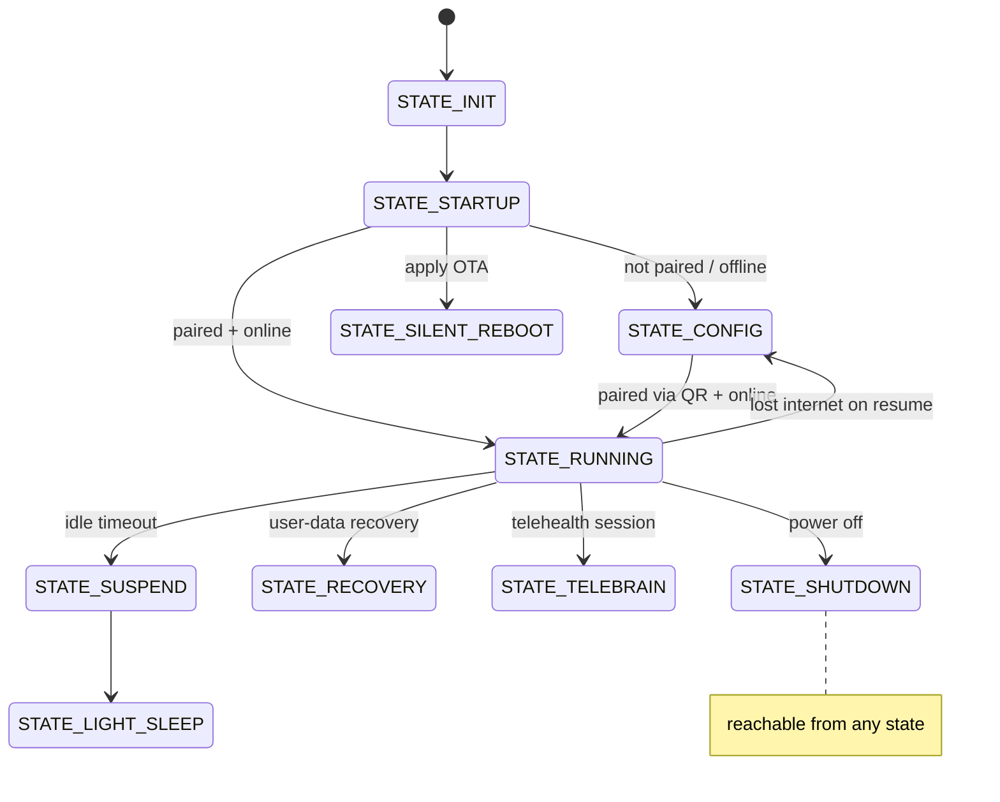

# 🚦 Boot & lifecycle — the Launcher state machine

> Analyzed build: **v3.6.4-Zephyr / OTA v24.10.803** (RK3288, Android 9) — see [`firmware-803-reference.md`](firmware-803-reference.md).

> **What this is.** How the robot boots into its experience and switches modes — the `me.embodied
> .services.Launcher` state machine that starts/stops the `bo-*` components. This is the app-level
> lifecycle *above* the Android boot in [`firmware-image.md`](firmware-image.md): what a custom
> firmware must replicate (goal #1), and what a stranded robot actually does (goal #3). From
> `bo-android`'s Java service layer (`Launcher`, `ServiceLauncher`).

## Components (`BOComponent`)

The Launcher supervises 12 components (mostly the native `libbo-*` + the Unity apps), starting/stopping
them per state:

| Component | What |
|---|---|
| `BO_DISPATCH` | the ZeroMQ message bus ([`robot-ipc-protocol.md`](../protocol/robot-ipc-protocol.md)) — always up |
| `BO_LOGGER` / `BO_SYSMON` | logging + system monitor (temps, RSSI, health) |
| `BO_UPDATER` | **OTA** ([`ota-and-recovery.md`](ota-and-recovery.md)) — up even in config/recovery |
| `BO_BRAIN` | ChatScript + ML conversation brain |
| `BO_FUSION` / `BO_VISION` / `BO_AUDIO` | perception (people fusion, faces/QR, STT/TTS/XMOS) |
| `BO_MAINAPP` | the Unity face/experience (`bo-android`'s Unity) |
| `BO_CFGAPP` | the config/setup app = **`bo-wifi`** (QR scanning, pairing) |
| `BO_ANALYTICS` | analytics (gated by `FEA_ANALYTICS`) |
| `BO_XMOS_WD` | XMOS audio-DSP watchdog (gated by `FEA_XMOS_WATCHDOG`) |

Each component reports its lifecycle on the bus as **`ComponentState{name, state, timestamp}`**
(`embodied.launcher`), where **`State`** is `UNKNOWN=0`, `Running=1`, `NotRunning=2`, `Fault=3`. The
Launcher watches these to detect a crashed component (`Fault`/`NotRunning`) and restart it — so a
custom app layer should emit the same `ComponentState` for its own processes to plug into the
supervision (or run its own supervisor). `DebugConfigureRequest{target, target_state}`
(`embodied.system`) toggles a named target's debug state at runtime.

## States (`LauncherState`)

| State | Components up | Meaning |
|---|---|---|
| `STATE_INIT` / `STATE_STARTUP` | boot bring-up | early boot, splash |
| **`STATE_CONFIG`** | DISPATCH, LOGGER, SYSMON, **UPDATER**, **CFGAPP** | **QR-reading / setup** — `bo-wifi` scans pairing/Wi-Fi/debug QRs. **No brain.** |
| **`STATE_RUNNING`** | full stack incl. BRAIN, FUSION, VISION, AUDIO, MAINAPP | the normal experience |
| `STATE_RECOVERY` / `STATE_SILENT_RECOVERY` | + BRAIN, MAINAPP (no UPDATER-only) | user-data recovery (see below); silent = no animation |
| `STATE_SILENT_REBOOT` | DISPATCH, LOGGER, SYSMON, UPDATER, BRAIN | minimal set to **apply an OTA** then reboot |
| `STATE_TELEBRAIN` | perception + MAINAPP, **no BRAIN** | telehealth remote-brain session |
| `STATE_DEMO` | — | factory/retail demo loop |
| `STATE_LIGHT_SLEEP` / `STATE_SUSPEND` | trimmed | idle / low-power |
| `STATE_SHUTDOWN` | — | powering off |

### Two facts that matter for revival

1. **Offline ⇒ QR-reading.** On resume, if `FEA_RESUME_WAIT_NET` is set and the net check fails
   (`waitOnNetwork(20000)`), the Launcher logs *"Could not detect internet after resume. Returning to
   QR reading state"* and `RequestState(STATE_CONFIG)`. **A stranded robot sits in `STATE_CONFIG`
   scanning QR codes** — which is exactly why the re-home QR works on 801+ (and why the pre-801 block
   is purely the endpoint pinning, not the robot refusing to scan).
2. **The updater runs in config.** `BO_UPDATER` is active in `STATE_CONFIG` and `STATE_SILENT_REBOOT`,
   so OTA can proceed while unpaired/offline-then-reconnected — the basis for "point at a server, get
   updated."

## User-data recovery (`UserDataRecoveryMode`)

`RECOVER_CLOUD` (default) / `RECOVER_LOCAL` / `UPDATE_CLOUD` — restores a child's pairing + data from
cloud backup or the local `/sdcard/EmbodiedStaticData/PERSISTENT_DATA` (e.g. `rightpoint/user_key.pub`,
`brightness`, legacy `S3`). `STATE_RECOVERY` runs the brain + main app against recovered data.

## Factory test entry (`FactoryTest`)

`Launcher.OnFactoryTestRequest(i)` launches a factory app by index via an Android intent — the
privileged manufacturing tools ([`factory-provisioning.md`](factory-provisioning.md)):

| i | FactoryTest | Component |
|--:|---|---|
| — | `BURN_IN` | `me.embodied.productiontesting.burnintest/.ActivityBurnInTest` |
| — | `TUMMY_BACK` (QC) | `…productiontesting.qc/.ActivityQC` |
| — | `DEMO_MODE` | (retail demo loop) |
| — | `LIFE_TEST` | `…lifetest/.ActivityLifeTest` |
| — | `INTERNAL_ASSEMBLY` | `…internalassytest/.ActivityInternalAssyTest` |
| — | `FINAL_TEST` | `…finaltest/.ActivityFinalTest` |

The request arrives over the bus (a factory/service message), not a user QR — but it shows the hook a
custom build could use to launch privileged bring-up tools.

## Init service graph (native daemons)

Below the app-layer Launcher sits the Android `init` service set. Across all `.rc` files (ramdisk +
`/system/etc/init` + `/vendor/etc/init[/hw]`) this build defines **98 unique services** — the complete list (name · class · binary · user · flags ·
source `.rc`) is in [`manifests/init-services.tsv`](manifests/init-services.tsv):

| `class` | count | fires |
|---|--:|---|
| `main` | 38 | after `zygote` (most daemons) |
| `hal` | 13 (+3 animation, +2 `early_hal`) | HIDL hardware services |
| `core` | 11 (+3 animation) | early core daemons |
| `late_start` | 8 | after boot completes |
| (none) / `charger` / `animation` | 18 | one-shots, charger mode, boot anim |

**The key structural fact: almost all of it is stock AOSP 9 + Rockchip.** Embodied adds only **two**
native init daemons:

| Service | Binary | Role |
|---|---|---|
| `ledctrld` | `/system/bin/ledctrld` (core, oneshot) | PCA963x status LEDs; own SELinux domain `u:r:ledctrld:s0` |
| `projectorfanpid` | `/system/bin/projectorfanpid` (core, oneshot) | DLP projector PID fan; domain `u:r:projectorfanpid:s0` |

Both are `core`/`oneshot` and each gets a **dedicated SELinux domain** — Embodied's only two additions
to the SELinux policy at the init layer. A comment in `venhw_init.rockchip.rc` notes
**`projectorfanpid` can be enabled/disabled via `/sdcard/scripts.config`** — a plaintext config knob on
the (MTP-reachable) `/sdcard`, i.e. the projector-fan behaviour is tunable without reflashing.

Everything else that makes Moxie *Moxie* runs in the **app layer** (the `bo-*` components the Launcher
starts — see above), **not** as init services. For custom firmware this is the clean seam: you can
replace the experience without touching the init/daemon layer.

Notable stock services in the mix:
- **OTA/recovery:** `update_engine`, `update_verifier`(`_nonencrypted`), `uncrypt`, `recovery`,
  `setup-bcb`/`clear-bcb`/`getbootmode` (bootloader-control-block for recovery). See [`ota-and-recovery.md`](ota-and-recovery.md).
- **DRM/keys:** `rk_store_keybox` (`/vendor/bin`, Widevine keybox), `rockchip.drmservice`,
  `tee-supplicant` + `wait_for_keymaster` (OP-TEE).
- **Vendor HALs:** `vendor.{camera-provider-2-4, audio-hal-2-0, light-hal-2-0, keymaster-3-0,
  gralloc-2-0, hwcomposer-2-1, power-hal-1-0, boot-hal-1-0, wifi_hal_legacy, media.omx, …}`.
- **VPN:** `racoon` (IPsec/IKE) and `mtpd` (L2TP/PPTP), both `user vpn` with `NET_ADMIN`/`NET_RAW` —
  the stock Android VPN daemons that sit behind the **VPN-config QR** (`VN`+`QRVPNConfig`, see
  [`qr-commands.md`](../protocol/qr-commands.md#vpn-qr-vn-qrvpnconfig)); a real OS-level path to tunnel a robot's
  traffic through infra you control.
- Kernel modules are loaded via `init.insmod.sh` (`insmod`/`modprobe` in `/vendor/bin`).

## For custom firmware

A replacement app layer must reproduce this supervision: bring up `BO_DISPATCH` (the bus) first, then
your equivalents of perception/brain/face, and honor the config↔running transition on
pairing/network. The component boundaries are clean process starts/stops, so you can replace one
component (e.g. swap `BO_BRAIN`) while keeping the rest — the minimal-invasive custom-personality path
in [`firmware-image.md`](firmware-image.md).

---
📖 [Reverse-engineering index](../README.md) · [Firmware image](firmware-image.md) · [OTA & recovery](ota-and-recovery.md) · [Docs index](../../README.md)
