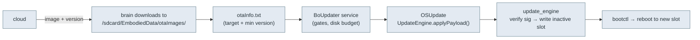

# 🔄 OTA & recovery — can a robot be upgraded without opening it? (`v3.6.4-Zephyr` / OTA `v24.10.803`)

A pre-801 Moxie (Google-IoT firmware) is stranded: its cloud is dead, so it is never told to update.
This page maps the update machinery to answer whether it can be upgraded to 803, or given custom
software, **without disassembly**.
- OTA is stock Android **A/B `update_engine`**, staged from internal `/sdcard` and applied by `OSUpdate`.
- Every path that installs code (OTA payload, recovery sideload) is **signature-gated** by Embodied keys.
- **No no-open route is confirmed for pre-801.** The reliable route is open + flash
  ([flashing runbook](flashing-runbook.md)), which is in scope.

Sources: `OSUpdate.apk`, `me.embodied.services.BoUpdater`, the A/B fstab, the `update_engine` keys.

## How OTA works (803 firmware)

- **Staging area:** `/sdcard/EmbodiedData/otaImages/` + `otaInfo.txt` (target version, minimum-OTA
  version), `otaLog.txt`, and a `DISABLE_OTA` sentinel file. `BoUpdater` enforces a min-version gate
  (can refuse downgrades) and a ~200 MB data-overage budget. It runs even in the setup/config state
  ([boot-and-launcher](boot-and-launcher.md#two-facts-that-matter-for-revival)).
- **`/sdcard` is internal emulated storage** (`export EXTERNAL_STORAGE /sdcard`; `/mnt/shell/emulated`
  → `/data/media`), **not** removable microSD. It is reachable by the robot's downloader, ADB/MTP, or an app.
- **Applier:** `OSUpdate` (`com.embodied.osupdate`) waits for **`/sdcard/update.zip`**, unpacks
  `payload.bin` + `payload_properties.txt`, and calls `android.os.UpdateEngine.applyPayload(
  "file:///sdcard/osupdate-tmp/payload.bin", …)`. `update_engine` writes the **inactive** A/B slot and
  `bootctl` switches to it on reboot. Nothing is touched in place; a bad update rolls back.

## Recovery mode (sideload)

`boot.img` is **recovery-as-boot**: its ramdisk carries `/sbin/recovery` (1.68 MB, AOSP recovery) and
`/sbin/adbd` with a **root seclabel** (`--root_seclabel=u:r:su:s0 --device_banner=recovery`). The menu
offers **Apply update from ADB** (`adb sideload <package>.zip`), **Apply update from SD card**, and
wipe data / factory reset.

**Entry** is via the **BCB** (bootloader control block) on the `misc` partition (recovery mounts
`/dev/block/by-name/misc`): the string `boot-recovery` there makes the bootloader boot recovery. That is
set by `reboot recovery` (needs a shell) or by a key held at power-on. Moxie's only external inputs are
**Power + Macro** ([device-tree](../hardware/device-tree.md#inputs-controls)), so the key route is a bench
experiment ([hardware-access](../hardware/hardware-access.md#boot-mode-entry-reboot-reasons-keys)).

**Storage recovery can read** (`/etc/recovery.fstab`): a **USB drive** (vfat, `voldmanaged=usb`) and an
**SD card** via the SoC's `dwmmc@ff0c0000` (mshc1/sdmmc) controller with card-detect. So an SD slot
exists; whether it is reachable without opening is a hardware question.

**The catch: recovery verifies the package signature.** It checks the whole-file signature against
`/system/etc/security/otacerts.zip` (Embodied's `releasekey`); strings `Signature verification failed` /
`failed to verify whole-file signature`. Both ADB sideload and SD-card update therefore need a
**genuine Embodied-signed OTA**, unless `otacerts.zip`/recovery is replaced first (needs `/system` write
or a reflash). No `/adb_keys` is baked into the recovery ramdisk, so sideload-adbd auth relies on
`/data/misc/adb/adb_keys` or the minadbd sideload path (untested on hardware).

## The signing gate

`update_engine` verifies every payload against a baked-in key:

- `/system/etc/update_engine/update-payload-key.pub.pem`: 2048-bit RSA. Only payloads signed by the
  matching private key apply. It is described in [`../phone/keys/`](../phone/keys/README.md); the `.pem`
  itself is not committed in this tree.
- `/system/etc/security/otacerts.zip` → `releasekey.x509.pem`: the recovery-sideload OTA cert.

So a **genuine Embodied-signed** OTA (e.g. the real 803 `update.zip`) applies to any robot whose
`update_engine` trusts that key, with no disassembly, if the file reaches `/sdcard` and OSUpdate is
triggered. A **self-built** payload cannot apply until `update-payload-key.pub.pem` is replaced, which
needs `/system` write access first. The first foothold must come from a genuine signed image or from
flashing. After that, swap in your own key and sign your own payloads normally.

## Tier-1 (no-disassembly) vectors

Tier 1 is the no-open option set for non-technical owners. Tier 2/3 (external USB/UART, full teardown)
is in [hardware-access](../hardware/hardware-access.md).

| Vector | Needs opening? | Status |
|---|---|---|
| **QR re-home** (`endpoint_update` → OPEN_MOXIE/EMBODIED_LOCAL) | no | **Works on 803 / 801+**. Redirects the cloud; does not upgrade firmware or run code on-device ([qr-commands](../protocol/qr-commands.md)) |
| **QR re-home on pre-801** | no | **Does not work.** Pre-801 hardcodes `mqtt.googleapis.com` (CA-validated TLS, not pinned, [network-trust](../protocol/network-trust.md)); QR can't relocate it ([live-hardware-debug](../../debugging/live-hardware-debug.md)) |
| **Serve a genuine signed OTA** from a network we control | no | Plausible on 801+ (re-home via QR, serve the real `update.zip`). Blocked on pre-801 (can't make it connect to us). **Also needs a genuine signed 803 `update.zip`, which we don't have** (we have partition images, not a payload) |
| **ADB push `update.zip` + launch OSUpdate** | depends on a reachable USB port | `ro.adb.secure=1`, `ro.debuggable=0`: needs an authorized key, and first auth needs an on-screen "allow" the projector can't show. Recovery sideload bypasses auth but needs a key combo and a signed package |
| **MTP copy `update.zip` + launch OSUpdate** | depends on a reachable USB port | The gadget offers **MTP** (`persist.sys.usb.config=mtp,adb`), which needs **no adb authorization**. Something must still launch `com.embodied.osupdate`, and the port may be internal |
| **Rockchip maskrom/rockusb + `rkdeveloptool`** | yes (Tier 3) | **Always works.** The reliable pre-801 path and the route to custom firmware ([runbook](flashing-runbook.md)) |

## Where this leaves pre-801 revival

Blockers to a purely over-the-air fix:
1. Pre-801 won't relocate off Google's dead cloud (hardcoded hostname), so we can't reach it to hand it an OTA.
2. Even then, we'd need a genuine Embodied-signed 803 `update.zip`.
3. ADB/recovery delivery depends on a reachable USB port and a confirmed recovery-entry method.

**Open leads:**
- Find Moxie's recovery key combo / an external USB port. Recovery sideload of an `otacerts`-signed
  package would be a clean no-open upgrade.
- Source a genuine signed 803 `update.zip` (community mirrors / Embodied's final OTA). That makes the
  801+ "QR re-home → serve OTA" path real.
- Does a pre-801 unit that can't reach its cloud fall into the Wifi App's QR mode, and does it accept any QR?
- Does pre-801 `update_engine` trust the same payload key as 803? If so, a signed 803 payload applies directly.
- The download-mode button path (`LOAD` on the mainboard, possibly Macro): unsigned flashing with just
  USB + a button ([fcc-teardown](../hardware/fcc-teardown.md#reset-load-power-on-board-buttons-major-bench-finding)).

---
📖 [Reverse-engineering index](../README.md) · [Firmware image](firmware-image.md) · [QR commands](../protocol/qr-commands.md) · [Docs index](../../README.md)
