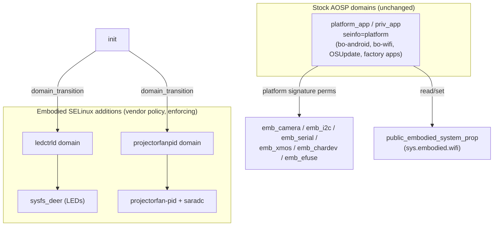

# 🔐 Android permissions & SELinux policy — Moxie `v3.6.4-Zephyr` (OTA `v24.10.803`)

> Measured from the **v24.10.803** `system.img` + `vendor.img` (RK3288, Android 9). This is the
> *access-control* surface: which Android platform permissions & hardware features the firmware
> declares, and how SELinux confines the embodied daemons. It answers a custom-firmware question the
> other docs don't: **what policy must a custom build satisfy (or replace) to run the experience?**
> Pairs with [`firmware-image.md`](firmware-image.md#code-signing-app-trust) (code signing),
> [`hardware-map.md`](../hardware/hardware-map.md) (the devices these labels protect) and
> [`boot-and-launcher.md`](boot-and-launcher.md) (the init services these domains run as).

## TL;DR

- **The embodied apps carry NO extra permission policy.** There are **zero embodied entries** in
  `privapp-permissions-platform.xml` and **no custom `seapp_contexts`** — the brain (`bo-android`),
  `bo-wifi`, OSUpdate, the factory apps, etc. run in the **stock** `platform_app` / `priv_app` SELinux
  domains with `seinfo=platform`. They get their power purely from being **signed with the platform
  key** (signature-level permissions) — see [`firmware-image.md`](firmware-image.md#code-signing-app-trust).
  → For custom firmware this is the clean seam: **sign your app with the platform key (or resign the
  ROM) and you inherit the same access with no policy edits.**
- **Embodied's SELinux additions are tiny and hardware-focused**: **2 custom daemon domains**
  (`ledctrld`, `projectorfanpid`) and a handful of **device/file/property types** wrapping the LEDs,
  projector fan, camera, I²C buses, XMOS speaker, panel selector and eFuse. Everything else is stock
  AOSP + Rockchip policy.
- **SELinux is enforcing** (`androidboot.veritymode=enforcing`, and **none** of the embodied domains
  are marked `permissive`).
- The declared **hardware-feature set is deliberately minimal** — no telephony, no touchscreen
  (`faketouch` instead), no microphone/sensor/location HAL features. A custom ROM must advertise the
  same short list for apps to behave.

## 1. Android permission surface (`/system/etc/permissions`, `/system/etc/sysconfig`)

| File | Bytes | Role |
|---|--:|---|
| `privapp-permissions-platform.xml` | 23,162 | Allow-list of signature|privileged permissions per priv-app. **Stock AOSP — no embodied packages listed.** |
| `platform.xml` | 10,323 | Permission→GID mappings + `<assign-permission>` (stock). |
| `android.software.{live_wallpaper,webview}.xml` | — | System features the framework advertises. |
| `com.android.{media.remotedisplay,mediadrm.signer,location.provider}.xml` | — | Shared-library exports (stock). |
| `sysconfig/framework-sysconfig.xml` | 1,757 | Framework tunables (stock). |
| `sysconfig/hiddenapi-package-whitelist.xml` | 3,360 | Hidden-API greylist (stock). |

> **Finding:** grepping every priv-app package (`bo-android`, `bo-wifi`, `com.embodied.osupdate`,
> `me.embodied.productiontesting.*`, …) against `privapp-permissions-platform.xml` returns **nothing**.
> The embodied apps therefore rely entirely on **platform-signature** permissions, not privileged-app
> allow-listing. That's why re-pointing/repackaging work on the app layer without touching sepolicy.

### Declared hardware features (what a custom ROM must advertise)

From `/vendor/etc/permissions/*.xml` (+ the two system `software.*`):

| Declared feature | Why it's here |
|---|---|
| `android.hardware.camera` + `camera.front` | OV2710 front camera (vision/QR) |
| `android.hardware.wifi` + `wifi.direct` | BCM4339 Wi-Fi (only radio; setup + cloud) |
| `android.hardware.bluetooth` + `bluetooth_le` | BT/BLE stack present |
| `android.hardware.usb.host` + `usb.accessory` | internal USB (XMOS audio, MTP/ADB) |
| `android.hardware.faketouch` | **no real touchscreen** — the projector face has none; apps that require touch fall back to faketouch |
| `android.hardware.opengles.aep` | GLES Android Extension Pack (Unity face render) |
| `android.software.verified_boot` | AVB is on |
| `tablet_core_hardware.xml` | base "tablet" profile |
| `android.software.live_wallpaper`, `android.software.webview` | framework features |

**Conspicuously ABSENT** (so a custom build should *not* advertise them, and apps must not assume them):
`android.hardware.telephony*` (vestigial RIL only), `android.hardware.touchscreen`,
`android.hardware.microphone` (the mic is the **XMOS USB** array, not a HAL feature — see
[`perception-pipeline.md`](../runtime/perception-pipeline.md)), `android.hardware.location*` / `sensor.*` (no GPS,
no IMU exposed as a feature), and no **GMS** (see [`firmware-inventory.md`](firmware-inventory.md)).

## 2. SELinux — the embodied additions

Policy files: `/system/etc/selinux/plat_*` (AOSP base) and `/vendor/etc/selinux/vendor_*`
(Rockchip + **embodied**). The embodied-authored types are:

### Custom daemon domains

| Domain | Runs | Entered via | Confinement highlights (from `vendor_sepolicy.cil`) |
|---|---|---|---|
| **`ledctrld`** | `/system/bin/ledctrld` (LED daemon, PCA963x) | `init → ledctrld` domain transition on `ledctrld_exec` | writes `sysfs_deer` (LED sysfs), **binds a TCP socket** (`net_raw`, `name_bind` — a local LED-control listener), reads `system_boot_reason_prop`, `set` on `system_prop`, r/w `media_rw_data_file` + `sdcardfs` |
| **`projectorfanpid`** | `/system/bin/projectorfanpid` (DLP fan PID) | `init → projectorfanpid` on `projectorfanpid_exec` | reads `projectorfanpid_file` (`/sys/.../projectorfan-pid/*`), **`saradc_file`** (fan-tach ADC), `sysfs_brightness`, `sysfs_fan_det`, `emb_chardev_device`; execs `logwrapper`/`logcat` |

Both get their own `*_exec` and `*_tmpfs` types and a `typetransition` from `init` — i.e. they are
**first-class enforcing domains**, not `init`-inherited shells. Neither is `permissive`.

### Custom device / file / property types (label → hardware)

| SELinux type | Labels (`vendor_file_contexts`) | Hardware |
|---|---|---|
| `emb_camera_file` | `/dev/video[0-9]`, `/dev/media[0-9]`, `/dev/v4l-subdev[0-9]` | OV2710 V4L2 camera |
| `emb_i2c_file` | `/dev/i2c-1`, `/dev/i2c-4`, `/dev/i2c-5` | I²C buses (DLPC3430 projector @ `5-001b`, PCA963x LEDs, sensors) |
| `emb_serial_file` | `/dev/ttyS3` | UART to the **Lizard** STM32 MCU / motor + power sub-board |
| `emb_xmos_file` | `/sys/devices/platform/xmos-usb/speaker_en` | XMOS DSP speaker-enable line |
| `emb_efuse_file` | `/sys/devices/platform/efuse-status/status` | SoC eFuse status |
| `emb_chardev_device` | `/dev/panel_name` | display-panel selector (`sys.embodied.displayhw`) |
| `projectorfanpid_file` | `/sys/devices/platform/projectorfan-pid(/.*)?` | DLP projector fan controller |

> These map one-to-one onto the [`hardware-map.md`](../hardware/hardware-map.md) device list — the policy is the
> canonical "what talks to what" for the custom silicon around the RK3288.

### App domains & properties

- **`seapp_contexts`**: `plat_seapp_contexts` is **stock**; `vendor_seapp_contexts` is **empty**. No
  embodied app seinfo → the brain and friends run as `platform_app`/`priv_app` (the stock rows keyed
  on `seinfo=platform`, i.e. platform-signed).
- **Property labels**: only **`sys.embodied.wifi`** is explicitly labeled — `public_embodied_system_prop`
  — so the Wi-Fi HAL (`hal_wifi_supplicant`) and `system_app` can read/set it across the vendor/system
  cut. The rest of the `sys.embodied.*` tree falls under the default vendor system-prop label. The
  policy grants `system_app` both `property_service:set` and file read on `public_embodied_system_prop`.

## 3. What this means for the three goals

**① Custom firmware.** The confinement you must satisfy is small and well-defined: keep (or recreate)
the 2 daemon domains + the `emb_*` device labels, and **sign with the platform key** so your app lands
in `platform_app`/`priv_app` with the signature permissions the brain uses. Because SELinux is
enforcing, a custom binary that pokes `/dev/i2c-*`, the XMOS speaker line or the projector fan needs a
matching domain/allow rule — the tables above are the checklist. Nothing here blocks an
`ro.oem_unlock_supported=1` unlock + resign path (see [`hardware-access.md`](../hardware/hardware-access.md)).

**② Server revival.** Irrelevant to the cloud contract — the server never touches Android policy. Noted
only to rule it out: no permission/SELinux rule gates which backend the robot talks to (that's the
TLS/endpoint story in [`network-trust.md`](../protocol/network-trust.md) / [`cloud-protocol.md`](../protocol/cloud-protocol.md)).

**③ Pre-801 revival without disassembly.** No new lever here — the policy is enforcing and standard;
it neither helps nor blocks a no-open path beyond what [`ota-and-recovery.md`](ota-and-recovery.md)
already documents.

---
📖 [Reverse-engineering index](../README.md) · [Field guide](../FIELD-GUIDE.md) · [Firmware reference](firmware-803-reference.md) · [Hardware map](../hardware/hardware-map.md)
