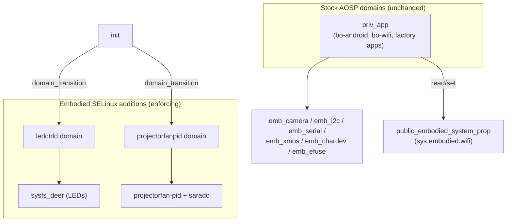

# 🔐 Android permissions & SELinux policy — Moxie `v3.6.4-Zephyr` (OTA `v24.10.803`)

This is the **access-control surface** of the v24.10.803 `system.img` + `vendor.img`: which permissions
and hardware features the firmware declares, and how SELinux confines Embodied's code. It answers what
policy a custom build must satisfy.
- **No embodied permission policy.** Zero embodied entries in `privapp-permissions-platform.xml`, no
  custom `seapp_contexts`. The brain runs in the **stock `priv_app` domain** and gets its privileges from
  `/system/priv-app` placement ([firmware-image](firmware-image.md#code-signing-app-trust)).
- **Embodied's SELinux additions are tiny and hardware-focused:** 2 daemon domains (`ledctrld`,
  `projectorfanpid`) plus a handful of `emb_*` device/file types and one property label.
- **SELinux is enforcing**, and the declared hardware-feature set is deliberately minimal.

## 1. Android permission surface (`/system/etc/permissions`, `/system/etc/sysconfig`)

| File | Bytes | Role |
|---|--:|---|
| `privapp-permissions-platform.xml` | 23,162 | allow-list of `signature|privileged` permissions per priv-app. **Stock AOSP; no embodied packages** |
| `platform.xml` | 10,323 | permission→GID mappings + `<assign-permission>` (stock) |
| `android.software.{live_wallpaper,webview}.xml` | — | system features the framework advertises |
| `com.android.{media.remotedisplay,mediadrm.signer,location.provider}.xml` | — | shared-library exports (stock) |
| `sysconfig/framework-sysconfig.xml` | 1,757 | framework tunables (stock) |
| `sysconfig/hiddenapi-package-whitelist.xml` | 3,360 | hidden-API greylist (stock) |

Grepping every priv-app package (`bo-android`, `bo-wifi`, `com.embodied.osupdate`,
`me.embodied.productiontesting.*`, …) against `privapp-permissions-platform.xml` returns nothing, and
`ro.control_privapp_permissions` is unset, so the allowlist is not enforced. Repackaging the app layer
therefore needs no policy edit.

### Declared hardware features (what a custom ROM must advertise)

From `/vendor/etc/permissions/*.xml` (+ the two system `software.*`):

| Declared feature | Why it's here |
|---|---|
| `android.hardware.camera` + `camera.front` | OV2710 front camera (vision/QR) |
| `android.hardware.wifi` + `wifi.direct` | BCM4339 Wi-Fi (only radio; setup + cloud) |
| `android.hardware.bluetooth` + `bluetooth_le` | BT/BLE stack present |
| `android.hardware.usb.host` + `usb.accessory` | internal USB (XMOS audio, MTP/ADB) |
| `android.hardware.faketouch` | **no real touchscreen**; the projector face has none |
| `android.hardware.opengles.aep` | GLES Android Extension Pack (Unity face render) |
| `android.software.verified_boot` | AVB is on |
| `tablet_core_hardware.xml` | base "tablet" profile |
| `android.software.live_wallpaper`, `android.software.webview` | framework features |

**Absent** (a custom build should not advertise them): `android.hardware.telephony*` (vestigial RIL
only), `android.hardware.touchscreen`, `android.hardware.microphone` (the mic is the **XMOS USB** array,
not a HAL feature, see [perception-pipeline](../runtime/perception-pipeline.md)),
`android.hardware.location*` / `sensor.*` (no GPS, no IMU feature), and no **GMS**
([firmware-inventory](firmware-inventory.md)).

## 2. SELinux

Policy files: `/system/etc/selinux/plat_*` (AOSP base) and `/vendor/etc/selinux/vendor_*` (Rockchip +
Embodied).

**Enforcing.** `user`/`release-keys` build, no `androidboot.selinux=permissive` on the
[kernel cmdline](firmware-803-reference.md#bootimg-kernel-cmdline-verbatim), and no permissive statement
for any Embodied type.

**Apps run in stock domains.** `plat_seapp_contexts` is stock and `vendor_seapp_contexts` is empty.
`bo-android` matches the ordinary rule `user=_app isPrivApp=true domain=priv_app`. It appears nowhere
in `seapp_contexts`, `mac_permissions.xml`, or as a custom type. A replacement app dropped into
`/system/priv-app` inherits the same `priv_app` domain with no sepolicy edit.

> An earlier pass described the embodied apps as platform-signed, running as `platform_app` with
> `seinfo=platform`. The per-APK signer decode contradicts that for `bo-android`/`bo-wifi` (Android
> Debug key). Whether the `CN=Embodied` certificate is also the platform certificate (which would put
> `OSUpdate`/`Launcher3Robot`/`BluetoothSpeaker` in `platform_app`) is not established.

### Custom daemon domains

Embodied's policy footprint at the init layer is two daemons, each with its own `*_exec` and `*_tmpfs`
types and a `typetransition` from `init`: first-class enforcing domains, neither `permissive`. (One
pass located them in `plat_sepolicy.cil`, another read the rules below from `vendor_sepolicy.cil`.)

| Domain | Runs | Confinement highlights |
|---|---|---|
| **`ledctrld`** | `/system/bin/ledctrld` (LED daemon, PCA963x) | writes `sysfs_deer` (LED sysfs); **binds a TCP socket** (`net_raw`, `name_bind`: a local LED-control listener); reads `system_boot_reason_prop`; `set` on `system_prop`; r/w `media_rw_data_file` + `sdcardfs` |
| **`projectorfanpid`** | `/system/bin/projectorfanpid` (DLP fan PID) | reads `projectorfanpid_file` (`/sys/.../projectorfan-pid/*`), **`saradc_file`** (fan-tach ADC), `sysfs_brightness`, `sysfs_fan_det`, `emb_chardev_device`; execs `logwrapper`/`logcat` |

### Custom device / file / property types (label → hardware)

| SELinux type | Labels (`vendor_file_contexts`) | Hardware |
|---|---|---|
| `emb_camera_file` | `/dev/video[0-9]`, `/dev/media[0-9]`, `/dev/v4l-subdev[0-9]` | OV2710 V4L2 camera |
| `emb_i2c_file` | `/dev/i2c-1`, `/dev/i2c-4`, `/dev/i2c-5` | I²C buses (DLPC3430 @ `5-001b`, PCA963x LEDs, sensors) |
| `emb_serial_file` | `/dev/ttyS3` | UART to the **Lizard** STM32 MCU |
| `emb_xmos_file` | `/sys/devices/platform/xmos-usb/speaker_en` | XMOS DSP speaker-enable line |
| `emb_efuse_file` | `/sys/devices/platform/efuse-status/status` | SoC eFuse status |
| `emb_chardev_device` | `/dev/panel_name` | display-panel selector (`sys.embodied.displayhw`) |
| `projectorfanpid_file` | `/sys/devices/platform/projectorfan-pid(/.*)?` | DLP projector fan controller |

These map one-to-one onto the [hardware-map](../hardware/hardware-map.md) device list: the policy is the
canonical "what talks to what" around the RK3288.

**Property label:** only **`sys.embodied.wifi`** is explicitly labeled (`public_embodied_system_prop`), so
the Wi-Fi HAL (`hal_wifi_supplicant`) and `system_app` can read/set it across the vendor/system cut
(`system_app` gets `property_service:set` + file read). The rest of `sys.embodied.*` falls under the
default vendor system-prop label.

```mermaid
flowchart TB
  subgraph plat["Stock AOSP domains (unchanged)"]
    pa["priv_app<br/>(bo-android, bo-wifi, factory apps)"]
  end
  subgraph emb["Embodied SELinux additions (enforcing)"]
    led["ledctrld domain"] --> ledsys["sysfs_deer (LEDs)"]
    fan["projectorfanpid domain"] --> fansys["projectorfan-pid + saradc"]
  end
  init["init"] -->|domain_transition| led
  init -->|domain_transition| fan
  pa --> dev["emb_camera / emb_i2c / emb_serial /<br/>emb_xmos / emb_chardev / emb_efuse"]
  pa -->|read/set| prop["public_embodied_system_prop<br/>(sys.embodied.wifi)"]
```

## 3. What this means

- **Custom firmware.** Keep (or recreate) the 2 daemon domains and the `emb_*` labels. A new binary that
  pokes `/dev/i2c-*`, the XMOS speaker line or the projector fan needs a matching domain/allow rule, and
  the tables above are the checklist. `ledctrld`/`projectorfanpid` are the template for adding one.
- **Server revival.** Unaffected. No permission or SELinux rule gates which backend the robot talks to
  (that is TLS/endpoints: [network-trust](../protocol/network-trust.md), [cloud-protocol](../protocol/cloud-protocol.md)).
- **Pre-801 revival without disassembly.** No new lever beyond [ota-and-recovery](ota-and-recovery.md).

---
📖 [Reverse-engineering index](../README.md) · [Field guide](../FIELD-GUIDE.md) · [Firmware reference](firmware-803-reference.md) · [Hardware map](../hardware/hardware-map.md)
