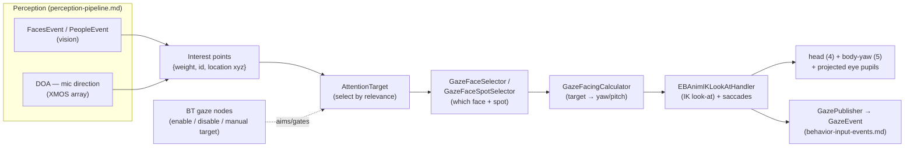

# 👀 Gaze & attention — how Moxie decides where to look (`v3.6.4-Zephyr` / OTA `v24.10.803`)

> Recovered from `Assembly-CSharp.dll` (the brain, `bo-android`) in the **v24.10.803** image. This is the
> loop that turns *perception* into *eye contact*: what Moxie finds interesting, which target it looks
> at, and how the head + eyes move there with biologically-plausible **saccades**. It sits between
> [`perception-pipeline.md`](perception-pipeline.md) (faces / people / mic direction come in) and
> [`hardware-map.md`](hardware-map.md) (head + eye motion goes out), and is aimed/gated by the gaze
> nodes in [`behavior-tree-engine.md`](behavior-tree-engine.md). Every constant below is read straight
> from the binary.

## TL;DR

- Attention is a set of **weighted 3D interest points** (`InterestPointInfo { float weight; ulong id;
  Vector3 location; }`). Faces, people and mic direction-of-arrival become interest points; the highest
  relevance wins the **`AttentionTarget`**.
- **`GazeBehavior`** aims the head + eyes at the target through pluggable strategies — a
  **face/spot selector** (which face, and where on it) and a **facing calculator** (target → yaw/pitch)
  — then an **IK look-at** handler (`EBAnimIKLookAtHandler`) drives the joints, with real **saccades**
  (quick eye jumps) layered on top.
- The motion is tuned to look alive, not robotic: a **10° re-target hysteresis** stops jitter between
  near-equal targets, and saccade duration scales with angle (the biological "main sequence"), floored
  at **12.5 ms**.
- It's fully controllable from content: BT nodes enable/disable gaze, force a manual target, or hand
  control to the behavior tree ([`behavior-tree-engine.md`](behavior-tree-engine.md)).

## The attention model

| Type | Fields | Meaning |
|---|---|---|
| `InterestPointInfo` (struct) | `weight : float`, `id : ulong`, `location : Vector3` | one thing worth looking at — a **weighted 3D point** (invalid = id 0 / `float.MinValue`) |
| `AttentionTarget` | `_info : InterestPointInfo`, `_state`, `_timestamp` | the currently-selected interest point + when it was chosen (`IsValid`, `TimeSince`) |
| `AttentionTargetInternal` | — | the brain's mutable working target (`GazeBehavior._attentionTarget`) |

Faces/people (from `libbo-vision`, [`perception-pipeline.md`](perception-pipeline.md)) and the mic-array
**direction-of-arrival** (`DOAInputEvent`) are converted into interest points; the highest-`weight`,
most-recent valid point becomes the `AttentionTarget`. `AttentionEvent` publishes attention changes onto
the [input-event bus](behavior-input-events.md).

## GazeBehavior — the controller

Once a target is chosen, `GazeBehavior` runs three swappable strategies:

1. **Face/spot selection** — `GazeFaceSelector` → `GazeFaceSelectorDefault`, and
   `GazeFaceSpotSelector` → `GazeFaceSpotSelectorBT` (behavior-tree-driven): *which* face, and *where on
   it* (eyes/nose/mouth spot) to fixate.
2. **Facing calculation** — `GazeFacingCalculator`, with variants: `…Default`, `…Legacy`,
   `…CenterTarget` (look at the target's centroid) and `…DebugLookAtPosition`. Turns the target's 3D
   location into a head **yaw/pitch** goal.
3. **IK look-at** — `EBAnimIKLookAtHandler` drives the head (motor 4) + body-yaw (motor 5, see
   [`hardware-map.md`](hardware-map.md)) and the **projected eye pupils** toward the goal, with the
   saccade layer below. `GazePublisher` emits the resulting `GazeEvent`; `GazeLog` traces it.

### Motion tuning (constants from the binary)

| Constant | Value | Role |
|---|--:|---|
| `SaccadeMinTime` | **0.0125 s** | floor on a saccade's duration (12.5 ms) |
| `SaccadeTimeAngleFactor` | **0.00235 s/°** | saccade duration grows with amplitude — the biological **main sequence** (bigger jumps take longer) |
| `SaccadeCoolDownAngleLimit` | **5°** | movements under 5° skip the post-saccade cooldown (allows quick micro-adjustments) |
| `GazeTargetChangeTolleranceAngle` | **10°** | **hysteresis** — don't switch targets for a <10° change, so the eyes don't jitter between near-equal points |
| `SaccadeMovementYawTime` / `PitchTime` | computed | per-axis saccade durations (from `MinTime` + angle × `AngleFactor`) |
| `ForceSaccade` / `CanSaccadeMove` | flags | force / gate a saccade this frame |
| `_gazeDefualtGts` | 2 | default gaze-target source |

So Moxie's eyes make **fast angle-scaled saccades** between fixation points, hold with a small cooldown,
and only re-target when the world moves ≥10° — which is exactly what reads as a curious, attentive gaze
rather than a servo tracking a dot.

## Control from content / behavior trees

The gaze loop is aimed and gated by the `RobotBT_*` nodes ([`behavior-tree-engine.md`](behavior-tree-engine.md)):
`RobotBT_GazeControlTarget` / `RobotBT_GazeControlManualTarget` (point the gaze at a chosen target),
`RobotBT_GazeDisabler` (suspend autonomous gaze during a scripted look), and `RobotBT_EyeGazeEnabled` /
`GazeControlManualTargetDataChanged`. So a content module can say "look at the child," "look away," or
"hold this pose" while the rest of the attention system idles.

## What this means for the three goals

**① Custom firmware / custom brain.** This is the complete recipe for lifelike gaze: model interest as
weighted 3D points, select an attention target with a ~10° hysteresis, and drive the head/eyes with
angle-scaled saccades floored at ~12.5 ms. The [SIL](../architecture/sil-and-cicd.md) already ships a
*simplified* version of this (idle gaze drift + the imaginary-life look-around beats in `life.js`); the
constants here are what a faithful re-implementation would use.

**② Server revival.** Gaze is on-device (it needs the camera + mic-array in real time), so a self-hosted
server does not run it — it only nudges it via content markup (`RobotBT_GazeControl*`). Noted to bound
it out.

**③ Pre-801 revival.** No new lever; brain-side, above the network boundary.

---
📖 [Reverse-engineering index](README.md) · [Perception pipeline](perception-pipeline.md) · [Behavior input events](behavior-input-events.md) · [Behavior-tree engine](behavior-tree-engine.md) · [Hardware map](hardware-map.md)
