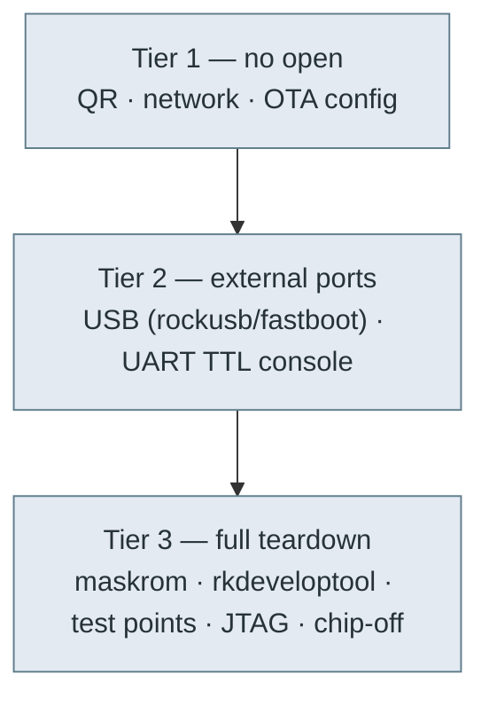

# 🔌 Hardware access & flashing — the physical surface

> **Scope: the whole machine.** This project deliberately covers Moxie **end to end** — including
> opening the shell, USB flashing, UART/TTL serial, JTAG, and re-signing firmware. The
> [no-disassembly options](ota-and-recovery.md) are just the *first tier* we exhaust for owners who
> can't (or shouldn't) open the robot; everything below is the **planned, in-scope** path for custom
> firmware and for reviving robots the over-the-air route can't reach. Build: **v3.6.4-Zephyr / OTA
> v24.10.803**, board **`rk3288-robot-gen1p5`** (`board=evb_rk3288`).

## Access tiers



## The Rockchip boot / download modes (RK3288)

U-Boot's `bootcmd` (recovered from `uboot.img`) shows the built-in fallbacks:

```
bootcmd = boot_android ${devtype} ${devnum};
          echo AVB boot failed and enter rockusb or fastboot!;
          rockusb 0 ${devtype} ${devnum};
          fastboot usb 0;
```

So on an **AVB verification failure the bootloader itself drops into `rockusb` (Rockchip USB download
mode), then `fastboot`** — both reachable over the USB data lines without special keys. The RK3288
also has:

| Mode | How to enter | Tool |
|---|---|---|
| **Maskrom** | hold the SoC's `BOOT`/recovery test-point low while powering (or corrupt the loader) | `rkdeveloptool db <loader>` then `wl`/`ul` |
| **Loader / rockusb** | U-Boot download mode (auto-entered on AVB fail, or `reboot loader`) | `rkdeveloptool`, `upgrade_tool`, Rockchip DriverAssistant |
| **Fastboot** | U-Boot fallback (see bootcmd) or `reboot bootloader` | `fastboot` (note RK fastboot is limited) |
| **Recovery** | A/B recovery-as-boot; `reboot recovery` or BCB in `misc` | `adb sideload` |

`bootloader-locked=%s` / `bootloader-min-versions=%s` strings confirm a lock-state variable; combined
with `ro.oem_unlock_supported=1`, the bootloader can be unlocked (see [`firmware-image.md`](firmware-image.md)).

## Boot-mode entry (reboot reasons & keys)

U-Boot selects a boot mode from a **reboot-reason magic** (written to a PMU register by the kernel's
`syscon-reboot-mode`, then read by the loader) **or** from a **key held at power-on**.

### Software: `reboot <mode>` → magic (`0x5242c3xx` = "BRc")
| `reboot` arg | Magic | Effect |
|---|---|---|
| normal | `0x5242c300` | normal boot |
| **loader** | `0x5242c301` | **Rockchip loader / rockusb** download → `rkdeveloptool` |
| recovery | `0x5242c303` | recovery ([sideload](ota-and-recovery.md)) |
| **bootloader** | `0x5242c309` | **Android fastboot** (`fastboot usb 0`) |
| **ums** | `0x5242c30c` | **USB Mass Storage** — exposes storage as a USB drive |
| halt / quiet | `0x5242c30d/e` | halt / quiet |

`bootonce-bootloader` gives a one-shot fastboot. All of these need a **root shell first** (normal-boot
ADB is locked), so they're most useful once you already have access — or from recovery.

### Hardware: a key at power-on (no shell needed)
U-Boot reads **`adc-keys`** (via SARADC) and the **PMIC power key** (`rk8xx_pwrkey`) at boot:
- `"recovery key pressed, entering recovery mode!"`
- `"download key pressed... Enter bootrom download..."` → **rockusb/bootrom download** (rkdeveloptool)

The **download and recovery keys are ADC levels on the SARADC** — the *same input class as the
**Macro** button* ([`device-tree.md`](device-tree.md); the kernel node reads `saradc` ch1,
`macro-key { rockchip,adc_value = <1> }`). Detection is **long-press** (U-Boot logs
`'%s' key long pressed...`), so the entry is a **held** button at power-on, not a tap. This strongly
implies **holding the Macro button while powering on enters recovery or bootrom-download mode**.

The **exact microvolt threshold that distinguishes download vs recovery is not in the extracted DTBs**
— the U-Boot control DTB is a stripped `Evb-RK3288` ([`manifests/uboot-control.dts`](manifests/uboot-control.dts))
with no `adc-keys` node, so those thresholds are compiled into Rockchip U-Boot. Confirming *which*
level → *which* mode is a **bench experiment** (watch the [serial console](#serial-console-uart--ttl)
while holding Macro at power-on). The power key is the RK808 PMIC key (also long-press capable).

> **Why this matters for goal #3 (low/no-open revival):** the **download-key → rockusb** path is
> **unsigned** — `rkdeveloptool` can then flash *anything*, including a `--disable-verification`
> `vbmeta`, bypassing the signed-OTA gate that blocks [recovery sideload](ota-and-recovery.md). So if
> the Macro button enters download mode **and a USB data port is reachable**, you can revive/reflash a
> unit (even pre-801) with just **USB + a button** — no teardown. Confirming (a) the button→mode
> mapping and (b) an accessible USB port is the key bench experiment.

## Flashing a partition (the reliable path)

### Partition table (flash targets)

`rkdeveloptool`/`upgrade_tool` address partitions **by name** (from the eMMC GPT), so you don't need
offsets to flash — you need the names. The complete `by-name` set for this build:

| Partition | A/B? | What |
|---|---|---|
| `uboot` | — | U-Boot (SPL + U-Boot) |
| `trust` | — | OP-TEE secure world ([firmware-image](firmware-image.md#tee--secure-world-op-tee--rpmb)) |
| `misc` | — | BCB (recovery/loader signalling) |
| `resource` | — | boot logo + DTB (RSCE) |
| `dtbo` | ✅ `_a`/`_b` | device-tree overlay (empty stub here) |
| `vbmeta` | ✅ `_a`/`_b` | **AVB metadata** — flash a `--disable-verification` one here |
| `boot` | ✅ `_a`/`_b` | kernel + ramdisk (+ recovery) |
| `system` | ✅ `_a`/`_b` | Android `/` (system-as-root) |
| `vendor` | ✅ `_a`/`_b` | Rockchip HALs + fstab + hw init |
| `oem` | — | boot animation |
| `metadata` | — | vold/metadata-encryption keys |
| `frp` | — | factory-reset-protection / persistent unlock consent |
| `cache` | — | (legacy) |
| `userdata` | — | `/data` (f2fs, `forceencrypt`) |

The **A/B (`slotselect`) partitions** carry `_a`/`_b` suffixes; flash the **inactive** slot (or both).
`trust`, `uboot`, `misc`, `frp`, `userdata` are single-slot. **Exact offsets/sizes are in the eMMC
GPT** (not in any partition image) — read them on a bench with `rkdeveloptool ppt` (print partition
table) or `gpt`. Verify a read-back against the [SHA-256s](firmware-803-reference.md).


1. Enter **maskrom** or **loader** mode over USB.
2. `rkdeveloptool db rk3288_loader.bin` (download the DDR init + loader).
3. `rkdeveloptool wl <offset> <partition.img>` (or `upgrade_tool uf update.img`). Partition names map
   to the GPT `by-name` entries in [`firmware-image.md`](firmware-image.md).
4. To run **modified** `system`/`vendor`: flash a `--disable-verification` `vbmeta` (or re-sign the
   AVB hashtrees with your own key), then flash your images. A/B: flash the inactive slot or both.

> ⚠️ `/data` is `forceencrypt` f2fs — replacing `system`/keystore state may force a data wipe on first
> boot. Back up `/data` first if you care about paired state.

## Serial console (UART / TTL)

The kernel cmdline sets **`console=ttyFIQ0`** (`androidboot.console=ttyFIQ0`) — the RK3288 **FIQ debugger
serial console**. Bring a 3.3 V USB-TTL adapter to the board's debug UART (RK3288 debug UART is
typically **1500000 baud**, 8N1; some builds use 115200 — try both) to get:

- U-Boot prompt + boot logs (watch the AVB / `rockusb`/`fastboot` fallback live).
- Android kernel `dmesg` and the `init`/`FIQ` console.
- A shell for debugging (subject to `ro.secure`/SELinux; recovery/maskrom bypass this).

Locating the pads: the DTB is `rk3288-robot-gen1p5.dtb` — dump it (`dtc`) to find the `uart` node and
its pinmux, then map to test points on the mainboard. (Teardown photos / test-point map: TODO as we
open a unit.)

## ADB / USB (when booted normally)

- Gadget offers `adb`, `mtp`, `mtp+adb`, `rndis` (idVendor `18d1`, idProduct `4EE7`).
- `ro.adb.secure=1` + `ro.debuggable=0`: normal-mode ADB needs an authorized key and an on-screen
  "allow" (hard on a projector-face device). **Recovery-mode adb sideload** and **maskrom/rockusb**
  bypass this — hence Tier-2/3.
- MTP needs no adb auth (can drop files on `/sdcard` if a port is reachable) — see [`ota-and-recovery.md`](ota-and-recovery.md).

## JTAG / SWD & chip-off (deep tier)

The RK3288 exposes JTAG (muxed on SD/other pins; enabled via eFuse/loader in some configs). For a
fully bricked unit or key extraction, JTAG/SWD or eMMC chip-off + external programmer are the last
resort. Documenting pinouts requires a unit on the bench (TODO).

## In-scope checklist (as we open a unit)

- [ ] Photograph the mainboard; identify SoC, eMMC, MCU, DLPC3430, XMOS, PMIC.
- [ ] Find + label the **debug UART** pads; capture a full boot log at both baud rates.
- [ ] Confirm maskrom entry (test point) and dump the loader.
- [ ] `rkdeveloptool` read-back of each partition (compare SHA-256 to [`firmware-803-reference.md`](firmware-803-reference.md)).
- [ ] Flash a `--disable-verification` vbmeta + a debuggable `system`; get root ADB.
- [ ] Map the Lizard MCU UART + its firmware-update header (see [`hardware-map.md`](hardware-map.md)).

---
📖 [Reverse-engineering index](README.md) · [Firmware image (build & sign)](firmware-image.md) · [OTA & recovery](ota-and-recovery.md) · [Hardware map](hardware-map.md) · [Docs index](../README.md)
