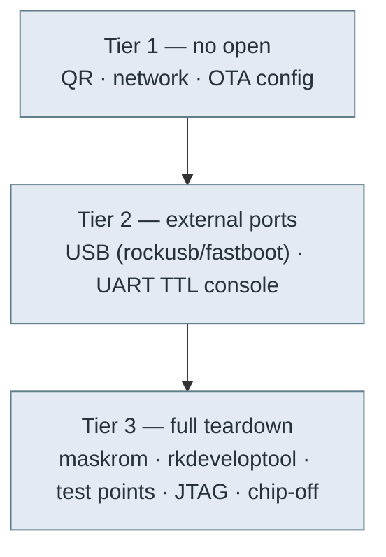

# 🔌 Hardware access & flashing — the physical surface

The physical ways into a Moxie (**v3.6.4-Zephyr / OTA v24.10.803**, board **`rk3288-robot-gen1p5`**,
U-Boot `board=evb_rk3288`): the RK3288 download/boot modes, how to enter them, the partition names to
flash, the serial console, ADB/USB and JTAG. Opening the robot is in scope; the
[no-disassembly options](../firmware/ota-and-recovery.md) are only the first tier. The step-by-step
procedure is the [flashing runbook](../firmware/flashing-runbook.md).

## Access tiers



## The Rockchip boot / download modes (RK3288)

U-Boot's `bootcmd` (recovered from `uboot.img`) shows the built-in fallbacks:

```
bootcmd = boot_android ${devtype} ${devnum};
          echo AVB boot failed and enter rockusb or fastboot!;
          rockusb 0 ${devtype} ${devnum};
          fastboot usb 0;
```

On an **AVB verification failure the bootloader itself drops into `rockusb` (Rockchip USB download
mode), then `fastboot`**, both reachable over USB without special keys.

| Mode | How to enter | Tool |
|---|---|---|
| **Maskrom** | hold the mainboard `LOAD` button ([fcc-teardown](fcc-teardown.md#reset-load-power-on-board-buttons-major-bench-finding)) or the SoC `BOOT`/recovery test point while powering (or corrupt the loader) | `rkdeveloptool db <loader>` then `wl`/`ul` |
| **Loader / rockusb** | U-Boot download mode (auto-entered on AVB fail, or `reboot loader`) | `rkdeveloptool`, `upgrade_tool`, Rockchip DriverAssistant |
| **Fastboot** | U-Boot fallback (see bootcmd) or `reboot bootloader` | `fastboot` (note RK fastboot is limited) |
| **Recovery** | A/B recovery-as-boot; `reboot recovery` or BCB in `misc` | `adb sideload` |

`bootloader-locked=%s` / `bootloader-min-versions=%s` strings confirm a lock-state variable. With
`ro.oem_unlock_supported=1` an unlock exists, but it is AVB-ATX attestation-gated
([firmware-image](../firmware/firmware-image.md#the-verified-boot-chain-and-how-to-break-it-for-custom-code)).

## Boot-mode entry (reboot reasons & keys)

U-Boot selects a boot mode from a **reboot-reason magic** (written to a PMU register by the kernel's
`syscon-reboot-mode`, then read by the loader) **or** from a **key held at power-on**.

### Software: `reboot <mode>` → magic (`0x5242c3xx` = "BRc")
| `reboot` arg | Magic | Effect |
|---|---|---|
| normal | `0x5242c300` | normal boot |
| **loader** | `0x5242c301` | **Rockchip loader / rockusb** download → `rkdeveloptool` |
| recovery | `0x5242c303` | recovery ([sideload](../firmware/ota-and-recovery.md)) |
| **bootloader** | `0x5242c309` | **Android fastboot** (`fastboot usb 0`) |
| **ums** | `0x5242c30c` | **USB Mass Storage** — exposes storage as a USB drive |
| halt / quiet | `0x5242c30d/e` | halt / quiet |

`bootonce-bootloader` gives a one-shot fastboot. All of these need a **root shell first** (normal-boot
ADB is locked), so they're most useful once you already have access — or from recovery.

### Hardware: a key at power-on (no shell needed)
U-Boot reads **`adc-keys`** (via SARADC) and the **PMIC power key** (`rk8xx_pwrkey`) at boot:
- `"recovery key pressed, entering recovery mode!"`
- `"download key pressed... Enter bootrom download..."` → **rockusb/bootrom download** (rkdeveloptool)

The **download and recovery keys are ADC levels on the SARADC** — the *same input class as the
**Macro** button* ([`device-tree.md`](device-tree.md); the kernel node reads `saradc` ch1,
`macro-key { rockchip,adc_value = <1> }`). Detection is **long-press** (U-Boot logs
`'%s' key long pressed...`), so entry is a **held** button at power-on. This strongly implies
**holding Macro while powering on enters recovery or bootrom-download mode**.

The **exact microvolt threshold that distinguishes download vs recovery is not in the extracted DTBs**
— the U-Boot control DTB is a stripped `Evb-RK3288` ([`manifests/uboot-control.dts`](../firmware/manifests/uboot-control.dts))
with no `adc-keys` node, so those thresholds are compiled into Rockchip U-Boot. Confirming *which*
level → *which* mode is a **bench experiment** (watch the [serial console](#serial-console-uart-ttl)
while holding Macro at power-on). The power key is the RK808 PMIC key (also long-press capable).

> **Why this matters for low/no-open revival:** the download-key → rockusb path is **unsigned**, so
> `rkdeveloptool` can flash anything, including a disabled `vbmeta`, bypassing the signed-OTA gate on
> [recovery sideload](../firmware/ota-and-recovery.md). If Macro enters download mode **and** a USB data
> port is reachable, a unit (even pre-801) can be reflashed with just USB + a button.

## Partition table (flash targets)

`rkdeveloptool`/`upgrade_tool` address partitions **by name** (from the eMMC GPT). The complete
`by-name` set for this build:

| Partition | A/B? | What |
|---|---|---|
| `uboot` | — | U-Boot (SPL + U-Boot) |
| `trust` | — | OP-TEE secure world ([firmware-image](../firmware/firmware-image.md#tee-secure-world-op-tee-rpmb)) |
| `misc` | — | BCB (recovery/loader signalling) |
| `resource` | — | boot logo + DTB (RSCE) |
| `dtbo` | ✅ `_a`/`_b` | device-tree overlay (empty stub here) |
| `vbmeta` | ✅ `_a`/`_b` | **AVB metadata** — flash a `--disable-verification` one here |
| `boot` | ✅ `_a`/`_b` | kernel + ramdisk (+ recovery) |
| `system` | ✅ `_a`/`_b` | Android `/` (system-as-root) |
| `vendor` | ✅ `_a`/`_b` | Rockchip HALs + fstab + hw init |
| `oem` | — | boot animation |
| `metadata` | — | vold/metadata-encryption keys |
| `frp` | — | factory-reset-protection / persistent unlock consent |
| `cache` | — | (legacy) |
| `userdata` | — | `/data` (f2fs, `forceencrypt`) |

The **A/B (`slotselect`) partitions** carry `_a`/`_b` suffixes; flash the **inactive** slot (or both).
`trust`, `uboot`, `misc`, `frp`, `userdata` are single-slot. **Exact offsets/sizes are in the eMMC
GPT** (not in any partition image) — read them on a bench with `rkdeveloptool ppt` (print partition
table) or `gpt`. Verify a read-back against the [SHA-256s](../firmware/firmware-803-reference.md#partition-images).
Procedure: [flashing runbook](../firmware/flashing-runbook.md).

## Serial console (UART / TTL)

The kernel cmdline sets **`console=ttyFIQ0`** (`androidboot.console=ttyFIQ0`) — the RK3288 **FIQ debugger
serial console**. Bring a 3.3 V USB-TTL adapter to the board's debug UART (RK3288 debug UART is
typically **1500000 baud**, 8N1; some builds use 115200 — try both) to get:

- U-Boot prompt + boot logs (watch the AVB / `rockusb`/`fastboot` fallback live).
- Android kernel `dmesg` and the `init`/`FIQ` console.
- A shell for debugging (subject to `ro.secure`/SELinux; recovery/maskrom bypass this).

Locating the pads: the console is `serial2` (`ff690000`) in the [device tree](device-tree.md#uarts); map its
pinmux to mainboard test points. The SoC UART pads are not visible in the FCC photos (bench item).

## ADB / USB (when booted normally)

- Gadget offers `adb`, `mtp`, `mtp+adb`, `rndis` (idVendor `18d1`, idProduct `4EE7`).
- `ro.adb.secure=1` + `ro.debuggable=0`: normal-mode ADB needs an authorized key and an on-screen
  "allow" (hard on a projector-face device). **Recovery-mode adb sideload** and **maskrom/rockusb**
  bypass this — hence Tier-2/3.
- MTP needs no adb auth (can drop files on `/sdcard` if a port is reachable) — see [`ota-and-recovery.md`](../firmware/ota-and-recovery.md).

## JTAG / SWD & chip-off (deep tier)

The RK3288 exposes JTAG (muxed on SD/other pins; enabled via eFuse/loader in some configs). For a
fully bricked unit or key extraction, JTAG/SWD or eMMC chip-off + an external programmer are the last
resort; pinouts need a bench unit. The Lizard MCU's SWD header is documented in
[fcc-teardown](fcc-teardown.md#stm32f071vbt6-the-lizard-motor-mcu).

## In-scope checklist (as we open a unit)

- [ ] Photograph the mainboard; identify SoC, eMMC, MCU, DLPC3430, XMOS, PMIC (partly done from FCC photos, [fcc-teardown](fcc-teardown.md)).
- [ ] Find + label the **debug UART** pads; capture a full boot log at both baud rates.
- [ ] Confirm maskrom entry (test point) and dump the loader.
- [ ] `rkdeveloptool` read-back of each partition (compare SHA-256 to [`firmware-803-reference.md`](../firmware/firmware-803-reference.md)).
- [ ] Flash a `--disable-verification` vbmeta + a debuggable `system`; get root ADB.
- [ ] Probe the Lizard MCU `ISP & DEBUG` header and UART ([fcc-teardown](fcc-teardown.md), [hardware-map](hardware-map.md)).

---
📖 [Reverse-engineering index](../README.md) · [Firmware image (build & sign)](../firmware/firmware-image.md) · [OTA & recovery](../firmware/ota-and-recovery.md) · [Hardware map](hardware-map.md) · [Docs index](../../README.md)
