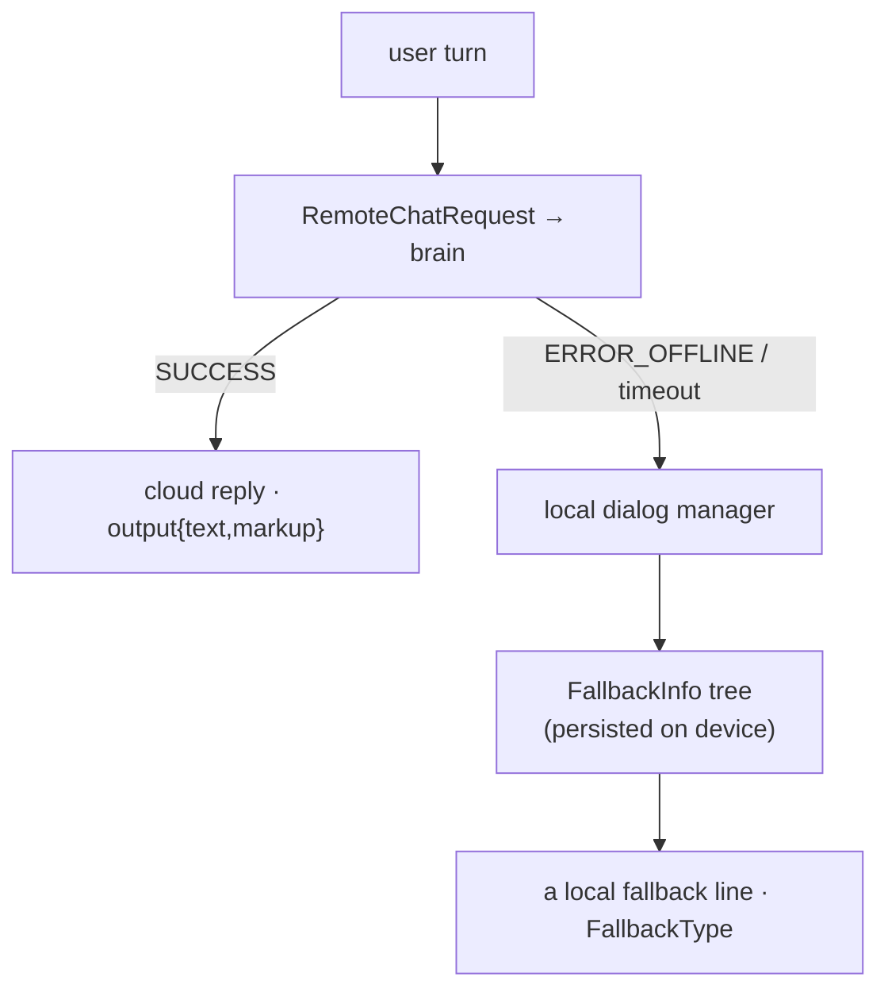

# 🛟 Offline behavior & on-device brain state (`v3.6.4-Zephyr` / OTA `v24.10.803`)

> Recovered from `embodied/robotbrain/serialized/{FallbackInfo,CSData,UserRecommendationData}.proto`
> (`package embodied.robotbrain.serialized`) in the **v24.10.803** image. These are the structures the
> brain **persists to disk** so it survives reboots and keeps working when the cloud brain is
> unreachable: **`FallbackInfo`** (what Moxie says/does offline), **`CSData`** (where the child was — the
> resume point), and **`UserRecommendationData`** (the recommender's learned history). This is the
> counterpart to the online [`remote-chat-protocol.md`](remote-chat-protocol.md): what happens on
> `ERROR_OFFLINE`. Persisted under Unity's `PERSISTENT_DATA` path (`/sdcard/EmbodiedData` /
> `persistentDataPath`, see [content-and-conversation](content-and-conversation.md#where-the-data-lives)).

## Online vs offline



When [`RemoteChatResponse.result`](remote-chat-protocol.md#the-response-remotechatresponse) is
`ERROR_OFFLINE` (or times out), the robot doesn't go silent — the **local dialog manager** serves a line
from the on-device `FallbackInfo` tree. So a robot with no reachable backend still talks; that behavior is
entirely governed by this persisted data.

## The fallback content tree — `FallbackInfo`

A three-level tree, keyed by where the conversation is:

```proto
message FallbackInfo   { Context default_context = 1; repeated ModuleFallback modules = 2; }
message ModuleFallback { string id; Context context;
                         repeated NodeFallback   node_fallbacks;         // per behavior-tree node
                         repeated ContentIDFallback content_id_fallbacks; // per content id
                         NodeFallback module_default_fallback; }          // the module's catch-all
message NodeFallback   { string id; Context context; FallbackOptions opt; }
message ContentIDFallback { string id; Context context; }
```

- Resolution is **specific → general**: a `NodeFallback` for the exact behavior-tree node, else a
  `ContentIDFallback` for the current content, else the `module_default_fallback`, else the
  `FallbackInfo.default_context`.
- Each `NodeFallback` carries a **`Context`** (the [ChatScript context](content-and-conversation.md) to
  speak from) and a **`FallbackOptions`** strategy:

  | # | `FallbackOptions` | Meaning |
  |--:|---|---|
  | 0 | `UNKNOWN` | unset |
  | 1 | `DEFAULT` | normal fallback handling |
  | 2 | `CONVERSATION` | keep a light local conversation going |
  | 3 | `SILENT` | say nothing (don't paper over the gap) |
  | 4 | `LOCAL_ONLY` | answer only from local rules, never wait on remote |
  | 5 | `FALLBACKS_NO_REMOTE` | use fallbacks and don't attempt the remote at all |

The local dialog manager's resulting decision surfaces as the **`FallbackType`** on the response
([cloud-protocol](cloud-protocol.md#the-chat-requestresponse-envelope)) — `FALLBACK_LOCAL_RULE`,
`FALLBACK_LOCAL_FALLBACK`, `FALLBACK_USE_REMOTE`, `FALLBACK_NO_REMOTE`, `FALLBACK_MOVE_ON`,
`FALLBACK_CONFIRMATION` — i.e. whether it answered from a local rule, a fallback line, deferred to remote,
gave up on remote, moved the activity on, or asked to confirm.

### The server controls offline behavior — `upgrade_fallbacks`

`RemoteChatRequest.upgrade_fallbacks` (field 16, [remote-chat-protocol](remote-chat-protocol.md#the-request-remotechatrequest-delta-over-cloud-protocol))
is the robot asking the brain to **push an updated `FallbackInfo`**. So a self-hosted server doesn't just
answer live turns — it seeds what the robot will say when *it* is later unreachable. Offline resilience is
a server responsibility, not a fixed ROM string.

## The resume point — `CSData`

The small checkpoint that lets Moxie pick up where the child left off across a reboot:

| Field | Meaning |
|---|---|
| `content_day` | which day of the content schedule the child is on |
| `module_id`, `content_id` | the activity/content in progress |
| `module_started_ts` | when it started (for time-in-activity limits) |
| `forced_sleep_ts` | when a forced-sleep (bedtime) was imposed |
| `instance_id` | the run instance |

A server that wants seamless resume reads/writes this; a minimal one can ignore it (the child restarts at
the hub).

## The recommender's memory — `UserRecommendationData`

The persisted state of the on-device recommender that decides **what content to offer next** (the engine
described in [content-and-conversation](content-and-conversation.md#the-recommender)):

- **`tag_history`** — a map of SEL/content **tag → `TagHistory`** (a list of `SparseValues{id, value}`):
  the child's accumulated engagement per tag. This is how Moxie learns the child likes some themes more
  than others, and it feeds the same weights as the parent-set `ContentPreferences`
  ([device-config-and-telemetry](device-config-and-telemetry.md#robotcloudconfig-the-master-config-document-cloud-robot)).
- **`random_tag_state`** — `{random_seed, update_state, weight_state}`: the exploration/exploitation state
  (a seeded RNG + serialized weights) so the recommender's variety is reproducible across reboots rather
  than resetting every boot.

## What this means for the three goals

**① Custom firmware.** These are the three blobs a custom brain must **persist and restore** — miss them
and the robot forgets its place (`CSData`), forgets what the child likes (`UserRecommendationData`), and
goes mute the moment the network drops (`FallbackInfo`). The `PERSISTENT_DATA` location and the
resolution order are the contract.

**② Server revival.** A server shapes offline behavior by pushing `FallbackInfo` via `upgrade_fallbacks`,
can seed/read the recommender history, and reads `CSData` to resume a session. Offline resilience and
personalization are things the server *provisions*, not fixed firmware.

**③ Pre-801 revival — the key point.** `FallbackInfo` is exactly what a robot runs **when it can reach no
server at all**. A stuck pre-801 unit that can't be re-homed ([network-trust](network-trust.md)) isn't
bricked — it still serves its last-persisted fallback content. This bounds what "revival" means: even
with no backend, the local fallback tree keeps Moxie minimally alive; a reachable server is what restores
the *full* experience.

---
📖 [Reverse-engineering index](README.md) · [RemoteChat protocol](remote-chat-protocol.md) · [Content & conversation](content-and-conversation.md) · [Cloud protocol](cloud-protocol.md) · [Device config & telemetry](device-config-and-telemetry.md)
