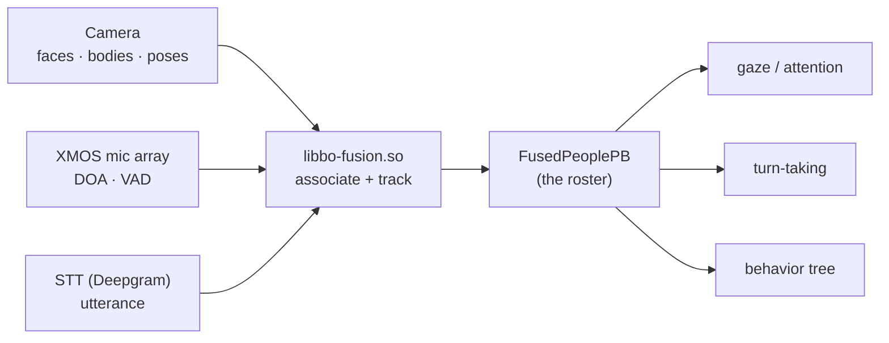

# 🧩👥 Perception fusion — the world-model of people (`v3.6.4-Zephyr` / OTA `v24.10.803`)

> Recovered from `embodied/perception/fusion/FusedPeople.proto` (`package embodied.perception.fusion`),
> implemented by the ~40 MB native `libbo-fusion.so`, in the **v24.10.803** image. This is the layer that
> turns raw percepts — [face/body/QR detections](perception-pipeline.md) and [audio DOA/STT](perception-pipeline.md#audio-hear-understand-speak) —
> into a single **tracked model of the people in the room**: who they are, where they are in 3D, whether
> they're engaged, whether they're speaking, and what they said. It's the perception *output* the brain
> actually reasons over — the input beneath [gaze](gaze-and-attention.md) and
> [turn-taking](turn-taking.md), and it arrives on the bus as `FusedPeopleEvent`
> ([behavior-input-events](behavior-input-events.md#-vision-people-from-libbo-vision-fusion)).

## Where it sits

Fusion's job is **association + tracking**: tie a detected face, a detected body, and a heard voice to
*the same person*, keep a stable `id` across frames, and lift low-level detections into person-level
events. The result is one `FusedPersonPB` per human, not three unrelated detection streams.

## The roster — `FusedPeoplePB`

`FusedPeoplePB { repeated FusedPersonPB people; timestamp }` is the full current set of tracked people,
republished as it changes. Each person:

### `FusedPersonPB` — one tracked human

| Field | Meaning |
|---|---|
| `id` | stable tracking id across frames |
| `name`, `fullname` | recognized identity (from [face recognition / enrollment](perception-pipeline.md#face-recognition-enrollment-data-model)); empty if unknown |
| `is_visible` | currently seen by the camera |
| `is_engaged`, `engagement` (float) | attending to Moxie — the boolean + a continuous score |
| `confidence` | fusion confidence this is a real, correctly-associated person |
| `world_x/y/z`, `world_width/height` | **3D position** in robot-relative world space |
| `vad_speaking`, `started_speaking` | voice-activity speaking flag + when it began |
| `face`, `body`, `speech` | the three sub-models below |

### `FusedFacePB` — the face, in two coordinate frames

Carries the face in both **world** (`world_x/y/z`, `world_width/height`) and **screen**
(`screen_x/y`, `screen_width/height`) frames, plus:

- **Head pose** — `roll`, `pitch`, `yaw` (where the head points, distinct from where the eyes look).
- **Per-eye positions** — `world_left_eye_x/y`, `world_right_eye_x/y` and their `screen_*` counterparts:
  the eye landmarks that make **eye-contact** and precise look-at targeting possible.
- **Affect** — `is_smiling` + `smile_confidence`.
- **Tracking/timing** — `face_tracker_id`, `last_time_in_view`, `last_time_seen` (so the brain knows how
  fresh the face is even when momentarily occluded).

### `FusedBodyPB` — the body

Body bounding box in world + screen frames (`world_*`, `screen_*`), `confidence`, and
`last_time_in_view` / `last_time_seen`. Lets Moxie track a person who has turned away or whose face is
out of frame.

### `FusedSpeechPB` — the voice, fused onto the person

The speech attributed to this person — the fusion of the mic array and STT:

| Field | Meaning |
|---|---|
| `world_x/y/z`, `doa`, `doa_confidence` | where the voice came from — **direction of arrival** from the mic array, placed in world space |
| `is_speaking`, `begin_timestamp`, `end_timestamp` | speech activity + span |
| `utterance`, `alternate_utterances[]`, `confidence` | the recognized text + STT n-best |
| `stt_event_id` | ties back to the raw STT event |
| `language`, `original_language` | detected language vs the source language |
| `original_utterance`, `original_alternate_utterances[]` | the **pre-translation** text — fusion keeps both the original and the (translated) `utterance` |
| `last_time_heard` | recency of the last speech |

The `original_language` / `original_utterance` pair shows the pipeline is **translation-aware**: a child
can speak another language, and the brain sees both what was said and its translation, tied to the person
who said it.

## The event stream

Beyond the roster snapshot, fusion emits discrete **person-level events** (each wraps the `FusedPersonPB`
so the consumer gets full context), which surface on the bus as the corresponding `…Event`
([behavior-input-events](behavior-input-events.md#-vision-people-from-libbo-vision-fusion)):

| Event | Fires when |
|---|---|
| `FusedPersonAddedPB` / `FusedPersonRemovedPB` | a person enters / leaves the tracked set |
| `FusedPersonMovedPB` | a tracked person changes position |
| `FusedPersonStartedSpeakingPB` / `FusedPersonStoppedSpeakingPB` | speech begins / ends — with a **`source`** (below) |
| `FusedPersonSayingPB` | interim/partial utterance in progress |
| `FusedPersonSaidPB` | a completed utterance |
| `FusedPersonSayingTimeoutPB` | expected speech didn't complete in time (`start`/`end_timestamp`, `event_id`) |
| `FusedPersonSmiledPB` | the person smiled |
| `FusedPersonEngagedPB` / `FusedPersonDisengagedPB` | engagement crossed the threshold |

**`FusedPersonSpeakingSource`** distinguishes *how* "speaking" was decided:
`STT` (words were recognized) vs `VAD` (voice activity only, no transcript yet) vs `UNKNOWN`. So the brain
can react to voice onset (VAD, fast) before the transcript (STT, slower) — the basis of barge-in and
responsive turn-taking ([turn-taking](turn-taking.md)).

## Coordinate frames

Two frames appear throughout:

- **World** (`world_x/y/z`, `world_width/height`) — 3D, robot-relative. This is what
  [gaze & attention](gaze-and-attention.md) consumes to build interest points and drive the IK look-at:
  a fused person (or their eyes) *is* an attention target with a world position.
- **Screen** (`screen_x/y`, `screen_width/height`) — normalized camera-image space, for anything that
  reasons in the 2D frame (framing, on-face overlays).

Fusion provides both so the brain never has to re-project.

## What this means for the three goals

**① Custom firmware.** This is the **perception contract** a custom brain sits behind: consume
`FusedPeoplePB` + the event stream, or (if replacing fusion) produce them. The world/screen split, the
per-eye landmarks, DOA, and the VAD-vs-STT speaking source are the exact signals the stock behavior tree,
gaze, and turn-taking expect.

**② Server revival.** A server acting as the brain (including [telehealth](telehealth.md) puppeting)
receives **who is present, where, engaged or not, speaking or not, and what they said** — with identity
and translation — as structured events, not raw pixels. That's the situational awareness a remote or
self-hosted brain needs to respond naturally (look at the speaker, wait for a turn, greet by name).

**③ Pre-801 revival.** No new lever; fusion runs on-device and its events ride the same bus/cloud path
([network-trust](network-trust.md)).

---
📖 [Reverse-engineering index](README.md) · [Perception pipeline](perception-pipeline.md) · [Gaze & attention](gaze-and-attention.md) · [Turn-taking](turn-taking.md) · [Behavior input events](behavior-input-events.md) · [Robot IPC protocol](robot-ipc-protocol.md)
