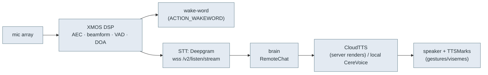

# 👂👁️ Perception pipeline — audio & vision

> **What this is.** How sound and sight flow through the robot: wake-word → mic DSP → speech-to-text →
> brain → text-to-speech → speaker, plus the vision events (faces, people, QR). A revival server sits
> in the middle of this (receives STT, returns TTS), and a custom firmware must drive these hardware
> stages. From the `embodied.perception.*` / `embodied.unity` protos and `bo-android`'s audio/vision code.

## Audio: hear → understand → speak

### Input side (`embodied.perception.audio`)
- **XMOS DSP** — a dedicated audio chip does acoustic echo cancellation, mic-array **beamforming**,
  **VAD**, and **DOA** (direction of arrival). Config via `EchoSuppressConfig` / `XmosConfig`; its
  firmware is updated by `bo-xmos-wd`/`xmosdfu` (`BO_XMOS_WD` gates on XMOS readiness — "XMOS is not
  ready, deferring launching services").
- **`WakeWordEvent{wake_word_detected}`** — "Hey, Moxie" trigger ("Wakeword key event detected. Sending
  detect intent").
- **STT** streams mic audio to **Deepgram** (`wss://deepgram-test.embodied.com/v2/listen/stream`,
  bearer auth; [`network-trust.md`](network-trust.md)) and emits:
  - `STTPartial` / (final) — `speech`, `confidence`, `alternatives`, `language`,
    `original_speech`/`original_language` (translation), `event_id`, start/end timestamps.
  - `Speaker{id, doa, id_confidence, doa_observations}` + `EnrollmentState` — **speaker ID** (who's
    talking + where), with voice enrollment.
  - `VoiceActivity{state, doa}`, `DOA{doa, vad, doa_ready}`, `PoorSNR{event_id}` — activity/quality.
- **Barge-in**: `Interrupt` / `AllowInterrupt{allow}` / `CutoffStatistics` — lets a child interrupt
  Moxie mid-sentence (and measures how often speech was cut off).

### Output side — TTS (`embodied.unity`)
- The brain sends **`CloudTTSRequest{markup, event_id, chunk_num, user_id}`** — the *markup* is the
  speech + `<mark name="cmd:…">` behavior tags ([`behavior-markup.md`](behavior-markup.md)).
- Back comes **`CloudTTSResponse{audio: AudioBuffer(buffer, channels, sample_rate), marks: TTSMark[],
  event_id, chunk_num}`** — i.e. **the server renders the audio** (PCM) and returns it with timing.
  A local **CereVoice** engine (`libcerevoice_eng.so`) is the on-device TTS path/fallback.
- **`TTSMark{time, start, end, type, value}`** — timeline marks lifted from the markup, so the Unity
  face syncs **visemes/lip-sync and gestures** to the audio. `SpeechPlaybackState{isPlaying}` reports
  playback.

**For a revival server:** you terminate STT (proxy Deepgram or swap any STT with the same framing),
answer `RemoteChat`, then satisfy `CloudTTSRequest` by synthesizing audio (any TTS) and returning a
`CloudTTSResponse` with `TTSMark`s derived from your markup. Chunking (`chunk_num`, `stream_response`,
`response_chunks`) lets you stream long replies.

## Vision (`embodied.perception.vision`)

The camera (OV2710) feeds a CV stack (`libbo-vision`, TFLite) publishing:

| Message | Content |
|---|---|
| `DetectedFacePB` / `FacesDetected` | face bbox (`center_x/y`, `width`, `height`), `confidence`, head **`pitch`/`yaw`** |
| `FacesRecognized` / `FacesTracked` | identity + tracking across frames |
| `FaceIDEnrollmentState` | face-enrollment progress/errors |
| `PersonPB` / `PeopleDetectedPB` | person bboxes + `frame_id` (body detection) |
| `PosesEstimated` | body pose keypoints |
| `Gaze` (unity) | where the person/robot is looking |
| `OcclusionDetected`, `RapidMotionDetected` | camera covered / fast motion |
| **`QRPB{qrcode, timestamp}`** | **decoded QR string** — the vision QR event (feeds both the setup grammar in [`qr-commands.md`](qr-commands.md) and content QRs in [`content-and-conversation.md`](content-and-conversation.md)) |
| `BookId` / `DrawId` / `ImageToText` | activity-specific recognizers (reading, drawing) |

Perception + audio are fused (`embodied.perception.fusion.FusedPeople`) so the brain knows **who** is
present, **where**, and whether they're **engaged/looking** — driving targeting (`RobotEngageTurn`,
`RobotTurnToOutOfViewChatTarget`) and the `BlockedType` reasons (`TARGET_OUT_OF_VIEW`, `NOT_ENGAGED`)
in [`cloud-protocol.md`](cloud-protocol.md).

## For custom firmware (goal #1)

The XMOS DSP and camera CV run as their own components (`BO_AUDIO`, `BO_VISION`) publishing these
protos on the ZMQ bus ([`robot-ipc-protocol.md`](robot-ipc-protocol.md)). A minimal-invasive build
keeps them and just consumes their events; a full custom stack must reproduce wake-word + VAD/DOA (or
drive the XMOS directly) and the face/person detectors.

---
📖 [Reverse-engineering index](README.md) · [Cloud protocol](cloud-protocol.md) · [Behavior markup](behavior-markup.md) · [Docs index](../README.md)
