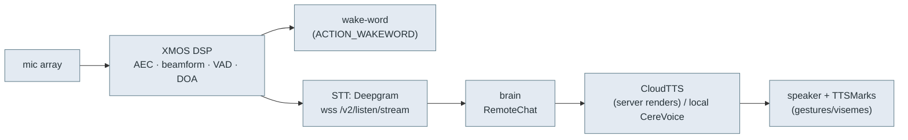

# 👂👁️ Perception pipeline — audio & vision

> **What this is.** How sound and sight flow through the robot: wake-word → mic DSP → speech-to-text →
> brain → text-to-speech → speaker, plus the vision events (faces, people, QR). A revival server sits
> in the middle of this (receives STT, returns TTS), and a custom firmware must drive these hardware
> stages. From the `embodied.perception.*` / `embodied.unity` protos and `bo-android`'s audio/vision code.

## Audio: hear → understand → speak

### Input side (`embodied.perception.audio`)
- **XMOS DSP** — a dedicated audio chip does acoustic echo cancellation, mic-array **beamforming**,
  **VAD**, and **DOA** (direction of arrival). Config via `EchoSuppressConfig` / `XmosConfig`; its
  firmware is updated by `bo-xmos-wd`/`xmosdfu` (`BO_XMOS_WD` gates on XMOS readiness — "XMOS is not
  ready, deferring launching services").
- **`WakeWordEvent{wake_word_detected}`** — "Hey, Moxie" trigger ("Wakeword key event detected. Sending
  detect intent").
- **STT** streams mic audio to **Deepgram** (`wss://deepgram-test.embodied.com/v2/listen/stream`,
  bearer auth; [`network-trust.md`](network-trust.md)) and emits:
  - `STTPartial` / (final) — `speech`, `confidence`, `alternatives`, `language`,
    `original_speech`/`original_language` (translation), `event_id`, start/end timestamps.
  - **Two STT engines** (`STT_IMPL` / `LOCAL_STT`, [`settings-schema.md`](settings-schema.md)):
    - **Cloud (primary):** Deepgram over WebSocket (above).
    - **Offline: Kaldi.** `embodied::audio::KaldiSTT` runs a full **Kaldi online-nnet3** decoder —
      MFCC + **i-vector** speaker adaptation (`OnlineNnet2FeaturePipelineInfo`, `AcceptIvector`) → an
      **nnet3** acoustic model (`DecodableNnetSimpleLoopedInfo`) → `HCLG.fst` lattice decode
      (`LatticeFaster`/`StdToken`) → **RNNLM** rescoring (`kaldi::rnnlm`). `USE_LOCAL_STT_QUANTIZED_MODEL`
      selects a quantized model; used for offline / `WAKE_WITHOUT_NET` / fallback. The Kaldi model
      (`final.mdl`, `HCLG.fst`, `words.txt`, i-vector extractor, RNNLM) is **synced content**, not in
      the firmware (like the CereVoice voice + ChatScript, [`content-and-conversation.md`](content-and-conversation.md)).
  - `Speaker{id, doa, id_confidence, doa_observations}` + `EnrollmentState` — **speaker ID** (who's
    talking + where), with voice enrollment.
  - `VoiceActivity{state, doa}`, `DOA{doa, vad, doa_ready}`, `PoorSNR{event_id}` — activity/quality.
- **Barge-in**: `Interrupt` / `AllowInterrupt{allow}` / `CutoffStatistics` — lets a child interrupt
  Moxie mid-sentence (and measures how often speech was cut off).

### Wake-word & VAD (fully on-device)

Waking Moxie and detecting speech happen **entirely on the robot** — a server never handles wake; it
only sees STT *after* a wake + speech. Three layers cooperate:

- **XMOS DSP (hardware):** the `wk` firmware variants (vs `nowk`, [above](#xmos-firmware-dfu)) enable
  **on-chip keyword spotting** — the "Hey, Moxie" wake word runs on the XMOS VocalFusion chip, plus its
  DOA/AEC. `XMOS_VARIANT` (settings) picks the image; `XMOS_VAD_BOOST_*`/`XMOS_DOA_BOOST_*` tune it.
- **TRILLsson features (TFLite, on RK3288):** `embodied::audio::TrillFeatureExtractor` +
  `TrillVAD` + `TrillssonListener` run **Google TRILLsson** (a distilled non-semantic-speech embedding
  model) via `libtensorflowlite` for **voice-activity detection** and speaker/voice features
  (`USE_TRILS_FEATS`, `TRILL_THRESHOLD/VAD/PREFIX/POSTFIX`, `TRILL_WEBRTC_TH`).
- **WebRTC VAD** as a classic fallback (`WEBRTC_VAD_AGGRESSIVENESS`, `..._SPEECH_START/STOP`) plus
  `VAD_CONFIG_HIGH/LOW/OFF`.

A detection emits **`WakeWordEvent{wake_word_detected}`** on the bus (`ACTION_WAKEWORD`,
"Wakeword key event detected"). Wake can also come from **the button** (`WAKE_BUTTON`, the Macro key —
[`device-tree.md`](device-tree.md)), **touch** (`TOUCH_WAKEUP`/`TOUCH_WAKE_ENABLED`), or
**smart wakeup** (`ENABLE_SMART_WAKEUP`); `AUDIO_WAKE_SET`/`VC_WAKE`/`WAKE_WITHOUT_NET` gate voice wake.

**Revival implication (goal #2):** wake + VAD are self-contained on the robot. Your server receives
audio/STT only once Moxie is already awake and hears speech — you don't implement wake-word.

### Output side — TTS (`embodied.unity`)
- The brain sends **`CloudTTSRequest{markup, event_id, chunk_num, user_id}`** — the *markup* is the
  speech + `<mark name="cmd:…">` behavior tags ([`behavior-markup.md`](behavior-markup.md)).
- Back comes **`CloudTTSResponse{audio: AudioBuffer(buffer, channels, sample_rate), marks: TTSMark[],
  event_id, chunk_num}`** — i.e. **the server renders the audio** (PCM) and returns it with timing.
  A local **CereVoice** engine (`libcerevoice_eng.so`) is the on-device TTS path/fallback.
- **`TTSMark{time, start, end, type, value}`** — timeline marks lifted from the markup, so the Unity
  face syncs **visemes/lip-sync and gestures** to the audio. `SpeechPlaybackState{isPlaying}` reports
  playback.

**For a revival server:** you terminate STT (proxy Deepgram or swap any STT with the same framing),
answer `RemoteChat`, then satisfy `CloudTTSRequest` by synthesizing audio (any TTS) and returning a
`CloudTTSResponse` with `TTSMark`s derived from your markup. Chunking (`chunk_num`, `stream_response`,
`response_chunks`) lets you stream long replies.

## Vision (`embodied.perception.vision`)

The camera (OV2710) feeds a CV stack (`libbo-vision`, TFLite) publishing:

| Message | Content |
|---|---|
| `DetectedFacePB` / `FacesDetected` | face bbox (`center_x/y`, `width`, `height`), `confidence`, head **`pitch`/`yaw`** |
| `FacesRecognized` / `FacesTracked` | identity + tracking across frames |
| `FaceIDEnrollmentState` | face-enrollment progress/errors |
| `PersonPB` / `PeopleDetectedPB` | person bboxes + `frame_id` (body detection) |
| `PosesEstimated` | body pose keypoints |
| `Gaze` (unity) | where the person/robot is looking |
| `OcclusionDetected`, `RapidMotionDetected` | camera covered / fast motion |
| **`QRPB{qrcode, timestamp}`** | **decoded QR string** — the vision QR event (feeds both the setup grammar in [`qr-commands.md`](qr-commands.md) and content QRs in [`content-and-conversation.md`](content-and-conversation.md)) |
| `BookId` / `DrawId` / `ImageToText` | activity-specific recognizers (reading, drawing) |

### Camera-driven activities (content activates these)

Beyond faces/people, the vision stack has **object/scene recognizers that content modules switch on**
for specific activities (via `Enable*{run}` toggles + the `eb_enable_*` execution actions,
[`content-and-conversation.md`](content-and-conversation.md)):

| Recognizer | Proto | Enable | Activity |
|---|---|---|---|
| **Book** | `BookIdPB{bookname, center_x/y}` | `EnableBook` | "read a book with Moxie" — IDs the physical book held up |
| **Draw / card** | `DrawIdPB{drawname, center_x/y}` | `EnableDraw` | drawing/card recognition — IDs a card/drawing shown to the camera |
| **Image→Text (VQA)** | `ImageToTextPB{question, prompt, description, targeted_region, is_mentor}` | `EnableICModule` | **visual question-answering / captioning** — Moxie "looks at" a region and describes/answers (a multimodal VLM; gated by `IMAGE_CAPTIONING`/`IMAGE_CAPTIONING_MODEL`, [`settings-schema.md`](settings-schema.md)) |
| **QR** | `QRPB{qrcode}` | `EnableQRCode` | content/launch QR ([`qr-commands.md`](qr-commands.md)) |
| **Gaze / look-at** | `LookAtMeRequest{user, bot}` | — | request the robot make eye contact with a specific user |

So a content module (e.g. a reading or drawing activity) toggles the recognizer it needs, and reacts
to the resulting `*IdPB`/`ImageToTextPB` event. `ImageToText` is the notable one — a **camera→VLM**
capability (the `IMAGE_CAPTIONING_TIMEOUT`/`IMAGE_CAPTION_BY_RB` settings route it locally or via the
remote brain). For a revival server (goal #2), these are optional: a module can ignore them, or you can
implement the recognizer server-side and return the `*IdPB`/description.

Perception + audio are fused (`embodied.perception.fusion.FusedPeople`) so the brain knows **who** is
present, **where**, and whether they're **engaged/looking** — driving targeting (`RobotEngageTurn`,
`RobotTurnToOutOfViewChatTarget`) and the `BlockedType` reasons (`TARGET_OUT_OF_VIEW`, `NOT_ENGAGED`)
in [`cloud-protocol.md`](cloud-protocol.md).

## XMOS firmware (DFU)

The **XMOS audio DSP** — a VocalFusion-class far-field voice chip (mic-array beamforming, AEC,
wake-word) — is a **third embedded processor** with its own firmware, updated from Android over
**USB DFU** (`libusb`, `/dev/bus/usb`) by `xmosdfu` / `bo_xmosupdate` (native `XMOSDFU` class).

| Aspect | Detail |
|---|---|
| Transport | **USB DFU** via libusb (`libusb_open_device_with_vid_pid`, `find_usbfs_path`) |
| Ops | `xmos_dfu_resetintodfu` → `--download <image>` → `xmos_dfu_resetfromdfu`; **`--revertfactory`** restores the factory image |
| Active image | **`/vendor/etc/firmware/xmosdfu.bin`** (and `xmosdfu-<variant>.bin`) — the deployed DSP firmware |
| Trigger | `bo-android`'s **`BoXmosWatchdog`** (`isXmosUpdateRequired`, "Checking for XMOS Update"); gated by `FEA_XMOS_WATCHDOG` and XMOS readiness at boot ([`boot-and-launcher.md`](boot-and-launcher.md)) |

### Shipped DSP images (`xmosdfu.apk`) — decode the naming
`assets/fw/` + `res/raw/`: `p9_{16k,48k}_10_{10,30}_{cm,mic01,mic23}[_nowk].bin`,
`wk_blue_p9_48k_10_10_cm.bin`. The fields:

- **p9 / blue** — board rev (Moxie P9 / MoxieBlue).
- **16k / 48k** — audio sample rate.
- **10_10 / 10_30** — DSP pipeline/geometry variant.
- **cm** — combined/comms mic mode; **mic01 / mic23** — which mic pair is active.
- **wk / nowk** — wake-word enabled / disabled.

`test.wav` (3 MB) ships alongside for audio validation.

## The three embedded processors (firmware map)

Moxie has **three** processors, each with its own firmware updated from the Android side:

| Processor | Role | Update path | Image format |
|---|---|---|---|
| **RK3288** (this OS) | main SoC — brain, vision, Unity face | A/B `update_engine` OTA ([`ota-and-recovery.md`](ota-and-recovery.md)) | signed `payload.bin` |
| **Lizard STM32 MCU** | motors · touch · IMU · LEDs · battery | UART `/dev/ttyS3`, GOBY bootloader ([`hardware-map.md`](hardware-map.md)) | Intel HEX @ `0x08000000` |
| **XMOS DSP** | mic array · AEC · wake-word | **USB DFU** (libusb) | `.bin` → `/vendor/etc/firmware/xmosdfu.bin` |

> `xmosdfu.apk` also bundles **newer Lizard MCU images** (`res/raw/d{4,5,6}_lizard_app.hex` = the
> D4/D5/D6 board revs) in addition to XMOS `.bin`s — so this one app can reflash both the DSP and the
> MCU. (`bo-firmwareUpdate` carries the older `v4_0_*`/`v7_7_*` Lizard images.)

## For custom firmware (goal #1)

The XMOS DSP and camera CV run as their own components (`BO_AUDIO`, `BO_VISION`) publishing these
protos on the ZMQ bus ([`robot-ipc-protocol.md`](robot-ipc-protocol.md)). A minimal-invasive build
keeps them and just consumes their events; a full custom stack must reproduce wake-word + VAD/DOA (or
drive the XMOS directly) and the face/person detectors.

---
📖 [Reverse-engineering index](README.md) · [Cloud protocol](cloud-protocol.md) · [Behavior markup](behavior-markup.md) · [Docs index](../README.md)
