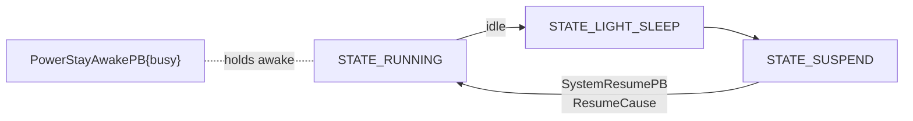

# 🔌 Power & system events — the lifecycle protocol (`v3.6.4-Zephyr` / OTA `v24.10.803`)

> Recovered from `embodied/system/PowerEvents.proto` (`package embodied.power`) + `SystemEvents.proto` (`package embodied.sys`) in the **v24.10.803** image.
> This is the **message-level** contract for Moxie's power lifecycle and system status — the authoritative
> power-state enum, why the robot woke, Wi-Fi/internet/STT/OTA health, and the shutdown & unpair flows.
> It's the proto layer beneath the app-level [`boot-and-launcher.md`](boot-and-launcher.md) (which
> describes what each state *runs*); these are the events a custom brain or a self-hosted server observes.

## The power state — `PowerStatePB`

`PowerStatePB { uint32 state; uint32 prev_state; … }` reports every transition (with the previous state,
so a consumer sees the edge). The authoritative enum (integer values matter — they're on the wire):

| # | `State` | Meaning (see [boot-and-launcher](boot-and-launcher.md)) |
|--:|---|---|
| 0 | `STATE_INIT` | early boot |
| 1 | `STATE_CONFIG` | setup / QR-reading (no brain) |
| 2 | `STATE_STARTUP` | bring-up |
| 3 | `STATE_RUNNING` | normal operation |
| 4 | `STATE_LIGHT_SLEEP` | screen/audio down, quick to wake |
| 5 | `STATE_SUSPEND` | deep suspend |
| 6 | `STATE_DEMO` | retail/factory demo loop |
| 7 | `STATE_RECOVERY` | user-data recovery |
| 8 | `STATE_TELEBRAIN` | telehealth remote-puppet ([`telehealth.md`](telehealth.md)) |
| 9 | `STATE_SILENT_REBOOT` | reboot with no animation |
| 10 | `STATE_SILENT_RECOVERY` | recovery with no animation |

## Suspend / resume

- **`SystemSuspendPB`** — the robot is going down to suspend.
- **`SystemResumePB { ResumeCause cause }`** — why it woke, a genuinely useful taxonomy:

  | `ResumeCause` | Meaning |
  |--:|---|
  | 0 `RESUME_FIRST_START` | cold first boot |
  | 1 `RESUME_RECOVERY` | came up into recovery |
  | 2 `RESUME_FROM_SUSPEND` | normal wake from suspend |
  | 3 `RESUME_POWER_ONLY` | power applied, minimal wake |
  | 4 `RESUME_HIDDEN_REBOOT` | silent reboot (no UI) |
  | 5 `RESUME_BRAIN_UPDATED` | rebooted because the brain (app) was updated |

- **`PowerStayAwakePB { bool busy }`** — the keep-awake pulse: while `busy` is set (an activity/upload in
  flight) the robot won't drop to light-sleep/suspend. (Surfaces on the input bus as
  `ReloadQueueStayAwakePulseEvent` → `PowerStayAwakePB`, see [`behavior-input-events.md`](behavior-input-events.md).)

## Recovery — `SystemRecoverRequest`

`SystemRecoverRequest { RecoveryTarget target }` where `RecoveryTarget` = `RESTART_NONE` (0) or
**`RESTART_XMOS`** (1) — a targeted restart of the XMOS audio DSP without a full reboot (the audio
co-processor, [`hal-and-drivers.md`](hal-and-drivers.md)). `WifiRecoverRequest` similarly kicks the Wi-Fi
stack.

## System status events — `embodied.sys`

These are what a self-hosted server (or a health monitor) watches to know the robot's real state:

| Message | Fields | Notes |
|---|---|---|
| **`WifiConnectionState`** | `connected`, `ssid`, `seconds_in_state`, **`wifi_connected`**, **`inet_connected`** | separates *Wi-Fi associated* from *internet reachable* — a revived robot is `wifi_connected` but its dead cloud is not `inet_connected` |
| **`STTConnectionState`** | `healthy`, `error_nr` | speech-to-text backend health |
| **`OTAStatus`** | `update_status`, `payload_complete`, `update_percent`, `payload_result` | live OTA progress ([`ota-and-recovery.md`](ota-and-recovery.md)) |
| `ShutdownRequest` / `SystemShutdown` | `recover_type`, `source`, `reason`, `time_remaining` | request + countdown of a shutdown/reboot |
| `DebugConfigureRequest` | `target`, `target_state` | toggle a subsystem into a debug state |

> The **`wifi_connected` vs `inet_connected`** split is a direct revival lever: the robot distinguishes
> "on the network" from "can reach the backend," so a self-hosted server just has to become the reachable
> backend — the Wi-Fi side already works.

## Unpair / disengage — `UnpairUserRequest`

`UnpairUserRequest { time_remaining; DisengageReason reason }` + `UnpairUserReady` bracket a graceful
detach of the current child:

| `DisengageReason` | When |
|--:|---|
| 0 `UNPAIRING` | the user is being unpaired (reset/handoff) |
| 1 `TELEHEALTH` | a telehealth session takes over ([`telehealth.md`](telehealth.md)) |
| 2 `USER_DATA_UPDATE` | the child's data/profile is being updated |

So *entering telehealth* and *updating the child profile* both disengage the active user the same way an
unpair does — the robot quiesces, then emits `UnpairUserReady`.

## Time, timezone & alarms — `embodied.sys` (`TimeEvents.proto`)

The other half of the `embodied.sys` family (recovered from `embodied/system/TimeEvents.proto`) is how
the robot knows *what time it is locally* and runs **wake alarms** — the on-device implementation of the
`WakeSchedule`/bedtime windows the cloud pushes in [`RobotCloudConfig`](device-config-and-telemetry.md#robotcloudconfig-the-master-config-document-cloud-robot).

- **`TimeZoneInfo { olson_id, midnight_in_timezone }`** — the robot's current timezone as an **IANA/Olson
  id** (e.g. `America/New_York`) plus the concrete `midnight_in_timezone` string. This is what turns the
  config's `timezone_id` + `weekday_bedtime_starts_at`/`…_ends_at` (wall-clock strings) into real local
  instants — bedtime/quiet-hours can't be evaluated without it.
- **`UserAlarmRequest { timer_id, alarm_expires, alarm_repeats }`** — arm a wake/timer. `timer_id` is
  namespaced by **`ReservedTimers`**:

  | `ReservedTimers` | Meaning |
  |--:|---|
  | 0 `TIMER_ID_USER_WAKE` | the child's wake alarm (the `WakeSchedule` alarms) |
  | 1 `TIMER_ID_PARENT_APP` | a parent-app–set timer ("wake Moxie at…") |
  | 100 `TIMER_ID_CUSTOM` | base id for content/activity-defined timers |

  `alarm_expires` is the fire time; `alarm_repeats` the repeat interval (recurring wakes).
- **`UserAlarmTriggered { timer_id }`** — emitted when an armed alarm fires, so the behavior layer can run
  the wake/animation for that `timer_id`.

So the loop is: cloud sets `WakeSchedule`/bedtime + `timezone_id`
([device-config-and-telemetry](device-config-and-telemetry.md)) → the robot resolves them against
`TimeZoneInfo` and arms `UserAlarmRequest`s → `UserAlarmTriggered` wakes Moxie. The reserved-timer split
is why a parent-app alarm and the child's recurring wake don't collide.

## What this means for the three goals

**① Custom firmware.** The power state machine (11 states, with `prev_state` edges) and the resume-cause
taxonomy are the lifecycle a custom build must drive; `RESTART_XMOS` shows co-processor recovery is a
first-class, targeted operation. A custom build must also resolve local time via an Olson timezone and
arm/fire `UserAlarm`s to honor the wake/bedtime schedule.

**② Server revival.** A server observes `WifiConnectionState` (the wifi-vs-internet split is why revival
works at all), `STTConnectionState`, and `OTAStatus`, and participates in the unpair/telehealth
disengage flow. It drives time behavior indirectly: setting `timezone_id` + `WakeSchedule` in
`RobotCloudConfig` is what the robot turns into `TimeZoneInfo` + `UserAlarmRequest`s. These are the
health/lifecycle signals a self-hosted backend reads and writes to know and shape what the robot is doing.

**③ Pre-801 revival.** No new lever; the same network boundary as [`network-trust.md`](network-trust.md).

**① Custom firmware.** The power state machine (11 states, with `prev_state` edges) and the resume-cause
taxonomy are the lifecycle a custom build must drive; `RESTART_XMOS` shows co-processor recovery is a
first-class, targeted operation.

**② Server revival.** A server observes `WifiConnectionState` (the wifi-vs-internet split is why revival
works at all), `STTConnectionState`, and `OTAStatus`, and participates in the unpair/telehealth
disengage flow. These are the health/lifecycle signals a self-hosted backend reads to know what the
robot is doing.

**③ Pre-801 revival.** No new lever; the same network boundary as [`network-trust.md`](network-trust.md).

---
📖 [Reverse-engineering index](README.md) · [Boot & launcher](boot-and-launcher.md) · [OTA & recovery](ota-and-recovery.md) · [HAL & drivers](hal-and-drivers.md) · [Behavior input events](behavior-input-events.md)
