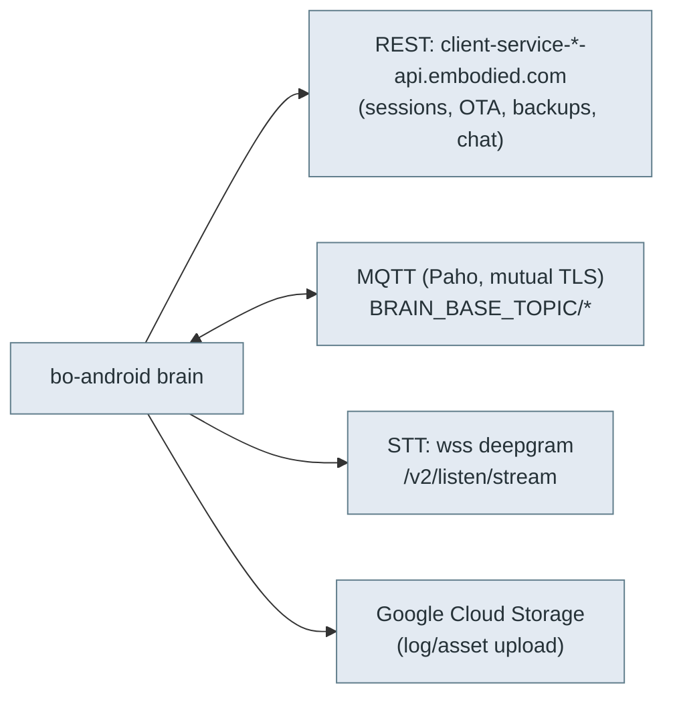
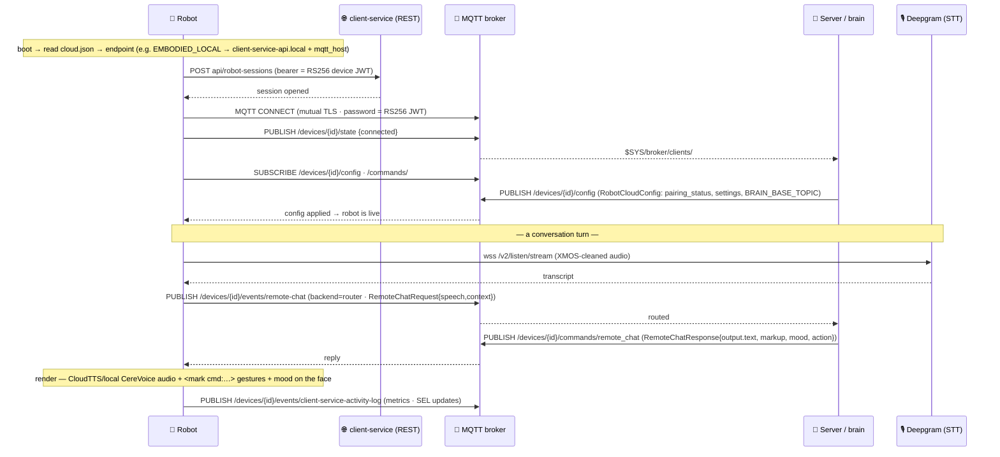

# ☁️ Robot ↔ cloud protocol — REST, MQTT, STT (`v3.6.4-Zephyr` / OTA `v24.10.803`)

> **What this is.** How the robot's brain (`bo-android`) talks to the **backend** — the surface a
> self-hosted server must implement to run a Moxie (goal #2, client/server revival). This is the
> *robot side* of the cloud; the *phone app's* REST surface is separate (see [`rest-api.md`](../phone/rest-api.md)).
> Reconstructed from `bo-android` native libs (`libbo-dispatch`, `libbo-logger`) and the
> `me.embodied.*` Java service layer.

## Three channels



## 1. REST — `client-service`

Per-endpoint base URLs (map 1:1 to the `IOTEndpoint` enum, see [`qr-commands.md`](qr-commands.md)):

| IOTEndpoint | Base URL |
|---|---|
| `EMBODIED_PRODUCTION` | `https://client-service-api.embodied.com/` |
| `EMBODIED_STAGING` | `https://client-service-staging-api.embodied.com/` |
| `EMBODIED_DEVELOP` | `https://client-service-develop-api.embodied.com/` |
| `EMBODIED_HIPAA` | `https://client-service-hipaa-api.embodied.com/` |
| `EMBODIED_CHINA` | `https://client-service-cn-api.embodied.com/` |
| `EMBODIED_HK` | `https://client-service-hk-api.embodied.com/` |
| **`EMBODIED_LOCAL`** | **`https://client-service-api.local/`** ← self-hosted target |

### Endpoints seen

| Path | Purpose |
|---|---|
| `api/robot-sessions`, `api/robot-sessions/complete` | Open/close a robot session (bearer/`?key=` auth). |
| **`api/ota`** | **OTA check** — how the robot asks the backend for a firmware update. A local server that implements this can serve a (signed) `update.zip`; see [`ota-and-recovery.md`](../firmware/ota-and-recovery.md). |
| `api/backups`, `api/backups/newest/download` | Cloud backup of robot/user data. |
| `api/restores/` | Restore flow. |

Assets/logs also go to **Google Cloud Storage** (`www.googleapis.com/upload/storage/v1`,
`oauth2/v4/token`, scope `devstorage.read_write`) — a service-account OAuth path, separate from
client-service.

> **Revival implication.** `EMBODIED_LOCAL` → `client-service-api.local` is a first-class,
> in-firmware target. Point an 801+ robot there (via `endpoint_update` QR + DNS for `*.local`) and a
> server that implements `api/robot-sessions`, `api/ota`, and the MQTT topics below can run it fully —
> no OpenMoxie dependency. `OPEN_MOXIE=11` is the analogous community target.

## Service configuration — how the robot is (re)pointed

`embodied.logging.ServiceConfiguration` is the robot's **runtime connection config**, held in the
native `embodied::core::SettingSchema` store (alongside `BRAIN_BASE_TOPIC` etc.) and delivered over
the bus/provisioning (not the managed layer):

| Field | Meaning |
|---|---|
| `connection_type` | `GOOGLE_IOT` \| `EMBODIED_IOT` \| `EMBODIED_LOCAL` |
| `endpoint_id` | the `IOTEndpoint` enum ([`qr-commands.md`](qr-commands.md)) |
| `endpoint` / `mqtt_host` / `override_port` | **override the REST/MQTT host + port** directly |
| `webservice_root` / `webservice_pin` | REST base URL + a pairing PIN |
| **`disable_verify`** | **skip TLS peer verification** (maps to `CURLOPT_SSL_VERIFYPEER=0`) |
| `disable_sync` / `disable_log_upload` | turn off file-sync / log upload |

The robot keeps a **table** of these, not just one:

- `EndpointStore { repeated ServiceConfiguration endpoints }` — a persisted list of endpoint configs.
- `EndpointConfiguration { endpoint, gcp_project }` — a lighter name→project record.
- Endpoints are selected **by name / `IOTEndpoint` id**: `libbo-logger` carries a `DEFAULT_ENDPOINT_NAME`
  and ships `{"endpoint":"openmoxie"}` as a known endpoint — i.e. the **803 firmware has first-class,
  built-in "openmoxie" support**. An `endpoint_update` (QR or config) just switches which stored
  `ServiceConfiguration` is active; its `mqtt_host`/`webservice_root` supply the actual host.

This is the lever a backend uses to move a robot to a custom host — and `disable_verify` means a
robot *can* be told to accept a self-signed cert (see [`network-trust.md`](network-trust.md) for the
important caveat about how it's delivered). (OpenMoxie's `ServiceConfiguration2` is the same message
under a different file name.)

### The built-in endpoint hosts (baked into `libbo-logger`)

Beyond the *mechanism*, `libbo-logger.so` (the [`RightPoint` cloud manager](../runtime/native-boundary.md#resolved-who-consumes-qrcommand-the-setup-qr-brain-bridge))
carries the **concrete host table** for each `IOTEndpoint` environment — the REST base URL and the MQTT
host string-constants are compiled in (recovered via `strings`/Ghidra on the **v24.10.803** lib):

| Profile (`IOTEndpoint`) | REST `client-service` base | MQTT host |
|---|---|---|
| `EMBODIED_PRODUCTION` | `https://client-service-api.embodied.com/` | `mqtt.embodied.com` |
| `EMBODIED_STAGING` | `https://client-service-staging-api.embodied.com/` | `mqtt-staging.embodied.com` |
| `EMBODIED_DEVELOP` | `https://client-service-develop-api.embodied.com/` | `mqtt-develop.embodied.com` |
| `EMBODIED_HIPAA` | `https://client-service-hipaa-api.embodied.com/` | `mqtt-hipaa.embodied.com` |
| `EMBODIED_HK` | `https://client-service-hk-api.embodied.com/` | `mqtt-hk.embodied.com` |
| `EMBODIED_CHINA` | `https://client-service-cn-api.embodied.com/` | `mqtt-cn.embodied.com` |
| **`EMBODIED_LOCAL`** | **`https://client-service-api.local/`** | *(from `cloud.json`; `.local` = mDNS/LAN)* |

- **`EMBODIED_LOCAL` is the revival profile** already baked into stock 803: it resolves the REST API at
  the **mDNS name `client-service-api.local`** on the LAN, so a robot on `EMBODIED_LOCAL` looks for *your*
  server by that `.local` name (no DNS, no internet). Its MQTT host isn't a compiled `*.embodied.com`
  constant — it comes from the active `ServiceConfiguration` (`mqtt_host`), so a local backend supplies it
  via config. `OPEN_MOXIE=11` is the community analogue, shipped as the `{"endpoint":"openmoxie"}` profile.
- The `GOOGLE_*` profiles are the dead IoT-Core era (`mqtt.googleapis.com`, [pre-801](../firmware/ota-and-recovery.md)); the `EMBODIED_*` hosts above are the post-migration cloud.

### `cloud.json` — the persisted active config

`RightPoint` stores the live selection in a **`cloud.json`** file (native `CLOUD_CONFIG_PATH`; a
`cloud_config_valid_` flag + a `BAD_CLOUD_CONFIG` error guard it, and a legacy form is auto-migrated —
*"Detected legacy cloud.json"*). This is what the [QR `endpoint_update` / `om` commands](qr-commands.md#the-effective-command-set-native-dispatch-rightpointon_qrcommand)
write, after which `RightPoint` **exits to restart the logger** so the new endpoint takes effect. For
revival: point a robot at `EMBODIED_LOCAL` (or `openmoxie`) and its `cloud.json` then names your
`.local`/host — the [minimum viable backend](#minimum-viable-backend-for-revival) answers those hosts.

## 2. MQTT — the live bus (Eclipse Paho, mutual TLS)

The brain links Eclipse **Paho MQTT** (C) over TLS with client certificates (the classic Google
IoT-Core / AWS IoT pattern; pre-801 pinned `mqtt.googleapis.com`, hence `kTypeGoogleApisComPrefix`).
Topics are **settings-driven** off a configurable **`BRAIN_BASE_TOPIC`** (an `embodied::core::SettingSchema`):

| Setting / topic | Role |
|---|---|
| `BRAIN_BASE_TOPIC` | Base path all others hang off (per-robot). |
| `RC_TOPIC` / `rc_topic` | **Remote chat** — cloud pushes `RemoteChatResponse`/`ChatResponse`. |
| `COMMANDS_TOPIC` | Commands to the robot (incl. system/OTA signals). |
| `chat_topic` / `clear_chat_topic` | Conversation stream + reset. |
| `rb_menu_topic` | Robot-brain menu / content selection. |
| `MQTT_FILE_SYNC`, `MQTT_FILE_RECOVERY`, `mqtt_files`, `mqtt_file_undo` | **File sync** channel — content modules, config, backups over MQTT. |
| `learning_focus_topics` | Learning-focus subscriptions. |

Payloads are the `embodied.*` protobufs (see [`recovered-proto/`](recovered-proto/)). Client-id and
topic prefixes are provisioned per robot (uuid/serial-derived).

### Exact topic map (Google IoT-Core convention, kept post-migration)

The broker mimics Google Cloud IoT Core's topic layout — `{device_id}` is the robot UUID/serial:

| Direction | Topic | Payload |
|---|---|---|
| robot → cloud | `/devices/{device_id}/events/{eventname}` | JSON events/telemetry/requests |
| robot → cloud | `/devices/{device_id}/state` | connection state |
| cloud → robot | `/devices/{device_id}/config` | JSON `ServiceConfiguration`-style config |
| cloud → robot | `/devices/{device_id}/commands/{command}` | JSON command (e.g. `remote_chat`, `query_result`, `telehealth`) |
| cloud → robot | **`/devices/{device_id}/commands/zmq`** | **binary: `"{proto_full_name}:" + serialized protobuf`** — injects a message straight onto the robot's ZMQ bus |
| server subscribes | `/devices/+/events/#`, `/devices/+/state` | wildcard for all robots |
| server subscribes | `$SYS/broker/clients/#`, `$SYS/broker/log/#` | **presence detection** — the mosquitto broker's own system topics; the server watches these to see a robot **connect/disconnect** (in addition to the device-published `/state`) |

> **Cross-confirmed by a working server.** This exact subscribe/publish set is independently
> implemented by the community **OpenMoxie** server ([`site/hive/mqtt/moxie_server.py`](https://github.com/jbeghtol/openmoxie/blob/main/site/hive/mqtt/moxie_server.py)):
> it subscribes to `/devices/+/events/#`, `/devices/+/state`, `$SYS/broker/clients/#`,
> `$SYS/broker/log/#` and publishes to `/devices/{id}/config`, `/devices/{id}/commands/{command}`, and
> `/devices/{id}/commands/zmq` — matching this table. So a revival server can be built **from this
> document alone**; OpenMoxie is a reference, not a dependency. (Robot→cloud events land on
> `/devices/{id}/events/{eventname}`, e.g. `client-service-activity-log`, multiplexed by `subtopic`
> including `query` and `telehealth`.)

**`commands/zmq` is the remote-control lever:** the cloud publishes `embodied.unity.QRCommand:` + bytes,
or any `embodied.*` message, and it lands on the on-device bus ([`robot-ipc-protocol.md`](robot-ipc-protocol.md)).
Same framing as the local bus, but the two frames are joined as `name:bytes` for MQTT.

### Event names & envelope (robot → cloud)

JSON events carry `event_id` / `request_id`, a `backend`, an optional `query`, and a `subtopic`:

| `eventname` | Meaning |
|---|---|
| `remote-chat` (`-staging`) | conversation: `backend=router` → a chat turn (`RemoteChatRequest`); `backend=data`, `query=modules` → module-list request |
| `client-service-activity-log` | multiplexed by `subtopic`: `query`=`schedule`/`mentor_behaviors`/`license`; `telehealth`; or a `mentor_behavior` report |
| `client-service-http-token` | request for an access token (e.g. Google speech license) |

The server answers by publishing to `…/commands/{command}` (JSON) or `…/config`. This is exactly what
OpenMoxie's `moxie_server.py` implements — the concrete recipe for the [`server/`](../../../server/) here.

## Health telemetry & backup (robot → cloud)

- **Device health** — `BoSystemMonitor` reports `embodied.logging.SystemMetrics.SystemState`:
  `CPULoad`, `RAMFree`, `DiskFree`, `Uptime`, `Temperature`, `Battery`, `WifiRssi`. A revival server can
  log/monitor these (or ignore them). `CloudStatus{connected, user_state, endpoint}` reports the robot's
  own view of its connection.
- **Backup** — `BackupStageRequest{path, end_timestamp}` + `BackupDataUpdate{actor, complete,
  files_added[]}` stage `/sdcard/EmbodiedData` files for upload to the cloud (the `api/backups` REST
  endpoint above + Google Cloud Storage). A minimal server can no-op backups; a full one persists them
  per robot for `api/restores`.
- **Family/child data** — `FamilyInformation{members[]}` is just a member list; the rich child PII
  (nickname, age) that content prompts use (`child_pii.nickname`) comes from the **account** (parent-app
  REST, [`rest-api.md`](../phone/rest-api.md)) via `RemoteChatRequest.family`/`settings`, not this proto.

## Conversation & learning telemetry (robot → cloud)

Beyond health, the brain emits per-turn **analytics** a server can log for the parent dashboard (or
ignore for a minimal revival). Three previously-undocumented messages:

- **`RemoteResponseData`** (`embodied.robotbrain`) — the brain's **affect + engagement scoring** of the
  child, computed each turn: `positive_emotion_score`, `negative_emotion_score`,
  `dialog_act_engagement_score`, `positive_sentiment_score`, `negative_sentiment_score` (all `float`),
  plus `instance_id`. This is the quantified read of how the child is feeling/engaging — it feeds the
  **recommender's sentiment weight** ([content-and-conversation](../runtime/content-and-conversation.md#the-recommender))
  and the parent-app mood reports. A revival server can compute these (e.g. from an LLM/sentiment model)
  or send zeros.
- **`SELUpdate`** / **`SELUpdateSet`** (`embodied.logging`) — a **Social-Emotional-Learning progress**
  event: `{goal_uuid, level_uuid, module_id, timestamp}`. Emitted when the child advances a STAR
  goal/level ([the SEL curriculum](../runtime/content-and-conversation.md#star-goals-the-sel-curriculum)); the
  batched `SELUpdateSet` syncs progress. This is the core learning-tracking signal — a server persists
  it to drive the recommender and parent reports.
- **`TopicChange`** (`embodied.robotbrain`) — logs a **conversation topic transition**:
  `{user, bot, newTopic, currentModule, currentContentID, timestamp}` — the utterance pair and the topic
  it moved to. Useful for transcripts/analytics; safe to no-op.

All three carry the usual `software_version` (100) / `module_name` (101) envelope fields and arrive on
the `events` topic like other robot→cloud reports.

## Content queries — `CloudQuery` (robot → cloud, pull)

Beyond the telemetry it *pushes*, the robot **pulls** its configuration and content from the server with a
single request/response API (`embodied.logging.CloudQueryRequest` / `CloudQueryResponse`). One
`CloudQueryRequest { CloudQuery query; request_id; schedule_id; subkey; child_id; user_age; api_version }`
selects **what** to fetch:

| `CloudQuery` | Returns (in `CloudQueryResponse`) | Consumer |
|--:|---|---|
| `idf` | `IDFRecord[] { module_id, score }` | the recommender's per-module relevance scores |
| `license` | `LicenseRecord[] { LicenseID (cereproc / google_speech), license, license_binary }` | the **TTS/STT license blobs** the robot needs to run CereVoice / Google Speech |
| `schedule` | `ContentSchedule` | the day's [schedule](../runtime/content-and-conversation.md) |
| `contexts` / `context_store` | `Contexts` + `versioned_contexts[] {key, value}` | ChatScript contexts |
| `mentor_behaviors` | `MentorBehavior[]` | [mentor-behavior history](../runtime/content-and-conversation.md) |
| `remote_lines` | `DynamicLine[] { id, text }` | server-authored dynamic lines |

The response carries a **`QueryResponseCode`** — **`QUERY_OK`**, **`QUERY_NO_CHANGE`** (the robot's
`current_version` is still current — nothing to send, a **version cache**), or **`QUERY_NETWORK_FAIL`** —
plus an optional `MetaDataResponse { log, text }`. So a revival server implements this one endpoint (over
the MQTT `query` subtopic / REST) to feed the robot its schedule, contexts, recommender scores, mentor
history, dynamic lines, and — notably — its **synthesis/recognition licenses**; the `QUERY_NO_CHANGE` path
lets it skip unchanged payloads by version.

## File sync — how a server delivers content, voice & ChatScript

The robot pulls its **content modules, CereVoice voice data, and ChatScript** from the server by a
**hash-based delta sync** (the `MQTT_FILE_SYNC` channel referenced in
[content-and-conversation](../runtime/content-and-conversation.md#where-the-data-lives)). The message set
(`embodied.logging`), now fully recovered:

```proto
message FileEntry      { string path = 1; string hash = 2; }              // one file: rel-path + content hash
message FileListQuery  { string root_name = 1; string current_version = 2; }        // robot → "what's in this root?"
message FileListResponse { string root_name = 1; string current_version = 2;
                           repeated FileEntry files = 3; }                 // server → the manifest (path+hash each)
message FileRead       { string root_name = 1; FileEntry file = 2; }                 // robot → "send me this file"
message FileResponse   { string root_name = 1; FileEntry file = 2; bytes contents = 3; } // server → the bytes
message FileSyncState  { uint64 timestamp; string root_name; string local_path;
                         enum SyncState { SYNC_IDLE=0; SYNC_ACTIVE=1; SYNC_COMPLETE=2; } sync_state;
                         enum RootType  { ROOT_TYPE_UNKNOWN=0; ASSETS=1; } root_type; }  // robot → progress
```

**The exchange** (a **`root`** is a named tree, e.g. `ASSETS`):
1. Robot sends **`FileListQuery{root_name, current_version}`** — "here's the version I have."
2. Server replies **`FileListResponse{files:[{path, hash}, …]}`** — the full manifest with a hash per file.
3. Robot diffs hashes against what it has and, for each changed/missing file, sends
   **`FileRead{root_name, file}`**.
4. Server returns **`FileResponse{file, contents:bytes}`** — the raw bytes.
5. Robot reports **`FileSyncState`** (`SYNC_ACTIVE` → `SYNC_COMPLETE`) as it writes into `local_path`
   (under `/sdcard/EmbodiedData` / `EmbodiedStaticData`).

**Revival relevance (goal #2):** this is the whole mechanism for **pushing new content/voice to a
robot** — a server implements the four request/response messages, serves files by path with a stable
hash (any digest, as long as it's consistent so unchanged files are skipped), and the robot pulls only
the deltas. No account or signing is involved in the transfer itself (unlike the signed **OTA** image
path, [`ota-and-recovery.md`](../firmware/ota-and-recovery.md)).

## Robot authentication (device identity)

The robot authenticates with the **Google Cloud IoT-Core device model**, kept post-migration:

- On first boot, `me.embodied.KeyMaker.provisionKeysCheck()` generates an **RSA keypair** and writes
  PEMs to `/sdcard/EmbodiedStaticData/PERSISTENT_DATA/rightpoint/RS256.key` (private) + `.key.pub`
  (public). (`rightpoint` = Embodied's app codename.)
- During **pairing** (`UserPairingRequest`, bound by the QR's `secret_key`), the **public key is
  registered** with the backend for this device.
- On every MQTT connect (Paho `_auth_username`/`_auth_password`), the **password is a JWT signed with
  the device's RS256 private key** (`{iat, exp, aud=project}`); the `client_id` is the device path
  (`…/registries/…/devices/{device_id}`). REST/STT use the resulting **bearer** token.

**Why a self-hosted broker can ignore all this:** an anonymous broker (`allow_anonymous true`, as
OpenMoxie uses) simply accepts the connection and never validates the JWT — so you don't need the
device's key or a registry. A stricter server could instead verify the JWT against the registered
public key. Either way, **device identity = the on-device RSA key**, not a shared secret you must
possess. See [`network-trust.md`](network-trust.md) for the server-cert side.

## 3. STT — Deepgram over WebSocket

Speech-to-text streams to a WebSocket, **not** MQTT:

```
wss://deepgram-test.embodied.com/v2/listen/stream?<params>
Authorization: bearer <token>
```

`STTWebClient`/`URIMaker` (`org.java_websocket`) opens the socket, streams mic audio frames
(`AudioBuffer`), and receives transcripts, in `CONTINUOUS` or `SPEECH` mode. The path (`/v2/listen/stream`)
is Deepgram's streaming API — a self-hosted server can proxy to any STT with the same framing.

## The chat request/response envelope

`RemoteChatRequest` (`embodied.robotbrain`) is what the robot sends the backend per user turn — the
contract a custom "brain server" must answer:

- Identity/context: `session_id`, `user_id`, `user_age`, `nickname`, `family`, `timezone_id`, `settings`.
- Input: `speech` (+ `confidence`, `speech_alternates`, `original_language`), `command`, `event_id`,
  `input_vars`, `module_id`/`content_id`, `activity_ids`.
- Context blocks: `global_context`, `conversation_context`, `prompt_context`, `recommend`.
- Controls: `stream_response`, `response_chunks`, `is_mentor`, `no_llm`, `upgrade_fallbacks`, `api_version`.

`ChatResponse` comes back with an `OutputType` (`NORMAL`, `FALLBACK`, `GLOBAL_COMMAND`, `STINGER`,
`SILENT`, `REMOTE_DELAY`, …), `FallbackType`, a `BlockedType` (why a response was suppressed —
`TARGET_OUT_OF_VIEW`, `NOT_ENGAGED`, `THINKING`, …), and `ResponseSource` (`LOCAL_RESPONSE` vs
`REMOTE_RESPONSE`). The spoken text carries inline behavior markup (`<mark name="cmd:…">`, see
[`robot-ipc-protocol.md`](robot-ipc-protocol.md)) so one response drives speech **and** body.

## The full session — power-on to first spoken line

The pieces above are scattered by concern; this is the **ordered end-to-end handshake** a revival server
must satisfy, from boot to a rendered reply. Every message here is one documented on this page (or its
linked docs) — the value is the *sequence*.



Step by step, with the authority for each:

1. **Boot → endpoint.** The robot reads [`cloud.json`](#the-built-in-endpoint-hosts-baked-into-libbo-logger)
   to learn which cloud it is homed to (host + `mqtt_host`). A revived robot was pointed at
   `EMBODIED_LOCAL`/`openmoxie` by a [QR `endpoint_update`/`om`](qr-commands.md#the-effective-command-set-native-dispatch-rightpointon_qrcommand).
2. **REST session.** It opens a session at [`api/robot-sessions`](#endpoints-seen), authenticating with its
   [RS256 device JWT](#robot-authentication-device-identity).
3. **MQTT connect + presence.** It connects to the broker over [mutual TLS with the JWT as the password](#robot-authentication-device-identity)
   and publishes `/devices/{id}/state`; the server also sees it via the broker's `$SYS` topics.
4. **Config push.** The server publishes `/devices/{id}/config` — the [`RobotCloudConfig`/`ServiceConfiguration`](#service-configuration-how-the-robot-is-repointed)
   with `pairing_status`, settings, and the `BRAIN_BASE_TOPIC` the robot will talk on.
5. **A turn.** Child speech is cleaned by the [XMOS DSP](../runtime/perception-pipeline.md) and streamed to
   [Deepgram STT](#3-stt-deepgram-over-websocket); the robot emits a `remote-chat` event carrying a
   [`RemoteChatRequest`](remote-chat-protocol.md); the server answers on `commands/remote_chat` with a
   [`RemoteChatResponse`](remote-chat-protocol.md) (text + `markup` + `mood` + navigation `action`).
6. **Render.** The robot speaks it (CloudTTS audio, or local CereVoice) and performs the
   [`<mark cmd:…>` markup](robot-ipc-protocol.md#the-behavior-command-markup-how-the-cloud-drives-the-body)
   + mood on the projected face. Per-turn metrics/SEL flow back on `client-service-activity-log`.

A server that answers **steps 2, 4, and 5** has a talking robot; everything else is enrichment.

## Minimum viable backend (for revival)

1. Serve `https://client-service-api.local/` (DNS + TLS) and point the robot at `EMBODIED_LOCAL`.
2. Implement `api/robot-sessions` (open/complete) and the MQTT broker with per-robot `BRAIN_BASE_TOPIC`.
3. Answer `RemoteChatRequest` on `RC_TOPIC` with `ChatResponse` (wrap any modern LLM; emit `<mark
   name="cmd:…">` for gestures).
4. Bridge STT (proxy the Deepgram framing, or swap in your own) and TTS (the robot renders CereVoice
   locally via the `embodied.unity.CloudTTS` path).
5. Optional: `api/ota` to push firmware, `api/backups`/`api/restores` for data.

This is a superset of what OpenMoxie does; the [`server/`](../../../server/) + [`mqtt/`](../../../mqtt/) in
this repo are the working start.

---
📖 [Reverse-engineering index](../README.md) · [IPC protocol](robot-ipc-protocol.md) · [OTA](../firmware/ota-and-recovery.md) · [Docs index](../../README.md)
