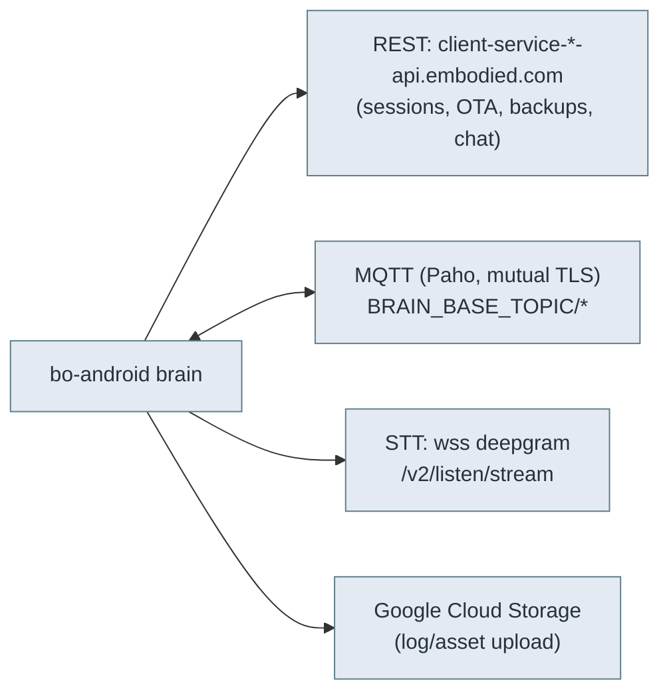
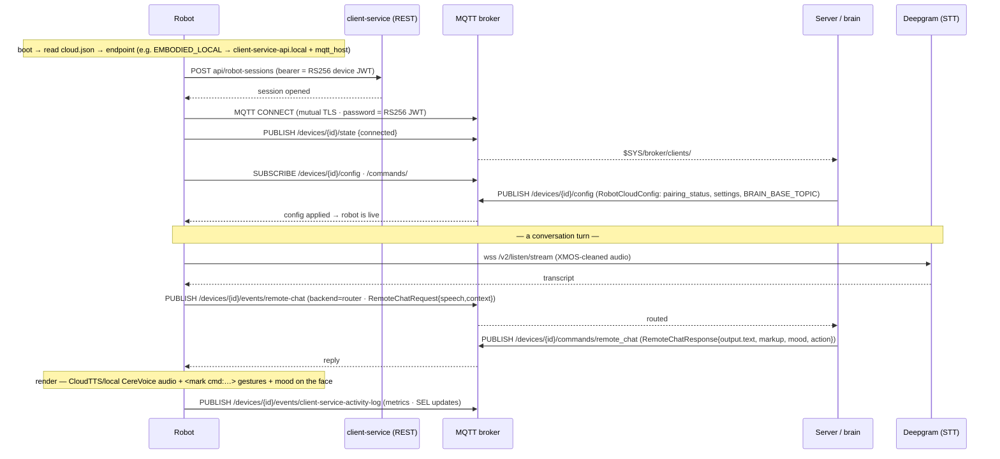

# ☁️ Robot ↔ cloud protocol — REST, MQTT, STT (`v3.6.4-Zephyr` / OTA `v24.10.803`)

How the robot's brain (`bo-android`) talks to the **backend** — the surface a self-hosted server must
implement. Reconstructed from `bo-android` native libs (`libbo-dispatch`, `libbo-logger`) and the
`me.embodied.*` Java layer. Three channels: **REST** `client-service` (sessions, OTA, backups), **MQTT**
(Paho, TLS; Google-IoT-Core topic layout; carries chat, config, commands and a raw `commands/zmq`
bus-injection lever), and **Deepgram STT** over WebSocket. The firmware already ships a local-server
profile (`EMBODIED_LOCAL`) and an OpenMoxie profile (`OPEN_MOXIE`). A server that answers REST
sessions, the config push, and RemoteChat turns has a talking robot. The phone app's REST surface is
separate ([`rest-api.md`](../phone/rest-api.md)).


```mermaid
flowchart LR
  brain["bo-android brain"]
  rest["REST: client-service-*-api.embodied.com<br/>(sessions, OTA, backups, chat)"]
  mqtt["MQTT (Paho, mutual TLS)<br/>BRAIN_BASE_TOPIC/*"]
  stt["STT: wss deepgram<br/>/v2/listen/stream"]
  gcs["Google Cloud Storage<br/>(log/asset upload)"]
  brain --> rest
  brain <--> mqtt
  brain --> stt
  brain --> gcs
  classDef d fill:#e3eaf2,stroke:#607d8b,color:#263238;
  class brain,rest,mqtt,stt,gcs d;
```

## 1. REST — `client-service`

| Path | Purpose |
|---|---|
| `api/robot-sessions`, `api/robot-sessions/complete` | Open/close a robot session (bearer/`?key=` auth). |
| **`api/ota`** | **OTA check** — how the robot asks for a firmware update; a local server can serve a signed `update.zip` ([ota-and-recovery](../firmware/ota-and-recovery.md)). |
| `api/backups`, `api/backups/newest/download` | Cloud backup of robot/user data. |
| `api/restores/` | Restore flow. |

Assets/logs also go to **Google Cloud Storage** (`www.googleapis.com/upload/storage/v1`,
`oauth2/v4/token`, scope `devstorage.read_write`) — a service-account OAuth path, separate from client-service.

### The built-in endpoint hosts (baked into `libbo-logger`)

`libbo-logger.so` (the [`RightPoint` cloud manager](../runtime/native-boundary.md#resolved-who-consumes-qrcommand-the-setup-qr-brain-bridge))
compiles in the host table for each `embodied.logging.IOTEndpoint` value (recovered via `strings`/Ghidra on the
**v24.10.803** lib). This is the canonical `IOTEndpoint` enum listing:

| # | `IOTEndpoint` | REST `client-service` base | MQTT host |
|--:|---|---|---|
| 0 | `IOT_DEFAULT` | — | — |
| 1–3 | `GOOGLE_DEVELOP` / `GOOGLE_STAGING` / `GOOGLE_PRODUCTION` | dead IoT-Core era ([pre-801](../firmware/ota-and-recovery.md)) | `mqtt.googleapis.com` |
| 4 | `EMBODIED_DEVELOP` | `https://client-service-develop-api.embodied.com/` | `mqtt-develop.embodied.com` |
| 5 | `EMBODIED_STAGING` | `https://client-service-staging-api.embodied.com/` | `mqtt-staging.embodied.com` |
| 6 | `EMBODIED_PRODUCTION` | `https://client-service-api.embodied.com/` | `mqtt.embodied.com` |
| 7 | `EMBODIED_HIPAA` | `https://client-service-hipaa-api.embodied.com/` | `mqtt-hipaa.embodied.com` |
| 8 | **`EMBODIED_LOCAL`** | **`https://client-service-api.local/`** | from the active config's `mqtt_host` (not a compiled constant) |
| 9 | `EMBODIED_CHINA` | `https://client-service-cn-api.embodied.com/` | `mqtt-cn.embodied.com` |
| 10 | `EMBODIED_HK` | `https://client-service-hk-api.embodied.com/` | `mqtt-hk.embodied.com` |
| 11 | **`OPEN_MOXIE`** | community server; shipped as the `{"endpoint":"openmoxie"}` profile | from `mqtt_host` |

- **`EMBODIED_LOCAL` is a revival profile baked into stock 803**: it resolves REST at the **mDNS name
  `client-service-api.local`** on the LAN (no DNS, no internet). `OPEN_MOXIE` is confirmed by
  `[OriginalName("OPEN_MOXIE")]` in both `WifiApp.Protos.dll` and `Embodied.Protos.dll`.
- A robot is moved between these by a QR ([pairing `endpoint` field or the `om` command](qr-commands.md#the-effective-command-set-native-dispatch-rightpointon_qrcommand))
  or by a config push. This only **redirects** the cloud; running custom software on the robot is separate ([firmware-image](../firmware/firmware-image.md)).

## Service configuration — how the robot is (re)pointed

`embodied.logging.ServiceConfiguration` (`Cloud.proto`) is the runtime connection config, held in the
native `embodied::core::SettingSchema` store (alongside `BRAIN_BASE_TOPIC`). OpenMoxie calls the same
message `ServiceConfiguration2` (file `Cloud2.proto`); it is the payload of the [`om` QR](qr-commands.md#the-om-relocation-the-real-re-home-payload).

```proto
message ServiceConfiguration {
  enum ConnectionType { GOOGLE_IOT = 0; EMBODIED_IOT = 1; EMBODIED_LOCAL = 2; }
  string gcp_project = 1;   string webservice_root = 2;   string webservice_pin = 3;   // REST base + pairing PIN
  bool   disable_sync = 4;  bool   disable_log_upload = 5; string endpoint = 6;          // profile name
  uint64 timestamp = 7;     string mqtt_host = 8;          ConnectionType connection_type = 9;
  IOTEndpoint endpoint_id = 10;  uint32 override_port = 11;  bool disable_verify = 12;   // 12 → CURLOPT_SSL_VERIFYPEER=0
}
message EndpointStore         { repeated ServiceConfiguration endpoints = 1; }  // persisted table of configs
message EndpointConfiguration { string endpoint = 1; string gcp_project = 2; }  // lighter name→project record
```

- `endpoint` / `mqtt_host` / `override_port` **override the REST/MQTT host + port**; `disable_verify`
  skips TLS peer verification (see [network-trust](network-trust.md#the-disable_verify-escape-hatch)).
- Endpoints are selected **by name / `IOTEndpoint` id**: `libbo-logger` has a `DEFAULT_ENDPOINT_NAME` and
  ships `{"endpoint":"openmoxie"}` as a known endpoint — first-class OpenMoxie support in 803.

### `cloud.json` — the persisted active config

`RightPoint` stores the live selection in **`cloud.json`** (native `CLOUD_CONFIG_PATH`; guarded by a
`cloud_config_valid_` flag and a `BAD_CLOUD_CONFIG` error; a legacy form is auto-migrated — *"Detected
legacy cloud.json"*). The QR `endpoint_update` / `om` handlers write it, then `RightPoint` **exits to
restart the logger** so the new endpoint takes effect.

## 2. MQTT — the live bus (Eclipse Paho, mutual TLS)

Paho MQTT (C) over TLS with client certificates (the Google IoT-Core pattern; pre-801 hard-coded the host
`mqtt.googleapis.com`, hence `kTypeGoogleApisComPrefix`). Topics are settings-driven off
**`BRAIN_BASE_TOPIC`** (an `embodied::core::SettingSchema`); client-id and prefixes are provisioned per
robot (uuid/serial-derived). Payloads are `embodied.*` protobufs ([recovered-proto](recovered-proto/)) or JSON.

| Setting / topic | Role |
|---|---|
| `BRAIN_BASE_TOPIC` | Base path all others hang off (per robot). |
| `RC_TOPIC` / `rc_topic` | **Remote chat** — cloud pushes `RemoteChatResponse`/`ChatResponse`. |
| `COMMANDS_TOPIC` | Commands to the robot (incl. system/OTA signals). |
| `chat_topic` / `clear_chat_topic` | Conversation stream + reset. |
| `rb_menu_topic` | Robot-brain menu / content selection. |
| `MQTT_FILE_SYNC`, `MQTT_FILE_RECOVERY`, `mqtt_files`, `mqtt_file_undo` | **File sync** channel (content, config, backups). |
| `learning_focus_topics` | Learning-focus subscriptions. |

### Exact topic map (Google IoT-Core convention, kept post-migration)

`{device_id}` is the robot UUID/serial:

| Direction | Topic | Payload |
|---|---|---|
| robot → cloud | `/devices/{device_id}/events/{eventname}` | JSON events/telemetry/requests |
| robot → cloud | `/devices/{device_id}/state` | connection state |
| cloud → robot | `/devices/{device_id}/config` | JSON config ([`RobotCloudConfig`](device-config-and-telemetry.md#robotcloudconfig-the-master-config-document-cloud-robot)) |
| cloud → robot | `/devices/{device_id}/commands/{command}` | JSON command (`remote_chat`, `query_result`, `telehealth`) |
| cloud → robot | **`/devices/{device_id}/commands/zmq`** | **binary `"{proto_full_name}:" + serialized protobuf`** — injected straight onto the robot's [ZMQ bus](robot-ipc-protocol.md) |
| server subscribes | `/devices/+/events/#`, `/devices/+/state` | wildcard for all robots |
| server subscribes | `$SYS/broker/clients/#`, `$SYS/broker/log/#` | **presence** — mosquitto's system topics show robot connect/disconnect |

**`commands/zmq` is the remote-control lever**: publish `embodied.unity.QRCommand:` + bytes, or any
`embodied.*` message, and it lands on the on-device bus — the local bus's two frames joined as `name:bytes`.
The same subscribe/publish set is implemented by the community OpenMoxie server
(`site/hive/mqtt/moxie_server.py`), which independently confirms this table; OpenMoxie is a reference,
not a dependency.

### Event names & envelope (robot → cloud)

JSON events carry `event_id` / `request_id`, a `backend`, an optional `query`, and a `subtopic`:

| `eventname` | Meaning |
|---|---|
| `remote-chat` (`-staging`) | `backend=router` → a chat turn (`RemoteChatRequest`); `backend=data`, `query=modules` → module-list request |
| `client-service-activity-log` | multiplexed by `subtopic`: `query` (= `schedule` / `mentor_behaviors` / `license`); `telehealth`; or a `mentor_behavior` report |
| `client-service-http-token` | request for an access token (e.g. Google speech license) |

The server answers on `…/commands/{command}` (JSON) or `…/config`. This repo's implementation is
[`mqtt/`](../../../mqtt/) + [`server/`](../../../server/).

## Health telemetry & backup (robot → cloud)

- **Device health** — `BoSystemMonitor` reports `embodied.logging.SystemMetrics.SystemState`:
  `CPULoad`, `RAMFree`, `DiskFree`, `Uptime`, `Temperature`, `Battery`, `WifiRssi`.
  `CloudStatus{connected, user_state, endpoint}` is the robot's view of its link ([`UserState`](device-config-and-telemetry.md#cloudstatususerstate-the-pairing-ota-lifecycle)).
- **Backup** — `BackupStageRequest{path, end_timestamp}` + `BackupDataUpdate{actor, complete, files_added[]}`
  stage `/sdcard/EmbodiedData` files for upload (`api/backups` + GCS). A minimal server can no-op; a full
  one persists per robot for `api/restores`.
- **Family/child data** — `FamilyInformation{members[]}` is only a member list; rich child PII
  (`child_pii.nickname`, age) comes from the account ([rest-api](../phone/rest-api.md)) via
  `RemoteChatRequest.family`/`settings` and [`RobotCloudConfig`](device-config-and-telemetry.md#the-child-pii-encryption-boundary).

## Conversation & learning telemetry (robot → cloud)

Per-turn analytics for the parent dashboard (safe to ignore in a minimal server). All carry the usual
`software_version` (100) / `module_name` (101) fields and arrive on the `events` topic.

- **`RemoteResponseData`** (`embodied.robotbrain`) — per-turn affect/engagement scoring of the child:
  `positive_emotion_score`, `negative_emotion_score`, `dialog_act_engagement_score`,
  `positive_sentiment_score`, `negative_sentiment_score` (all `float`) + `instance_id`. Feeds the
  [recommender's sentiment weight](../runtime/content-and-conversation.md#the-recommender) and mood reports.
- **`SELUpdate`** / **`SELUpdateSet`** (`embodied.logging`) — Social-Emotional-Learning progress
  `{goal_uuid, level_uuid, module_id, timestamp}` when the child advances a STAR goal/level
  ([SEL curriculum](../runtime/content-and-conversation.md#star-goals-the-sel-curriculum)); the set batches them.
- **`TopicChange`** (`embodied.robotbrain`) — `{user, bot, newTopic, currentModule, currentContentID, timestamp}`.

## Content queries — `CloudQuery` (robot → cloud, pull)

`CloudQueryRequest { CloudQuery query; request_id; schedule_id; subkey; child_id; user_age; api_version }`
→ `CloudQueryResponse` (`embodied.logging`), over the MQTT `query` subtopic / REST:

| `CloudQuery` | Returns | Consumer |
|--:|---|---|
| `idf` | `IDFRecord[] { module_id, score }` | recommender per-module relevance |
| `license` | `LicenseRecord[] { LicenseID (cereproc / google_speech), license, license_binary }` | **TTS/STT license blobs** for CereVoice / Google Speech |
| `schedule` | `ContentSchedule` | the day's [schedule](../runtime/content-and-conversation.md) |
| `contexts` / `context_store` | `Contexts` + `versioned_contexts[] {key, value}` | ChatScript contexts |
| `mentor_behaviors` | `MentorBehavior[]` | mentor-behavior history |
| `remote_lines` | `DynamicLine[] { id, text }` | server-authored dynamic lines |

`QueryResponseCode`: **`QUERY_OK`**, **`QUERY_NO_CHANGE`** (robot's `current_version` is current — a
version cache), **`QUERY_NETWORK_FAIL`**; plus optional `MetaDataResponse { log, text }`.

## File sync — how a server delivers content, voice & ChatScript

Content modules, CereVoice voice data and ChatScript arrive by **hash-based delta sync** on the
`MQTT_FILE_SYNC` channel ([where the data lives](../runtime/content-and-conversation.md#where-the-data-lives)):

```proto
message FileEntry        { string path = 1; string hash = 2; }                               // rel-path + content hash
message FileListQuery    { string root_name = 1; string current_version = 2; }                // robot → "what's in this root?"
message FileListResponse { string root_name = 1; string current_version = 2; repeated FileEntry files = 3; } // server → manifest
message FileRead         { string root_name = 1; FileEntry file = 2; }                        // robot → "send me this file"
message FileResponse     { string root_name = 1; FileEntry file = 2; bytes contents = 3; }    // server → the bytes
message FileSyncState    { uint64 timestamp; string root_name; string local_path;
                           enum SyncState { SYNC_IDLE=0; SYNC_ACTIVE=1; SYNC_COMPLETE=2; } sync_state;
                           enum RootType  { ROOT_TYPE_UNKNOWN=0; ASSETS=1; } root_type; }     // robot → progress
```

Exchange (a **root** is a named tree, e.g. `ASSETS`): robot `FileListQuery` → server `FileListResponse`
(path + hash per file) → robot diffs and sends `FileRead` per changed/missing file → server `FileResponse`
→ robot reports `FileSyncState` (`SYNC_ACTIVE` → `SYNC_COMPLETE`) while writing under
`/sdcard/EmbodiedData` / `EmbodiedStaticData`. Any consistent digest works; no signing is involved
(unlike the signed [OTA](../firmware/ota-and-recovery.md) path).

## Robot authentication (device identity)

Google Cloud IoT-Core device model, kept post-migration:

- First boot: `me.embodied.KeyMaker.provisionKeysCheck()` generates an **RSA keypair** →
  `/sdcard/EmbodiedStaticData/PERSISTENT_DATA/rightpoint/RS256.key` (private) + `.key.pub`
  (`rightpoint` = Embodied's app codename).
- Pairing (`UserPairingRequest`, bound by the QR's `secret_key`) registers the **public key** with the backend.
- Every MQTT connect (Paho `_auth_username`/`_auth_password`): **password = JWT signed RS256** with the
  device key (`{iat, exp, aud=project}`); `client_id` = device path (`…/registries/…/devices/{device_id}`).
  REST/STT use the resulting **bearer** token.

An anonymous broker (`allow_anonymous true`, as OpenMoxie uses) never validates the JWT, so no device
key or registry is needed; a stricter server can verify against the registered public key. Server-cert
side: [network-trust](network-trust.md).

## 3. STT — Deepgram over WebSocket

```
wss://deepgram-test.embodied.com/v2/listen/stream?<params>
Authorization: bearer <token>
```

`STTWebClient`/`URIMaker` (`org.java_websocket`) streams mic `AudioBuffer` frames and receives
transcripts, in `CONTINUOUS` or `SPEECH` mode. `/v2/listen/stream` is Deepgram's streaming API; a
server can proxy to any STT with the same framing.

## The chat request/response envelope

`RemoteChatRequest` (`embodied.robotbrain`), sent per user turn (full contract: [remote-chat-protocol](remote-chat-protocol.md)):

- Identity/context: `session_id`, `user_id`, `user_age`, `nickname`, `family`, `timezone_id`, `settings`.
- Input: `speech` (+ `confidence`, `speech_alternates`, `original_language`), `command`, `event_id`, `input_vars`, `module_id`/`content_id`, `activity_ids`.
- Context blocks: `global_context`, `conversation_context`, `prompt_context`, `recommend`.
- Controls: `stream_response`, `response_chunks`, `is_mentor`, `no_llm`, `upgrade_fallbacks`, `api_version`.

`ChatResponse` returns an `OutputType` (`NORMAL`, `FALLBACK`, `GLOBAL_COMMAND`, `STINGER`, `SILENT`,
`REMOTE_DELAY`, …), a `FallbackType` (values in [offline-and-brain-state](offline-and-brain-state.md#the-fallback-content-tree-fallbackinfo)),
a `BlockedType` (why a response was suppressed — `TARGET_OUT_OF_VIEW`, `NOT_ENGAGED`, `THINKING`, …), and
`ResponseSource` (`LOCAL_RESPONSE` / `REMOTE_RESPONSE`). Spoken text carries inline
[`<mark name="cmd:…">` markup](robot-ipc-protocol.md#the-behavior-command-markup-how-the-cloud-drives-the-body),
so one response drives speech **and** body.

## The full session — power-on to first spoken line


```mermaid
sequenceDiagram
  participant R as Robot
  participant W as client-service (REST)
  participant B as MQTT broker
  participant S as Server / brain
  participant T as Deepgram (STT)
  Note over R: boot → read cloud.json → endpoint (e.g. EMBODIED_LOCAL → client-service-api.local + mqtt_host)
  R->>W: POST api/robot-sessions  (bearer = RS256 device JWT)
  W-->>R: session opened
  R->>B: MQTT CONNECT (mutual TLS · password = RS256 JWT)
  R->>B: PUBLISH /devices/{id}/state {connected}
  B-->>S: $SYS/broker/clients/# + /state  (presence)
  R->>B: SUBSCRIBE /devices/{id}/config · /commands/#
  S->>B: PUBLISH /devices/{id}/config  (RobotCloudConfig: pairing_status, settings, BRAIN_BASE_TOPIC)
  B-->>R: config applied → robot is live
  Note over R,T: — a conversation turn —
  R->>T: wss /v2/listen/stream  (XMOS-cleaned audio)
  T-->>R: transcript
  R->>B: PUBLISH /devices/{id}/events/remote-chat  (backend=router · RemoteChatRequest{speech,context})
  B-->>S: routed
  S->>B: PUBLISH /devices/{id}/commands/remote_chat  (RemoteChatResponse{output.text, markup, mood, action})
  B-->>R: reply
  Note over R: render — CloudTTS/local CereVoice audio + <mark cmd:…> gestures + mood on the face
  R->>B: PUBLISH /devices/{id}/events/client-service-activity-log  (metrics · SEL updates)
```

1. **Boot → endpoint** from [`cloud.json`](#cloudjson-the-persisted-active-config).
2. **REST session** at `api/robot-sessions`, authenticated with the [RS256 device JWT](#robot-authentication-device-identity).
3. **MQTT connect + presence** (`/state` and the broker's `$SYS` topics).
4. **Config push** on `/devices/{id}/config` — `pairing_status`, settings, `BRAIN_BASE_TOPIC`.
5. **A turn** — speech cleaned by the [XMOS DSP](../runtime/perception-pipeline.md), streamed to STT; `remote-chat` event → server answers on `commands/remote_chat`.
6. **Render** — CloudTTS audio or local CereVoice, `<mark cmd:…>` gestures, mood; metrics/SEL flow back on `client-service-activity-log`.

Steps **2, 4 and 5** are the minimum; everything else is enrichment.

## Minimum viable backend (for revival)

1. Serve `https://client-service-api.local/` (DNS + TLS) and point the robot at `EMBODIED_LOCAL` (or `om` → your host).
2. Implement `api/robot-sessions` (open/complete) and an MQTT broker with per-robot `BRAIN_BASE_TOPIC`.
3. Answer `RemoteChatRequest` on `RC_TOPIC` / `commands/remote_chat` with a `RemoteChatResponse` (wrap any LLM; emit `<mark name="cmd:…">` for gestures).
4. Bridge STT (proxy the Deepgram framing, or swap in your own) and TTS (CloudTTS audio, or CereVoice rendered locally via `embodied.unity.CloudTTS`).
5. Optional: `api/ota` (firmware), `api/backups` / `api/restores` (data), `CloudQuery`, file sync.

---
📖 [Reverse-engineering index](../README.md) · [IPC protocol](robot-ipc-protocol.md) · [OTA](../firmware/ota-and-recovery.md) · [Docs index](../../README.md)
