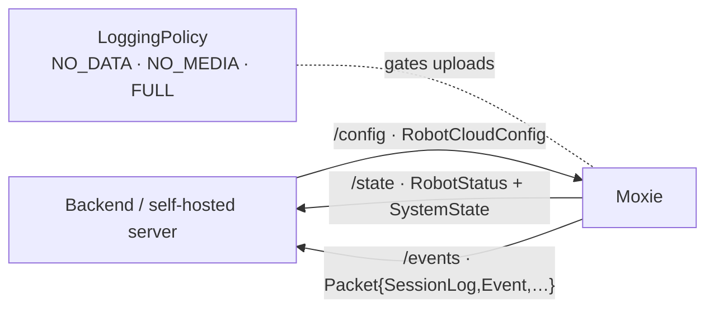

# ⚙️ Device config & telemetry — the `embodied.logging` data-model (`v3.6.4-Zephyr` / OTA `v24.10.803`)

> Recovered from `embodied/logging/{Cloud,Log,LoggingState,CloudStatus,enums}.proto` (`package
> embodied.logging`) in the **v24.10.803** image. This is the **data-model** between robot and backend —
> the master **config document the cloud pushes down** (`RobotCloudConfig`), the **status snapshot** and
> **telemetry envelope** the robot sends up (`RobotStatus`, `Packet`/`Log*`), and the **data-collection
> policy** that gates uploads (`LoggingPolicy`). The *transport* (topics, TLS, REST) is
> [`cloud-protocol.md`](cloud-protocol.md); this is the *content* that flows over it. It's the single
> most important schema for goal ②: a self-hosted server **synthesizes `RobotCloudConfig` and consumes
> the telemetry**.

## The loop



## `RobotCloudConfig` — the master config document (cloud → robot)

The single JSON/proto the cloud publishes on **`/devices/{id}/config`** ([topic map](cloud-protocol.md#exact-topic-map-google-iot-core-convention-kept-post-migration)).
It's the robot's entire remotely-managed runtime state — **the thing a revival server must produce.**
Fields (`embodied.logging.RobotCloudConfig`):

| Group | Fields |
|---|---|
| **Child / user** | `child` (`ChildEncrypted`, ciphertext), `child_pii` (`ChildDecrypted`, plaintext — see boundary below), `secret_key` (pairing seed), `switch_user_config`, `num_children`, `max_children` |
| **Quiet hours** | `privacy_mode_enabled`, `weekday_bedtime_enabled` + `…_starts_at`/`…_ends_at`, `weekend_bedtime_enabled` + `…_starts_at`/`…_ends_at` |
| **Wake / alarms** | `alarms` (`WakeSchedule{ WakeEntry{days[], time} …, enabled }`), `wake_button_enabled`, `audio_wake_set`, `touch_wake_enabled`, `schedule_preferences` (`ParentRequest{module_id, scheduled_at}`) |
| **Device** | `audio_volume`, `screen_brightness`, `timezone_id`, `settings` (`DeviceSettings` k/v — cf. [settings-schema](../firmware/settings-schema.md)) |
| **OTA** | `ota_update` (`{id, version}`), `forbid_otaver` |
| **Mode / privacy** | `moxie_mode` (`DEFAULT_MODE` / `TELEHEALTH`, cf. [telehealth](telehealth.md)), `data_sharing`, `grl_connected`, `rc_topic` |
| **Meta** | `last_updated_at`, `timestamp` |

So bedtime windows, alarms, volume/brightness, timezone, privacy mode, wake-button/touch-wake toggles,
the OTA target, and the child profile are **all one config push** — a server changes any of them by
re-publishing `RobotCloudConfig`.

### The child-PII encryption boundary

The child appears **twice**: `child` is a **`ChildEncrypted`** (every personal field is a `*_encrypted`
`bytes` blob — `first_name_encrypted`, `birthday_encrypted`, `therapy_needs_encrypted`,
`volume_preference_encrypted`, … + a `checksum`), while `child_pii` is the decrypted **`ChildDecrypted`**
(plain `first_name`, `birthday`, `therapy_needs[]`, …). The `*_encrypted` fields are unsealed with the
**pairing `secret_key` seed** ([`crypto-and-keys.md`](../phone/crypto-and-keys.md#7-security-observations-relevant-to-a-reimplementation)),
so an honest cloud stores only ciphertext — the robot decrypts locally. Non-PII knobs
(`content_preferences` with `SELPreference{sel_tag, weight}`, `starbits`, `face_options`, `input_speed`,
`family`) sit alongside in the clear.

> **Revival note.** A self-hosted server you control *is* the key-holder (it ran pairing), so it can
> populate `child_pii` directly and leave `child` empty — the encryption exists to blind Embodied's
> cloud, not to lock out the robot's own paired backend.

## `RobotStatus` — the status snapshot (robot → cloud)

Published on **`/devices/{id}/state`**. The robot's self-report (`embodied.logging.RobotStatus`):

| Field | Field |
|---|---|
| `embodied_robot_id`, `mac` | `robot_firmware_version`, `android_version` |
| `battery_level`, `audio_volume`, `screen_brightness` | `wifi_ssid`, `mode` |
| `last_back_up_at`, `ota_reboot_required` | `public_key`, `user_id_encrypted` |
| `settings` (`DeviceSettings`) | `last_updated_at`, `timestamp` |

Live **health metrics** ride separately as `SystemState{CPULoad, RAMFree, DiskFree, Uptime, Temperature,
Battery, WifiRssi}` — already documented in [cloud-protocol → health telemetry](cloud-protocol.md#health-telemetry-backup-robot-cloud).

## `CloudStatus.UserState` — the pairing / OTA lifecycle

`CloudStatus{connected, user_state, endpoint}` reports the robot's own view of its backend link, and
`user_state` is a real lifecycle enum (`embodied.logging.CloudStatus.UserState`):

| # | `UserState` | Meaning |
|--:|---|---|
| 0 | `UNKNOWN` | not yet determined |
| 1 | `NONE` | unpaired / factory |
| 2 | `PAIRED_PENDING` | pairing started, not confirmed |
| 3 | `PAIRED_VALID` | fully paired & operating |
| 4 | `UNPAIR_REQUESTED` | unpair in progress (cf. [`UnpairUserRequest`](power-and-system-events.md#unpair-disengage-unpairuserrequest)) |
| 5 | `OTA_LOCK` | held for an OTA (no user activity) |
| 6 | `UNPAIR_WITH_RFS` | unpair **+ restore-factory-settings** (wipe) |
| 7 | `USER_DATA_UPDATE` | child profile being updated |

This mirrors the disengage reasons in [`power-and-system-events.md`](power-and-system-events.md) — `OTA_LOCK`,
`UNPAIR_*`, and `USER_DATA_UPDATE` are the cloud-visible counterparts of the on-device quiesce.

## The telemetry envelope — `Packet` + `Log*`

Analytics/events upload inside a generic **`Packet`** (`embodied.logging.Cloud`):

```proto
message Packet {
  enum Model { UNKNOWN=0; SessionLog=1; Device=2; Event=3; Raw=4; }
  Model  model = 1;  uint32 version = 2;  uint64 recorded_at = 3;
  string moxie_id = 4;  string moxie_session_id = 5;  string user_id = 6;
  string event_name = 7;  bytes  event_data = 8;              // the typed payload
}
```

- **`model`** classifies the record — a per-session log (`SessionLog`), a device fact (`Device`), a
  discrete `Event`, or opaque `Raw`. `event_name` + `event_data` (serialized bytes) carry the specifics.
- Two scoped wrappers exist for individual events (`embodied.logging.Log`): **`LogDevice`**
  (`{deviceUUID, eventArgsTypename, eventArgs}`) for device-scoped events and **`LogUser`** (adds
  `userUUID`) for user-scoped ones — `eventArgsTypename` names the serialized `eventArgs` type, a
  self-describing typed-event pattern.
- **`LogcatTrace{timestamp, level, tag, pid, tid, message, bo_uid}`** uploads raw Android logcat lines
  (for remote debugging) — distinct from the structured analytics above.

A minimal revival server can **ignore** all of this (it's for the parent dashboard and Embodied's
telemetry); a full one persists `Packet`s per robot/session.

## `LoggingPolicy` / `LoggingState` — the data-collection gate

What actually gets uploaded is governed by a **consent policy** and a per-session recording state
(`embodied.logging.enums` + `LoggingState`):

- **`LoggingPolicy`** — **`NO_DATA` (0)**, **`NO_MEDIA` (1)**, **`FULL` (2)**. The tier of what may leave
  the device: nothing, everything-but-audio/video, or everything. Tied to the account's `data_sharing`
  setting (`RobotCloudConfig.data_sharing`).
- **`LoggingState`** — `START → STARTED → STOP → STOPPED`, a recording session's lifecycle.
- **`LoggingStateChangeRequest{ state, path }`** starts/stops recording to a filesystem `path`;
  **`LoggingStateUpdate`** reports back with `uuid`, `session_uuid`, `user_uuid`, and the effective
  **`upload_policy`** (`LoggingPolicy`).

> **Revival + firmware note.** A server (or custom firmware) should **honor `NO_DATA`/`NO_MEDIA`** — it's
> the child-privacy contract, not a cosmetic flag. Staged files land under `/sdcard/EmbodiedData`
> (cf. [backup, cloud-protocol](cloud-protocol.md#health-telemetry-backup-robot-cloud)) and upload only
> per policy.

## Small control messages (`embodied.logging.Log`)

- **`Ping{ include_zmq, user_data }`** — liveness probe; `include_zmq` asks for a bus round-trip too.
- **`ProtoSubscribe{ protos[] }`** — subscribe a consumer to a set of proto streams by full name.
- **`DeviceSettings{ props[]: {key,value} }`** / `DeviceSettingsUpdate` — the flat settings bag echoed in
  both `RobotCloudConfig` and `RobotStatus` (schema in [settings-schema](../firmware/settings-schema.md)).

## `IOTEndpoint` — the endpoint taxonomy

`embodied.logging.IOTEndpoint` enumerates every backend the firmware knows, and it's baked into the
config/service layer:

`IOT_DEFAULT`(0) · `GOOGLE_DEVELOP/STAGING/PRODUCTION`(1–3) · `EMBODIED_DEVELOP/STAGING/PRODUCTION`(4–6) ·
`EMBODIED_HIPAA`(7) · **`EMBODIED_LOCAL`(8)** · `EMBODIED_CHINA`(9) · `EMBODIED_HK`(10) · **`OPEN_MOXIE`(11)**.

Both **`EMBODIED_LOCAL`** and **`OPEN_MOXIE`** are first-class enum values in the 803 firmware — the
self-hosted/community endpoints are ones the stock robot already understands, which is exactly the hook
[`cloud-protocol.md`](cloud-protocol.md#service-configuration-how-the-robot-is-repointed) and
[`qr-commands.md`](qr-commands.md) use to repoint a robot.

## What this means for the three goals

**① Custom firmware.** `RobotCloudConfig` is the contract a custom build must *accept* (or emulate) to
be configurable the way the app expects — bedtime, alarms, volume, privacy, OTA target, child profile.
`LoggingPolicy` is the data-governance surface to preserve.

**② Server revival.** This is the **central server responsibility**: publish `RobotCloudConfig` on
`/config` to drive the robot's settings/child/schedule, consume `RobotStatus` + `Packet` telemetry, and
honor the `LoggingPolicy`. Because the paired server holds the key, it can fill `child_pii` directly.
`EMBODIED_LOCAL`/`OPEN_MOXIE` in `IOTEndpoint` are the built-in "point me at a local server" values.

**③ Pre-801 revival.** No new lever — the config rides the same MQTT/endpoint path blocked pre-801
([`network-trust.md`](network-trust.md)); once a robot can reach your server, this is what you send it.

---
📖 [Reverse-engineering index](../README.md) · [Cloud protocol](cloud-protocol.md) · [Crypto & keys](../phone/crypto-and-keys.md) · [Power & system events](power-and-system-events.md) · [Settings schema](../firmware/settings-schema.md) · [Content & conversation](../runtime/content-and-conversation.md)
