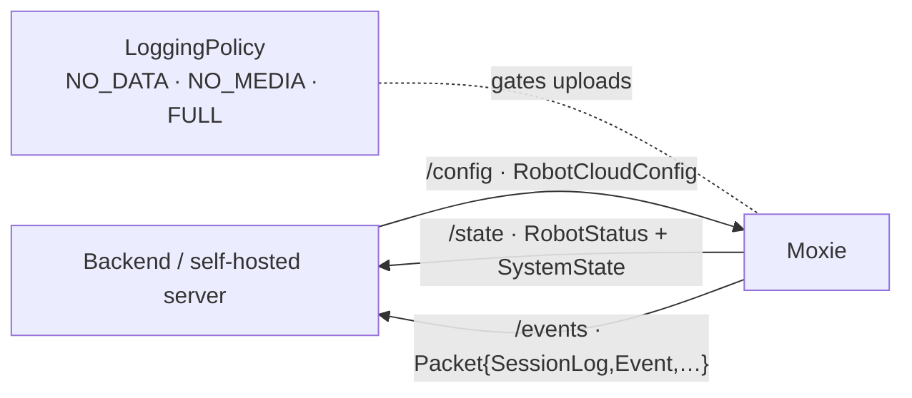

# ⚙️ Device config & telemetry — the `embodied.logging` data-model (`v3.6.4-Zephyr` / OTA `v24.10.803`)

The **content** that flows between robot and backend (the transport is [cloud-protocol](cloud-protocol.md)).
Recovered from `embodied/logging/{Cloud,Log,LoggingState,CloudStatus,enums}.proto` (`package
embodied.logging`) in the **v24.10.803** image. The key schema for a self-hosted server: it **publishes
`RobotCloudConfig`** (child, bedtime, alarms, volume, OTA, privacy — one document), **consumes
`RobotStatus` and `Packet` telemetry**, and must **honor `LoggingPolicy`** (`NO_DATA`/`NO_MEDIA`/`FULL`).


```mermaid
flowchart LR
  server["Backend / self-hosted server"]
  robot["Moxie"]
  server -->|"/config · RobotCloudConfig"| robot
  robot -->|"/state · RobotStatus + SystemState"| server
  robot -->|"/events · Packet{SessionLog,Event,…}"| server
  policy["LoggingPolicy<br/>NO_DATA · NO_MEDIA · FULL"]
  policy -.gates uploads.- robot
```

## `RobotCloudConfig` — the master config document (cloud → robot)

Published on **`/devices/{id}/config`** ([topic map](cloud-protocol.md#exact-topic-map-google-iot-core-convention-kept-post-migration)).
The robot's entire remotely-managed state; a server changes any setting by re-publishing it.

| Group | Fields |
|---|---|
| **Child / user** | `child` (`ChildEncrypted`, ciphertext), `child_pii` (`ChildDecrypted`, plaintext — see below), `secret_key` (pairing seed), `switch_user_config`, `num_children`, `max_children` |
| **Quiet hours** | `privacy_mode_enabled`, `weekday_bedtime_enabled` + `…_starts_at`/`…_ends_at`, `weekend_bedtime_enabled` + `…_starts_at`/`…_ends_at` |
| **Wake / alarms** | `alarms` (`WakeSchedule{ WakeEntry{days[], time} …, enabled }`), `wake_button_enabled`, `audio_wake_set`, `touch_wake_enabled`, `schedule_preferences` (`ParentRequest{module_id, scheduled_at}`) |
| **Device** | `audio_volume`, `screen_brightness`, `timezone_id`, `settings` (`DeviceSettings` k/v — [settings-schema](../firmware/settings-schema.md)) |
| **OTA** | `ota_update` (`{id, version}`), `forbid_otaver` |
| **Mode / privacy** | `moxie_mode` (`DEFAULT_MODE` / `TELEHEALTH`, [telehealth](telehealth.md)), `data_sharing`, `grl_connected`, `rc_topic` |
| **Meta** | `last_updated_at`, `timestamp` |

On-device, bedtime/alarms/timezone become `TimeZoneInfo` + `UserAlarmRequest`s
([time & alarms](power-and-system-events.md#time-timezone-alarms-timeeventsproto)); live overrides are the
[runtime-control](runtime-control.md) commands.

### The child-PII encryption boundary

`child` is a **`ChildEncrypted`** (every personal field a `*_encrypted` `bytes` blob — `first_name_encrypted`, `birthday_encrypted`, `therapy_needs_encrypted`, `volume_preference_encrypted`, … + a `checksum`);
`child_pii` is the decrypted **`ChildDecrypted`** (plain `first_name`, `birthday`, `therapy_needs[]`, …).
The `*_encrypted` fields are unsealed with the pairing `secret_key` seed ([crypto-and-keys](../phone/crypto-and-keys.md#7-security-observations-relevant-to-a-reimplementation)).
Non-PII knobs sit in the clear: `content_preferences` (`SELPreference{sel_tag, weight}`), `starbits`, `face_options`, `input_speed`, `family`.
The encryption blinds Embodied's cloud; a self-hosted server that ran pairing is the key-holder and can fill `child_pii` directly and leave `child` empty.

## `RobotStatus` — the status snapshot (robot → cloud)

Published on **`/devices/{id}/state`** (`embodied.logging.RobotStatus`):

| Field | Field |
|---|---|
| `embodied_robot_id`, `mac` | `robot_firmware_version`, `android_version` |
| `battery_level`, `audio_volume`, `screen_brightness` | `wifi_ssid`, `mode` |
| `last_back_up_at`, `ota_reboot_required` | `public_key`, `user_id_encrypted` |
| `settings` (`DeviceSettings`) | `last_updated_at`, `timestamp` |

Live health metrics (`SystemState`) ride separately — see [health telemetry](cloud-protocol.md#health-telemetry-backup-robot-cloud).

## `CloudStatus.UserState` — the pairing / OTA lifecycle

`CloudStatus{connected, user_state, endpoint}` is the robot's view of its backend link; `user_state`:

| # | `UserState` | Meaning |
|--:|---|---|
| 0 | `UNKNOWN` | not yet determined |
| 1 | `NONE` | unpaired / factory |
| 2 | `PAIRED_PENDING` | pairing started, not confirmed |
| 3 | `PAIRED_VALID` | fully paired & operating |
| 4 | `UNPAIR_REQUESTED` | unpair in progress ([`UnpairUserRequest`](power-and-system-events.md#unpair-disengage-unpairuserrequest)) |
| 5 | `OTA_LOCK` | held for an OTA (no user activity) |
| 6 | `UNPAIR_WITH_RFS` | unpair **+ restore-factory-settings** (wipe) |
| 7 | `USER_DATA_UPDATE` | child profile being updated |

`OTA_LOCK`, `UNPAIR_*` and `USER_DATA_UPDATE` are the cloud-visible counterparts of the on-device
disengage reasons ([power-and-system-events](power-and-system-events.md#unpair-disengage-unpairuserrequest)).
The MAINAPP-side pairing action set is `UserPairingRequest` ([unity-mainapp-interface](unity-mainapp-interface.md#pairing-mainapp-side-userpairingrequest)).

## The telemetry envelope — `Packet` + `Log*`

```proto
message Packet {                                   // embodied.logging.Cloud
  enum Model { UNKNOWN=0; SessionLog=1; Device=2; Event=3; Raw=4; }
  Model  model = 1;  uint32 version = 2;  uint64 recorded_at = 3;
  string moxie_id = 4;  string moxie_session_id = 5;  string user_id = 6;
  string event_name = 7;  bytes  event_data = 8;   // the typed payload
}
```

- `model` classifies the record (per-session log, device fact, discrete event, opaque raw); `event_name` + serialized `event_data` carry the specifics.
- Scoped wrappers (`embodied.logging.Log`): **`LogDevice`** `{deviceUUID, eventArgsTypename, eventArgs}` and **`LogUser`** (adds `userUUID`) — `eventArgsTypename` names the serialized `eventArgs` type (self-describing typed events).
- **`LogcatTrace{timestamp, level, tag, pid, tid, message, bo_uid}`** uploads raw Android logcat lines for remote debugging.

A minimal server can ignore all of this; a full one persists `Packet`s per robot/session.

## `LoggingPolicy` / `LoggingState` — the data-collection gate

- **`LoggingPolicy`** (`embodied.logging.enums`) — **`NO_DATA` (0)**, **`NO_MEDIA` (1)** (everything but audio/video), **`FULL` (2)**. Tied to `RobotCloudConfig.data_sharing`.
- **`LoggingState`** — `START → STARTED → STOP → STOPPED`, a recording session's lifecycle.
- **`LoggingStateChangeRequest{ state, path }`** starts/stops recording to `path`; **`LoggingStateUpdate`** reports `uuid`, `session_uuid`, `user_uuid` and the effective **`upload_policy`**.

Servers and custom firmware should **honor `NO_DATA`/`NO_MEDIA`** — it is the child-privacy contract.
Staged files land under `/sdcard/EmbodiedData` ([backup](cloud-protocol.md#health-telemetry-backup-robot-cloud)) and upload only per policy.

## Small control messages (`embodied.logging.Log`)

- **`Ping{ include_zmq, user_data }`** — liveness probe; `include_zmq` asks for a bus round-trip too.
- **`ProtoSubscribe{ protos[] }`** — subscribe a consumer to proto streams by full name.
- **`DeviceSettings{ props[]: {key,value} }`** / `DeviceSettingsUpdate` — the flat settings bag in both `RobotCloudConfig` and `RobotStatus`.

`embodied.logging` also defines the **`IOTEndpoint`** enum (0–11, incl. `EMBODIED_LOCAL`=8 and
`OPEN_MOXIE`=11) and `ServiceConfiguration`; both are documented once in
[cloud-protocol](cloud-protocol.md#the-built-in-endpoint-hosts-baked-into-libbo-logger).

## For the three goals

- **Custom firmware:** accept (or emulate) `RobotCloudConfig`; preserve `LoggingPolicy` data governance.
- **Server revival:** the central responsibility — publish `RobotCloudConfig` on `/config`, consume `RobotStatus` + `Packet`, honor `LoggingPolicy`, fill `child_pii` directly. See [`mqtt/moxie_sdk/faces.py`](../../../mqtt/moxie_sdk/faces.py) (`face_options`) and the [config & telemetry contract](../../architecture/config-and-telemetry-contract.md).
- **Pre-801:** no new lever ([network-trust](network-trust.md)).

---
📖 [Reverse-engineering index](../README.md) · [Cloud protocol](cloud-protocol.md) · [Crypto & keys](../phone/crypto-and-keys.md) · [Power & system events](power-and-system-events.md) · [Settings schema](../firmware/settings-schema.md) · [Content & conversation](../runtime/content-and-conversation.md)
