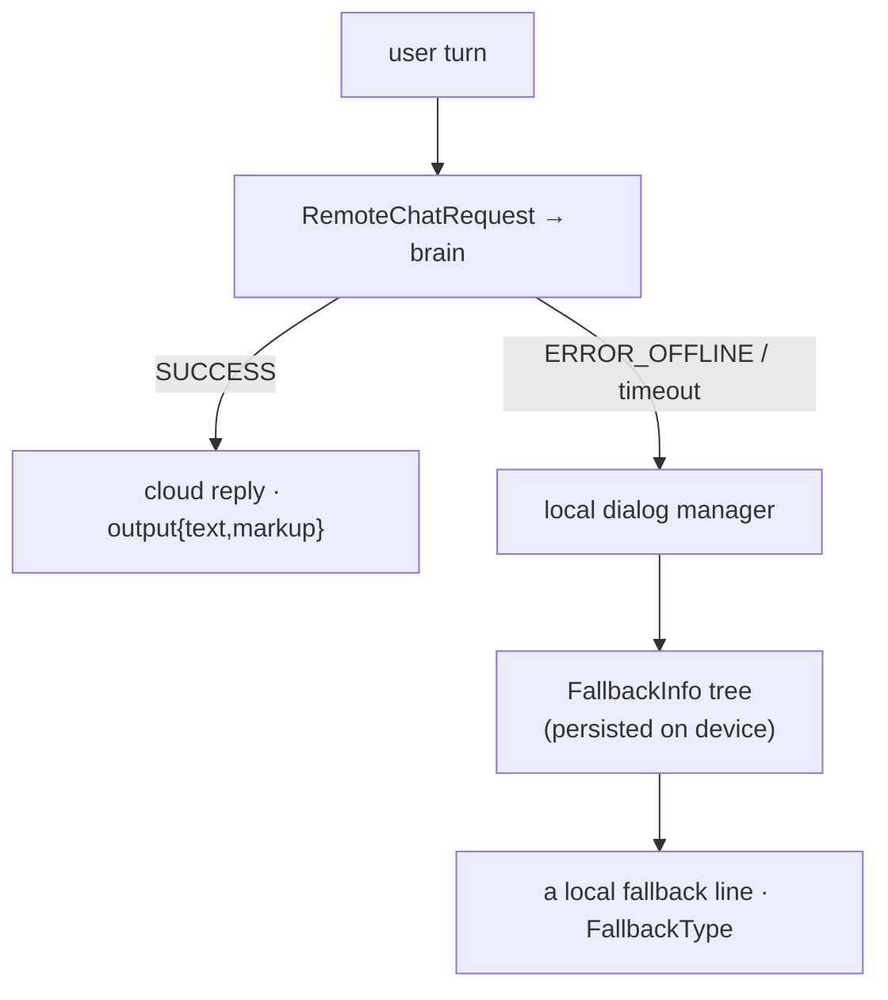

# 🛟 Offline behavior & on-device brain state (`v3.6.4-Zephyr` / OTA `v24.10.803`)

What Moxie persists to disk so it survives reboots and keeps talking when the cloud brain is
unreachable. Recovered from `embodied/robotbrain/serialized/{FallbackInfo,CSData,UserRecommendationData}.proto`
(`package embodied.robotbrain.serialized`) in the **v24.10.803** image. Three blobs: **`FallbackInfo`** (what
Moxie says offline, pushed by the server via `upgrade_fallbacks`), **`CSData`** (the resume point), and
**`UserRecommendationData`** (the recommender's learned history). Stored under Unity's `PERSISTENT_DATA`
path (`/sdcard/EmbodiedData` / `persistentDataPath`, see [where the data lives](../runtime/content-and-conversation.md#where-the-data-lives)).
This is why a robot with no backend — even a stranded pre-801 unit — is not mute.



When [`RemoteChatResponse.result`](remote-chat-protocol.md#the-response-remotechatresponse) is `ERROR_OFFLINE`
(or the call times out), the local dialog manager serves a line from the on-device `FallbackInfo` tree.

## The fallback content tree — `FallbackInfo`

```proto
message FallbackInfo   { Context default_context = 1; repeated ModuleFallback modules = 2; }
message ModuleFallback { string id; Context context;
                         repeated NodeFallback   node_fallbacks;         // per behavior-tree node
                         repeated ContentIDFallback content_id_fallbacks; // per content id
                         NodeFallback module_default_fallback; }          // the module's catch-all
message NodeFallback   { string id; Context context; FallbackOptions opt; }
message ContentIDFallback { string id; Context context; }
```

Resolution is **specific → general**: `NodeFallback` for the exact behavior-tree node → `ContentIDFallback`
for the current content → `module_default_fallback` → `FallbackInfo.default_context`. Each `NodeFallback`
has a `Context` (the [ChatScript context](../runtime/content-and-conversation.md) to speak from) and a strategy:

| # | `FallbackOptions` | Meaning |
|--:|---|---|
| 0 | `UNKNOWN` | unset |
| 1 | `DEFAULT` | normal fallback handling |
| 2 | `CONVERSATION` | keep a light local conversation going |
| 3 | `SILENT` | say nothing |
| 4 | `LOCAL_ONLY` | answer only from local rules, never wait on remote |
| 5 | `FALLBACKS_NO_REMOTE` | use fallbacks and don't attempt the remote at all |

The resulting decision surfaces as **`FallbackType`** on the `ChatResponse`
([envelope](cloud-protocol.md#the-chat-requestresponse-envelope)): `FALLBACK_LOCAL_RULE`,
`FALLBACK_LOCAL_FALLBACK`, `FALLBACK_USE_REMOTE`, `FALLBACK_NO_REMOTE`, `FALLBACK_MOVE_ON`,
`FALLBACK_CONFIRMATION` — answered from a local rule, a fallback line, deferred to remote, gave up on
remote, moved the activity on, or asked to confirm.

### The server controls offline behavior — `upgrade_fallbacks`

`RemoteChatRequest.upgrade_fallbacks` (field 16, [remote-chat-protocol](remote-chat-protocol.md#the-request-remotechatrequest-delta-over-cloud-protocol))
asks the brain to **push an updated `FallbackInfo`**. A self-hosted server therefore seeds what the robot
will say when the server is later unreachable. See also `ChatScriptException.restore_default`
([runtime-control](runtime-control.md#chatscript-lifecycle)).

## The resume point — `CSData`

| Field | Meaning |
|---|---|
| `content_day` | which day of the content schedule the child is on |
| `module_id`, `content_id` | the activity/content in progress |
| `module_started_ts` | when it started (for time-in-activity limits) |
| `forced_sleep_ts` | when a forced sleep (bedtime) was imposed |
| `instance_id` | the run instance |

A server wanting seamless resume reads/writes this; a minimal one ignores it (the child restarts at the hub).

## The recommender's memory — `UserRecommendationData`

State of the on-device [recommender](../runtime/content-and-conversation.md#the-recommender):

- **`tag_history`** — map of SEL/content **tag → `TagHistory`** (a list of `SparseValues{id, value}`): the
  child's accumulated engagement per tag. Feeds the same weights as the parent-set `content_preferences`
  ([`RobotCloudConfig`](device-config-and-telemetry.md#robotcloudconfig-the-master-config-document-cloud-robot)).
- **`random_tag_state`** — `{random_seed, update_state, weight_state}`: seeded RNG + serialized weights, so
  exploration/exploitation variety is reproducible across reboots.

## For the three goals

- **Custom firmware:** persist and restore all three blobs — otherwise the robot forgets its place (`CSData`), the child's preferences (`UserRecommendationData`), and goes mute offline (`FallbackInfo`).
- **Server revival:** push `FallbackInfo` via `upgrade_fallbacks`, seed/read recommender history, read `CSData` to resume.
- **Pre-801:** `FallbackInfo` is exactly what a robot runs when it can reach no server; a stuck unit that can't be re-homed ([network-trust](network-trust.md)) still serves its last-persisted fallback content. A reachable server restores the full experience.

---
📖 [Reverse-engineering index](../README.md) · [RemoteChat protocol](remote-chat-protocol.md) · [Content & conversation](../runtime/content-and-conversation.md) · [Cloud protocol](cloud-protocol.md) · [Device config & telemetry](device-config-and-telemetry.md)
