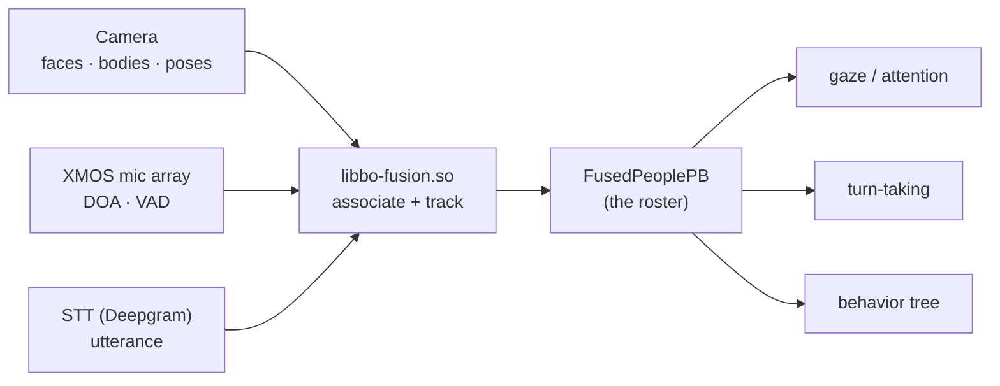

# 🧩👥 Perception fusion — the world-model of people (`v3.6.4-Zephyr` / OTA `v24.10.803`)

The layer that turns raw percepts — [face/body/QR detections](../runtime/perception-pipeline.md) and
[audio DOA/STT](../runtime/perception-pipeline.md#audio-hear-understand-speak) — into one **tracked model of
the people in the room**: identity, 3D position, engagement, speaking state, and what they said
(translation-aware). Recovered from `embodied/perception/fusion/FusedPeople.proto` (`package
embodied.perception.fusion`), implemented by the ~40 MB native `libbo-fusion.so`, in the **v24.10.803**
image. It is the input beneath [gaze](../runtime/gaze-and-attention.md) and [turn-taking](../runtime/turn-taking.md),
arriving on the bus as `FusedPeopleEvent` ([behavior-input-events](../runtime/behavior-input-events.md#-vision-people-from-libbo-vision-fusion)).

Fusion's job is **association + tracking**: tie a face, a body and a voice to the same person, keep a
stable `id` across frames, and lift detections into person-level events. `FusedPeoplePB { repeated
FusedPersonPB people; timestamp }` is the full current roster, republished as it changes.

## Coordinate frames

- **World** (`world_x/y/z`, `world_width/height`) — 3D, robot-relative; what [gaze & attention](../runtime/gaze-and-attention.md) uses for interest points and IK look-at.
- **Screen** (`screen_x/y`, `screen_width/height`) — normalized camera-image space for 2D reasoning (framing, overlays).

Fusion provides both, so the brain never re-projects.

## The roster — `FusedPeoplePB`

### `FusedPersonPB` — one tracked human

| Field | Meaning |
|---|---|
| `id` | stable tracking id across frames |
| `name`, `fullname` | recognized identity ([face recognition / enrollment](../runtime/perception-pipeline.md#face-recognition-enrollment-data-model)); empty if unknown |
| `is_visible` | currently seen by the camera |
| `is_engaged`, `engagement` (float) | attending to Moxie — boolean + continuous score |
| `confidence` | fusion confidence this is a real, correctly-associated person |
| `world_x/y/z`, `world_width/height` | 3D position |
| `vad_speaking`, `started_speaking` | voice-activity flag + when it began |
| `face`, `body`, `speech` | the three sub-models below |

### `FusedFacePB` — the face, in two coordinate frames

World (`world_x/y/z`, `world_width/height`) and screen (`screen_x/y`, `screen_width/height`) boxes, plus:

- **Head pose** — `roll`, `pitch`, `yaw` (where the head points, distinct from the eyes).
- **Per-eye positions** — `world_left_eye_x/y`, `world_right_eye_x/y` and `screen_*` counterparts: the landmarks for eye contact and precise look-at.
- **Affect** — `is_smiling` + `smile_confidence`.
- **Tracking/timing** — `face_tracker_id`, `last_time_in_view`, `last_time_seen` (freshness through brief occlusion).

### `FusedBodyPB` — the body

World + screen boxes (`world_*`, `screen_*`), `confidence`, `last_time_in_view` / `last_time_seen` — tracks
a person who has turned away or whose face is out of frame.

### `FusedSpeechPB` — the voice, fused onto the person

| Field | Meaning |
|---|---|
| `world_x/y/z`, `doa`, `doa_confidence` | where the voice came from — mic-array **direction of arrival**, placed in world space |
| `is_speaking`, `begin_timestamp`, `end_timestamp` | speech activity + span |
| `utterance`, `alternate_utterances[]`, `confidence` | recognized text + STT n-best |
| `stt_event_id` | ties back to the raw STT event |
| `language`, `original_language` | detected vs source language |
| `original_utterance`, `original_alternate_utterances[]` | the **pre-translation** text, kept beside the translated `utterance` |
| `last_time_heard` | recency of the last speech |

A child can speak another language; the brain sees both the original and the translation, tied to the
speaker (mirrored in [`RemoteChatRequest`](remote-chat-protocol.md#the-request-remotechatrequest-delta-over-cloud-protocol)).

## The event stream

Discrete person-level events, each wrapping the `FusedPersonPB`, surfaced as the corresponding `…Event`
([behavior-input-events](../runtime/behavior-input-events.md#-vision-people-from-libbo-vision-fusion)):

| Event | Fires when |
|---|---|
| `FusedPersonAddedPB` / `FusedPersonRemovedPB` | a person enters / leaves the tracked set |
| `FusedPersonMovedPB` | a tracked person changes position |
| `FusedPersonStartedSpeakingPB` / `FusedPersonStoppedSpeakingPB` | speech begins / ends, with a `source` |
| `FusedPersonSayingPB` | interim/partial utterance in progress |
| `FusedPersonSaidPB` | a completed utterance |
| `FusedPersonSayingTimeoutPB` | expected speech didn't complete in time (`start`/`end_timestamp`, `event_id`) |
| `FusedPersonSmiledPB` | the person smiled |
| `FusedPersonEngagedPB` / `FusedPersonDisengagedPB` | engagement crossed the threshold |

**`FusedPersonSpeakingSource`**: `STT` (words recognized) vs `VAD` (voice activity only, no transcript yet)
vs `UNKNOWN` — so the brain can react to voice onset (fast) before the transcript (slower), the basis of
barge-in and responsive [turn-taking](../runtime/turn-taking.md).

## For the three goals

- **Custom firmware:** the perception contract a custom brain consumes (or, if replacing fusion, produces) — world/screen split, per-eye landmarks, DOA, VAD-vs-STT source.
- **Server revival:** a server acting as the brain (including [telehealth](telehealth.md)) gets who is present, where, engaged, speaking, and what they said — structured events, not pixels.
- **Pre-801:** no new lever; fusion runs on-device ([network-trust](network-trust.md)).

---
📖 [Reverse-engineering index](../README.md) · [Perception pipeline](../runtime/perception-pipeline.md) · [Gaze & attention](../runtime/gaze-and-attention.md) · [Turn-taking](../runtime/turn-taking.md) · [Behavior input events](../runtime/behavior-input-events.md) · [Robot IPC protocol](robot-ipc-protocol.md)
