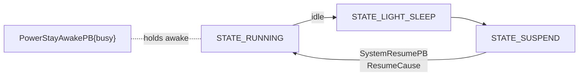

# 🔌 Power & system events — the lifecycle protocol (`v3.6.4-Zephyr` / OTA `v24.10.803`)

The message-level contract for Moxie's power lifecycle and system status, recovered from
`embodied/system/{PowerEvents,SystemEvents,TimeEvents}.proto` (packages `embodied.power` and
`embodied.sys`) in the **v24.10.803** image. Key takeaways: the authoritative 11-state power enum, a
wake-cause taxonomy, targeted XMOS recovery, a Wi-Fi-vs-internet health split, the unpair/telehealth
disengage flow, and local time + wake alarms. [`boot-and-launcher.md`](../firmware/boot-and-launcher.md)
describes what each state *runs*; this page is the wire layer beneath it.

## The power state — `PowerStatePB`

`PowerStatePB { uint32 state; uint32 prev_state; … }` reports every transition with its previous state,
so consumers see the edge. Integer values are on the wire:

| # | `State` | Meaning |
|--:|---|---|
| 0 | `STATE_INIT` | early boot |
| 1 | `STATE_CONFIG` | setup / QR-reading (no brain) |
| 2 | `STATE_STARTUP` | bring-up |
| 3 | `STATE_RUNNING` | normal operation |
| 4 | `STATE_LIGHT_SLEEP` | screen/audio down, quick to wake |
| 5 | `STATE_SUSPEND` | deep suspend |
| 6 | `STATE_DEMO` | retail/factory demo loop |
| 7 | `STATE_RECOVERY` | user-data recovery |
| 8 | `STATE_TELEBRAIN` | telehealth remote-puppet ([telehealth](telehealth.md)) |
| 9 | `STATE_SILENT_REBOOT` | reboot with no animation |
| 10 | `STATE_SILENT_RECOVERY` | recovery with no animation |

## Suspend / resume

- **`SystemSuspendPB`** — going down to suspend.
- **`SystemResumePB { ResumeCause cause }`** — why it woke:

  | # | `ResumeCause` | Meaning |
  |--:|---|---|
  | 0 | `RESUME_FIRST_START` | cold first boot |
  | 1 | `RESUME_RECOVERY` | came up into recovery |
  | 2 | `RESUME_FROM_SUSPEND` | normal wake from suspend |
  | 3 | `RESUME_POWER_ONLY` | power applied, minimal wake |
  | 4 | `RESUME_HIDDEN_REBOOT` | silent reboot (no UI) |
  | 5 | `RESUME_BRAIN_UPDATED` | rebooted because the brain app was updated |

- **`PowerStayAwakePB { bool busy }`** — keep-awake pulse: while `busy` (activity/upload in flight) the robot
  won't drop to light-sleep/suspend. Surfaces as `ReloadQueueStayAwakePulseEvent` → `PowerStayAwakePB`
  ([behavior-input-events](../runtime/behavior-input-events.md)).

## Recovery — `SystemRecoverRequest`

`SystemRecoverRequest { RecoveryTarget target }`, `RecoveryTarget` = `RESTART_NONE` (0) or
**`RESTART_XMOS`** (1): restart the XMOS audio DSP co-processor without a full reboot
([hal-and-drivers](../firmware/hal-and-drivers.md)). `WifiRecoverRequest` similarly kicks the Wi-Fi stack.

## System status events — `embodied.sys`

| Message | Fields | Notes |
|---|---|---|
| **`WifiConnectionState`** | `connected`, `ssid`, `seconds_in_state`, **`wifi_connected`**, **`inet_connected`** | separates *Wi-Fi associated* from *backend reachable* — a stranded robot is `wifi_connected` but not `inet_connected`, so a revival server only has to become the reachable backend |
| **`STTConnectionState`** | `healthy`, `error_nr` | speech-to-text backend health |
| **`OTAStatus`** | `update_status`, `payload_complete`, `update_percent`, `payload_result` | live OTA progress ([ota-and-recovery](../firmware/ota-and-recovery.md)) |
| `ShutdownRequest` / `SystemShutdown` | `recover_type`, `source`, `reason`, `time_remaining` | request + countdown of a shutdown/reboot — robot-side events; none of the recovered protos is a cloud→robot reboot command |
| `DebugConfigureRequest` | `target`, `target_state` | toggle a subsystem into a debug state |

## Unpair / disengage — `UnpairUserRequest`

`UnpairUserRequest { time_remaining; DisengageReason reason }` + `UnpairUserReady` bracket a graceful
detach of the current child: the robot quiesces, then emits `UnpairUserReady`.

| # | `DisengageReason` | When |
|--:|---|---|
| 0 | `UNPAIRING` | the user is being unpaired (reset/handoff) |
| 1 | `TELEHEALTH` | a telehealth session takes over ([telehealth](telehealth.md)) |
| 2 | `USER_DATA_UPDATE` | the child's profile is being updated |

The cloud-visible counterparts are the `CloudStatus.UserState` values `UNPAIR_*`, `OTA_LOCK`,
`USER_DATA_UPDATE` ([device config](device-config-and-telemetry.md#cloudstatususerstate-the-pairing-ota-lifecycle)).

## Time, timezone & alarms — `TimeEvents.proto`

The on-device implementation of the `WakeSchedule`/bedtime windows the cloud pushes in
[`RobotCloudConfig`](device-config-and-telemetry.md#robotcloudconfig-the-master-config-document-cloud-robot):

- **`TimeZoneInfo { olson_id, midnight_in_timezone }`** — current timezone as an IANA/Olson id (e.g.
  `America/New_York`) plus a concrete `midnight_in_timezone` string. Turns the config's `timezone_id` +
  `weekday_bedtime_starts_at`/`…_ends_at` wall-clock strings into local instants.
- **`UserAlarmRequest { timer_id, alarm_expires, alarm_repeats }`** — arm a wake/timer; `alarm_expires` is
  the fire time, `alarm_repeats` the repeat interval. `timer_id` is namespaced by `ReservedTimers`:

  | # | `ReservedTimers` | Meaning |
  |--:|---|---|
  | 0 | `TIMER_ID_USER_WAKE` | the child's wake alarm (the `WakeSchedule` alarms) |
  | 1 | `TIMER_ID_PARENT_APP` | a parent-app timer ("wake Moxie at…") |
  | 100 | `TIMER_ID_CUSTOM` | base id for content/activity-defined timers |

- **`UserAlarmTriggered { timer_id }`** — an armed alarm fired; the behavior layer runs the wake for that id.

Loop: cloud sets `WakeSchedule`/bedtime + `timezone_id` → robot resolves them against `TimeZoneInfo` and
arms `UserAlarmRequest`s → `UserAlarmTriggered` wakes Moxie. Reserved ids keep parent-app and child alarms
from colliding.

## For the three goals

- **Custom firmware:** drive the 11-state machine (with `prev_state` edges) and resume causes; support
  targeted `RESTART_XMOS`; resolve local time via Olson id and arm/fire `UserAlarm`s for the wake/bedtime schedule.
- **Server revival:** observe `WifiConnectionState`, `STTConnectionState`, `OTAStatus`; take part in the
  unpair/telehealth disengage flow; shape time behavior indirectly via `timezone_id` + `WakeSchedule` in
  `RobotCloudConfig`.
- **Pre-801:** no new lever ([network-trust](network-trust.md)).

---
📖 [Reverse-engineering index](../README.md) · [Boot & launcher](../firmware/boot-and-launcher.md) · [OTA & recovery](../firmware/ota-and-recovery.md) · [HAL & drivers](../firmware/hal-and-drivers.md) · [Behavior input events](../runtime/behavior-input-events.md)
