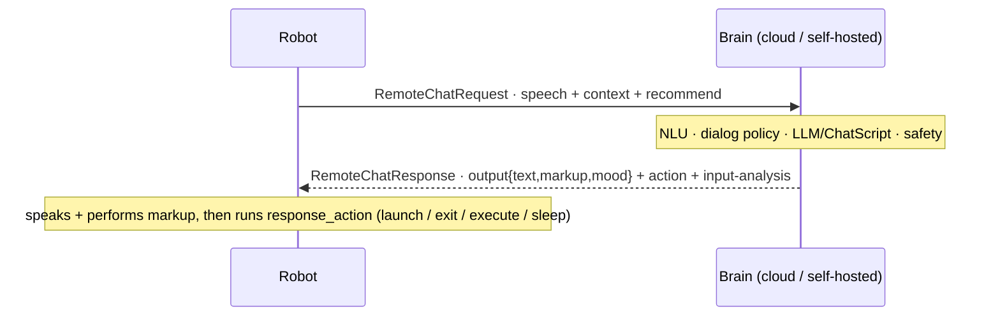

# 💬 RemoteChat — the robot ↔ brain conversation protocol (`v3.6.4-Zephyr` / OTA `v24.10.803`)

The **per-turn RPC** between the robot and its conversational brain (cloud LLM/ChatScript backend) —
*the* contract a self-hosted brain server answers. Recovered from `embodied/robotbrain/RemoteChat.proto`
(`package embodied.robotbrain`) in the **v24.10.803** image. The response carries far more than text:
affect scoring, **action commands** that drive activity navigation, a **safety verdict** on the child's
input, and conversation metrics. Minimum viable answer:
`RemoteChatResponse{result: 0, output:{text, markup}}` (`0` is SUCCESS; `result` is a `uint32`, so
the JSON carries the number).
Transport (MQTT `remote-chat` event / `commands/remote_chat`) is in [cloud-protocol](cloud-protocol.md#the-chat-requestresponse-envelope).

**Streaming:** `RemoteChatRequest.stream_response` asks for chunks; each `RemoteChatResponse` carries
`chunk_num` + `RemoteConsistencyControl{prefix, is_completed, extractor}` so the robot can start speaking
a stable prefix early (`REPLY_PENDING` = more chunks coming).

## The request — `RemoteChatRequest` (delta over cloud-protocol)

Field groups (identity, input, context blocks, controls) are listed in [cloud-protocol](cloud-protocol.md#the-chat-requestresponse-envelope). Additionally:

- **`execute_returns[]`** (`ExecuteReturn{index, function_id, return}`) — results of functions the brain asked the robot to `execute`, returned next turn.
- **`query`** (`RemoteDataQuery{query: contexts|modules, key, subkey, current_version}`) — piggyback a content/context data request.
- **`notify_source`** (`ResponseSource`), **`rollback`**, **`allow_multiple`**, **`no_llm`** — turn controls (retry/rollback, multiple outputs, force non-LLM).
- **`upgrade_fallbacks`** (field 16) — ask the brain to push an updated offline `FallbackInfo` ([offline-and-brain-state](offline-and-brain-state.md#the-server-controls-offline-behavior-upgrade_fallbacks)).
- **Translation** — `original_language`, `original_speech`, `original_speech_alternates[]` beside the translated `speech` (as in [perception fusion](perception-fusion.md#fusedspeechpb-the-voice-fused-onto-the-person)).
- **`extra_lines[]`** (`RemoteChatContext{text, context_type}`) — typed situational context lines beyond the raw `speech`.

Related standalone signal: **`PrimaryUserNameChange`** is published when the child's display name changes, so the brain re-reads it.

## The response — `RemoteChatResponse`

| # | `ResultCode` | Meaning |
|--:|---|---|
| 0 | `SUCCESS` | normal reply in `output` |
| 1 | `ERROR_TIMEOUT` | brain didn't answer in time |
| 2 | `ERROR_STATE` | bad/inconsistent state |
| 3 | `ERROR_SERVICE` | backend error |
| 4 | `ERROR_OFFLINE` | no connectivity → local brain / [fallback tree](offline-and-brain-state.md) |
| 5 | `NOREPLY_INTERRUPT` | suppressed: the child interrupted |
| 6 | `NOREPLY_ACK` | acknowledge only, no spoken line |
| 7 | `REPLY_FORCE_ANCHOR` | reply **and** force a return to the anchor/hub |
| 8 | `REPLY_FORCE_QUIT` | reply **and** force-quit the current module |
| 9 | `REPLY_PENDING` | more chunks coming (streaming) |

Besides `result`: `output`, `input` (analysis of the child's turn), `response_action`(s), `metrics`,
`query_data` (`RemoteDataBlock{contexts, modules}`), `nlp_intent` (`IntentResult`), `relevancy_score`,
`nonsense_score`, `gpt_status`, `processing_time`/`server_timestamp`, `worker_image` (serving backend
build), `fallback`, `total_volleys`/`node_volleys`, `flow_info{module_id, content_id, version}`.

### `RemoteChatOutput` — the spoken turn

| Field | Meaning |
|---|---|
| `text`, `text_extended` | the spoken line (+ an extended variant) |
| `markup` | inline behavior markup — face/motion/audio ([behavior-markup](../runtime/behavior-markup.md)) |
| `mood`, `mood_intensity` | emotional performance to render |
| `dialog_act`, `dialog_act_score` | the act this line performs |
| `emotion`, `emotion_score` / `sentiment`, `sentiment_score` | conveyed emotion / sentiment |
| `signals` (`RemoteSignals`), `single_signal`, `volley_signal` | conversation signals |
| `perplexity`, `source` | LM perplexity + which source produced the line |
| `auto_tags[]` (`TagScore{name, uuid, score}`) | auto-applied content tags |

### `RemoteChatAction` — the brain drives navigation

| `ActionID` | Effect |
|---|---|
| `launch` / `launch_if_confirmed` | start a module (`module_id`/`content_id`), optionally after a yes/no |
| `exit_module` / `abort_module` | leave / hard-abort the current activity |
| `request_next` | ask for the next recommended activity |
| `execute` | run robot-side `function_id(function_args…)`; result returns via `execute_returns` |
| `sleep` | put Moxie to sleep |
| `tangent` | branch to a tangent and return |

Also carries **`EventSubscription{clear, active[], passive[]}`** (the brain subscribing to robot input
events it wants pushed), `output_type`, and `is_remote_module`; `response_actions[]` allows a list. This
is what makes the brain the *director* rather than a chat endpoint.

### `RemoteChatInput` — the brain's read of the child

`emotion`/`dialog_act`/`sentiment` (+ scores), `signals`, `auto_tags[]`, `perplexity`, and
**`InputSafety{is_unsafe, blocked_by[], intents[], phrase_id}`** — the content-moderation verdict
(unsafe?, which classifiers blocked, detected intents, matched safety-phrase id). The moderation hook.

## Taxonomies

- **`RemoteDialog.DialogAct`** (22): `abandon`, `apology`, `apology_response`, `appreciation`, `backchannelling`, `closing`, `complaint`, `opinion`, `statement_non_opinion`, `factual_question`, `opinion_question`, `hold`, `opening`, `yes_no_question`, `pos_answer`, `neg_answer`, `other_answers`, `command`, `comment`, `thanking`, `other`, `timeout`.
- **`RemoteDialog.EmotionState`** (7): `sadness`, `joy`, `love`, `anger`, `fear`, `surprise`, `neutral`.
- **`RemoteSignals.Signal`** (9): `no_signal`, `closing`, `apology`, `interrupted_speech`, `complaint_clarification`, `confirmation_agreement`, `interest`, `non_interest`, `rejection_disagreement`.
- **`RecommendationContext.Urgency`** (3): `casual`, `normal`, `immediate`; with `Recommendation{module_id, content_id, entry_line, seen, skip_hub}` exits + `restricted_modules` + `holidays` — what the request says the brain *could* recommend next.

## `RemoteChatMetrics` — conversation-quality analytics

Scored for `user`, `bot`, and `both`: **HighLevel** — `emotionality`/`sentimentality`
(positive/negative/total), `engagement` (opinion/question/total), `informativity`, `non_interest`,
`cognitive_load`, `nonsense` (rates); **Numerics** — `num_utters`, `avg_num_words`, `turn_balance`;
**Classifications** — `frustrated_rate`. May be left empty; they feed [the recommender + parent
reports](../runtime/content-and-conversation.md#the-recommender), overlapping the per-turn
`RemoteResponseData` scores in [cloud-protocol](cloud-protocol.md#conversation-learning-telemetry-robot-cloud).

## For the three goals

- **Server revival:** minimum `{result: 0 (SUCCESS), output:{text, markup}}`; fuller servers set `mood`/`dialog_act`, drive activities with `response_action`, moderate via `input.safety`, and stream with `chunk_num` + `consistency_control`. Implemented in [`mqtt/moxie_sdk/`](../../../mqtt/moxie_sdk/) (`wire.py`, `vocab.py`, `safety.py`).
- **Custom firmware:** send `RemoteChatRequest`, speak `output`, run `response_action`, feed `execute_returns` back; the `ResultCode` set (`ERROR_OFFLINE` → local fallback, `NOREPLY_*`, `REPLY_FORCE_*`) is the dialog manager's contract.
- **Pre-801:** no new lever ([network-trust](network-trust.md)).

---
📖 [Reverse-engineering index](../README.md) · [Cloud protocol](cloud-protocol.md) · [Content & conversation](../runtime/content-and-conversation.md) · [Behavior markup](../runtime/behavior-markup.md) · [Perception fusion](perception-fusion.md) · [Device config & telemetry](device-config-and-telemetry.md)
