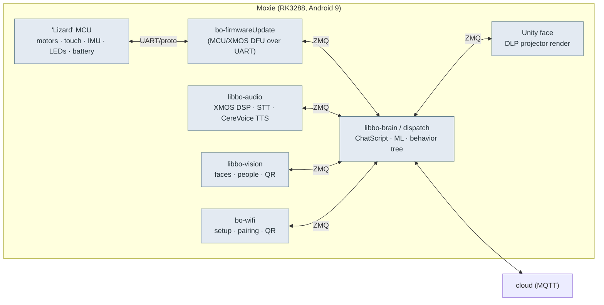

# 🧠 On-robot IPC — the ZeroMQ + protobuf message bus

Analyzed build: **v3.6.4-Zephyr / OTA v24.10.803** (RK3288, Android 9) — see [`firmware-803-reference.md`](../firmware/firmware-803-reference.md).

How Moxie's on-device modules talk to *each other* (not the cloud): a **ZeroMQ pub/sub bus carrying
Protocol Buffers**, routed by each message's protobuf descriptor full-name. Speak this bus and you can
drive Moxie's face, motors, audio and behavior from your own code. The full schema — **120 `.proto`
files, 382 messages, 84 enums** — is under [`recovered-proto/`](recovered-proto/), browsable in the
[proto catalog](proto-catalog.md).

**Provenance.** `bo-android` (brain) and `bo-wifi` (setup) are Unity/Mono apps whose logic ships as
plain-IL assemblies (`Assembly-CSharp.dll`, `WifiApp.dll`, and the generated `Embodied.Protos.dll` /
`WifiApp.Protos.dll`). Every generated protobuf class embeds its serialized `FileDescriptorProto`;
decoding those bytes reconstructs the original `.proto` IDL verbatim (field numbers, enums, packages) —
facts extracted from shipped binaries, not Embodied source.

## The bus



- **Transport:** ZeroMQ over `tcp://` loopback. The dispatch daemon (`embodied::dispatch`
  `ZMQEventBroadcaster`) runs an **XSUB/XPUB proxy**: modules **publish to `tcp://127.0.0.1:5678`** (XSUB)
  and **subscribe from `tcp://127.0.0.1:6789`** (XPUB). Per-module direct pairs `tcp://0.0.0.0:5000`–`5005`
  also exist for some components.
- **Framing:** exactly **two ZMQ frames** — frame 0 the descriptor **`FullName`** as UTF-8 (e.g.
  `embodied.lizzerface.SetLedrEventPB`), frame 1 the serialized protobuf (`SendMore(full_name)` + `Send(bytes)`).
  Over MQTT `commands/zmq` the two are joined as `name:bytes` ([cloud-protocol](cloud-protocol.md#exact-topic-map-google-iot-core-convention-kept-post-migration)).
- **Subscription = the name string.** ZMQ SUB prefix-matches, so subscribing to `"embodied.unity.OTAStatus"`
  (or `""` for everything) selects by type — how `bo-wifi` subscribes to `CloudStatus`, `OTAStatus`, `BatteryEventPB`.
- **Managed side:** each type is wrapped in `Deserializer<T>(Deserialize, Descriptor.FullName)` and
  registered with the input-event system. **Native side:** `libbo-dispatch.so` is the C++ equivalent; the
  Unity/Mono `ZMQ` class is the managed peer. Same `embodied.*` protobufs.
- **Client tool:** [`tools/robot-toolkit/moxie_toolkit/bus.py`](../../../tools/robot-toolkit/moxie_toolkit/bus.py)
  (`MoxieBus.send/subscribe/recv`). Reach a robot with `adb forward tcp:5678 tcp:5678 && adb forward tcp:6789 tcp:6789`,
  then `python -m moxie_toolkit.bus monitor` or `… led F_LISTEN_GREEN`.

## Module map (recovered proto packages)

| Package | Files | What it carries |
|---|--:|---|
| `embodied.lizzerface` | 3 | **The MCU protocol** — motor set-position, PID config, power rails, LED patterns, every hardware event (touch, switch, IMU, battery, servo stall, firmware errors). [hardware-map](../hardware/hardware-map.md) |
| `embodied.perception.audio` | 11 | STT, wake-word, DOA, SNR, speaker ID, **XmosConfig** (DSP), speech, Google account audio. |
| `embodied.perception.vision` | 16 | Faces (detect/recognize/track/enroll), people, poses, **QR**, book/draw IDs, image-to-text, occlusion, rapid-motion. |
| `embodied.perception.fusion` | 1 | `FusedPeople` — [perception fusion](perception-fusion.md). |
| `embodied.robotbrain` (+ `.serialized`) | 40 | **The brain** — ChatScript, content modules & schedules, intents, contexts, idle-state, mentor behavior, STAR goals, [remote chat](remote-chat-protocol.md), [runtime control](runtime-control.md), [persisted state](offline-and-brain-state.md). |
| `embodied.unity` | 25 | Brain ↔ Unity face — [MAINAPP interface](unity-mainapp-interface.md) (CloudTTS, playback, markup tool, camera, console commands). |
| `embodied.wifiapp` | 5 | Setup app ↔ brain: QR commands, Wi-Fi update, bricked/silent-boot/status. [qr-commands](qr-commands.md) |
| `embodied.logging` | 11 | Cloud config, backup, file sync, system metrics, `IOTEndpoint`, SEL updates. [device-config-and-telemetry](device-config-and-telemetry.md) |
| `embodied.system` | 3 | Power / system / time events. [power-and-system-events](power-and-system-events.md) |
| `embodied.launcher`, `embodied.playspace`, `embodied.telehealth`, `embodied.testing` | 1 each | Component state, play-space, [telehealth](telehealth.md) session, fusion/vision test harnesses. |

## The behavior-command markup (how the cloud drives the body)

Speech carries inline behavior commands as SSML-like `<mark>` tags; full grammar in
[behavior-markup](../runtime/behavior-markup.md).

```
<mark name="cmd:behaviour-tree,data:{transition:0.5,duration:1.0,repeat:1,blocking:false,
  action:0,eventName:Gesture_Celebrate,category:BehaviourTree,behaviour:Bht_Demo_Wake_Up,Track:wake}"/>
<mark name="cmd:playaudio,data:{SoundToPlay:sfx_...,channel:2,Volume:1.0,...}"/>
<mark name="cmd:playback-mood,data:{mood:0,intensity:0}"/>
<mark name="cmd:idlestate,data:{idleState:7}"/>
<mark name="cmd:stopaudio,data:{scope:1,channel:2,FadeOutTime:1.0,ClearQueue:true}"/>
<usel variant="0" genre="excited"> ...spoken text... </usel>
<break time="1.5s"/>
```

Verbs seen in shipped assets: `behaviour-tree`, `playaudio`, `stopaudio`, `playback-mood`, `idlestate`.
Behaviours reference named trees (`Bht_*`) and gesture events (`Gesture_*`). It rides the normal
TTS/markup path in `embodied.unity` (`CloudTTS`, `MarkUpToolMessages`, `SpeechPlayback`).

## Console commands

`embodied.Robot.ConsoleCommandRequest{ command }` (file `embodied/unity/ConsoleCommandRequest.proto`)
feeds a developer console inside `bo-android` — inject it on the bus or via MQTT `/commands/zmq` to poke
the brain without a [RemoteChat](remote-chat-protocol.md) turn. Handlers are registered by
`[EBConsoleCommand(name, description)]` — a **closed set of 31** in the `v24.10.803` brain (`Assembly-CSharp`):

| Group | Commands |
|---|---|
| **Build info** | `build branch` · `build date` · `build hash` |
| **Introspection** | `dump` (print all commands) · `dump methods` · `dump vars` |
| **FPS diagnostics** | `fps display` (toggle GUI) · `fps output` · `fps outputinterval` · `fps watchdogprecision` · `fps watchdogthreshold` |
| **Memory diagnostics** | `mem display` (toggle GUI) · `mem once` · `mem output` · `mem outputinterval` |
| **Speech / TTS test** | `say <text>` · `phoneme` · `emphasis` · `genre` · `prosody pitch` · `prosody rate` · `prosody volume` · `vocal gesture` ([vocal gestures](../runtime/behavior-markup.md#vocal-gestures-spurts-vocalgesturesavailablegestures-hardcoded-in-bo-android)) · `playback mood` · `play composite` · `stop playback` |
| **STT** | `stt` (submit a speech-to-text request) · `toggle stt` |
| **Behavior / anim** | `behavior` · `toggle animator` |
| **Logging** | `upload log` |

A direct test lever: `ConsoleCommandRequest{command:"say Hello"}` or `{command:"vocal gesture laugh"}`
exercises TTS / vocal gestures on-device with no cloud turn.

## Using this for custom software

- **Personality swap:** keep stock `vendor`, `ledctrld`, DLP + camera plumbing and the Lizard MCU firmware;
  replace `bo-android` with an app that subscribes to `embodied.perception.*` + `embodied.lizzerface` events and
  publishes `embodied.lizzerface` motor/LED and `embodied.unity` speech/face commands.
- **Bridge to a modern LLM:** terminate the cloud MQTT side yourself ([`mqtt/`](../../../mqtt/) + [`server/`](../../../server/)) and translate LLM output into `<mark name="cmd:...">` markup + the `CloudTTS` path.
- **Field numbers are stable:** regenerate bindings with `protoc` in any language and stay wire-compatible.

---
📖 [Reverse-engineering index](../README.md) · [Recovered protos](recovered-proto/) · [Docs index](../../README.md) · [Back to top](../../../README.md)
