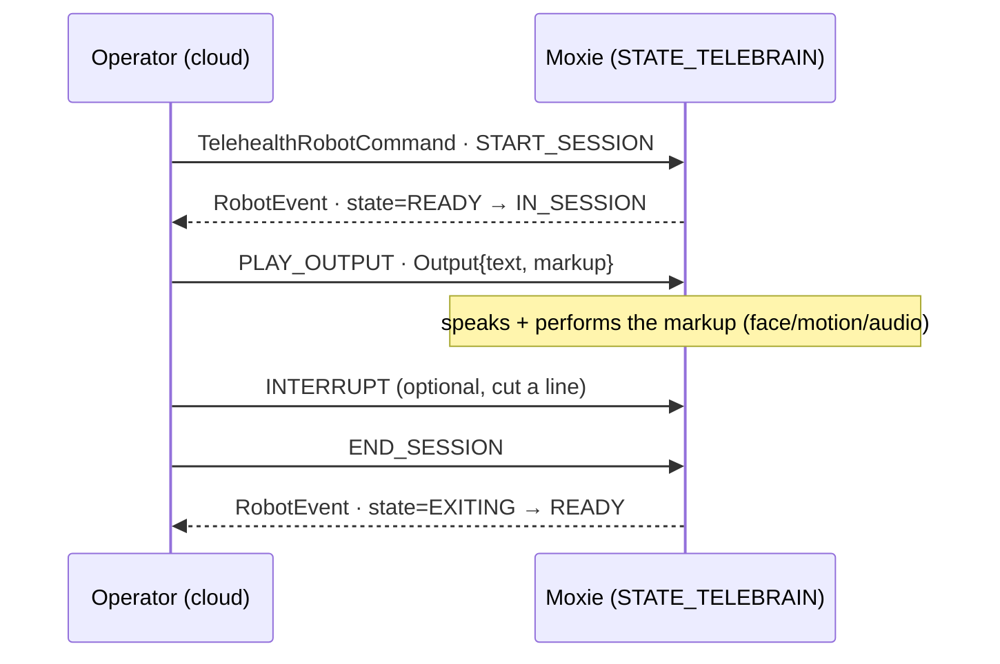

# 🩺 Telehealth / remote-puppet — the "TeleBrain" protocol (`v3.6.4-Zephyr` / OTA `v24.10.803`)

Telehealth is Moxie's **remote-puppet** mode: a remote human (clinician / therapist) replaces the
on-device brain and drives what Moxie says and does in real time. Recovered from
`embodied.telehealth.TeleHealth.proto` + the `STATE_TELEBRAIN` launcher state in the **v24.10.803** image.

- In `STATE_TELEBRAIN` the launcher runs **perception + MAINAPP but NOT the BRAIN**, so camera/mic stay live while the operator supplies every line.
- The operator sends **`Output { text, markup }`**; markup is the full [behavior language](../runtime/behavior-markup.md) (face, motion, audio).
- Transport is MQTT: `commands/telehealth` (cloud → robot), `telehealth` activity-log subtopic (robot → cloud). Session = `START_SESSION → PLAY_OUTPUT… → END_SESSION`.

## The protocol — `embodied.telehealth.TeleHealth.proto`

```proto
package embodied.telehealth;

enum Action     { UNKNOWN_ACTION=0; START_SESSION=1; PLAY_OUTPUT=2; END_SESSION=3; UPDATE_STATE=4; INTERRUPT=5; }
enum RobotState { UNKNOWN_STATE=0;  READY=1; IN_SESSION=2; EXITING=3; }

message Output {                       // one thing for Moxie to say / perform
  optional string line_id      = 1;    // id of a pre-authored line (or ad-hoc)
  repeated string line_params  = 2;    // fill-ins for a templated line
  optional string text         = 3;    // spoken text
  optional string markup       = 4;    // behavior markup — face/motion/audio
}
message TelehealthStatus {
  optional uint64 timestamp = 1;  optional bool telehealth_active = 2;  optional bool session_active = 3;
  optional string software_version = 100;  optional string module_name = 101;
}
message TelehealthMessage {            // the core envelope
  optional uint64      timestamp   = 1;
  optional Action      action      = 2;   // what the operator wants
  optional Output      output      = 3;   // the line (for PLAY_OUTPUT)
  optional RobotState  state       = 4;   // robot-reported state
  optional string      session_id  = 5;
  optional string software_version = 100;  optional string module_name = 101;
}
message TelehealthRobotCommand { optional string command = 1; optional TelehealthMessage message = 2; }  // cloud → robot
message TelehealthRobotEvent   { optional string subtopic = 1; optional TelehealthMessage message = 2; } // robot → cloud
```

- **`Action`** — operator verbs. `START_SESSION`/`END_SESSION` bracket the session; `PLAY_OUTPUT` delivers an
  `Output`; `INTERRUPT` cuts Moxie off mid-line (operator-side barge-in, cf. [turn-taking](../runtime/turn-taking.md));
  `UPDATE_STATE` syncs status.
- **`RobotState`** — robot reports: `READY` (idle, armed), `IN_SESSION` (being puppeted), `EXITING` (tearing down).

## Launcher state and session flow

| State | Components up | Meaning |
|---|---|---|
| **`STATE_TELEBRAIN`** (8) | perception + MAINAPP, **no BRAIN** | telehealth remote-brain session ([boot-and-launcher](../firmware/boot-and-launcher.md), [power states](power-and-system-events.md#the-power-state-powerstatepb)) |

Entered from `STATE_RUNNING` when a session starts; the active child is disengaged with
`DisengageReason.TELEHEALTH` ([unpair / disengage](power-and-system-events.md#unpair-disengage-unpairuserrequest)).
Dropping the local brain means no on-device dialog engine competes with the operator's lines.



## Transport (MQTT)

Per the [cloud topic map](cloud-protocol.md#exact-topic-map-google-iot-core-convention-kept-post-migration):

- **Cloud → robot:** `/devices/{device_id}/commands/telehealth` carries `TelehealthRobotCommand` (alongside `remote_chat`, `query_result`).
- **Robot → cloud:** the `client-service-activity-log` event with subtopic **`telehealth`** carries `TelehealthRobotEvent` (state, session lifecycle).

A telehealth backend is a peer of the chat backend — same device topics, a different command verb — and
`Output.markup` reuses the conversation path's markup grammar. The cloud also flags the mode in
`RobotCloudConfig.moxie_mode` (`DEFAULT_MODE` / `TELEHEALTH`, [device config](device-config-and-telemetry.md#robotcloudconfig-the-master-config-document-cloud-robot)).

## For the three goals

- **Custom firmware:** a brain-off operating mode; the launcher gate is the pattern for "let something external drive Moxie."
- **Server revival:** a ready-made remote-control API — `START_SESSION`, then `PLAY_OUTPUT{text, markup}` — with full authority over every line.
  Implemented in [`moxie_toolkit/cloud.py`](../../../tools/robot-toolkit/moxie_toolkit/cloud.py) (`telehealth_session`, `telehealth_play_output`,
  `telehealth_command`, `telehealth_topic`, `parse_telehealth_event`; tested in `tools/robot-toolkit/test_telehealth.py`) and
  [`mqtt/moxie_sdk/telehealth.py`](../../../mqtt/moxie_sdk/telehealth.py).
- **Pre-801:** no new lever; rides the same MQTT/endpoint path as chat ([network-trust](network-trust.md)).

---
📖 [Reverse-engineering index](../README.md) · [Cloud protocol](cloud-protocol.md) · [Boot & launcher](../firmware/boot-and-launcher.md) · [Behavior markup](../runtime/behavior-markup.md) · [Turn-taking](../runtime/turn-taking.md)
