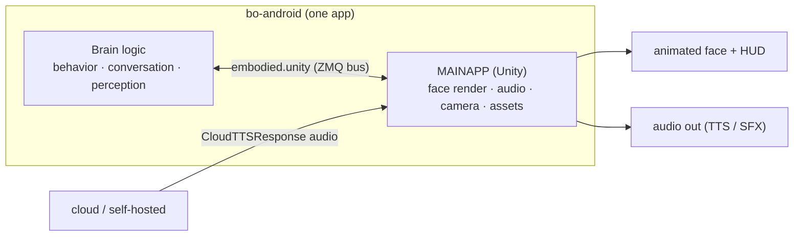

# 🎮 MAINAPP interface — the Unity front-end protocol (`embodied.unity`) (`v3.6.4-Zephyr` / OTA `v24.10.803`)

> Recovered from the `embodied/unity/*.proto` files in the **v24.10.803** image. `bo-android` (the brain)
> is really **two cooperating halves**: the **brain logic** (behavior / conversation / perception, the
> `embodied.robotbrain` + friends) and the **MAINAPP** — the **Unity engine** that renders the animated
> face, plays audio, drives a virtual camera over the 3D scene, and loads face/HUD assets. This is the
> "Unity code." `embodied.unity` is the **wire protocol between the two**, carried on the on-device
> [ZMQ bus](robot-ipc-protocol.md). This doc is the complete map of that namespace; where a message is
> covered in depth elsewhere it's cross-linked, and the rest is documented here.



## App lifecycle & version

| Message | Payload | Meaning |
|---|---|---|
| `MainAppStatus` | `code` (uint32) | the Unity app's status code (bring-up / ready / busy) |
| `MainAppShutdown` | — | the MAINAPP is going down |
| `SilentBootComplete` | — | UI-less boot finished (the `STATE_SILENT_REBOOT` path, [power-and-system-events](power-and-system-events.md)) |
| `SoftwareVersion` | `UnityVersion` (uint32), `CommitHash` (string) | the Unity build number + its git commit — how the brain learns which face build is running |

## The virtual camera — Moxie's self-view

The Unity scene has a **camera looking at Moxie's own 3D face**; content can move it for cinematics
(zoom, angle, shake). The brain both sets and reads it:

```proto
message RobotCamera {                                   // full camera transform + projection
  float center_x/y/z;   // eye position
  float target_x/y/z;   // look-at point
  float up_x/y/z;       // up vector
  float fov; float aspect; float near; float far;       // projection
}
message RobotPosition   { float camera_center_x/y/z; camera_target_x/y/z; camera_up_x/y/z; }  // pose as camera
message RobotCameraShake { bool shaking; }              // camera-shake effect on/off
```

`RobotCamera` is a standard Unity camera (position / look-at / up + FOV/aspect/clip planes);
`RobotPosition` expresses the robot's framing as that camera pose; `RobotCameraShake` toggles the shake
effect (used for impact/reaction beats). A custom face renderer must accept these to be driven by stock
content.

## Audio out — TTS, SFX, playback control

The MAINAPP owns audio playback. The **CloudTTS** exchange (also in
[perception-pipeline](../runtime/perception-pipeline.md#output-side-tts-embodiedunity)) is the core:

```proto
enum RequestSourceType { ROBOT_TTS_REQUEST=0; REMOTECHAT_TTS_REQUEST=1; }   // who asked for this line
message CloudTTSRequest  { string markup; string event_id; int32 chunk_num; string user_id; }
message AudioBuffer      { bytes buffer; int32 channels; int32 sample_rate; }   // raw PCM
message TTSMark          { uint32 time; uint32 start; uint32 end; string type; string value; }  // timed marks
message CloudTTSResponse { RequestSourceType request_source; AudioBuffer audio; repeated TTSMark marks;
                           string event_id; int32 chunk_num; uint64 synthesis_time; }
message CloudTTSSupplement { string text; string markup; string tts_engine;
                             uint64 translation_time; uint64 automarkup_time; uint64 synthesis_time; }
```

- The brain sends **`CloudTTSRequest`** (behavior markup + a `user_id`); the server (or on-device engine)
  returns **`CloudTTSResponse`** with raw **`AudioBuffer`** PCM plus **`TTSMark`s** — the timed marks
  (visemes / behavior cues) that sync the face and gestures to the audio. `CloudTTSSupplement` carries the
  timing breakdown (translation → auto-markup → synthesis) and the `tts_engine` name.
- **`request_source`** distinguishes a line the local brain asked for from one a [remote-chat](remote-chat-protocol.md)
  turn produced.

**Playback control & notifications** (`AudioNotif` — the MAINAPP driving/reporting its own player):

| Message | Payload | Meaning |
|---|---|---|
| `AudioNotifPauseEventPB` | `duration` (float) | pause playback (for `duration`) |
| `AudioNotifResumeEventPB` | — | resume |
| `AudioNotifSpeedChangeEventPB` | `speed` (float) | change playback rate |
| `AudioNotifVolumeChangeEventPB` | `volume` (float) | change playback volume (clip-level; cf. system-level [`SystemVolumeModify`](runtime-control.md#audio-volume-systemvolume)) |
| `AudioIsFinishedEventPB` | — | the current clip finished ([behavior-input-events](../runtime/behavior-input-events.md)) |
| `AudioNotifChatEventPB` | `chatEvent` (string) | a named chat/audio milestone |
| `SFXPlaybackState` | `isPlaying`, `input_id`, `label` | a sound-effect's play state |
| `SpeechPlaybackState` | — | speech-playback state ([perception-pipeline](../runtime/perception-pipeline.md)) |

**`PredictedMotorNoise{noiseLevel}`** is a neat cross-cut: the brain tells the audio pipeline **how loud
the motors are about to be**, so acoustic echo cancellation can subtract the robot's own motor sound from
the mic — the audio counterpart of the [`MpuIsNoisy` gate](../hardware/hardware-map.md#semantic-handling-events-embodiedunity).

## Engagement & physical orientation

The MAINAPP reports how the robot is physically framing the interaction:

| Message | Payload | Meaning |
|---|---|---|
| `EngagedEvent` | `engaged` (bool) | engagement crossed on/off (cf. the [fused engagement](perception-fusion.md) + [turn-taking](../runtime/turn-taking.md)) |
| `RobotEngageTurn` | `turning` (bool) | Moxie is turning to engage a target ([perception-pipeline](../runtime/perception-pipeline.md)) |
| `RobotTurnToOutOfViewChatTarget` | `is_turning` (bool) | turning to face someone **out of the camera view** |
| `RobotRequestChatPause` | `pause` (bool) | ask the dialog manager to pause (e.g. during a big turn) |

## Asset bundles — runtime face/HUD assets

The MAINAPP manages Unity **AssetBundles** (the face meshes, HUD, effects — inventory in
[unity-assets](../firmware/unity-assets.md); delivery in [content-delivery](../runtime/content-delivery.md)) at runtime:

| Message | Payload | Meaning |
|---|---|---|
| `AssetBundleScan` | — | scan available bundles |
| `AssetBundleCache` | `bundles[]` | pre-cache these bundles into memory |
| `AssetBundleReload` | `bundles[]` | reload (after an update) |
| `AssetBundleRelease` | `bundles[]` | free them |

So new/updated content ([content-delivery](../runtime/content-delivery.md)) is applied to the live face by a
scan → cache/reload → release cycle without restarting the app.

## Pairing (MAINAPP side) — `UserPairingRequest`

The Unity setup/pairing UI drives pairing through an action enum richer than the cloud-side
[`CloudStatus.UserState`](device-config-and-telemetry.md#cloudstatususerstate-the-pairing-ota-lifecycle):

```proto
message UserPairingRequest {
  enum PairingRequest { PAIR_UNPAIR_LEGACY=0; PAIR=1; UNPAIR_USER=2; UNPAIR_FULL=3;
                        UNPAIR_RFS_ONLY=4; RECOVER_USER=5; RECOVER_USER_LOCAL=6; USER_DATA_UPDATE=7; }
  string user_token; string public_key; bytes secret_key; uint32 request; bool is_staging;
}
message UserDataStatus { uint32 code; }
```

- **`PairingRequest`** is the full action set: `PAIR`, three flavours of unpair (`UNPAIR_USER`,
  `UNPAIR_FULL`, `UNPAIR_RFS_ONLY` = restore-factory-settings only), recovery (`RECOVER_USER`,
  `RECOVER_USER_LOCAL`), and `USER_DATA_UPDATE`. `secret_key` carries the pairing seed
  ([crypto-and-keys](../phone/crypto-and-keys.md)); `UserDataStatus{code}` reports the flow's result.

## Perf & network telemetry — `Stats`, `NetworkState`

| Message | Fields | Meaning |
|---|---|---|
| `FPSStatsPB` | `curr_fps`, `lowest_fps`, `avg_fps`, `highest_fps`, `curr_deltatime` | Unity **frame rate** health |
| `TTSStatsPB` | `doa`, `synth_*_duration` (in-queue → callback → output → playback), `audioclips_info[]` | end-to-end **TTS latency breakdown** per utterance |
| `TTSAudioClipInfoPB` | `clip_name`, `clip_length`, `create_duration`, `create_timestamp` | per audio-clip timing |
| `NetworkState` | `Connected`, `Ping` | the MAINAPP's view of connectivity ([behavior-input-events](../runtime/behavior-input-events.md)) |

## Dev / authoring tools

Present in the shipped build but for development:

- **`ConsoleCommandRequest{command}`** — inject a debug console command into the Unity app
  ([unity-assets](../firmware/unity-assets.md)).
- **`MarkUpToolMessages`** — the in-house **behavior-markup authoring tool** (a designer edits a line's
  `<mark>` markup live and previews it on the robot): `MarkUpEditRequest{id, input}` →
  `MarkUpEditResponse{input, output, revision, ended}`, `MarkUpLineRequest{forward}` /
  `MarkUpLineResponse{valid}` to step lines, `MarkUpEditorClosedEvent`. This is the tool behind the
  [behavior-markup](../runtime/behavior-markup.md) grammar.
- **`Gaze`** — the gaze target the MAINAPP renders, driven by the attention system
  ([gaze-and-attention](../runtime/gaze-and-attention.md)).
- **`MpuPickup`** — IMU handling events surfaced through the Unity layer
  ([hardware-map](../hardware/hardware-map.md#semantic-handling-events-embodiedunity)).

## What this means for the three goals

**① Custom firmware.** This is the contract between the brain and the face renderer. To **replace the
Unity face** you implement this namespace (lifecycle, camera, audio playback + TTS marks, asset bundles);
to **keep the stock face and replace the brain**, you drive it — send `CloudTTSRequest`/camera/engagement
messages and consume `MainAppStatus`, FPS/TTS stats, and playback notifications. Either half of bo-android
can be swapped across this seam.

**② Server revival.** Mostly on-device — the MAINAPP is local. The server's one real touch-point is
**CloudTTS**: it returns the `CloudTTSResponse` `AudioBuffer` + `TTSMark`s that the MAINAPP plays and
lip-syncs to ([perception-pipeline](../runtime/perception-pipeline.md)). Pairing (`UserPairingRequest`) rides the
normal cloud pairing flow.

**③ Pre-801 revival.** No new lever; this seam is internal to bo-android, above the network boundary
([network-trust](network-trust.md)).

---
📖 [Reverse-engineering index](../README.md) · [Robot IPC protocol](robot-ipc-protocol.md) · [Perception pipeline](../runtime/perception-pipeline.md) · [Unity assets](../firmware/unity-assets.md) · [Content delivery](../runtime/content-delivery.md) · [Behavior markup](../runtime/behavior-markup.md) · [Gaze & attention](../runtime/gaze-and-attention.md)
