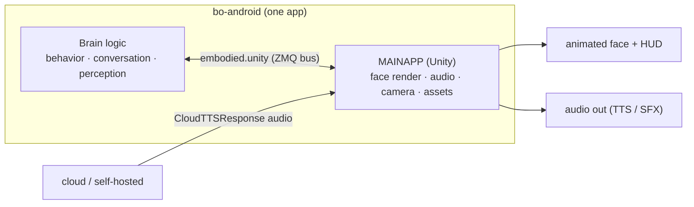

# 🎮 MAINAPP interface — the Unity front-end protocol (`embodied.unity`) (`v3.6.4-Zephyr` / OTA `v24.10.803`)

`bo-android` is two cooperating halves: the **brain logic** (behavior, conversation, perception —
`embodied.robotbrain` and friends) and the **MAINAPP**, the Unity engine that renders the animated face,
plays audio, drives a virtual camera over the 3D scene, and loads face/HUD assets. `embodied.unity`
(recovered from `embodied/unity/*.proto` in the **v24.10.803** image) is the wire protocol between them,
carried on the on-device [ZMQ bus](robot-ipc-protocol.md). Either half can be replaced across this seam;
the server's one direct touch-point is **CloudTTS** audio + timed marks.


```mermaid
flowchart LR
  subgraph bo["bo-android (one app)"]
    brain["Brain logic<br/>behavior · conversation · perception"]
    main["MAINAPP (Unity)<br/>face render · audio · camera · assets"]
  end
  brain <-->|"embodied.unity (ZMQ bus)"| main
  main --> face["animated face + HUD"]
  main --> spk["audio out (TTS / SFX)"]
  server["cloud / self-hosted"] -->|CloudTTSResponse audio| main
```

## App lifecycle & version

| Message | Payload | Meaning |
|---|---|---|
| `MainAppStatus` | `code` (uint32) | Unity app status code (bring-up / ready / busy) |
| `MainAppShutdown` | — | the MAINAPP is going down |
| `SilentBootComplete` | — | UI-less boot finished (`STATE_SILENT_REBOOT`, [power-and-system-events](power-and-system-events.md)) |
| `SoftwareVersion` | `UnityVersion` (uint32), `CommitHash` (string) | Unity build number + git commit of the running face build |

## The virtual camera — Moxie's self-view

The Unity scene has a camera looking at Moxie's own 3D face; content moves it for cinematics (zoom,
angle, shake). A custom face renderer must accept these to be driven by stock content.

```proto
message RobotCamera {                                   // standard Unity camera
  float center_x/y/z;   // eye position
  float target_x/y/z;   // look-at point
  float up_x/y/z;       // up vector
  float fov; float aspect; float near; float far;       // projection
}
message RobotPosition    { float camera_center_x/y/z; camera_target_x/y/z; camera_up_x/y/z; }  // robot framing as a camera pose
message RobotCameraShake { bool shaking; }              // shake effect on/off (impact/reaction beats)
```

## Audio out — TTS, SFX, playback control

The MAINAPP owns playback. The **CloudTTS** exchange (also in [perception-pipeline](../runtime/perception-pipeline.md#output-side-tts-embodiedunity)):

```proto
enum RequestSourceType { ROBOT_TTS_REQUEST=0; REMOTECHAT_TTS_REQUEST=1; }   // local brain vs remote-chat turn
message CloudTTSRequest  { string markup; string event_id; int32 chunk_num; string user_id; }
message AudioBuffer      { bytes buffer; int32 channels; int32 sample_rate; }   // raw PCM
message TTSMark          { uint32 time; uint32 start; uint32 end; string type; string value; }  // timed marks
message CloudTTSResponse { RequestSourceType request_source; AudioBuffer audio; repeated TTSMark marks;
                           string event_id; int32 chunk_num; uint64 synthesis_time; }
message CloudTTSSupplement { string text; string markup; string tts_engine;
                             uint64 translation_time; uint64 automarkup_time; uint64 synthesis_time; }
```

The brain sends `CloudTTSRequest` (behavior markup + `user_id`); the server or on-device engine returns
`CloudTTSResponse` with PCM plus **`TTSMark`s** — timed visemes / behavior cues that sync face and
gestures to the audio. `CloudTTSSupplement` carries the timing breakdown (translation → auto-markup →
synthesis) and the `tts_engine` name. `request_source` tells a local-brain line from a
[remote-chat](remote-chat-protocol.md) one.

**Playback control & notifications** (`AudioNotif`):

| Message | Payload | Meaning |
|---|---|---|
| `AudioNotifPauseEventPB` | `duration` (float) | pause playback (for `duration`) |
| `AudioNotifResumeEventPB` | — | resume |
| `AudioNotifSpeedChangeEventPB` | `speed` (float) | change playback rate |
| `AudioNotifVolumeChangeEventPB` | `volume` (float) | clip-level volume (system-level is [`SystemVolumeModify`](runtime-control.md#audio-volume-systemvolume)) |
| `AudioIsFinishedEventPB` | — | current clip finished ([behavior-input-events](../runtime/behavior-input-events.md)) |
| `AudioNotifChatEventPB` | `chatEvent` (string) | a named chat/audio milestone |
| `SFXPlaybackState` | `isPlaying`, `input_id`, `label` | sound-effect play state |
| `SpeechPlaybackState` | — | speech-playback state ([perception-pipeline](../runtime/perception-pipeline.md)) |

**`PredictedMotorNoise{noiseLevel}`** — the brain tells the audio pipeline how loud the motors are about
to be, so echo cancellation can subtract motor sound from the mic (the audio counterpart of the
[`MpuIsNoisy` gate](../hardware/hardware-map.md#semantic-handling-events-embodiedunity)).

## Engagement & physical orientation

| Message | Payload | Meaning |
|---|---|---|
| `EngagedEvent` | `engaged` (bool) | engagement crossed on/off ([fused engagement](perception-fusion.md), [turn-taking](../runtime/turn-taking.md)) |
| `RobotEngageTurn` | `turning` (bool) | Moxie is turning to engage a target |
| `RobotTurnToOutOfViewChatTarget` | `is_turning` (bool) | turning to face someone **out of the camera view** |
| `RobotRequestChatPause` | `pause` (bool) | ask the dialog manager to pause (e.g. during a big turn) |

## Asset bundles — runtime face/HUD assets

Unity **AssetBundles** (face meshes, HUD, effects — inventory in [unity-assets](../firmware/unity-assets.md),
delivery in [content-delivery](../runtime/content-delivery.md)) are applied live by a
scan → cache/reload → release cycle without restarting the app:

| Message | Payload | Meaning |
|---|---|---|
| `AssetBundleScan` | — | scan available bundles |
| `AssetBundleCache` | `bundles[]` | pre-cache into memory |
| `AssetBundleReload` | `bundles[]` | reload (after an update) |
| `AssetBundleRelease` | `bundles[]` | free them |

## Pairing (MAINAPP side) — `UserPairingRequest`

A richer action set than the cloud-side [`CloudStatus.UserState`](device-config-and-telemetry.md#cloudstatususerstate-the-pairing-ota-lifecycle):

```proto
message UserPairingRequest {
  enum PairingRequest { PAIR_UNPAIR_LEGACY=0; PAIR=1; UNPAIR_USER=2; UNPAIR_FULL=3;
                        UNPAIR_RFS_ONLY=4; RECOVER_USER=5; RECOVER_USER_LOCAL=6; USER_DATA_UPDATE=7; }
  string user_token; string public_key; bytes secret_key; uint32 request; bool is_staging;
}
message UserDataStatus { uint32 code; }   // result of the flow
```

`UNPAIR_RFS_ONLY` = restore-factory-settings only. `secret_key` carries the pairing seed
([crypto-and-keys](../phone/crypto-and-keys.md)); registration of the device public key is described in
[device auth](cloud-protocol.md#robot-authentication-device-identity).

## Perf & network telemetry — `Stats`, `NetworkState`

| Message | Fields | Meaning |
|---|---|---|
| `FPSStatsPB` | `curr_fps`, `lowest_fps`, `avg_fps`, `highest_fps`, `curr_deltatime` | Unity frame-rate health |
| `TTSStatsPB` | `doa`, `synth_*_duration` (in-queue → callback → output → playback), `audioclips_info[]` | per-utterance TTS latency breakdown |
| `TTSAudioClipInfoPB` | `clip_name`, `clip_length`, `create_duration`, `create_timestamp` | per audio-clip timing |
| `NetworkState` | `Connected`, `Ping` | the MAINAPP's view of connectivity ([behavior-input-events](../runtime/behavior-input-events.md)) |

## Dev / authoring tools (shipped, for development)

- **`ConsoleCommandRequest{command}`** — inject a debug console command; the closed set of 31 is in [robot-ipc-protocol](robot-ipc-protocol.md#console-commands).
- **`MarkUpToolMessages`** — the in-house behavior-markup authoring tool (edit a line's `<mark>` markup live and preview on the robot):
  `MarkUpEditRequest{id, input}` → `MarkUpEditResponse{input, output, revision, ended}`, `MarkUpLineRequest{forward}` /
  `MarkUpLineResponse{valid}` to step lines, `MarkUpEditorClosedEvent`. The tool behind [behavior-markup](../runtime/behavior-markup.md).
- **`Gaze`** — the gaze target the MAINAPP renders, driven by [gaze & attention](../runtime/gaze-and-attention.md).
- **`MpuPickup`** — IMU handling events surfaced through Unity ([hardware-map](../hardware/hardware-map.md#semantic-handling-events-embodiedunity)).

## For the three goals

- **Custom firmware:** to replace the Unity face, implement this namespace (lifecycle, camera, playback + TTS marks, asset bundles); to keep the face and replace the brain, send `CloudTTSRequest`/camera/engagement messages and consume `MainAppStatus`, stats and playback notifications.
- **Server revival:** mostly on-device; the server returns `CloudTTSResponse` `AudioBuffer` + `TTSMark`s. Pairing rides the normal cloud flow.
- **Pre-801:** no new lever — the seam is internal to bo-android ([network-trust](network-trust.md)).

---
📖 [Reverse-engineering index](../README.md) · [Robot IPC protocol](robot-ipc-protocol.md) · [Perception pipeline](../runtime/perception-pipeline.md) · [Unity assets](../firmware/unity-assets.md) · [Content delivery](../runtime/content-delivery.md) · [Behavior markup](../runtime/behavior-markup.md) · [Gaze & attention](../runtime/gaze-and-attention.md)
