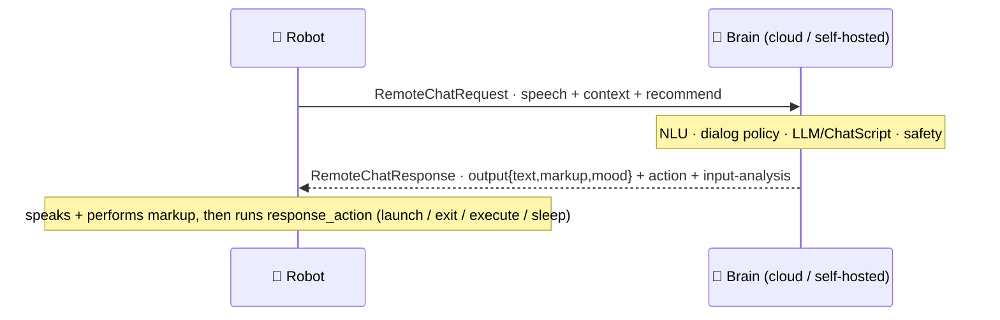

# 💬 RemoteChat — the robot ↔ brain conversation protocol (`v3.6.4-Zephyr` / OTA `v24.10.803`)

> Recovered from `embodied/robotbrain/RemoteChat.proto` (`package embodied.robotbrain`) in the
> **v24.10.803** image. This is the **per-turn RPC** between the robot and its conversational brain (the
> cloud LLM/ChatScript backend) — *the* contract a self-hosted "brain server" answers. The request side
> is summarized in [`cloud-protocol.md`](cloud-protocol.md#the-chat-requestresponse-envelope) and the
> transport (MQTT `remote_chat` command / `query_result`) there too; **this doc documents the full
> contract, especially the response** — which carries far more than text: affect scoring, **action
> commands** that drive the robot's activity navigation, a **safety verdict** on the child's input, and
> conversation-quality metrics. The dialog engines behind it are in
> [`content-and-conversation.md`](content-and-conversation.md).

## One turn

A turn can also **stream**: `RemoteChatRequest.stream_response` asks for chunks, and each
`RemoteChatResponse` carries `chunk_num` + `RemoteConsistencyControl{prefix, is_completed, extractor}`
so the robot can start speaking a stable prefix before the full reply lands.

## The request — `RemoteChatRequest` (delta over cloud-protocol)

The field *groups* are in [cloud-protocol](cloud-protocol.md#the-chat-requestresponse-envelope); the
fields that matter here and aren't listed there:

- **`execute_returns[]`** (`ExecuteReturn{index, function_id, return}`) — results of functions the brain
  previously asked the robot to `execute` (see actions), fed back on the next turn. A round-trip RPC.
- **`query`** (`RemoteDataQuery{query: contexts|modules, key, subkey, current_version}`) — piggyback a
  content/context data request on the chat turn.
- **`notify_source`** (`ResponseSource`), **`rollback`**, **`allow_multiple`**, **`no_llm`** — turn
  controls (retry/rollback a sequence, allow multiple outputs, force a non-LLM path).
- **Translation** — `original_language`, `original_speech`, `original_speech_alternates[]` alongside the
  (translated) `speech` — same translation-awareness seen in [perception fusion](perception-fusion.md#fusedspeechpb--the-voice-fused-onto-the-person).

## The response — `RemoteChatResponse`

The envelope the brain returns. `result` is a **`ResultCode`**:

| # | `ResultCode` | Meaning |
|--:|---|---|
| 0 | `SUCCESS` | normal reply in `output` |
| 1 | `ERROR_TIMEOUT` | brain didn't answer in time |
| 2 | `ERROR_STATE` | bad/again-inconsistent state |
| 3 | `ERROR_SERVICE` | backend error |
| 4 | `ERROR_OFFLINE` | no connectivity → robot falls back to the local brain |
| 5 | `NOREPLY_INTERRUPT` | suppressed: the child interrupted |
| 6 | `NOREPLY_ACK` | acknowledge only, no spoken line |
| 7 | `REPLY_FORCE_ANCHOR` | reply **and** force a return to the anchor/hub |
| 8 | `REPLY_FORCE_QUIT` | reply **and** force-quit the current module |
| 9 | `REPLY_PENDING` | more chunks coming (streaming) |

Alongside `result` it carries: `output` (below), `input` (the analysis of the child's turn),
`response_action`(s), `metrics`, `query_data` (`RemoteDataBlock{contexts, modules}` answering a
`RemoteDataQuery`), `nlp_intent` (`IntentResult`), `relevancy_score`, `nonsense_score`, `gpt_status`,
`processing_time`/`server_timestamp`, `worker_image` (which backend build served it), `fallback`,
`total_volleys`/`node_volleys`, and `flow_info{module_id, content_id, version}`.

### `RemoteChatOutput` — the spoken turn

Not just text — the fully-scored line the robot performs:

| Field | Meaning |
|---|---|
| `text`, `text_extended` | the spoken line (+ an extended variant) |
| `markup` | inline behavior markup — face/motion/audio ([behavior-markup](behavior-markup.md)) |
| `mood`, `mood_intensity` | the emotional performance to render |
| `dialog_act`, `dialog_act_score` | the act this line performs (taxonomy below) |
| `emotion`, `emotion_score` | conveyed emotion |
| `sentiment`, `sentiment_score` | conveyed sentiment |
| `signals` (`RemoteSignals`), `single_signal`, `volley_signal` | conversation signals |
| `perplexity`, `source` | LM perplexity + which source produced the line |
| `auto_tags[]` (`TagScore{name, uuid, score}`) | auto-applied content tags |

So one response tells the robot *what to say*, *how to feel while saying it*, and *what the line means* —
the markup + mood drive the face/body, exactly as the local brain would.

### `RemoteChatAction` — the brain drives navigation

The response can also **command the robot**, not just speak. `RemoteChatAction.ActionID`:

| `ActionID` | Effect |
|---|---|
| `launch` / `launch_if_confirmed` | start a content module (`module_id`/`content_id`), optionally after a yes/no |
| `exit_module` / `abort_module` | leave / hard-abort the current activity |
| `request_next` | ask for the next recommended activity |
| `execute` | run a robot-side `function_id(function_args…)` — result returns via `execute_returns` next turn |
| `sleep` | put Moxie to sleep |
| `tangent` | branch to a tangent and return |

It also carries an **`EventSubscription{clear, active[], passive[]}`** — the brain subscribing to robot
input events it wants pushed to it — and `output_type` / `is_remote_module`. `response_actions[]` allows a
list. This is what makes the brain the *director*: it can move the child between activities, run
device-side functions, and subscribe to perception — the reason a revival server can do more than reply.

### `RemoteChatInput` — the brain's read of the child

The brain returns its analysis of the **user's** utterance:

- `emotion`/`dialog_act`/`sentiment` (+ scores), `signals`, `auto_tags[]`, `perplexity`.
- **`InputSafety{is_unsafe, blocked_by[], intents[], phrase_id}`** — the **content-moderation verdict**:
  whether the child's input was unsafe, which classifiers blocked it, detected intents, and a matched
  safety-phrase id. This is the hook where a revival server plugs in moderation.

## Taxonomies

- **`RemoteDialog.DialogAct`** (22) — the dialog-act labels: `abandon`, `apology`, `apology_response`,
  `appreciation`, `backchannelling`, `closing`, `complaint`, `opinion`, `statement_non_opinion`,
  `factual_question`, `opinion_question`, `hold`, `opening`, `yes_no_question`, `pos_answer`,
  `neg_answer`, `other_answers`, `command`, `comment`, `thanking`, `other`, `timeout`.
- **`RemoteDialog.EmotionState`** (7) — `sadness`, `joy`, `love`, `anger`, `fear`, `surprise`, `neutral`.
- **`RemoteSignals.Signal`** (9) — `no_signal`, `closing`, `apology`, `interrupted_speech`,
  `complaint_clarification`, `confirmation_agreement`, `interest`, `non_interest`,
  `rejection_disagreement`.
- **`RecommendationContext.Urgency`** (3) — `casual`, `normal`, `immediate`; with
  `Recommendation{module_id, content_id, entry_line, seen, skip_hub}` exits + `restricted_modules` +
  `holidays`. This is how the request tells the brain what it *could* recommend next, and how the response
  steers there.

## `RemoteChatMetrics` — conversation-quality analytics

Per-turn analytics for the parent dashboard / recommender, scored for `user`, `bot`, and `both`:

- **HighLevel** — `emotionality`/`sentimentality` (positive/negative/total), `engagement`
  (opinion/question/total), `informativity`, `non_interest`, `cognitive_load`, `nonsense` (rates).
- **Numerics** — `num_utters`, `avg_num_words`, `turn_balance`.
- **Classifications** — `frustrated_rate`.

A revival server can leave these empty; they feed [the recommender + parent reports](content-and-conversation.md#the-recommender),
overlapping the per-turn affect scores in [device-config-and-telemetry](device-config-and-telemetry.md).

## What this means for the three goals

**② Server revival — the headline.** This is the contract a custom brain server implements. **Minimum:**
return `RemoteChatResponse{result: SUCCESS, output:{text, markup}}` and Moxie speaks and performs it.
**Fuller:** set `mood`/`dialog_act`, drive activities with `response_action` (`launch`/`exit_module`/
`execute`), enforce moderation via `input.safety`, and stream with `chunk_num` +
`consistency_control`. Every field here is one a self-hosted brain *may* fill to match stock behavior —
and the action verbs are what let the server be the director, not just a chat endpoint.

**① Custom firmware.** The robot side must send `RemoteChatRequest` and apply the response — speak
`output`, run `response_action`, feed `execute_returns` back. The `ResultCode` set (esp. `ERROR_OFFLINE`
→ local fallback, `NOREPLY_*`, `REPLY_FORCE_*`) is the local dialog manager's contract with the brain.

**③ Pre-801 revival.** No new lever — RemoteChat rides the same MQTT/endpoint path blocked pre-801
([network-trust](network-trust.md)).

---
📖 [Reverse-engineering index](README.md) · [Cloud protocol](cloud-protocol.md) · [Content & conversation](content-and-conversation.md) · [Behavior markup](behavior-markup.md) · [Perception fusion](perception-fusion.md) · [Device config & telemetry](device-config-and-telemetry.md)
