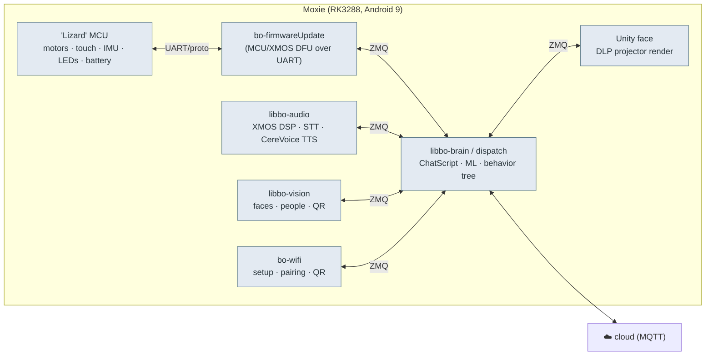

# 🧠 On-robot IPC — the ZeroMQ + protobuf message bus

> **What this is.** How Moxie's on-device modules talk to *each other* (not the cloud). The robot is
> a set of processes wired together by a **ZeroMQ pub/sub bus carrying Protocol Buffers**, routed by
> each message's protobuf **descriptor full-name**. Speak this bus and you can drive Moxie's face,
> motors, audio, and behavior from your own code. The full schema — **120 `.proto` files, ~360
> messages** — is recovered under [`recovered-proto/`](recovered-proto/).

## Where this came from

Both `bo-android` (the brain) and `bo-wifi` (setup) are **Unity/Mono** apps. Their app logic ships as
plain-IL managed assemblies inside the APKs (`Assembly-CSharp.dll`, `WifiApp.dll`, and the
generated `Embodied.Protos.dll` / `WifiApp.Protos.dll`). Every generated protobuf class embeds its
serialized `FileDescriptorProto`; decoding those bytes reconstructs the original `.proto` IDL
verbatim (field numbers, enums, packages). That's what `recovered-proto/` is — facts extracted from
the shipped binaries, not Embodied source.

## The bus



- **Transport:** ZeroMQ **pub/sub** over `tcp://` on loopback. Observed bind addresses
  `tcp://0.0.0.0:5000`–`5005` (per-module pub/sub pairs) plus `tcp://127.0.0.1:5678` / `:6789`.
  A module publishes protobufs and subscribes to the descriptor-names it cares about.
- **Routing key:** the protobuf **descriptor `FullName`** (e.g. `embodied.unity.QRCommand`). The
  managed side wraps each type in a `Deserializer<T>(Deserialize, Descriptor.FullName)` and registers
  it with the input-event system — so the wire is `[full-name][serialized-bytes]`.
- **Native side:** `libbo-dispatch.so` is the C++ equivalent bus; the Unity/Mono `ZMQ` class is the
  managed peer. Both carry the same `embodied.*` protobufs.

## Module map (recovered proto packages)

| Package | Files | What it carries |
|---|--:|---|
| `embodied.lizzerface` | 3 | **The MCU protocol** — motor set-position, PID config, power rails, LED patterns, and every hardware event (touch, switch, IMU, battery, servo stall, firmware errors). See [`hardware-map.md`](hardware-map.md). |
| `embodied.perception.audio` | ~11 | STT, wake-word, DOA, SNR, speaker ID, **XmosConfig** (DSP), speech, Google account audio. |
| `embodied.perception.vision` | ~14 | Faces (detect/recognize/track/enroll), people, poses, **QR**, book/draw IDs, image-to-text, occlusion, rapid-motion. |
| `embodied.perception.fusion` | 1 | `FusedPeople` — sensor fusion of who's present. |
| `embodied.robotbrain` | ~40 | **The brain.** ChatScript state/response, content modules & schedules, intents, contexts, idle-state, mentor behavior, STAR goals, remote chat, target/primary user. |
| `embodied.unity` | ~25 | Brain ↔ Unity face: **CloudTTS**, speech/SFX playback, markup-tool messages, gaze, camera/shake, engage-turn, robot position, console commands, app status/shutdown. |
| `embodied.wifiapp` | 5 | Setup app ↔ brain: **QR commands**, Wi-Fi update, bricked/silent-boot/status. See [`qr-commands.md`](qr-commands.md). |
| `embodied.logging` | 11 | Cloud/backup/file-sync, system metrics, **IOTEndpoint** enum, SEL updates, "something happened." |
| `embodied.system` | 3 | Power / system / time events. |
| `embodied.launcher`, `embodied.playspace`, `embodied.telehealth`, `embodied.testing` | 1 each | Component state, play-space, telehealth session, fusion/vision test harnesses. |

## The behavior-command markup (how the cloud drives the body)

Beyond raw protobufs, Moxie's **speech carries inline behavior commands** as SSML-like `<mark>` tags.
The cloud (or your server) sends TTS text interleaved with:

```
<mark name="cmd:behaviour-tree,data:{transition:0.5,duration:1.0,repeat:1,blocking:false,
  action:0,eventName:Gesture_Celebrate,category:BehaviourTree,behaviour:Bht_Demo_Wake_Up,Track:wake}"/>
<mark name="cmd:playaudio,data:{SoundToPlay:sfx_...,channel:2,Volume:1.0,...}"/>
<mark name="cmd:playback-mood,data:{mood:0,intensity:0}"/>
<mark name="cmd:idlestate,data:{idleState:7}"/>
<mark name="cmd:stopaudio,data:{scope:1,channel:2,FadeOutTime:1.0,ClearQueue:true}"/>
<usel variant="0" genre="excited"> ...spoken text... </usel>
<break time="1.5s"/>
```

Command verbs seen in the shipped assets: `behaviour-tree`, `playaudio`, `stopaudio`,
`playback-mood`, `idlestate`. Behaviours reference named trees (`Bht_*`) and gesture events
(`Gesture_*`). This is the practical surface a custom server drives to make Moxie *do things* while
talking — it rides the normal TTS/markup path in `embodied.unity` (`CloudTTS`, `MarkUpToolMessages`,
`SpeechPlayback`).

## Console commands

`embodied.Robot.ConsoleCommandRequest{ command }` feeds a developer console inside `bo-android`
(the `AddConsoleCommand*` / `ConsoleCommandSender` machinery). It accepts free-form command strings
dispatched to registered handlers — a direct lever for poking the brain in a custom build.

## Using this for custom software

- **Minimal-invasive personality swap:** keep stock `vendor`, `ledctrld`, DLP + camera plumbing and
  the Lizard MCU firmware. Replace `bo-android` with your own app that (a) subscribes to
  `embodied.perception.*` + `embodied.lizzerface` events and (b) publishes `embodied.lizzerface`
  motor/LED commands and `embodied.unity` speech/face commands. You inherit Moxie's whole body.
- **Bridge to a modern LLM:** terminate the cloud MQTT side yourself (this repo's `mqtt/` +
  `server/`), and translate LLM output into the `<mark name="cmd:...">` markup + `CloudTTS` path.
- **Field numbers are stable:** the recovered `.proto` files preserve exact field numbers, so you can
  regenerate bindings for any language with `protoc` and be wire-compatible with the stock firmware.

---
📖 [Reverse-engineering index](README.md) · [Recovered protos](recovered-proto/) · [Docs index](../README.md) · [Back to top](../../README.md)
