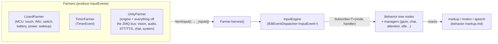

# 👂 Behavior input events — the robot's perception vocabulary (`v3.6.4-Zephyr` / OTA `v24.10.803`)

The **input contract** of the behavior engine (decompiled `Assembly-CSharp.dll`, **v24.10.803**): the
**163** typed `InputEvent`s — sensors, vision, audio, speech, chat, system — that flow into the behavior
tree. Producers (`Farmer`s) feed one typed pub/sub bus (`InputEngine`). Only **24** events are
protobuf-serializable and cross the ZeroMQ bus; the rest are in-process. Counterparts: output is
[behavior-markup](behavior-markup.md); producers are the [perception pipeline](perception-pipeline.md) and
the Lizard MCU ([hardware-map](../hardware/hardware-map.md)).

## The Farmer pattern

- **`abstract class Farmer`** holds `List<InputEvent> _inputs`; each frame `farmInput()` fills it and
  `harvest()` drains it into the engine. Concrete farmers:
  - **`LizardFarmer`** — hardware events from `Lizzerface` (the MCU bridge,
    [raw UART commands](../hardware/hardware-map.md#raw-uart-command-set-lizzerfacecommands)); gated by `SensorsEnabled`.
  - **`TimerFarmer`** — scheduled `TimerEvent`s.
  - **`UnityFarmer`** — the Unity tick plus everything arriving on the on-device ZeroMQ bus.
- **`InputEngine : IEBEventDispatcher<InputEvent>`** — singleton wrapping `EBEventDispatcher`; consumers
  call `Subscribe<T>(subscriber, delegate)` / `Unsubscribe<T>(…)` with `T : InputEvent` (e.g. gaze →
  `FacesEvent`/`GazeEvent`, chat → `STTResultEvent`).

## The event vocabulary (163 types, by domain)

### 🖐️ Physical / sensor (from the Lizard MCU)
`TouchEvent` (BACK/TUMMY/hands) · `SwitchEvent` (arms, DC-plug) · `MpuEvent` + `MpuPickedUpEvent` /
`MpuPickedUpShakenEvent` / `MpuPutDownEvent` / `MpuTiltEvent` / `MpuIsNoisyEvent` / `MpuPickUpStatusEvent` ·
`ServoPosFdbackEvent` · `ServoStallEvent` · `BatteryEvent` · `PowerStateEvent` · `LizardWakeupEvent` ·
`LizardErrorEvent` · `RobotActionMPUPickedUpEvent` · `RobotActionMPUNotStableEvent` · `RobotActionHugEvent` ·
`RobotActionBellyRubEvent` (the last four are higher-level percepts fused from touch + IMU that trigger
the [reflex actions](robot-actions.md)).

### 👁️ Vision / people (from `libbo-vision` / fusion)
`FacesEvent` · `PeopleEvent` · `FusedPeopleEvent` · `PersonAddedEvent` / `PersonRemovedEvent` /
`PersonSaidEvent` / `PersonSmiledEvent` / `PersonStartedSpeakingEvent` · `PosesEvent` · `GazeEvent` ·
`OcclusionEvent` · `QREvent` · `RobotBodyTrackingEvent` / `RobotEyeTrackingEvent` / `RobotHeadTrackingEvent` ·
`RobotCameraEvent` / `RobotCameraShakeEvent` / `RobotMotorCameraEvent` · `DOAInputEvent` /
`DOAControlRequest` (mic-array direction-of-arrival) · `AttentionEvent`.

### 🔊 Audio & speech (percepts + playback)
`AudioEvent` · `AudioEnergyPercept` · `SpeechEnergyPercept` · `VoiceActivityPercept` · `AudioIsFinishedEvent` ·
`SFXPlaybackReportEvent` · `AudioNotif{Chat,Pause,Resume,SpeedChange,VolumeChange}Event` ·
`AudioNotifyBaseBackgroundEvent`.

### 🗣️ STT / TTS
`STTPartialEvent` · `STTResultEvent` · `STTReadyEvent` · `CloudTTSRequestEvent` · `CloudTTSBaseEvent` ·
`TTSRequestEvent` · `TTSOutputEvent` · `TTSResult` · `TTSBTEvent` · `TTSErrorEvent` · `TTSVoiceTypeEvent` ·
`SpeechPlaybackRequest` · `SpeechPlaybackSpeakingWords` · `SpeechPlaybackStreamStatus` · `SpeechStateChangeEvent`.

### 💬 Chat / conversation
`ChatEvent` · `ChatInputEvent` / `ChatOutputEvent` / `ChatResponseEvent` · `ChatRequested` / `ChatResetEvent` ·
`ChatbotReadyEvent` / `ChatbotListeningEvent` / `ChatbotAllowCutoffEvent` / `ChatbotRunmodeEvent` /
`ChatbotSettingsSwapEvent` · `ChatStateEvent` / `ChatInstanceState` / `ChatEntityUpdateEvent` /
`ChatTargetEvent` · `ChatBehaviorStartedEvent` / `ChatBehaviorStoppedEvent` · `TriggerChatActivityEvent` ·
`SendChatInputEvent` · `PullstringResponseEvent`.

### 🌳 Behavior-tree control & turn-taking
`BTStartedAction` / `BTStartedBlocking` / `BTEndedBlocking` / `BTStartedSubgraph` / `BTEndedSubgraph` ·
`BTManagerEvent` · `BTInputEventAsset` · `BTGazeControlTarget` · `AllowInterruption` /
`UserInterruptionEvent` · `TurnTakingEvent` · `IdleStateRequestEvent` · `ConsciousState_Event`.

### ⚙️ System / power / network
`NetworkState` · `SystemWifiConnectionState` / `SystemWifiRecoverPBPublisher` · `ServerConnectEvent` ·
`SystemStartSuspend` / `SystemSuspendEventPBPublisher` / `SystemResumeEvent` / `SystemRecoverEvent` ·
`SystemShutdownRequestPBPublisher` / `MainAppShutdownEvent` · `SilentBootCompleteEvent` ·
`SystemUnpairReadyPBPublisher` · `MarkupSystemStartSuspend` / `MarkupSystemStartUnpair` ·
`SystemFPSStatsPBPublisher` / `TTSStatsPBPublisher` (telemetry).

### ⏱️ Timers, assets, logging, debug
`TimerEvent` · `KeyEvent` · `ConsoleCommandEvent` · `AnimStateEvent` / `AnimTrackEvent` /
`ProceduralBlinkEvent` · `DynamicAssetBundle{Load,ReLoad,Release,Scan}Event` ([content-delivery](content-delivery.md)) ·
`Logging*` · `*TestEvent`.

## The bus-serializable subset — the external contract (24 events)

These carry a protobuf serializer (`new Serializer<Evt>(Serialize, EvtPB.Descriptor.FullName)`), so they
cross the process/ZeroMQ boundary and are what a server or custom controller sees/injects on the bus
([robot-ipc-protocol](../protocol/robot-ipc-protocol.md), `MoxieBus`):

| Event | Proto | Domain |
|---|---|---|
| `TouchEvent` | `TouchEventPB` | touch (BACK/TUMMY/hands) |
| `SwitchEvent` | `SwitchEventPB` | switches (arms, DC-plug) |
| `MpuEvent` | `MpuEventPB` | IMU gesture |
| `MpuPickedUpEvent` / `MpuPickedUpShakenEvent` / `MpuPickUpStatusEvent` / `MpuPutDownEvent` / `MpuTiltEvent` / `MpuIsNoisyEvent` | `Mpu…PB` | IMU sub-events |
| `BatteryEvent` | `BatteryEventPB` | battery level/temp |
| `PowerStateEvent` | `PowerStateEventPB` | power state |
| `ServoStallEvent` | `ServoStallEventPB` | motor stall |
| `LizardErrorEvent` | `LizardErrorEventPB` | MCU faults (1000–1051) |
| `LizardWakeupEvent` | `LizardWakeupEventPB` | wake source |
| `ReloadQueueStayAwakePulseEvent` | `PowerStayAwakePB` | keep-awake pulse |
| `AudioNotifChat/Pause/Resume/SpeedChange/VolumeChange` | `AudioNotif…PB` | audio-playback control |
| `AudioIsFinishedEvent` | `AudioIsFinishedEventPB` | playback done |
| `SystemSuspendEventPBPublisher` | `SystemSuspendPB` | suspend |
| `SystemFPSStatsPBPublisher` / `TTSStatsPBPublisher` | `FPSStatsPB` / `TTSStatsPB` | telemetry |

Everything else (vision `Faces/People*`, `Gaze*`, `Chat*`, `STT/TTS*`, `BT*`) stays inside the brain; a
server influences it only through the cloud chat/TTS contract ([cloud-protocol](../protocol/cloud-protocol.md))
and the markup it returns.

## Implications

- **Custom brain:** the 163 types are the stimuli a replacement engine must consume to feel like Moxie;
  the 24 PB events are the hardware/telemetry events it must handle or synthesize.
- **Server revival:** a bus bridge can read sensor/battery/power/IMU state and inject audio-playback
  control; conversation goes through chat/TTS, not event injection. Pre-801: no new lever (above the
  [network boundary](../protocol/network-trust.md)).

---
📖 [Reverse-engineering index](../README.md) · [Behavior markup (output)](behavior-markup.md) · [Perception pipeline](perception-pipeline.md) · [Hardware map](../hardware/hardware-map.md) · [Robot IPC](../protocol/robot-ipc-protocol.md)
