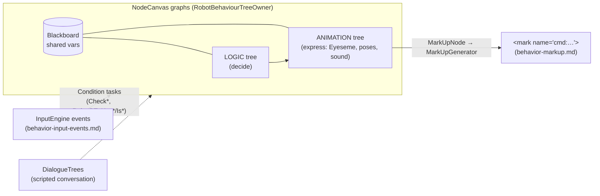

# 🌳 Behavior-tree engine & node catalog — the decision layer (`v3.6.4-Zephyr` / OTA `v24.10.803`)

Moxie's brain (`bo-android`, decompiled `Assembly-CSharp.dll`, **v24.10.803**) decides what to do with
**ParadoxNotion NodeCanvas**, an off-the-shelf Unity graph framework — not a bespoke interpreter. Embodied
adds **65 `RobotBT_*` nodes** (the instruction set authored trees are built from) and **45 named `Bht_*`
trees**, including every facial expression. Input events come in via condition nodes
([behavior-input-events](behavior-input-events.md)); behavior goes out via `MarkUpNode`
([behavior-markup](behavior-markup.md)). Above this sits the [action arbiter](robot-actions.md); below it
the [task scheduler](task-scheduler.md) and the [face engine](unity-face-animation.md).

## The engine — NodeCanvas

Namespaces present: `NodeCanvas.BehaviourTrees`, `.DialogueTrees`, `.StateMachines`, `.Framework`
(Blackboard/Graph/Task), `.Tasks.Actions`, `.Tasks.Conditions`. All four graph kinds are used:

| Graph kind | Owner class | Role in Moxie |
|---|---|---|
| **BehaviourTree** | `BehaviourTreeOwner : GraphOwner<BehaviourTree>` → embodied **`RobotBehaviourTreeOwner`** | the reactive behavior layer (the `Bht_*` trees) |
| **DialogueTree** | `DialogueTreeController : GraphOwner<DialogueTree>, IDialogueActor` | scripted conversation ([below](#dialoguetrees-scripted-conversation)) |
| **FSM** | `FSMOwner : GraphOwner<FSM>` | state machines (e.g. engagement/turn-taking states) |
| **FlowScript** | `FlowScriptController : GraphOwner<FlowScript>` | visual scripting glue |

- Every node returns a NodeCanvas **`Status`** — `Success`, `Failure` or `Running` (the description
  strings are embedded verbatim, e.g. *"You should return Status.Success, Failure or Running within that
  function."*).
- The **`Blackboard`** (`IBlackboard`, `object this[string varName]`) is the shared variable store — the
  same store the markup `variableName`/`variableValue` pair writes and `RobotBT_CheckMarkupVariable` reads.
  On the face side it is the [`StateVariables` blackboard](unity-face-animation.md#4-the-blackboard-bridge-statevariables).
- Behavior runs as **two parallel trees** over one blackboard: a **Logic** tree (what to do) and an
  **Animation** tree (how to express it) — `RobotBT_SetLogicBehaviourTree` /
  `RobotBT_SetAnimationBehaviourTree`, `RobotBehaviourTreeComponentLogic` / `…ComponentAnimation`.

### Stock node taxonomy (descriptions from the binary)

| Composite (`BTComposite`) | Behavior |
|---|---|
| `Selector` | run children in order (or randomly) until one Succeeds; Dynamic mode re-evaluates higher-priority children |
| `Sequencer` | run children in order until one Fails |
| `PrioritySelector` | **Utility-AI** selector — run the child with the highest priority weight, fall through on failure |
| `ProbabilitySelector` | pick a child by weighted chance, optional pre-Condition filter |
| `Parallel` | run all children at once; return per `ParallelPolicy` (incl. Repeat) |
| `FlipSelector` | Selector that moves a Succeeding child to the end (recently-failed checked first) |
| `StepIterator` | step through children across ticks |

- **Decorators** (`BTDecorator`, wrap one child): `Inverter`, `Repeater`, `Iterator`, `Optional`,
  `Filter`, `Monitor`, `ConditionalEvaluator`, **`Guard`** (token-based mutual exclusion across *all* the
  agent's trees), **`Interruptor`** (fail-and-bail the child when a condition becomes true), `Remapper`,
  `Setter`, plus embodied's `RobotBT_CameraShake`, `RobotBT_GazeDisabler`, `RobotBT_Repeater`,
  `RobotBT_EndTreeDisabler`.
- **Leaves / flow:** `ActionNode`, `ConditionNode`, **`MarkUpNode`** (owns a `MarkUpGenerator`; emits the
  `<mark name="cmd:…">` string), `SubTree`, `NestedFSM`, `FSMState`, `RootSwitcher`, `NodeToggler`,
  `EndBehaviourTree`, `BTNestedFlowScript`.
- Stock task library alongside embodied's: `Check*`, `Find*`, `Wait`, `Set/GetProperty`, …

## The node catalog — the 65 `RobotBT_*` nodes

Trees are built from NodeCanvas **`ActionTask`** (does something) and **`ConditionTask`** (tests
something) nodes. Every parameter is a **`BBParameter<T>`**, bound either to a constant or to a
blackboard variable (`RobotState_*`), so a node can be driven live by running state. The decompile counts
65 `RobotBT_*` nodes; the 61 below are itemized by name.

**Expression & mood** — rendered by the [Eyeseme layer](unity-face-animation.md#5-the-eyes-eyeseme-blink):

| Node | Kind | Effect |
|---|---|---|
| `RobotBT_PlaybackMood { BBParameter<ePlaybackMood> Mood }` | action | set `RobotState_PlaybackMood` (one of the 11 moods) |
| `RobotBT_PlaybackIntensity` | action | set mood intensity |
| `RobotBT_EyesemeState` | action | set the eye-expression layer's mood |
| `RobotBT_OldPlaybackMood` / `RobotBT_HasMoodChanged` | cond | previous mood / whether it just changed |
| `RobotBT_EyeGazeEnabled` / `RobotBT_HasEyesemeEnableChanged` | cond | eyeseme gating |

**Gaze** — drives the [attention/look-at](gaze-and-attention.md) layer:

| Node | Effect |
|---|---|
| `RobotBT_GazeControlTarget` | point autonomous gaze at a target |
| `RobotBT_GazeControlManualTarget` | force a manual gaze target |
| `RobotBT_GazeDisabler` | suspend autonomous gaze (for a scripted look) |

**Animation, camera & audio** — each becomes an [`EBGameTask`](task-scheduler.md) claiming
[resources](task-scheduler.md#the-outputs-robotresourceflags):

| Node | Effect |
|---|---|
| `RobotBT_PlayAnimation` | play a composite animation clip |
| `RobotBT_CameraShake { bool enabled }` | toggle the [virtual-camera shake](../protocol/unity-mainapp-interface.md#the-virtual-camera-moxies-self-view) |
| `RobotBT_PlayScreenSaver` | play the screensaver/idle visual |
| `RobotBT_PlaySound { BBParameter<Channel> SoundChannel (=FX), BBParameter<string> SoundName }` | play an SFX on a channel |
| `RobotBT_PlayBackgroundSound` | play/stop a background audio bed |

**Sensory idle** — selects the [`SensoryMode`](unity-face-animation.md#8-the-sensory-idle-layer-sensorymode) ambient layer:

| Node | Effect |
|---|---|
| `RobotBT_SensoryMode { BBParameter<SensoryMode> Mode }` | set the mode (`NoTarget`/`Engaged`/`Listening`/`Talking`/`Seeking`/`Earmuffs`…) |
| `RobotBT_SensoryModeDuration` / `RobotBT_TimeSinceSensoryMode` | time in the mode / since it changed |
| `RobotBT_HasSensoryModeChanged` | cond: mode just changed |

**Turn-taking conditions (12)** — expose the [`TurnTakingState`](turn-taking.md) machine:

| Node | Tests |
|---|---|
| `RobotBT_TurnTakingInTurn` | who owns the turn (Mentor/Moxie) |
| `RobotBT_TurnTakingInMoxieState` / `…InMentorState` | speaker state (Idle/Listening/Thinking/Speaking/Interrupted) |
| `RobotBT_TurnTakingInEngagementState` | Earmuffs/Engaged/Seeking/Disengaged |
| `RobotBT_TurnTakingInAssistState` | None/Advanced assist |
| `RobotBT_TurnTakingIsResponseMissing` | the child hasn't responded |
| `RobotBT_TurnTakingTimeIn{Turn,MoxieState,MentorState,EngagementState,AssistState}` | time-in-state (timeouts) |
| `RobotBT_TurnTakingWaitingForResponseTime` | how long waiting for a reply (re-prompt timer) |

**Accessibility globals** — set the [`GlobalSettings_*` gates](unity-face-animation.md#9-accessibility-global-gates)
(also settable by config, mirroring [settings-schema](../firmware/settings-schema.md)): `RobotBT_RobotGlobalSettings`
+ `…_HideRobotHUDAnimatorAttachments`, `…_HideRobotVisualEffects`, `…_LessMotion`,
`…_MuteRobotSoundEffects`, `…_SlowSpeech`.

**Tree control & flow:**

| Node | Effect |
|---|---|
| `RobotBT_SetBehaviourTree { BBParameter<string> BehaviourTreeResourceName }` | switch to a named tree (by resource) |
| `RobotBT_SetAnimationBehaviourTree` / `RobotBT_SetLogicBehaviourTree` | set the animation / logic tree |
| `RobotBT_ConditionalBehaviourTreeState` | gate a sub-tree on a condition |
| `RobotBT_EnableNodeCanvas` / `RobotBT_IsNodeCanvasEnabled` | enable/query the whole tree runtime |
| `RobotBT_EndTreeDisabler` | stop a tree from ending (hold it) |
| `RobotBT_Is{Current,Animation,Logic}BehaviorTree` | which tree is running |
| `RobotBT_Repeater` | repeat a child |
| `RobotBT_TimeoutRandom { BBParameter<float> timeoutMin, timeoutMax }` | randomised timeout (natural pauses) |
| `RobotBT_TimeSinceStarted` / `RobotBT_IsFirstRun` | timing / first-execution guards |
| `RobotBT_BoolConstant` / `RobotBT_LogMessage` / `RobotBT_TestAction` | literal / debug helpers |

**Markup & events** — the bridges to [markup](behavior-markup.md) and the [input bus](behavior-input-events.md):

| Node | Effect |
|---|---|
| `RobotBT_IsMarkupGraph` / `RobotBT_IsPlayingMarkupGraph` / `RobotBT_IsMarkupTool` | whether a markup graph is active |
| `RobotBT_CheckMarkupVariable` | read a variable set by markup |
| `RobotBT_SendEventAsset` / `RobotBT_CheckEventAsset` | fire / test an input-event asset |
| `RobotBT_CompleteEvent` | signal a behavior/activity complete |

## The 45 named behavior trees (`Bht_*`)

Loaded via `RobotBehaviourTreeAssetResourceSingleton` (from content bundles — [content-delivery](content-delivery.md));
a markup `behaviour-tree` command names one of these.

| Group | Trees |
|---|---|
| **Expressions (`Eyeseme`, 11)** | `Afraid` · `Angry` · `Concerned` · `Confused` · `Curious` · `Embarrassed` · `Happy` · `Neutral` · `Sad` · `Shy` · `Surprised` |
| **Idle / attention** | `Idle_Curious` · `Idle_Listening` · `Idle_Near_Focused` · `Idle_Near_UnFocused` · `Idle_Far_Unfocused` · `Idle_SeekingState` · `Idle_DisengagedState` · `Idle_Earmuffs` |
| **Gestures / talking** | `Gesture_Greet` · `Talking_Poses` · `Talking_With_Gestures` · `Vocal_Gestures` (`Vg_`) · `Head` · `Spin_360` · `ooo_long` · `Sign_off` |
| **Physical reactions** | `Robot_Pickup` · `Robot_Putdown` |
| **Sleep / sensory** | `Sleep_Anim` (+`_Zero`) · `Sleeping_Anim` · `SensoryIdle_Anim` · `SensoryIdleStoryTime_Anim` |
| **System / lifecycle** | `System_Resume` · `System_Suspend` (+`_Zero`) · `System_WifiRecover` · `Active_Thinking` · `Demo_Wake_Up` |
| **Test / misc** | `Motor_Test` · `TestState` · `Anim` |

**Facial expressions are behavior trees** (`Bht_Eyeseme_*`), not static frames — each is a small graph
that plays face + eye animation, which is why the mood/eyeseme condition nodes exist. The `ePlaybackMood`
→ tree mapping is in [behavior-markup](behavior-markup.md); the SIL face renders all 11 (`MOOD_TO_FACE`
in `sim/web/bridge/body.js`). Render side: [unity-assets](../firmware/unity-assets.md).

## DialogueTrees — scripted conversation

Conversation content also runs on NodeCanvas as **DialogueTrees** (`DialogueTreeController`, an
`IDialogueActor`). Node types: `StatementNode` (Moxie says a line), `MultipleChoiceNode` /
`MultipleConditionNode` (branch), `ConditionNode`, `GoToNode` / `Jumper` (flow), `ProbabilitySelector`
(random branch), `FinishNode`, `DTNestedFlowScript` — the authoring model behind the content modules in
[content-and-conversation](content-and-conversation.md).

## Implications

- **Custom brain:** the decision layer is a known engine with a documented node contract. Implement the 65
  nodes over the `RobotState_*` blackboard (setters, turn-taking/sensory conditions, tree-flow control)
  and stock content trees run; author new behavior by composing them. The logic/animation split and the
  `Bht_*` catalog are the blueprint for a faithful personality.
- **Server revival:** trees execute on-device; a server influences them only through the chat/TTS
  contract and the markup it returns. Content bundles a server ships are trees built from these nodes, so
  this vocabulary is how that content is authored or validated. Pre-801: no new lever.

---
📖 [Reverse-engineering index](../README.md) · [Behavior input events](behavior-input-events.md) · [Behavior markup](behavior-markup.md) · [Robot actions](robot-actions.md) · [Task scheduler](task-scheduler.md) · [Face-animation engine](unity-face-animation.md) · [Content & conversation](content-and-conversation.md)
