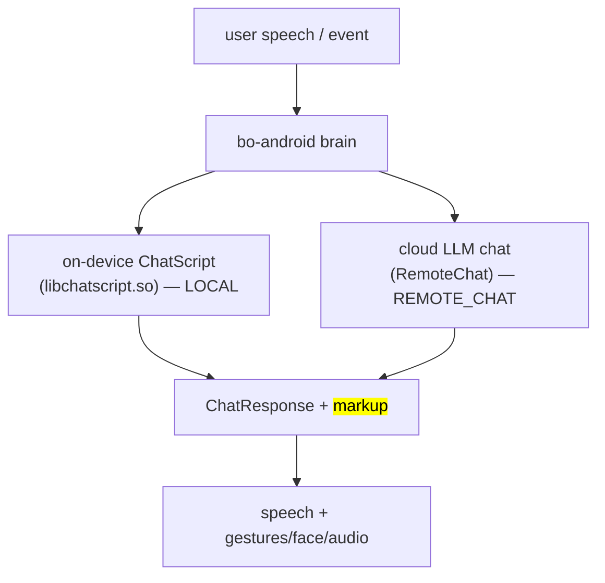

# 🗣️ Content & conversation — ChatScript, content modules, the volley API (`v3.6.4-Zephyr` / OTA `v24.10.803`)

How Moxie decides what to *say and do*: two dialog engines (on-device ChatScript, cloud LLM chat), the
content-module format a server delivers, the `volley`/`session` hooks that let content run code, and the
pedagogy layer (schedules, recommender, SEL taxonomy, rewards). Key takeaways: the engines are in the
firmware but their **data** (voice, dialog, persona) is synced content, so a revival server authors
Moxie's character itself; content code runs **server-side**. Sources: `embodied.robotbrain` protos,
`libbo-brain`/`libchatscript` symbols, and OpenMoxie's module format (same `RemoteChat` contract).
Transport: [cloud-protocol](../protocol/cloud-protocol.md). Packaging: [content-delivery](content-delivery.md).

## Two dialog engines



- **ChatScript (LOCAL)** — rule engine on the robot (`ChatscriptEngine`, `chatscript::api`): fast,
  offline, deterministic. Errors: `ChatScriptError`/`ChatScriptException`; readiness: `ChatScriptReady` (on the bus).
- **Cloud chat (REMOTE_CHAT)** — an LLM answers a `RemoteChatRequest` with a `ChatResponse`.
- **HYBRID** — `ModuleDetail.ContentSource = LOCAL | REMOTE_CHAT | HYBRID`.
- A third source, a live human operator, is [telehealth](#telehealth-remote-puppet-mode).

A **module** (`ModuleDetail`) is an activity/content pack: `ContentDetail` entries, a `ModuleCategory`
(CREATIVITY, REGULATION, MOVEMENT, READING, PLAYFUL_GAME, PUZZLE_GAME, FUN_TIDBIT, LISTENING, MISSION,
CONVERSATION, UTILITY), delivery `ContentRules` (ORDERED, RANDOM, `*_EXHAUST[_SEEN]`, DAILY_MISSION,
CALENDAR), and `min_api_version`. `LineStoreSerialState` tracks seen lines (the `masks`) so `*_EXHAUST`
rules don't repeat.

## Content-module format (what a server serves)

JSON with three optional sections — `conversations`, `globals`, `schedules`.

### `conversations[]` — LLM-driven chats
```json
{ "name":"Basic Memory Chat", "module_id":"OPENMOXIE_CHAT", "content_id":"memory",
  "max_history":40, "max_volleys":40, "opener":"Let's have a chat.|Anything on your mind?<opener>",
  "prompt":"You are a robot named Moxie ... talking to {{volley.config.child_pii.nickname}}. FACTS:\n{{volley.persist_data.memory_chat.facts}}",
  "model":"gpt-4o", "max_tokens":100, "temperature":0.5,
  "code":"def post_process(volley, session): ..." }
```
- `prompt` is **Jinja2** over `volley`/`session` (`{{…}}`, ``); common vars
  `volley.config.child_pii.nickname`, `volley.persist_data.*`, `session.overflow`.
- `opener` supports `|`-alternatives and inline tags (`<opener>`, `<exit>`, `<sleep>`, `<launch:XX>`).
- `code` defines Python hooks: `pre_process`, `post_process`, `complete_handler`, `notify_handler`
  (and `handle_volley` for globals).

### `globals[]` — regex-triggered commands (always on)
```json
{ "name":"Timer Start", "pattern":"^(moxie|moxy) (start|set) a? timer for? (\\d+) (minute|hour|second)s?$",
  "entity_groups":"3,4", "action":4, "code":"def handle_volley(volley): ..." }
```
Regex over the utterance; capture groups become `volley.entities`; `action` selects match handling; `code`
builds the response and fires execution actions.

### `schedules[]` — what to offer when
```json
{ "name":"moxie_go_hub_timers",
  "schedule":{ "provided_schedule":[{"module_id":"ENROLLCONVO"},{"module_id":"DM"}],
    "generate":{"chat_count":2,"module_count":6,"chat_modules":[...]},
    "hub_config":{"hubs":[{"module_id":"MOXIE_GO","content_id":"default"}]},
    "alarm_module":{"module_id":"ALARM","content_id":"fire"} } }
```
Mirrors `embodied.robotbrain.ContentSchedule` ([below](#scheduling-progression-rewards-what-to-offer-next)).

## TTS & dialog engine internals (formats & data)

Both engines are native libs in the firmware; their **data is synced content, not in the image** — a
revival supplies its own voice/dialog and neither can nor needs to extract Embodied's licensed assets.

### CereVoice TTS (`libcerevoice_eng.so`, ~44 MB)
- **CereProc CereVoice v5.0.2**, **DNN parametric synthesis** (`CPDNN` spurt generation, not unit
  selection).
- Voice model: a **`.voice` file** = "**CEREPROC TPDATABASE v 1.0**" (`CEREVOICE HEADER`) — licensed
  text-processing DB + DNN weights, delivered as content; license check in `src/license/bigdigits.c`.
- The brain can instead request `CloudTTSRequest` and play server-rendered PCM
  ([perception-pipeline](perception-pipeline.md#output-side-tts-embodiedunity)), so any TTS drops in;
  CereVoice is the on-device path/fallback.

### ChatScript (`libchatscript.so`, ~27 MB)
- **Bruce Wilcox's ChatScript** (prints `ChatScript Version %s compiled %s`). Symbol legend in the
  binary: `$` variables · `@` factsets · `_` match-vars · `^` macros · `~` topics/concepts.
- **`.top` topic files** (topics, `~concepts`, `table`/facts) compile to a runtime dictionary + topic
  store (`AddTopicCode`, `AllocateTopicMemory`, `$cs_topicretrylimit`); the compiled store is synced content.
- Drives the LOCAL path and the always-on global commands.

### ChatScript authoring — the real format & pipeline

From an ex-Embodied game designer's public sample repo
([`nhertanto/Embodied-Moxie`](https://github.com/nhertanto/Embodied-Moxie); facts captured per the
[self-sufficiency doctrine](../external-sources.md)), content was authored in three layers:

1. **Python node classes** (`*.py`) subclassing `FlexibleInteractions`/`FlexibleNodeData` declare a node's
   authoring-tool UI properties (fixed-choice dropdowns, text+markup fields, "move-on" transitions) — what
   a designer edits in the in-house visual tool.
2. **Jinja2 templates** (`*.jinja`) turn that data into ChatScript: `base_topic.jinja` emits
   `topic:`/`t:` blocks and expands **text** and **markup variations** (multiple `[ … ]` alternatives);
   templates `` shared `Macros/node_utility.jinja`.
3. **Generated `.top` files** (`Generated-*.top`) — the output shipped as synced content.

```chatscript
# reusable intent pattern (what the child said to trigger an activity)
patternmacro: ^P_JOKES_userTellJoke()
[ (!~negation [can could may] I *~2 tell {you} a *~2 joke)
  (!~negation I [have know] *~2 joke) ]

# a topic = a dialog node; CS flags then robot-brain [flags]
topic: ~my_topic keep repeat [FLAG]
  t: PROMPT() ^keep() ^repeat()        # a gambit/output rule
     [ Here is one variation of the line. ]   # text/markup variations in [ ]
     [ Here is another phrasing. ]
```

Operators: `[ a b ]` alternates · `{ x }` optional · `*~N` up to N-word gap · `!~negation` must-not-precede
· `~concept` concept set (`~want`, `~silly`, `~botname`, `~intensifier`) · `%tense=present` · `< … >`
sentence bounds · `^macro()` pattern/output macro (e.g. `^intentPattern_request()`). Offline dialog for a
revival is authored in exactly this form and compiled into the on-device store.

**The named global commands** (always-listening voice controls, from the sample's
`FlexibleGlobalCommand1` choice list): **`Sleep`, `WakeUp`, `Hello`, `ListenToMe`, `Earmuffs`,
`HoldOn`, `RepeatThat`, `SpeakLouder`, `SpeakSofter`, `SomethingElse`** — recognized at any time,
independent of the activity. `Earmuffs` is also `ENGAGEMENTSTATE_EARMUFFS` in [proto-catalog](../protocol/proto-catalog.md).

### Where the data lives
Voice, ChatScript and content modules sync to **`/sdcard/EmbodiedData` / `/sdcard/EmbodiedStaticData`**
over the MQTT **file-sync** channel (`MQTT_FILE_SYNC`, [cloud-protocol](../protocol/cloud-protocol.md)) —
the same mechanism as OTA images. The base firmware ships only the engines.

## Context assembly & topical awareness

- **Context blocks** (`embodied.robotbrain`): `GlobalContext`, `EnvironmentContext`,
  `ConversationContext{context, content_tags, goal_levels, properties, prompt[]}`, each a
  `Context{id, text}`. They map to `RemoteChatRequest.global_context/conversation_context/prompt_context`
  ([cloud-protocol](../protocol/cloud-protocol.md)); a server fills them to steer the LLM.
- **Moxie's personality is not in the firmware.** The system prompt / persona was authored on Embodied's
  cloud and delivered per turn in these blocks (plus each module's templated `prompt`). The robot carries
  only the slots and the `gpt_status` flag, so a revival server authors the character (warm, playful,
  kid-safe SEL mentor — cues: [GRL lore](../firmware/unity-assets.md), age adaptation, mood + markup) —
  the ecosystem's [LLM-agent workstream](../../architecture/moxie-as-a-platform.md).
- **Holidays/events** — `EventsAndHolidaysData{holidays[]}`, `Holiday{event_uid, holiday_id, name, tag,
  date, region}`: region-specific dated events for topical content.
- **Content tags** — `Tag{uuid, name}` / `ContentTag{replaced, finalized, review}`: the tag lifecycle
  that curates offered content (with `TagList` allow/deny, below).
- **NLU & fallback** — `IntentPB{intent, input}`; `Fallback{topic, module, userInput, fallbackType}` (maps
  to `ChatResponse.FallbackType`); `IdleStateChange{state}` (the `idlestate` markup verb).

## Session & sleep lifecycle

- **Session** — `SessionState{inSession, record_mode, user, outSessionReason, prev_active}` with
  **`SessionUser{user_age, num_children, max_children}`** — Moxie supports **group sessions** (ties to the
  `MP_*` settings, [settings-schema](../firmware/settings-schema.md)). Ends with an `outSessionReason`.
- **Bedtime** — parent-set **`WakeSchedule`** (`embodied.logging`): `weekday_bedtime_enabled` +
  `weekday_bedtime_starts_at`/`ends_at`, same for `weekend_*` (HH:MM strings). In the window Moxie sleeps
  and won't fully wake; **`BedTimeStatus{status, status_plus_20}`** reports it (`status_plus_20` = a
  20-minute grace/warning window). The server pushes the schedule; the robot enforces it.
- **Users** — `TargetedUser{targeted_user_id, targeted_user_face_id}` (who Moxie attends to,
  [gaze-and-attention](gaze-and-attention.md)); `LearnUserState` (face enrollment/recognition, paired
  with audio speaker-ID in [perception-pipeline](perception-pipeline.md)).

## Embodiment & activity runtime (PlaySpace, turn-taking, orientation)

### `PlaySpace` — activity/turn state (`embodied.playspace`, 15 msgs)
- **`MoxieState`** — sync signals content waits on: `READY`, `STARTED_SPEAKING`, `DONE_SPEAKING`,
  `DONE_MOVING`, `PAUSED`.
- **`TurnState`** — `USER` / `SYSTEM` / `UNKNOWN`: when to listen vs speak (the on-device machine is
  [turn-taking](turn-taking.md)).
- **`AgeGroup`** — `AGE_0_4`, `AGE_5_6`, `AGE_7_8`, `AGE_9_10`, `AGE_11_PLUS` — difficulty/tone per bracket (ties to
  `RemoteChatRequest.user_age`).
- **Triggers** — `TriggerAction {SET, CLEAR, CLEAR_ALL}` × `TriggerDuration {ONE_SHOT, PASSIVE, ACTIVE}` — content arms conditions that fire callbacks.
- `Source {ROBOT, PORTAL}` (local vs cloud-driven), `ExitCode {QUIT, ERROR, COMPLETE}`.

### Spatial orientation & handling (`embodied.unity`)
- **`RobotPosition`** — the Unity face camera pose (`camera_center/target/up` xyz).
- **`RobotEngageTurn{turning}`** / **`RobotTurnToOutOfViewChatTarget{is_turning}`** — Moxie turns its body
  (`BASE_L_R` motor, [hardware-map](../hardware/hardware-map.md)) toward the speaker or to seek one out of view.
- **`MpuPickedUpEventPB`** / **`MpuPickedUpShakenEventPB{shakeDirection}`** / `MpuPickUpStatusEventPB{pitch}`
  + **`RobotCameraShake{shaking}`** — pickup/shake reactions ([robot-actions](robot-actions.md)).

A server mainly cares about `TurnState` (when to expect input) and `AgeGroup`/`user_age`; the rest is
on-device.

## Scheduling, progression & rewards (what to offer next)

All `embodied.robotbrain`.

### Content days & schedule
- **`DailySchedule{csv_day_name, featured_module, modules[]}`** — content is organized in **content days**
  (a featured activity + module list); a child advances through `content_day`s.
- **`ScheduleConfig`** — `day_one_schedule` (onboarding), `promoted_content`, `prompt_template`/`prompt_lm`;
  **`MissionConfig{mission_id}`**, **`RewardsConfig{module_id, min_content_day}`**,
  **`EndOfSessionConfig{chat_module, end_module, chat_count}`**.
- **`ContentModule{module_id, allowed, denied_ids}`** + **`TagList{allowed, denied}`** — parental gating.

### The recommender
Ranks modules by the `RECOMMENDATION_*` settings ([settings-schema](../firmware/settings-schema.md)):
`RECOMMENDATION_MP_PARENT_WEIGHT`, `..._SENTIMENT_WEIGHT`, `..._RANDOM_WEIGHT`,
`RECOMMENDATION_TAGHISTORY_ALPHA`, `RECOMMENDATION_RANDOM_SEED/MODIFIER/UPDATE_PROB`,
`RECOMMENDATION_BY_SEL`. Output: `RecommendationContext.Recommendation{module_id, content_id,
entry_line, seen, skip_hub}` (`RemoteChatRequest.recommend`, [cloud-protocol](../protocol/cloud-protocol.md)).

**Content metadata** (`ContentMetaList`) — four dimensions a server tags its content with:

| Dimension | Tag type | Meaning |
|---|---|---|
| **`cognitive_load`** | `CognitiveTag{name, uuid, value}` | mental demand (`value` = numeric level) |
| **`intimacy_level`** | `IntimacyTag{name, uuid, order}` | emotional closeness (`order` ranks levels) |
| **`topics`** | `Tag{name, uuid}` | subject matter |
| **`genres`** | `Tag{name, uuid}` | style/format |

Per item, **`ContentInfo{_content_id, _csv_dict: ContentData}`** → **`ContentData{UUID, content_tags,
sel_tags}`** (topic/genre tags + the SEL goals it serves). Load/intimacy pace a session; `content_tags` /
`sel_tags` drive tag-history weighting (`RECOMMENDATION_TAGHISTORY_ALPHA`, `..._BY_SEL`).

### STAR goals (the SEL curriculum)
**`STARGoalStateChange{goal, goal_level, prompt_level, activated}`** with **`STARGoalSuccess`/
`STARGoalFailure`**: content targets a `goal` at a `goal_level`; success advances levels.

The taxonomy is a four-level hierarchy (`embodied.robotbrain.tags`) with weighted edges:

```proto
message Tag       { string uuid; string name; }
message Weight    { string parentUUID; string childUUID; float weighting; }   // a weighted parent→child edge
message GoalLevel { string goal; string level; }                              // a goal at a level
message SELTagInfo {
  repeated Tag allPillars;  repeated Tag allSkills;  repeated Tag allGoals;  repeated Tag allLevels;
  repeated Weight pillarsToSkills;   // Pillar  → Skill
  repeated Weight skillsToGoals;     // Skill   → Goal
  repeated Weight goalsToLevels;     // Goal    → Level
}
```

**Pillars → Skills → Goals → Levels.** Per-tag engagement (`UserRecommendationData.tag_history`,
[offline-and-brain-state](../protocol/offline-and-brain-state.md#the-recommenders-memory-userrecommendationdata))
and the parent's `ContentPreferences.SELPreference{sel_tag, weight}`
([device-config-and-telemetry](../protocol/device-config-and-telemetry.md#robotcloudconfig-the-master-config-document-cloud-robot))
index into this tree; the edge weights propagate a Goal signal up to its Skill and Pillar when scoring.

Each module carries a **`ModuleTagData`** (the catalog is `ModuleTagInfo{ module_tags[] }`):

| Field | Meaning |
|---|---|
| `_module_id`, `_module_name`, `_uuid` | which module |
| `_sel_tags` (`GoalLevel[]`) | SEL goals-at-levels it teaches |
| `_content_tags` (`ModuleTag[]` = `{tag_uuid, source_uuid}`) | topic/genre tags |
| `_index_table` (`ContentInfo[]`) | per-content-id tag map |
| `_does_report_completion` | whether finishing it advances STAR progress |

A server that wants the recommender to rank its own modules ships a `SELTagInfo` (or reuses the stock one)
plus a `ModuleTagData` per module.

### Rewards & history
- **`StarBitsEarned{earned, total, latest_unlocked}`** — **StarBits**, the reward currency that unlocks
  content (`reward-star` markup/animation, [unity-assets](../firmware/unity-assets.md)).
- **`MentorBehavior{module_id, content_id, content_day, action, ended_reason}`** + `MentorBehaviorSet` —
  activity history. The robot requests it at session start (`client-service-activity-log subtopic=query,
  query=mentor_behaviors`, [cloud-protocol](../protocol/cloud-protocol.md)) and reports new entries; the
  server persists it for the recommender and parent reports.
  - `action` = **`MentorAction`**: `PRESENTED` · `SUGGESTED` · `SCHEDULED` · `REQUESTED` → `COMPLETED` ·
    `REFUSED` · `QUIT` (`ActivityUpdateData{activity_id, MentorAction}` is the live update).
  - `ended_reason` = **`EndedReason`**: `USER_QUIT` · `USER_DISENGAGED` · `MOXIE_DISENGAGED` ·
    `USER_REQUEST` · `TIME_LIMIT` · `MOXIE_ENDED` · `USER_SLEPT` · `REMOTE_LAUNCH` · `REMOTE_ABORT`.
  - Related: `FlowInfo{module_id, content_id, version}`, `ScheduleStart{schedule[], resumed}`, and
    `TurnTakingAssistanceState` (`NONE`/`ADVANCED`, the [turn-taking](turn-taking.md) assist axis).

A minimal server ships a fixed schedule + hub and ignores the recommender (OpenMoxie does — a static
`provided_schedule` + hub, [above](#schedules-what-to-offer-when)); full parity persists MentorBehavior,
StarBits and STAR state per child.

## Telehealth / remote puppet mode

A live human operator puppets Moxie. The robot enters **`STATE_TELEBRAIN`**
([boot-and-launcher](../firmware/boot-and-launcher.md)): perception + Unity face run, the local brain is
off. Protocol (`embodied.telehealth`, over MQTT `client-service-activity-log` `subtopic=telehealth` and
`/commands/telehealth`, [cloud-protocol](../protocol/cloud-protocol.md); full detail in
[telehealth](../protocol/telehealth.md)):

```proto
enum Action { START_SESSION=1; PLAY_OUTPUT=2; END_SESSION=3; UPDATE_STATE=4; INTERRUPT=5; }
enum RobotState { READY=1; IN_SESSION=2; EXITING=3; }
message Output  { string line_id=1; repeated string line_params=2; string text=3; string markup=4; }
message TelehealthMessage { Action action=2; Output output=3; RobotState state=4; string session_id=5; }
TelehealthRobotCommand { string command; TelehealthMessage message; }   // cloud → robot
TelehealthRobotEvent   { string subtopic; TelehealthMessage message; }   // robot → cloud (status)
```

`START_SESSION` → `IN_SESSION`; **`PLAY_OUTPUT{text, markup}`** speaks and drives face/motion (same
[markup](behavior-markup.md)); **`INTERRUPT`** stops output; `END_SESSION` returns to normal.
`TelehealthStatus{telehealth_active, session_active}` reports state. OpenMoxie exposes this
(`send_telehealth` / `PLAY_OUTPUT` / `INTERRUPT`); this repo's is `mqtt/moxie_sdk/telehealth.py`.

## The `volley` / `session` API (server-side hooks)

Each turn hands module `code` a **`volley`** (this exchange) and a **`session`** (the conversation);
this repo's implementation is `mqtt/moxie_sdk/content/volley.py`.

| Call | Effect |
|---|---|
| `volley.set_output(text, markup)` | spoken text + optional `<mark cmd:…>` markup ([behavior-markup](behavior-markup.md)) |
| `volley.entities` | regex capture groups (globals) |
| `volley.persist_data` / `volley.local_data` | cross-session / this-turn storage |
| `volley.request.get("input_vars", {})` | inbound vars (`RemoteChatRequest.input_vars`) |
| `volley.add_execution_action(name, args)` | ask the robot to *do* something |
| `volley.update_subscriptions([...])` | subscribe to robot events for later turns |
| `session.summarize(...)` | LLM-summarize the transcript (memory) |
| `session.total_volleys`, `session.is_empty()`, `session.overflow` | turn accounting |

**Execution actions** map to `RemoteChatRequest.execute_returns` / `ChatResponse` action fields (the
`activity_ids`/`input_vars` plumbing). Examples: `eb_timer_request [id, expiration_ms]` (timer; fires a
wake event on expiry), `eb_enable_qr [true]` (camera QR scanner for this activity), `eb_wake`.

### QR inside content (ties to the QR toolkit)
```python
volley.add_execution_action('eb_enable_qr', ['true'])
volley.update_subscriptions(['eb-qr-event'])
# next turn:
qr = volley.request["input_vars"].get("$eb_qr_value", "")
if qr.startswith("GO"): volley.set_output(f"You got it!{qr[2:]}", None)
```
Ordinary content QRs (a text payload decoded by the vision QR pipeline), distinct from the setup /
`bo-wifi` grammar in [qr-commands](../protocol/qr-commands.md) — same camera, different consumer.

## Revival implications

- A server implements `RemoteChat` (MQTT `RC_TOPIC`): load modules, render the Jinja prompt, call an
  LLM, run the `code` hooks, return `ChatResponse` text + markup. Here: `mqtt/moxie_sdk/content/` (module
  runtime) and `mqtt/content_modules/` (shipped modules).
- ChatScript packs can stay on-device for offline/global commands; new activities are pure server-side
  modules. Because `code` runs server-side and `add_execution_action` reaches native robot functions, the
  content layer is fully programmable without touching firmware.

---
📖 [Reverse-engineering index](../README.md) · [Cloud protocol](../protocol/cloud-protocol.md) · [Content delivery](content-delivery.md) · [Behavior markup](behavior-markup.md) · [Docs index](../../README.md)
