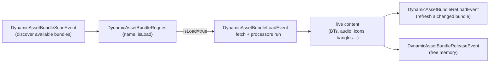

# 📦 Content delivery — dynamic AssetBundles (`v3.6.4-Zephyr` / OTA `v24.10.803`)

> Recovered from `Assembly-CSharp.dll` (the brain, `bo-android`) in the **v24.10.803** image. This is how
> Moxie's *content* — behavior trees, audio, animations, face icons, on-screen decorations,
> personalization — is packaged, delivered, and loaded on demand. It's the runtime layer beneath
> [`content-and-conversation.md`](content-and-conversation.md) (the module/volley format) and
> [`unity-assets.md`](../firmware/unity-assets.md) (the *static* app assets). For a self-hosted server, this is the
> **content update mechanism**: what a bundle is, where it comes from, and how the robot loads it.

## TL;DR

- Content ships as **Unity AssetBundles** loaded/unloaded **dynamically by name** at runtime
  (`DynamicAssetBundleRequest { string assetBundleName; bool isLoad; }`).
- Bundles come from **three sources** (`RobotAssetBundleSource`): `STREAMING_ASSETBUNDLES` (5001, baked
  into the app), `LOCAL_ASSETBUNDLES` (5002, on device storage), and **`REMOTE_ASSETBUNDLES` (5003,
  downloaded from the cloud)** — the last is what a revival server would serve.
- Each bundle carries a **file manifest** (path, size, version, hash, typed assets, tags) so the robot
  knows what's inside and whether it's up to date.
- **24 per-type processors** turn bundle assets into live content (behavior trees, audio composites,
  animations, HUD icons, "bangles," Moxie customizations, …), and markup references them by name.

## Where bundles come from — `RobotAssetBundleSource`

| Value | Source | Use |
|--:|---|---|
| `5001` | **`STREAMING_ASSETBUNDLES`** | baked into the APK (`StreamingAssets`) — the built-in content |
| `5002` | **`LOCAL_ASSETBUNDLES`** | the device's persistent storage — cached/side-loaded packs |
| `5003` | **`REMOTE_ASSETBUNDLES`** | **downloaded from the cloud** (`EBAssetBundleFetch`) — the OTA-content path a self-hosted server replaces |

So content is not baked-only: the robot fetches remote bundles at runtime, which is exactly how new
missions/activities were pushed without a full firmware OTA — and where a revival server plugs in.

## The bundle manifest — `EBAssetBundleFileManifest`

Each bundle is described by a manifest entry (built by `EBAssetBundleFileManifestBuilder`):

| Field | Type | Meaning |
|---|---|---|
| `filePath` | `string` | the bundle file |
| `fileSize` | `long` | size in bytes |
| `assetVersion` | `EBVersion` | content version (for update checks) |
| `hash` | `string` | integrity / change detection |
| `mainAsset` | `EBAssetInformation` | the primary asset (`{ name, Type }`) |
| `subAssets` / `subAssetTypeNames` | `EBAssetInformation[]` / `string[]` | the typed contents |
| `tags` | `string[]` | selection tags |
| `attributes` | `EBAssetAttributeMap` | arbitrary metadata (key `"assetbundle"`) |

`hash` + `assetVersion` are the update primitives: a server that serves `REMOTE` bundles just bumps
these to push new content, and the robot re-fetches on a mismatch.

## The load lifecycle

`DynamicAssetBundleBehaviour` subscribes to four events on the input bus
([`behavior-input-events.md`](behavior-input-events.md)) and drives bundles in and out of memory:

`AssetBundleLoadStatus` / `EBAssetBundleFileRuntimeState` track each bundle's state, so content is
streamed in only when needed (an activity's assets) and released after — important on the RK3288's
limited RAM.

## Content types — the 24 processors

Every asset kind has an `…AssetBundleProcessor` that instantiates it from a bundle:

| Group | Processors (content types) |
|---|---|
| **Behavior** | `BehaviourTree`, `FSM`, `BTEvent` — the NodeCanvas graphs ([`behavior-tree-engine.md`](behavior-tree-engine.md)); the `Bht_*` trees load from bundles here |
| **Audio** | `AudioClipProxy`, `AudioComposite` — clips + composited/sequenced audio |
| **Animation** | `AnimatorController`, `AnimGrinder`, `EBAnimationComposite`, `HUDAnimatorCollection` |
| **Face / HUD** | `Icon`, `IconAnimated`, `IconBubble` (the `cmd:icons-v2` face icons — [`behavior-markup.md`](behavior-markup.md)); `Bangle`, `BangleGroup` (on-face decorations, below) |
| **Personalization** | `MoxieCustomizationAsset`, `MoxieCustomizationPreview` — Moxie skins/customization |
| **Effects** | `ParticleCollection`, `ShaderCollection` |
| **Gesture** | `VocalGesture` (the `Bht_Vocal_Gestures` content) |
| **Generic** | `EBAssetProxy`, `EBAssetComposite`, `EBAssetCompositeParametrized`, `EBImageComposite` |

> **Bangles** (`class Bangle : EBImageComposite, RobotHUDAttachment, RobotHUDAsset`) are on-face **HUD
> attachments** — image composites layered onto the projected face (badges / decorations / seasonal
> flair), grouped as `BangleGroup`. This is the same face-screen surface the `icons-v2` marks use.

## Markup + selection

`AssetBundleMarkUpGenerator` lets a content module's markup reference a bundle asset by name (so a line
of dialog can pull in a specific animation/icon/bangle just-in-time), and `EBAssetBundleFilter` variants
(`…NameFilter`, `…PathFilter`, `…SizeFilter`, `…TagFilter`) select which bundles/assets apply.

## What this means for the three goals

**① Custom firmware / custom brain.** Content is a Unity-AssetBundle pipeline with a typed manifest and
24 asset processors — reproducible with Unity's AssetBundle tooling. A custom build ships `STREAMING`
bundles and/or serves `REMOTE` ones.

**② Server revival.** This is the **content-update contract**: serve `REMOTE_ASSETBUNDLES` with a
manifest (`hash` + `assetVersion`), and the robot fetches and loads them — how to push new
missions/animations/icons/bangles without a firmware OTA. The asset types tell you exactly what a bundle
may contain.

**③ Pre-801 revival.** No new lever; brain-side, above the network boundary.

---
📖 [Reverse-engineering index](../README.md) · [Content & conversation](content-and-conversation.md) · [Unity assets](../firmware/unity-assets.md) · [Behavior-tree engine](behavior-tree-engine.md) · [Behavior markup](behavior-markup.md)
