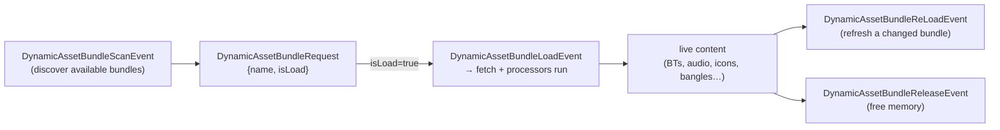

# 📦 Content delivery — dynamic AssetBundles (`v3.6.4-Zephyr` / OTA `v24.10.803`)

How Moxie's content — behavior trees, audio, animations, face icons, on-screen decorations,
personalization — is packaged and loaded on demand (decompiled `Assembly-CSharp.dll`, **v24.10.803**).
Content ships as **Unity AssetBundles** loaded/unloaded **by name** at runtime
(`DynamicAssetBundleRequest { string assetBundleName; bool isLoad; }`) from three sources — including
**remote** bundles fetched from the cloud, which is the content-update path a revival server replaces.
Each bundle has a hash+version manifest; 24 per-type processors turn assets into live content. What the
content *says* (modules, volleys) is in [content-and-conversation](content-and-conversation.md); static
app assets are in [unity-assets](../firmware/unity-assets.md).

## Sources — `RobotAssetBundleSource`

| Value | Source | Use |
|--:|---|---|
| `5001` | **`STREAMING_ASSETBUNDLES`** | baked into the APK (`StreamingAssets`) — built-in content |
| `5002` | **`LOCAL_ASSETBUNDLES`** | device persistent storage — cached/side-loaded packs |
| `5003` | **`REMOTE_ASSETBUNDLES`** | **downloaded from the cloud** (`EBAssetBundleFetch`) — how new missions/activities shipped without a firmware OTA |

## The manifest — `EBAssetBundleFileManifest`

Built by `EBAssetBundleFileManifestBuilder`:

| Field | Type | Meaning |
|---|---|---|
| `filePath` | `string` | the bundle file |
| `fileSize` | `long` | bytes |
| `assetVersion` | `EBVersion` | content version (update checks) |
| `hash` | `string` | integrity / change detection |
| `mainAsset` | `EBAssetInformation` | primary asset (`{ name, Type }`) |
| `subAssets` / `subAssetTypeNames` | `EBAssetInformation[]` / `string[]` | typed contents |
| `tags` | `string[]` | selection tags |
| `attributes` | `EBAssetAttributeMap` | arbitrary metadata (key `"assetbundle"`) |

`hash` + `assetVersion` are the update primitives: bump them on a `REMOTE` bundle and the robot
re-fetches on mismatch.

## Load lifecycle

`DynamicAssetBundleBehaviour` subscribes to four [input-bus](behavior-input-events.md) events:

```mermaid
flowchart LR
  scan["DynamicAssetBundleScanEvent<br/>(discover available bundles)"] --> req["DynamicAssetBundleRequest<br/>{name, isLoad}"]
  req -->|isLoad=true| load["DynamicAssetBundleLoadEvent<br/>→ fetch + processors run"]
  load --> live["live content<br/>(BTs, audio, icons, bangles…)"]
  live --> reload["DynamicAssetBundleReLoadEvent<br/>(refresh a changed bundle)"]
  live --> rel["DynamicAssetBundleReleaseEvent<br/>(free memory)"]
```

`AssetBundleLoadStatus` / `EBAssetBundleFileRuntimeState` track each bundle, so an activity's assets are
streamed in only when needed and released after (RK3288 RAM is limited).

## Content types — the 24 processors

Each asset kind has an `…AssetBundleProcessor`:

| Group | Processors |
|---|---|
| **Behavior** | `BehaviourTree`, `FSM`, `BTEvent` — the NodeCanvas graphs; the `Bht_*` trees load here ([behavior-tree-engine](behavior-tree-engine.md)) |
| **Audio** | `AudioClipProxy`, `AudioComposite` |
| **Animation** | `AnimatorController`, `AnimGrinder`, `EBAnimationComposite`, `HUDAnimatorCollection` |
| **Face / HUD** | `Icon`, `IconAnimated`, `IconBubble` (the `cmd:icons-v2` icons, [behavior-markup](behavior-markup.md)); `Bangle`, `BangleGroup` |
| **Personalization** | `MoxieCustomizationAsset`, `MoxieCustomizationPreview` — skins ([avatar slots](unity-face-animation.md#the-face-itself-a-customizable-avatar-clean-room-visual-spec)) |
| **Effects** | `ParticleCollection`, `ShaderCollection` |
| **Gesture** | `VocalGesture` (the `Bht_Vocal_Gestures` content) |
| **Generic** | `EBAssetProxy`, `EBAssetComposite`, `EBAssetCompositeParametrized`, `EBImageComposite` |

**Bangles** (`class Bangle : EBImageComposite, RobotHUDAttachment, RobotHUDAsset`) are on-face HUD
attachments — image composites layered onto the projected face (badges, decorations, seasonal flair),
grouped as `BangleGroup`; the same surface the `icons-v2` marks use.

**Selection.** `AssetBundleMarkUpGenerator` lets markup reference a bundle asset by name (a dialog line
can pull in an animation/icon/bangle just-in-time); `EBAssetBundleFilter` variants (`…NameFilter`,
`…PathFilter`, `…SizeFilter`, `…TagFilter`) select which bundles/assets apply.

## Implications

- **Custom build:** a standard Unity AssetBundle pipeline with a typed manifest — ship `STREAMING`
  bundles and/or serve `REMOTE` ones.
- **Server revival:** the content-update contract is "serve `REMOTE_ASSETBUNDLES` with a manifest
  (`hash` + `assetVersion`)"; the processor list is what a bundle may contain. Pre-801: no new lever.

---
📖 [Reverse-engineering index](../README.md) · [Content & conversation](content-and-conversation.md) · [Unity assets](../firmware/unity-assets.md) · [Behavior-tree engine](behavior-tree-engine.md) · [Behavior markup](behavior-markup.md)
