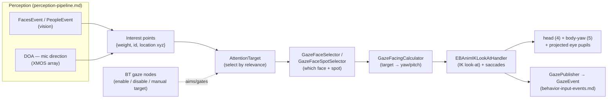

# 👀 Gaze & attention — how Moxie decides where to look (`v3.6.4-Zephyr` / OTA `v24.10.803`)

The loop that turns perception into eye contact (decompiled `Assembly-CSharp.dll`, **v24.10.803**; every
constant read from the binary). Faces, people and mic direction-of-arrival become **weighted 3D interest
points**; the best becomes the **`AttentionTarget`**; `GazeBehavior` aims head + eyes through an IK
look-at with angle-scaled **saccades** (12.5 ms floor, 10° re-target hysteresis). Gaze runs entirely
on-device — there is no gaze markup verb; content reaches it only through BT nodes and look-bearing trees.
The brain publishes its decision as `robotbrain.Attention`, which a server can subscribe to.



## The attention model

| Type | Fields | Meaning |
|---|---|---|
| `InterestPointInfo` (struct) | `weight : float`, `id : ulong`, `location : Vector3` | one thing worth looking at (invalid = id 0 / `float.MinValue`) |
| `AttentionTarget` | `_info : InterestPointInfo`, `_state`, `_timestamp` | the selected point + when chosen (`IsValid`, `TimeSince`) |
| `AttentionTargetInternal` | — | the brain's mutable working target (`GazeBehavior._attentionTarget`) |

Faces/people (from `libbo-vision`, [perception-pipeline](perception-pipeline.md)) and mic-array DOA
(`DOAInputEvent`) become interest points; the highest-`weight`, most-recent valid point becomes the
`AttentionTarget`. `AttentionEvent` publishes changes onto the [input bus](behavior-input-events.md).
During conversation the active speaker is chosen by DOA person scoring ([turn-taking](turn-taking.md#who-is-speaking-doa-person-scoring)).

## The published attention state — `robotbrain.Attention`

What the brain publishes on the bus (`embodied/robotbrain/TargetUser.proto`):

```proto
enum AttentionState { ATTENTION_UNKNOWN=0; TARGET_FOCUS=1; NO_TARGET_FOCUS=2; SEARCHING=3; }
message WorldLocation { uint64 id; float x; float y; float z; }              // a 3D world point
message InterestPoint { float weight; uint64 person_id; WorldLocation location; }  // wire form of InterestPointInfo
message Attention {                                                          // the published decision
  AttentionState        state;         // focused / no target / actively searching
  uint64                targeted_user; // the person being attended to (0 = none)
  repeated InterestPoint locations;    // the candidate interest points considered
}
message TargetedUser  { uint64 targeted_user_id; uint64 targeted_user_face_id; }  // target acquired
message NoTargetedUser { }                                                         // target lost
```

- `TARGET_FOCUS` = locked on someone; `NO_TARGET_FOCUS` = aware but not fixed; `SEARCHING` = actively
  looking — the "settled vs looking-around" body language.
- `targeted_user` / `targeted_user_id` is a **`FusedPerson.id`**
  ([perception-fusion](../protocol/perception-fusion.md#fusedpersonpb-one-tracked-human));
  `targeted_user_face_id` ties to [`FusedFacePB.face_tracker_id`](../protocol/perception-fusion.md#fusedfacepb-the-face-in-two-coordinate-frames).
- `TargetedUser`/`NoTargetedUser` are the acquire/lose edges; `Attention` is the continuous state +
  candidate set. Pipeline: fusion (who's in the room) → `Attention` → `GazeBehavior`.

## GazeBehavior — the controller

1. **Face/spot selection** — `GazeFaceSelector` → `GazeFaceSelectorDefault`; `GazeFaceSpotSelector` →
   `GazeFaceSpotSelectorBT` (behavior-tree-driven): which face, and which spot on it (eyes/nose/mouth).
2. **Facing calculation** — `GazeFacingCalculator` (`…Default`, `…Legacy`, `…CenterTarget` = look at the
   centroid, `…DebugLookAtPosition`): target 3D location → head **yaw/pitch** goal.
3. **IK look-at** — `EBAnimIKLookAtHandler` drives head (motor 4) + body-yaw (motor 5,
   [hardware-map](../hardware/hardware-map.md)) and the projected pupils, with saccades layered on
   (rig side: [face engine §7](unity-face-animation.md#7-gaze-look-at)). `GazePublisher` emits
   `GazeEvent`; `GazeLog` traces it.

| Constant | Value | Role |
|---|--:|---|
| `SaccadeMinTime` | **0.0125 s** | saccade duration floor (12.5 ms) |
| `SaccadeTimeAngleFactor` | **0.00235 s/°** | duration grows with amplitude (the biological **main sequence**) |
| `SaccadeCoolDownAngleLimit` | **5°** | moves under 5° skip the post-saccade cooldown (micro-adjustments) |
| `GazeTargetChangeTolleranceAngle` | **10°** | **hysteresis** — no re-target for a <10° change (no jitter between near-equal points) |
| `SaccadeMovementYawTime` / `PitchTime` | computed | per-axis durations (`MinTime` + angle × `AngleFactor`) |
| `ForceSaccade` / `CanSaccadeMove` | flags | force / gate a saccade this frame |
| `_gazeDefualtGts` | 2 | default gaze-target source |

## Control from content

BT nodes ([catalog](behavior-tree-engine.md#the-node-catalog-the-65-robotbt_-nodes)):
`RobotBT_GazeControlTarget` / `RobotBT_GazeControlManualTarget` (aim at a chosen target),
`RobotBT_GazeDisabler` (suspend autonomous gaze for a scripted look), `RobotBT_EyeGazeEnabled` /
`GazeControlManualTargetDataChanged`. Task priorities `EyeTrackBehavior`/`LookBehavior`/`GazeBehavior`
and resources `GazeTarget`/`GazeFacing`/`FaceTrack` are in the [task scheduler](task-scheduler.md).

## Implications

- **Custom brain:** weighted 3D interest points, a ~10° target hysteresis, angle-scaled saccades floored
  at 12.5 ms. The [SIL](../../architecture/sil-and-cicd.md) ships a simplified version (random gaze drift
  in `sim/web/moxie/liveness.js`, look-around beats in `sim/web/life.js`); these constants are what a
  faithful re-implementation would use.
- **Server revival:** gaze motion needs camera + mic array in real time, so it stays on-device. A server,
  a [telehealth](../protocol/telehealth.md) operator or the parent app can **subscribe to `Attention`**
  for situational awareness (who, and `TARGET_FOCUS`/`SEARCHING`). Pre-801: no new lever.

---
📖 [Reverse-engineering index](../README.md) · [Perception fusion](../protocol/perception-fusion.md) · [Perception pipeline](perception-pipeline.md) · [Behavior input events](behavior-input-events.md) · [Behavior-tree engine](behavior-tree-engine.md) · [Hardware map](../hardware/hardware-map.md)
