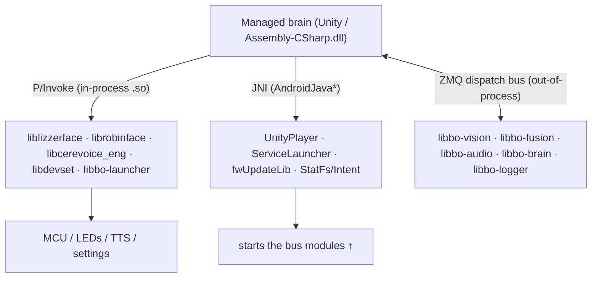

# 🔗 The native boundary — how the managed brain reaches native code (`v3.6.4-Zephyr` / OTA `v24.10.803`)

> Reverse-engineered from the decompiled `Assembly-CSharp.dll` (`bo-android`, the Unity brain) in the
> **v24.10.803** image — the `[DllImport]` P/Invoke declarations and `AndroidJava*` calls. The
> [native-library *inventory*](../firmware/firmware-803-reference.md#bo-android-native-libraries-the-brain-libarmeabi-v7a)
> lists the 29 `.so`s and their sizes; **this doc is the wiring** — the three distinct ways the managed
> C# brain actually reaches native code, and (the important part for a custom build) which heavy native
> work is *out of process* and therefore replaceable without reimplementing it.

## Three mechanisms

**P/Invoke** is for tightly-coupled native the brain calls directly; **JNI** reaches the Android platform
and starts services; the **ZMQ bus** ([robot-ipc-protocol](../protocol/robot-ipc-protocol.md)) is how the brain talks
to the *heavy* perception/ML modules, which run as **separate processes**.

## 1. In-process native — `[DllImport]`

### `liblizzerface.so` — the MCU control C API

The direct C interface to the **Lizard MCU** (motors, LEDs, sensors, power). This is the goal-① lever:
*this* is how firmware drives the hardware. The full surface:

| Function | Purpose |
|---|---|
| `bool robot_init()` / `robot_deinit()` | bring up / tear down the MCU link |
| `robot_motor_set_pos(byte motor, ushort pos)` | drive one motor to a raw position (counts, cf. [hardware-map](../hardware/hardware-map.md#driving-a-motor)) |
| `robot_motor_set_pos_dt(byte motor, ushort pos, byte deltaTime)` | …over a delta-time |
| `robot_motor_set_pos_rTime(ushort realTime, ushort p0…p6)` | set **all 7 motors atomically** in one call (the per-frame motor push) |
| `robot_configure_motor(byte motor, byte param, ushort val)` | set a motor param (PID etc., cf. `ConfigParam`) |
| `ushort robot_get_motor_config(byte motor, byte param)` | read a motor param back |
| `ulong robot_get_event()` | poll the MCU event word (touch / switch / IMU — decoded to [`MpuEventPB` et al.](../hardware/hardware-map.md)) |
| `robot_set_power_state(byte ps)` | set the MCU power state |
| `robot_set_motors_update(byte enabled)` | enable/disable the motor update loop |
| `robot_reset_xmos()` | reset the XMOS audio DSP (the native side of [`RESTART_XMOS`](../protocol/power-and-system-events.md#recovery-systemrecoverrequest)) |
| `robot_set_heart_brightness(byte brightness)` | the chest **heart LED** brightness |
| `robot_echo(char c)` | echo/ping the MCU (link test) |

The single `robot_motor_set_pos_rTime(realTime, p0..p6)` confirms the **7-motor** rig and that the brain
pushes all joints in one atomic frame update. These are the same operations exposed on the bus as
`embodied.lizzerface` protos (`MotorSetPosEventPB`, etc., [robot-ipc-protocol](../protocol/robot-ipc-protocol.md)) —
so there are **two ways to drive the MCU**: this in-process C API (what `bo-android` uses) and the ZMQ
messages (what a tunnelled [`MoxieBus`](../protocol/robot-ipc-protocol.md) client uses).

### `librobinface.so` — the physical LED-face driver

The **LED-array** face (the status "face" of LEDs, distinct from the Unity animated face) — an `LEDA_*`
("LED Array") API:

- `LEDA_init(byte led_num)` / `LEDA_connect()` — set up the array.
- `LEDA_run_cmd(uint[] color, byte[] bri_div, uint enable_grpCtrl, byte grp_bri)` — push a frame:
  per-LED `color`, per-LED brightness divider, group-control flag, and a group brightness.

This is the native side of the LED patterns in [hardware-map](../hardware/hardware-map.md#leds-the-face)
and the `ledctrld` daemon in [security-policy](../firmware/security-policy.md).

### The rest

- **`libcerevoice_eng.so`** — CereProc **CereVoice TTS**, called via **108** P/Invoke functions (the
  licensed local synth, [content-and-conversation](content-and-conversation.md#cerevoice-tts-libcerevoice_engso-44-mb)).
  Heavily coupled but *replaceable*: the brain can instead take rendered audio from the server
  ([CloudTTS](../protocol/unity-mainapp-interface.md#audio-out-tts-sfx-playback-control)).
- **`libdevset.so`** — the native **DeviceSettings** accessor: `DeviceSettings_Instance_get{Bool,Int,
  String,Float}S(key)` — how the managed side reads the [199 settings keys](../firmware/settings-schema.md)
  from the native settings store.
- **`libbo-launcher.so`** — `Start(string pluginPath)` / `Stop()`: the launcher loads the Unity brain as
  a plugin.

## 2. JNI — `AndroidJava*` (managed → Java/Android)

A thin bridge to the Android platform and Embodied's Java services:

| Class | Use |
|---|---|
| `com.unity3d.player.UnityPlayer` | the Unity activity/context |
| **`me.embodied.services.ServiceLauncher`** | **starts the native module processes** (the bus modules below) |
| `me.embodied.firmwareupdatelib.fwUpdateLibEntry` | Lizard/XMOS **DFU** ([hardware-map](../hardware/hardware-map.md#lizard-mcu-firmware-update-bootloader-goby)) |
| `android.os.StatFs` | disk-free stats (fed to `SystemState`) |
| `android.content.Intent` | Android intents (e.g. Bluetooth pairing) |

`ServiceLauncher` is the key one: the Unity brain doesn't link the perception/ML natives — it **launches
them as services** and then talks to them over the bus.

## 3. Out-of-process modules — the ZMQ bus

The heavy natives — **`libbo-vision`** (91 MB), **`libbo-fusion`** (40 MB), **`libbo-audio`** (184 MB),
**`libbo-brain`** (154 MB, ChatScript + ML), **`libbo-logger`** (MQTT) — do **not** link into Unity. They
run as **separate processes** (started via `ServiceLauncher`) and exchange
[protobuf-over-ZeroMQ](../protocol/robot-ipc-protocol.md) messages with the brain. That's why every perception/brain
capability in this repo is described as a **bus message**, not a function call.

**This is the single most important architectural fact for goals ① and ②:** the expensive, licensed,
opaque native ML (154 MB of `libbo-brain`, the MXNet models, Deepgram glue) is **behind a documented bus
protocol**. A custom brain or a self-hosted server **replaces those modules by speaking the bus**
([the full protocol is documented](../README.md)) — you never reimplement or extract them. Only the
in-process natives above (MCU, LEDs, TTS, settings) are things a *custom firmware* image must actually
provide or call.

## What this means for the three goals

**① Custom firmware.** `liblizzerface.so` is the exact C API to drive the motors, LEDs, power, and read
sensors — the hardware lever. `librobinface`/`libdevset` cover the LED face and settings. Everything
heavier (vision/fusion/audio/brain) is out-of-process behind the bus, so a custom build swaps modules
without touching the 154 MB brain blob. `ServiceLauncher` is how those processes come up.

**② Server revival.** Confirms the boundary a server sits at: the on-device ML modules are bus peers, and
the server is just another peer (over MQTT↔bus, [cloud-protocol](../protocol/cloud-protocol.md)). Nothing
native needs to be reimplemented server-side.

**③ Pre-801 revival.** No new lever; this is internal architecture above the network boundary.

---
📖 [Reverse-engineering index](../README.md) · [Robot IPC protocol](../protocol/robot-ipc-protocol.md) · [Hardware map](../hardware/hardware-map.md) · [Native lib inventory](../firmware/firmware-803-reference.md) · [HAL & drivers](../firmware/hal-and-drivers.md)
