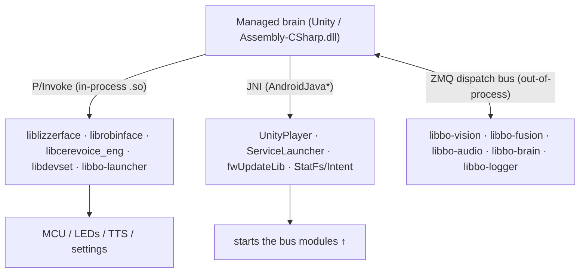
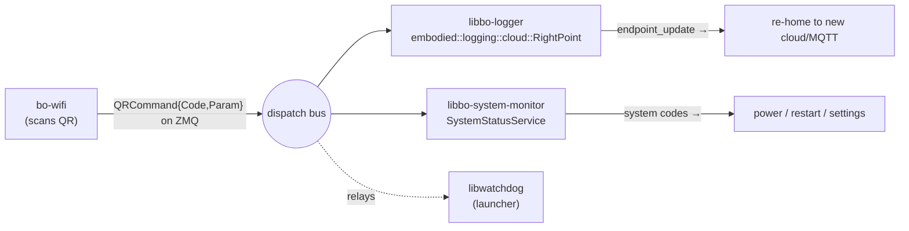

# 🔗 The native boundary — how the managed brain reaches native code (`v3.6.4-Zephyr` / OTA `v24.10.803`)

How the managed C# brain (`bo-android`, decompiled `Assembly-CSharp.dll`, **v24.10.803**) reaches native
code — `[DllImport]` declarations, `AndroidJava*` calls, and `nm -D`/`readelf -d` on the shipped `.so`s.
Three mechanisms: **P/Invoke** for tightly-coupled in-process libs (MCU, LED face, TTS, settings),
**JNI** to the Android platform (incl. starting services), and the **ZMQ bus** to the heavy out-of-process
ML modules. The key fact: the expensive native ML sits **behind a documented bus**, so a custom brain or
server replaces it by speaking the bus. The library list + sizes is the
[native-library inventory](../firmware/firmware-803-reference.md#bo-android-native-libraries-the-brain-libarmeabi-v7a).

```mermaid
flowchart TB
  brain["Managed brain (Unity / Assembly-CSharp.dll)"]
  brain -->|"P/Invoke (in-process .so)"| pinv["liblizzerface · librobinface · libcerevoice_eng · libdevset · libbo-launcher"]
  brain -->|"JNI (AndroidJava*)"| jni["UnityPlayer · ServiceLauncher · fwUpdateLib · StatFs/Intent"]
  brain <-->|"ZMQ dispatch bus (out-of-process)"| mods["libbo-vision · libbo-fusion · libbo-audio · libbo-brain · libbo-logger"]
  pinv --> hw["MCU / LEDs / TTS / settings"]
  jni --> svc["starts the bus modules ↑"]
```

## 1. In-process native — `[DllImport]`

### `liblizzerface.so` — the MCU control C API

The direct C interface to the **Lizard MCU** (motors, LEDs, sensors, power) — the custom-firmware
hardware lever. Imported by the managed brain:

| Function | Purpose |
|---|---|
| `bool robot_init()` / `robot_deinit()` | bring up / tear down the MCU link |
| `robot_motor_set_pos(byte motor, ushort pos)` | drive one motor to a raw position ([counts](../hardware/hardware-map.md#driving-a-motor)) |
| `robot_motor_set_pos_dt(byte motor, ushort pos, byte deltaTime)` | …over a delta-time |
| `robot_motor_set_pos_rTime(ushort realTime, ushort p0…p6)` | set **all 7 motors atomically** (the per-frame motor push) |
| `robot_configure_motor(byte motor, byte param, ushort val)` | set a motor param (PID etc., cf. `ConfigParam`) |
| `ushort robot_get_motor_config(byte motor, byte param)` | read a motor param |
| `ulong robot_get_event()` | poll the MCU event word (touch / switch / IMU → [`MpuEventPB` et al.](../hardware/hardware-map.md)) |
| `robot_set_power_state(byte ps)` | set the MCU power state |
| `robot_set_motors_update(byte enabled)` | enable/disable the motor update loop |
| `robot_reset_xmos()` | reset the XMOS DSP (native side of [`RESTART_XMOS`](../protocol/power-and-system-events.md#recovery-systemrecoverrequest)) |
| `robot_set_heart_brightness(byte brightness)` | chest **heart LED** brightness |
| `robot_echo(char c)` | echo/ping the MCU (link test) |

The library exports **20** functions; these **7 are exported but never imported** by the brain — lower
level primitives the factory tools use directly:

| Native-only export | Purpose |
|---|---|
| `robot_get_system_info` | MCU system/version info |
| `robot_event_reset` | flush the MCU event queue |
| `robot_require_motor_pos` | request/poll a motor's current position |
| `robot_set_motor_state` | enable/disable an individual motor |
| `robot_new_command` / `robot_new_param` | raw command/param injection into the MCU protocol |
| `robot_app_exit` | shut the MCU-side app down |

`robot_motor_set_pos_rTime` confirms the **7-motor** rig and atomic per-frame joint updates. The same
operations exist on the bus as `embodied.lizzerface` protos (`MotorSetPosEventPB`, …,
[robot-ipc-protocol](../protocol/robot-ipc-protocol.md)) — two ways to drive the MCU: this C API (what
`bo-android` uses) and bus messages (what a tunnelled `MoxieBus` client uses).

### `librobinface.so` — the physical LED-face driver

The **LED-array** status face (distinct from the Unity animated face), an `LEDA_*` API:

- `LEDA_init(byte led_num)` / `LEDA_connect()` — set up the array.
- `LEDA_run_cmd(uint[] color, byte[] bri_div, uint enable_grpCtrl, byte grp_bri)` — push a frame: per-LED
  color, per-LED brightness divider, group-control flag, group brightness.
- Further exports: `LEDA_get_color`, `_LEDA_init_led_map`, `_LEDA_push_cmd`, and **`i2c1_init`,
  `i2c2_init`, `i2c_init`, `initGPIO`, `_daq_connect`** — the LED face runs over **two I²C buses + GPIO**
  ([device-tree](../hardware/device-tree.md) I²C map), not the motor MCU's UART.

Native side of the [LED patterns](../hardware/hardware-map.md#leds-the-face) and the `ledctrld` daemon
([security-policy](../firmware/security-policy.md)).

### The rest

- **`libcerevoice_eng.so`** — CereVoice TTS via **108** P/Invoke functions
  ([content-and-conversation](content-and-conversation.md#cerevoice-tts-libcerevoice_engso-44-mb));
  replaceable by server-rendered [CloudTTS](../protocol/unity-mainapp-interface.md#audio-out-tts-sfx-playback-control).
- **`libdevset.so`** — native DeviceSettings accessor `DeviceSettings_Instance_get{Bool,Int,String,Float}S(key)`
  for the [199 settings keys](../firmware/settings-schema.md).
- **`libbo-launcher.so`** — `Start(string pluginPath)` / `Stop()`: loads the Unity brain as a plugin.

## 2. JNI — `AndroidJava*` (managed → Java/Android)

| Class | Use |
|---|---|
| `com.unity3d.player.UnityPlayer` | the Unity activity/context |
| **`me.embodied.services.ServiceLauncher`** | **starts the native module processes** (§3) |
| `me.embodied.firmwareupdatelib.fwUpdateLibEntry` | Lizard/XMOS **DFU** ([hardware-map](../hardware/hardware-map.md#lizard-mcu-firmware-update-bootloader-goby)) |
| `android.os.StatFs` | disk-free stats (fed to `SystemState`) |
| `android.content.Intent` | Android intents (e.g. Bluetooth pairing) |

The brain doesn't link the perception/ML natives — it launches them as services and talks over the bus.

## 3. Out-of-process modules — the ZMQ bus

**`libbo-vision`** (91 MB), **`libbo-fusion`** (40 MB), **`libbo-audio`** (184 MB), **`libbo-brain`**
(154 MB, ChatScript + ML) and **`libbo-logger`** (MQTT) run as **separate processes** (via
`ServiceLauncher`) exchanging [protobuf-over-ZeroMQ](../protocol/robot-ipc-protocol.md). That is why every
perception/brain capability in these docs is a bus message, not a function call — and why a custom brain
or server replaces them by speaking the bus instead of reimplementing them. Only the in-process natives
(§1) must be provided or called by a custom image.

**The broker — `libbo-dispatch.so` (8.6 MB):**

- **statically-linked ZeroMQ** — exports the full `zmq_*` C API (`zmq_poller_*`, `zmq_msg_*`,
  `zmq_socket_monitor*`, and the **RADIO/DISH** draft API `zmq_join`/`zmq_leave`/`zmq_msg_set_group`) —
  real libzmq, not a reimplementation;
- **`embodied::dispatch::Dispatcher`** (log tag `[BoDispatcher]`, module `bo-dispatch`) runs its loop on
  its own thread (a `void (Dispatcher::*)()` entry), plus **`core::EventBroadcaster`** — the XSUB↔XPUB
  proxy every module connects to. A custom program joins by connecting to the XSUB/XPUB endpoints and
  speaking framed protobuf (the toolkit's `MoxieBus`).

### The full module roster — what each remaining `bo-*` `.so` actually is

`bo-android` ships **30** native `.so`s. `readelf -d` + demangled symbols on the rest:

| Library | Size | Identity (namespace / build tag) | Role |
|---|--:|---|---|
| **`libbo-analytics.so`** | 93 MB | `embodied::vision::MainLoop` · `perception::vision` | A second **camera-vision engine**: OpenCV (ArUco, RANSAC, `wechat_qrcode`) + TFLite + camera2-NDK + ZBar. Emits `FacesTracked`, `ZBarQRCodeRead` / `MarkerRead`, and **`ImageToTextPB`** (on-device VQA: `prompt` / `question` / `session_id`). `NEEDED: libbsk, libtensorflowlite, libcamera2ndk, libmediandk, libzbar`. |
| **`libbo-system-monitor.so`** | 35 MB | `embodied::logging::SystemStatusService` | **System-status service** — power (`PowerStatePB`), volume (`SystemVolumeModify`), timezone (`TimeZoneInfo`), `SettingSchema`; `NEEDED: liblizzerface`. **Consumes `QRCommand`** (below). |
| **`libwatchdog.so`** | 71 MB | `embodied::launcher::Watchdog` · build tag `bo-launcher` | **Launcher watchdog** — supervises/restarts module processes (native half of `ServiceLauncher`, [§2](#2-jni-androidjava-managed-javaandroid)); statically links the `perception::fusion` + `robotbrain` + `QRCommand` protos it relays. |
| **`libbsk.so`** | 22 MB | `BSK*` (`BSKCustomImageWarp`, `BSK_PCCR`, `BSKProfileUtil`) | Image-processing kernel (warp, LUT, `PCCR`) under `libbo-analytics`; no `embodied::` API. |
| **`librfc.so`** | 0.6 MB | `RfcPredict` / `RfcTrilsPredict`, path `bo-audio/third_party/rfc` | Random-forest classifier in the **audio** pipeline (`float*` features in, prediction out). |
| **`libmain.so`** · **`libnative-lib.so`** | 27 KB · 104 KB | — | Entry glue — `libmain` is the loaded-plugin entry ([`libbo-launcher.Start(pluginPath)`](#the-rest)); `libnative-lib` a small JNI helper. |

So the heavy natives are two vision engines (`bo-vision` + `bo-analytics`), the audio/brain/fusion trio,
and a supervision/telemetry layer (`watchdog`, `system-monitor`, `analytics`, `logger`) — all behind the bus.

### Resolved: who consumes `QRCommand` (the setup-QR → brain bridge)

`bo-wifi` publishes every scanned debug command as `embodied.unity.QRCommand{Code, Param}`
([qr-commands](../protocol/qr-commands.md)); the managed brain has zero references to it. The consumers
are native:

```mermaid
flowchart LR
  wifi["bo-wifi<br/>(scans QR)"] -->|"QRCommand{Code,Param} on ZMQ"| bus(("dispatch bus"))
  bus --> logger["libbo-logger<br/>embodied::logging::cloud::RightPoint"]
  bus --> sysmon["libbo-system-monitor<br/>SystemStatusService"]
  bus -.relays.-> wd["libwatchdog<br/>(launcher)"]
  logger -->|"endpoint_update →"| cloud["re-home to new cloud/MQTT"]
  sysmon -->|"system codes →"| sys["power / restart / settings"]
```

- **`libbo-logger`** (`embodied::logging::cloud::RightPoint`) — `AddListener<embodied::ProtoEventArgs<embodied::unity::QRCommand>>` with a `RightPoint::*` member handler: the cloud/MQTT module, where **`endpoint_update`** lands (re-points the robot at a new cloud).
- **`libbo-system-monitor`** (`SystemStatusService`) — `AddListener<…QRCommand…>` (free-function handler): the system-level codes.
- **`libwatchdog`** — links `descriptor_table_embodied_2fwifiapp_2fQRCommands_2eproto` (`CreateMessage<QRCommand>`): relays/constructs the message across supervised modules.

The effective QR command set is therefore closed: what the cloud/logger and system-monitor act on. A
custom firmware or bus client reproduces it by publishing `QRCommand` and handling the codes in its own
cloud/system layer.

## Implications

- **Custom firmware:** `liblizzerface.so` (full 20-function surface) drives motors, LEDs, power and
  sensors; `librobinface`/`libdevset` cover the LED face and settings; everything heavier is swapped at
  the bus without touching the 154 MB brain blob.
- **Server revival:** on-device ML modules are bus peers and the server is just another peer (MQTT↔bus,
  [cloud-protocol](../protocol/cloud-protocol.md)); nothing native is reimplemented server-side.
  Pre-801: no new lever.

---
📖 [Reverse-engineering index](../README.md) · [Robot IPC protocol](../protocol/robot-ipc-protocol.md) · [Hardware map](../hardware/hardware-map.md) · [Native lib inventory](../firmware/firmware-803-reference.md) · [HAL & drivers](../firmware/hal-and-drivers.md)
