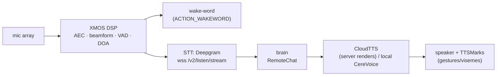
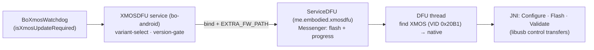

# 👂👁️ Perception pipeline — audio & vision

> Analyzed build: **v3.6.4-Zephyr / OTA v24.10.803** (RK3288, Android 9) — see [`firmware-803-reference.md`](../firmware/firmware-803-reference.md).

How sound and sight flow through the robot, from the `embodied.perception.*` / `embodied.unity` protos
and `bo-android`'s audio/vision code: wake-word → XMOS mic DSP → STT → brain → TTS → speaker, plus the
vision events (faces, people, pose, QR, camera activities). Wake-word and VAD are fully on-device; a
revival server sits in the middle (receives STT, returns TTS) and can plug in either as a
Deepgram-compatible cloud STT or as an on-device `zmqSTT` engine. Also here: the XMOS DSP's own
firmware and its USB-DFU update chain.

## Audio: hear → understand → speak



### Input side (`embodied.perception.audio`)
- **XMOS DSP** — acoustic echo cancellation, mic-array **beamforming**, **VAD**, **DOA**. Config via
  `EchoSuppressConfig` / `XmosConfig`; firmware updated by `bo-xmos-wd`/`xmosdfu`
  ([below](#xmos-firmware-dfu)); `BO_XMOS_WD` gates service launch on XMOS readiness ("XMOS is not ready,
  deferring launching services").
- **STT engines** (`STT_IMPL` / `LOCAL_STT`, [settings-schema](../firmware/settings-schema.md)):
  - **Cloud (primary): Deepgram** — `wss://deepgram-test.embodied.com/v2/listen/stream`, bearer auth
    ([network-trust](../protocol/network-trust.md)). A legacy **Google Speech** path also exists
    (`GoogleAccount{project_id}` selects the GCP project).
  - **Offline: Kaldi** — `embodied::audio::KaldiSTT` runs a **Kaldi online-nnet3** decoder: MFCC +
    **i-vector** speaker adaptation (`OnlineNnet2FeaturePipelineInfo`, `AcceptIvector`) → **nnet3**
    acoustic model (`DecodableNnetSimpleLoopedInfo`) → `HCLG.fst` lattice decode (`LatticeFaster`/`StdToken`)
    → **RNNLM** rescoring (`kaldi::rnnlm`). `USE_LOCAL_STT_QUANTIZED_MODEL` selects a quantized model; used
    offline / `WAKE_WITHOUT_NET` / fallback. The model (`final.mdl`, `HCLG.fst`, `words.txt`, i-vector
    extractor, RNNLM) is **synced content**, like the voice + ChatScript ([content-and-conversation](content-and-conversation.md)).
  - **ASR biasing** — `PhraseHints{module, hints[]}` (per-activity), `NameHints{names[]}` (family names),
    `NativeHints`; a revival can pass these to its STT (keyword boosting).
- STT output: `STTPartial` / final — `speech`, `confidence`, `alternatives`, `language`,
  `original_speech`/`original_language` (translation), `event_id`, start/end timestamps.
- **Speaker ID** — `Speaker{id, doa, id_confidence, doa_observations}` + `EnrollmentState` (voice enrollment).
- Activity/quality — `VoiceActivity{state, doa}`, `DOA{doa, vad, doa_ready}`, `PoorSNR{event_id}`.
- **Barge-in** — `Interrupt` / `AllowInterrupt{allow}` / `CutoffStatistics` (how often speech was cut
  off); the state machine is [turn-taking](turn-taking.md#barge-in-interruption).

#### STT response wire format (`DeepgramResponse`)
A Deepgram-compatible result the robot already parses — what a self-hosted STT (Whisper, Vosk, …) returns:

```proto
message DeepgramResponse {
  float duration = 1; float start = 2;
  bool  is_final = 3;                 // this segment is final (vs interim)
  bool  speech_final = 4;             // end-of-utterance (endpointing) → close the turn
  message Channel {
    message Alternative {
      string transcript = 1; float confidence = 2;
      message Word { string word = 1; float start = 2; float end = 3; float confidence = 4; }
      repeated Word words = 3;        // per-word timings + confidence
    }
    repeated Alternative alternatives = 1;   // n-best
  }
  Channel channel = 5;
}
```

`speech_final=true` ends the child's turn. Optional timing telemetry: **`ASRAnalytics`**
(`detected_speech_start/end`, `asr_first_response`, `total/max/min_send_time`, `final_result_count`,
`error_message[]`).

#### The internal STT bus interface (`zmqSTT`) — how any engine plugs in

On-device, the audio module talks to whichever engine (Deepgram glue or Kaldi) through one bus contract,
`embodied.perception.audio.zmqSTT`:

```proto
message zmqSTTRequest {
  enum VADState { UNKNOWN=0; START_OF_SPEECH=1; SPEECH=2; END_OF_SPEECH=3; }
  VADState vad;          // the XMOS VAD state for this chunk (frames the utterance)
  bytes    audio_content;// the PCM chunk
  string   uuid;         // the utterance id
}
message zmqSTTResponse {
  enum ResponseType { PARTIAL=0; FINAL=1; }
  ResponseType type;  string speech;  float confidence;  uint64 start_timestamp, end_timestamp;  string uuid;
  uint32 error_code;  string error_message;
  string language;  repeated string alternatives;                       // recognized + n-best
  string original_language;  string original_speech;  repeated string original_alternatives;  // pre-translation
  repeated float speaker_id;                                            // per-word speaker attribution
}
```

VAD-framed chunks go in (`START_OF_SPEECH` → `SPEECH…` → `END_OF_SPEECH`); `PARTIAL` then `FINAL` come
back, translation-aware and speaker-attributed (cf. [fusion](../protocol/perception-fusion.md#fusedspeechpb-the-voice-fused-onto-the-person)).
Results are republished to the brain as:

| Event | Meaning |
|---|---|
| `STTReady` | engine up and listening |
| `STTPartial` / `STTFinal { Speaker, speech, confidence, start/endTimestamp, event_id }` | interim / committed transcription, attributed to a `Speaker` (id + DOA) |
| `SpeechStateChanged { bool state, Speaker }` | a speaker started/stopped talking |
| `CutoffDetected { cutoff_duration, stt_uuid }` / `NonTargetCutoff` | a barge-in cut the current line (non-target speaker for the latter) |

Either plug-in point (Deepgram-shaped cloud STT or `zmqSTT` engine) yields the same `STTFinal` stream.

### Wake-word & VAD (fully on-device)

A server never handles wake; it sees STT only after wake + speech. Three layers:

- **XMOS (hardware):** the `wk` firmware variants ([images](#shipped-dsp-images-xmosdfuapk-decode-the-naming))
  run on-chip keyword spotting for "Hey, Moxie" on the VocalFusion chip, plus DOA/AEC. `XMOS_VARIANT`
  picks the image; `XMOS_VAD_BOOST_*`/`XMOS_DOA_BOOST_*` tune it.
- **TRILLsson (TFLite, on the RK3288):** `embodied::audio::TrillFeatureExtractor` + `TrillVAD` +
  `TrillssonListener` run **Google TRILLsson** (distilled non-semantic speech embedding) via
  `libtensorflowlite` for VAD and speaker/voice features (`USE_TRILS_FEATS`,
  `TRILL_THRESHOLD/VAD/PREFIX/POSTFIX`, `TRILL_WEBRTC_TH`).
- **WebRTC VAD** fallback (`WEBRTC_VAD_AGGRESSIVENESS`, `..._SPEECH_START/STOP`) plus `VAD_CONFIG_HIGH/LOW/OFF`.

Detection emits **`WakeWordEvent{wake_word_detected}`** (`ACTION_WAKEWORD`, log "Wakeword key event
detected. Sending detect intent"). Other wake sources: the **button** (`WAKE_BUTTON`, the Macro key,
[device-tree](../hardware/device-tree.md)), **touch** (`TOUCH_WAKEUP`/`TOUCH_WAKE_ENABLED`), **smart
wakeup** (`ENABLE_SMART_WAKEUP`); `AUDIO_WAKE_SET`/`VC_WAKE`/`WAKE_WITHOUT_NET` gate voice wake.

### Output side — TTS (`embodied.unity`)
- Brain → **`CloudTTSRequest{markup, event_id, chunk_num, user_id}`** — the markup is speech + `<mark
  name="cmd:…">` tags ([behavior-markup](behavior-markup.md)).
- ← **`CloudTTSResponse{audio: AudioBuffer(buffer, channels, sample_rate), marks: TTSMark[], event_id,
  chunk_num}`** — **the server renders PCM**. Local **CereVoice** (`libcerevoice_eng.so`) is the
  on-device path/fallback.
- **`TTSMark{time, start, end, type, value}`** — timeline marks lifted from the markup so the face syncs
  visemes and gestures ([face engine §6](unity-face-animation.md#6-the-mouth-visemes-lip-sync)).
  `SpeechPlaybackState{isPlaying}` reports playback.
- **`CloudTTSSupplement{event_id, chunk_num, text, markup, tts_engine, translation_time,
  automarkup_time, synthesis_time, total_time}`** — per-chunk analytics revealing the server-side stages
  *translate → auto-markup → synthesize*; optional (zeros or omit).

A revival server terminates STT, answers `RemoteChat`, and satisfies `CloudTTSRequest` with any TTS plus
`TTSMark`s derived from its markup; chunking (`chunk_num`, `stream_response`, `response_chunks`) streams
long replies.

## Vision (`embodied.perception.vision`)

The camera (OV2710) feeds a CV stack (`libbo-vision`, TFLite; a second engine, `libbo-analytics`, is in
[native-boundary](native-boundary.md#the-full-module-roster-what-each-remaining-bo-so-actually-is)):

| Message | Content |
|---|---|
| **`FacesDetectedPB { frame_id, DetectedFacePB faces[] }`** | per-frame detections; `DetectedFacePB`: `center_x/y`, `width`, `height`, `confidence`, head `pitch`/`yaw`/`roll`, **`emotion` + `emotion_proba`**, `left_eye_x/y` + `right_eye_x/y`, `occlusion`, a **`gesture`** string |
| **`FacesTrackedPB { TrackedFacePB faces[] }`** | tracked faces: stable **`id`**, recognized **`name`**, **`WorldPosition { center_x/y/z, width, height }`** |
| `FacesRecognizedPB` / `RecognizedPersonPB` / `Person { Face }` | recognition result; a detected person paired with their face |
| `FaceIDEnrollmentState` | face-enrollment progress/errors |
| `PersonPB` / `PeopleDetectedPB` | person bboxes + `frame_id` (body detection) |
| **`PosesEstimatedPB { PosePB people[] }`** | `PosePB`: `class_id`, `new_pose_id`, `proba`, **`jointPosPB joints[] { index, x, y }`** — 2D skeleton keypoints (not motor names, [hardware-map](../hardware/hardware-map.md#arm-anatomy-what-arm_in_out-actually-is)) |
| `Gaze` (unity) | where the person/robot is looking |
| `OcclusionPB { occluded, occlusion_percentage }` / `RapidMotionPB { rapid_motion }` | camera covered / fast motion |
| **`QRPB{qrcode, timestamp}`** | decoded QR string — feeds both the setup grammar ([qr-commands](../protocol/qr-commands.md)) and content QRs ([content-and-conversation](content-and-conversation.md#qr-inside-content-ties-to-the-qr-toolkit)) |
| **`ShowState { Type, State }`** | "show me" brackets: `Type` = `BOOK` / `DRAWING` / **`ARUCO`** (fiducial) / `FACE`; `State` = `STARTED` / `FINISHED` |
| `OfflineMediaPB` + `FacesAnalyzedPB { AnalyzedFacePB }` + `OfflineAnalysisReady` | analysis of **stored media**, not just the live feed |

A face goes **detected (2D + emotion) → tracked (id + name + 3D) → [fused](../protocol/perception-fusion.md)**.
Moxie reads the child's expression (`emotion`), distinct from its own expressed mood.

### Face recognition & enrollment data model
Recognition uses the [MXNet embedding path](../firmware/firmware-inventory.md#the-on-device-ml-stack-four-frameworks):

- **`FaceDescriptor`** — geometry (`center`, `w`/`h`, `pitch`/`yaw`/`roll`), quality (`blur`, `occlusion`),
  landmarks (`left_eye`, `right_eye`, `chin`), and **`repeated float descriptors`** — the face-embedding
  vector. Recognition = nearest neighbour against enrolled users; `id` is the match.
- **`FaceIDEnrollmentInfo{uuid, number_of_enrollments}`** + **`FaceIDEnrollmentsInfo{enrollments[]}`** —
  the enrollment registry ("learn my face", [content-and-conversation](content-and-conversation.md#session-sleep-lifecycle)).
- **`AnalyzedFacePB`** — bbox + `HeadPosePB` + **`ActionUnitPB`** (FACS action units → `emotion`/
  `emotion_proba`) + `landmarks[]`.

> 🔒 The embedding is **biometric data** and matches **on-device**; a revival server neither receives nor
> stores it (cf. child-PII encryption, [crypto-and-keys §5b](../phone/crypto-and-keys.md#5b-field-level-encryption-apimodelschildjava177-196-asdecrypteddata)).

### Camera-driven activities (content activates these)

Recognizers content modules switch on via `Enable*{run}` toggles and `eb_enable_*` execution actions:

| Recognizer | Proto | Enable | Activity |
|---|---|---|---|
| **Book** | `BookIdPB{bookname, center_x/y}` | `EnableBook` | IDs the physical book held up |
| **Draw / card** | `DrawIdPB{drawname, center_x/y}` | `EnableDraw` | IDs a card/drawing shown |
| **Image→Text (VQA)** | `ImageToTextPB{question, prompt, description, targeted_region, is_mentor}` | `EnableICModule` | captioning / visual QA on a region (gated by `IMAGE_CAPTIONING`/`IMAGE_CAPTIONING_MODEL`; `IMAGE_CAPTIONING_TIMEOUT`/`IMAGE_CAPTION_BY_RB` route it locally or via the remote brain) |
| **QR** | `QRPB{qrcode}` | `EnableQRCode` | content/launch QR |
| **Look-at** | `LookAtMeRequest{user, bot}` | — | make eye contact with a specific user |

These are optional for a server: ignore them, or implement the recognizer server-side and return the
`*IdPB`/description. Audio + vision are fused (`embodied.perception.fusion.FusedPeople`) into who is
present, where, and whether engaged — driving targeting (`RobotEngageTurn`,
`RobotTurnToOutOfViewChatTarget`) and the `BlockedType` reasons (`TARGET_OUT_OF_VIEW`, `NOT_ENGAGED`) in
[cloud-protocol](../protocol/cloud-protocol.md).

## XMOS firmware (DFU)

The XMOS VocalFusion-class far-field voice chip is a **third embedded processor**, updated from Android
over **USB DFU** (`libusb`, `/dev/bus/usb`) by `xmosdfu` / `bo_xmosupdate` (native `XMOSDFU` class).

| Aspect | Detail |
|---|---|
| Transport | USB DFU via libusb (`libusb_open_device_with_vid_pid`, `find_usbfs_path`) |
| Ops | `xmos_dfu_resetintodfu` → `--download <image>` → `xmos_dfu_resetfromdfu`; **`--revertfactory`** restores the factory image |
| Active image | **`/vendor/etc/firmware/xmosdfu.bin`** (and `xmosdfu-<variant>.bin`) |
| Trigger | `bo-android`'s **`BoXmosWatchdog`** (`isXmosUpdateRequired`, "Checking for XMOS Update"); gated by `FEA_XMOS_WATCHDOG` and XMOS readiness at boot ([boot-and-launcher](../firmware/boot-and-launcher.md)) |

### The update chain — three layers (`v24.10.803`)

From `bo-android`'s `me.embodied.services.XMOSDFU` + the standalone `me.embodied.xmosdfu` app:



1. **`XMOSDFU` service** (orchestration) — picks `/vendor/etc/firmware/xmosdfu-<variant>.bin` (+
   `xmosdfu-<variant>_version.txt`) from the **`xmos_variant`** setting, falling back to `xmosdfu.bin`.
   Flashes **only if** the `*_version.txt` differs from SharedPreference `xmos_version` (a variant's
   version is encoded `firstChar*100 + baseVersion`), then `bindService`s the DFU app with the path as
   `EXTRA_FW_PATH`/`fwpath` and polls progress on a timer.
2. **`ServiceDFU`** (`me.embodied.xmosdfu`, via **Messenger IPC**, `ComponentName("me.embodied.xmosdfu",
   "…ServiceDFU")`) — on `Flash(fwpath)` spawns a `DFU` thread; exposes `GetProgress()` and `PASS`/`FAIL`.
3. **`DFU` thread** — finds the XMOS by **USB vendor id `0x20B1` (8369, XMOS Ltd)** (`USB.java`), then
   **`Setup → Flash → Validate`** through JNI `Configure(int)`, `Flash(int, path)`, `Validate(int, path)` —
   the libusb control transfers (search 10 s, reset 10 s, 1 KB blocks).

Custom firmware can reflash the DSP from userspace: drop `xmosdfu[-variant].bin` in
`/vendor/etc/firmware/`, bump its `_version.txt`, and the watchdog flashes on next boot — no JTAG.

### Shipped DSP images (`xmosdfu.apk`) — decode the naming
`res/raw/` ships **8** images (`v24.10.803`): six `nowk`/mic builds (~146 KB) and two `wk` builds
(~426 KB; the wake model adds ~280 KB):

| Image | Size |
|---|--:|
| `p9_16k_10_10_cm_nowk.bin` · `p9_16k_10_30_mic01.bin` · `p9_16k_10_30_mic23.bin` | 146,432 |
| `p9_48k_10_10_cm_nowk.bin` · `p9_48k_10_10_mic01.bin` | 147,200 |
| `p9_48k_10_10_mic23.bin` | 147,456 |
| **`wk_moxie_ep1_48k_10_10_cm.bin`** · **`wk_moxie_p9_48k_10_10_cm.bin`** | 425,728 |

Fields: **p9 / ep1** — audio-board rev in XMOS's own naming (Moxie P9 / EP1; *not* the Lizard
`REVISION_D*` / MoxieBlue scheme in [hardware-map](../hardware/hardware-map.md)); the wake builds are
`wk_moxie_ep1`/`wk_moxie_p9` (not `wk_blue`); **16k / 48k** — sample rate; **10_10 / 10_30** — DSP
pipeline/geometry; **cm** — combined/comms mic mode; **mic01 / mic23** — active mic pair; **wk / nowk** —
wake-word on/off (only at 48k/cm, one per board rev). `test.wav` (3 MB) ships for audio validation.

## The three embedded processors (firmware map)

| Processor | Role | Update path | Image format |
|---|---|---|---|
| **RK3288** (this OS) | main SoC — brain, vision, Unity face | A/B `update_engine` OTA ([ota-and-recovery](../firmware/ota-and-recovery.md)) | signed `payload.bin` |
| **Lizard STM32 MCU** | motors · touch · IMU · LEDs · battery | UART `/dev/ttyS3`, GOBY bootloader ([hardware-map](../hardware/hardware-map.md)) | Intel HEX @ `0x08000000` |
| **XMOS DSP** | mic array · AEC · wake-word | **USB DFU** (libusb) | `.bin` → `/vendor/etc/firmware/xmosdfu.bin` |

`xmosdfu.apk` also bundles newer **Lizard MCU images** (`res/raw/d{4,5,6}_lizard_app.hex` = D4/D5/D6
board revs), so one app can reflash both DSP and MCU; `bo-firmwareUpdate` carries the older
`v4_0_*`/`v7_7_*` Lizard images.

**For custom firmware:** audio and vision run as their own components (`BO_AUDIO`, `BO_VISION`)
publishing these protos on the ZMQ bus ([robot-ipc-protocol](../protocol/robot-ipc-protocol.md)). Keep
them and consume their events, or reproduce wake-word + VAD/DOA (or drive the XMOS directly) and the
face/person detectors.

---
📖 [Reverse-engineering index](../README.md) · [Cloud protocol](../protocol/cloud-protocol.md) · [Behavior markup](behavior-markup.md) · [Docs index](../../README.md)
