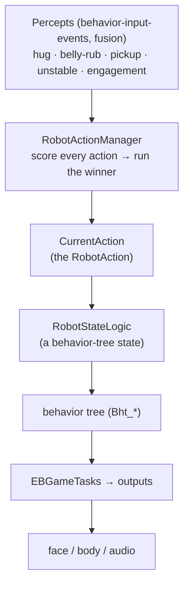

# 🎬 Robot actions — the top-level behavior arbiter (`v3.6.4-Zephyr` / OTA `v24.10.803`)

> Reverse-engineered from the decompiled `Assembly-CSharp.dll` (`bo-android`) in the **v24.10.803**
> image — the `RobotAction` / `RobotActionManager` / `RobotActionScores` system. This is the **top of
> Moxie's behavior stack**: the single arbiter that decides, moment to moment, *what Moxie is doing at
> all* — reacting to being picked up, responding to a hug, running a content activity, or idling. Below it
> sit the [behavior tree](behavior-tree-engine.md) (the *detail* of each action), the
> [task scheduler](task-scheduler.md) (which *outputs* each task claims), and the
> [face-animation engine](unity-face-animation.md) (the *render*). This layer is the "personality" —
> what makes Moxie feel like it has priorities of its own.

## The stack



`RobotAction` = *what am I doing*; the behavior tree = *how*; `EBGameTask` = *which outputs*; the animator
= *render*. This doc is the top box.

## The arbiter — `RobotActionManager`

A singleton that holds a `Dictionary<Type, RobotAction>` of every action (discovered by reflection,
`CreateInstancesOfType<RobotActionRuntime, RobotAction>`) and runs exactly one at a time:

- Each tick, **`SelectBestAction()`** calls **`GetActionScore()`** on every action, stores it in
  `CurrentScore`, and takes the **highest score ≥ 0** as the winner.
- **`SetCurrentAction(action)`** switches: it deactivates the outgoing action (`ActionDeactivated`) and
  activates the winner (`ActionActivated`); a re-selection of the same action is a no-op.
- **`Update()`** ticks only the `CurrentAction` (`ActionActivatedUpdate` + its coroutines).

So Moxie runs **one top-level action at a time**, re-decided every frame by score. An action that isn't
applicable scores negative and is simply never selected.

## The score ladder — `RobotActionScores`

The scores are fixed constants; what varies is *whether* an action returns its score (only when its
trigger is live). Highest wins:

| Score | Action | When it scores |
|--:|---|---|
| `float.MaxValue` | **Startup** | during the boot/wake sequence — always wins |
| 900 | **MPUPutDown** | Moxie was just set down |
| 800 | **MPUPickedUp** | Moxie is being **held** |
| 700 | **MPUUnstable** | Moxie is being **wobbled / is unstable** |
| 400 | **BellyRub** | a belly-rub was detected |
| 300 | **Hug** | a hug was detected |
| 200 | **Activity** | a content activity is available/running |
| 100 | **Idle** | always (the floor) |

This ladder *is* Moxie's personality priority: **physical handling** (put-down / pickup / wobble)
overrides everything but boot; **affection** (belly-rub / hug) overrides content; a **content activity**
overrides idle; and **idle** is the ever-present floor. Pick Moxie up in the middle of a drawing activity
and `MPUPickedUp` (800) instantly beats `Activity` (200) — it reacts to being held; set it down and once
it stabilises, `MPUPickedUp` stops scoring and the activity resumes.

## Reactions — the `RobotActionMicroExpBase` pattern

The handling and affection actions share one elegant generic base:

```csharp
abstract class RobotActionMicroExpBase<TActionEvent, TRobotState>
    where TActionEvent : InputEvent  where TRobotState : RobotStateLogic
{ protected override float OnActionEventReceivedScore => …; }
```

Each reaction is parameterised by **(a) the [`InputEvent`](behavior-input-events.md) that triggers it** and
**(b) the `RobotStateLogic` (a behavior-tree state) it plays** when it wins:

| Action | Trigger event | State played | Score |
|---|---|---|--:|
| `RobotActionMPUPickedUp` | `RobotActionMPUPickedUpEvent` | `RobotState_MPU_PickedUp` | 800 |
| `RobotActionMPUUnstable` | `RobotActionMPUNotStableEvent` | `RobotState_MPU_NotStable` | 700 |
| `RobotActionBellyRub` | `RobotActionBellyRubEvent` | `RobotState_HugBelly` | 400 |
| `RobotActionHug` | `RobotActionHugEvent` | `RobotState_HugToNeutral` | 300 |

When the event arrives, `OnActionEventReceivedScore` becomes the action's live score, it wins arbitration,
and it drives its `RobotStateLogic` — a scripted micro-expression reaction (a "micro-exp"). The trigger
events come from perception/handling ([the IMU handling events](../hardware/hardware-map.md#semantic-handling-events-embodiedunity)
feed the MPU reactions; touch feeds hug/belly-rub), so the whole reflex arc is **percept → scored action →
state → animation**. `RobotActionStartup` and `RobotActionIdle` are plain `RobotActionRuntime`s (not
event-gated): Startup wins during boot, Idle is the constant floor.

## Content — `RobotActionActivity`

`RobotActionActivity` (score 200) is the action that **runs content activities**. It's itself a mini
arbiter: it holds a set of typed `RobotActivity` runtimes and, via `GetActivityScore()`, selects the
`BestActivity` among the `CurrentActivatableActivities`:

| Activity type | Kind |
|---|---|
| `RobotActivityGeneralConv` | open conversation |
| `RobotActivityDrawing` | drawing/creative |
| `RobotActivityImaginativePlay` | imaginative play |
| `RobotActivityForTesting` | test harness |

These are the *on-device shells* of an activity; the actual lines, logic, and Python `code` hooks
(`pre_process`/`post_process`) run **server-side** in the brain ([content-and-conversation](content-and-conversation.md),
[remote-chat-protocol](../protocol/remote-chat-protocol.md)) — there is **no Python interpreter in the robot image**.
The robot's job is: pick the best activity shell, run its behavior-tree state, and volley with the server.

## Worked example — a drawing activity, interrupted

1. `RobotActionActivity` (200) wins; within it, `RobotActivityDrawing` scores best → Moxie draws with the
   child, volleying with the server.
2. The child **picks Moxie up**. `RobotActionMPUPickedUpEvent` fires → `RobotActionMPUPickedUp` scores
   **800** → it preempts `Activity` (200) → Moxie plays `RobotState_MPU_PickedUp` (a "whee, I'm being
   held!" micro-exp).
3. The child **sets Moxie down** and it stabilises → `MPUPickedUp`/`MPUUnstable` stop scoring → `Activity`
   (200) wins again → the drawing resumes.

One arbiter, re-decided every frame, is what makes that transition feel instant and natural.

## What this means for the three goals

**① Custom firmware — the headline.** This is the **top-level behavior contract**. A custom brain must
reproduce a scored action arbiter with (at least) this ladder — **handling > affection > activity > idle**
— or Moxie won't react like itself (it'll keep drawing while you shake it). The `RobotActionMicroExpBase`
pattern (percept event → scored action → behavior state) is the template for every reflex; the
`RobotActionScores` constants are the tuning that makes reactions feel appropriately urgent.

**② Server revival.** The server drives the **Activity** branch (it supplies the content a
`RobotActivity` runs, via RemoteChat), but the **reactions are on-device** and outrank content — a server
can't (and shouldn't need to) make Moxie ignore being picked up. Knowing this split tells a revival server
exactly what it owns (activities) versus what the robot owns (reflexes/idle).

**③ Pre-801 revival.** No new lever; internal to the app.

---
📖 [Reverse-engineering index](../README.md) · [Behavior-tree engine](behavior-tree-engine.md) · [Task scheduler](task-scheduler.md) · [Behavior input events](behavior-input-events.md) · [Content & conversation](content-and-conversation.md) · [Hardware map](../hardware/hardware-map.md)
