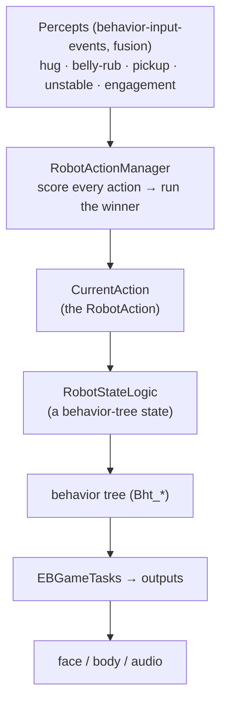

# 🎬 Robot actions — the top-level behavior arbiter (`v3.6.4-Zephyr` / OTA `v24.10.803`)

The top of Moxie's behavior stack (`RobotAction` / `RobotActionManager` / `RobotActionScores`, decompiled
`Assembly-CSharp.dll` in the **v24.10.803** image): one arbiter re-scores every action each frame and runs
exactly one — reacting to being picked up, a hug, a content activity, or idling. The fixed score ladder
**Startup > handling (900/800/700) > affection (400/300) > activity (200) > idle (100)** *is* Moxie's
priority personality. Below it: the [behavior tree](behavior-tree-engine.md) (how), the
[task scheduler](task-scheduler.md) (which outputs), the [face engine](unity-face-animation.md) (render).


```mermaid
flowchart TB
  perc["Percepts (behavior-input-events, fusion)<br/>hug · belly-rub · pickup · unstable · engagement"] --> mgr
  mgr["RobotActionManager<br/>score every action → run the winner"] --> act["CurrentAction<br/>(the RobotAction)"]
  act --> state["RobotStateLogic<br/>(a behavior-tree state)"]
  state --> bt["behavior tree (Bht_*)"]
  bt --> tasks["EBGameTasks → outputs"]
  tasks --> render["face / body / audio"]
```

## The arbiter — `RobotActionManager`

A singleton holding a `Dictionary<Type, RobotAction>` of every action (discovered by reflection,
`CreateInstancesOfType<RobotActionRuntime, RobotAction>`):

- Each tick **`SelectBestAction()`** calls **`GetActionScore()`** on every action, stores it in
  `CurrentScore`, and takes the **highest score ≥ 0**. An inapplicable action scores negative.
- **`SetCurrentAction(action)`** deactivates the outgoing action (`ActionDeactivated`) and activates the
  winner (`ActionActivated`); re-selecting the same action is a no-op.
- **`Update()`** ticks only the `CurrentAction` (`ActionActivatedUpdate` + its coroutines).

## The score ladder — `RobotActionScores`

Scores are fixed constants; what varies is *whether* an action returns its score (only while its trigger
is live).

| Score | Action | When it scores |
|--:|---|---|
| `float.MaxValue` | **Startup** | during the boot/wake sequence — always wins |
| 900 | **MPUPutDown** | just set down |
| 800 | **MPUPickedUp** | being **held** |
| 700 | **MPUUnstable** | being **wobbled / unstable** |
| 400 | **BellyRub** | belly-rub detected |
| 300 | **Hug** | hug detected |
| 200 | **Activity** | a content activity is available/running |
| 100 | **Idle** | always (the floor) |

## Reflexes — `RobotActionMicroExpBase<TActionEvent, TRobotState>`

```csharp
abstract class RobotActionMicroExpBase<TActionEvent, TRobotState>
    where TActionEvent : InputEvent  where TRobotState : RobotStateLogic
{ protected override float OnActionEventReceivedScore => …; }
```

Each handling/affection reaction is parameterised by the [`InputEvent`](behavior-input-events.md) that
triggers it and the `RobotStateLogic` (behavior-tree state) it plays:

| Action | Trigger event | State played | Score |
|---|---|---|--:|
| `RobotActionMPUPickedUp` | `RobotActionMPUPickedUpEvent` | `RobotState_MPU_PickedUp` | 800 |
| `RobotActionMPUUnstable` | `RobotActionMPUNotStableEvent` | `RobotState_MPU_NotStable` | 700 |
| `RobotActionBellyRub` | `RobotActionBellyRubEvent` | `RobotState_HugBelly` | 400 |
| `RobotActionHug` | `RobotActionHugEvent` | `RobotState_HugToNeutral` | 300 |

When the event arrives, `OnActionEventReceivedScore` becomes the live score, the action wins, and it plays
its scripted micro-expression ("micro-exp"). Triggers come from the
[IMU handling events](../hardware/hardware-map.md#semantic-handling-events-embodiedunity) (MPU reactions)
and touch (hug/belly-rub): **percept → scored action → state → animation**. `RobotActionStartup` and
`RobotActionIdle` are plain `RobotActionRuntime`s, not event-gated.

## Content — `RobotActionActivity`

`RobotActionActivity` (200) is itself a mini-arbiter: it holds typed `RobotActivity` runtimes and, via
`GetActivityScore()`, picks the `BestActivity` among `CurrentActivatableActivities`:

| Activity type | Kind |
|---|---|
| `RobotActivityGeneralConv` | open conversation |
| `RobotActivityDrawing` | drawing/creative |
| `RobotActivityImaginativePlay` | imaginative play |
| `RobotActivityForTesting` | test harness |

These are on-device **shells**: the lines, logic and Python `code` hooks (`pre_process`/`post_process`)
run **server-side** ([content-and-conversation](content-and-conversation.md),
[remote-chat-protocol](../protocol/remote-chat-protocol.md)) — there is **no Python interpreter in the
robot image**. The robot picks the shell, runs its behavior-tree state, and volleys with the server.

**Example.** During a drawing activity (`Activity` 200 → `RobotActivityDrawing`), the child picks Moxie
up: `RobotActionMPUPickedUpEvent` → `MPUPickedUp` scores 800 → preempts the activity → plays
`RobotState_MPU_PickedUp`. Set down and stable, `MPUPickedUp`/`MPUUnstable` stop scoring and the drawing
resumes.

## Implications

- **Custom brain:** reproduce a scored arbiter with at least **handling > affection > activity > idle**,
  or Moxie keeps drawing while being shaken. `RobotActionMicroExpBase` (event → scored action → state) is
  the template for every reflex; the `RobotActionScores` constants are the urgency tuning.
- **Server revival:** the server owns the **Activity** branch (content via RemoteChat); reflexes and idle
  are on-device and outrank content. Pre-801: no new lever.

---
📖 [Reverse-engineering index](../README.md) · [Behavior-tree engine](behavior-tree-engine.md) · [Task scheduler](task-scheduler.md) · [Behavior input events](behavior-input-events.md) · [Content & conversation](content-and-conversation.md) · [Hardware map](../hardware/hardware-map.md)
