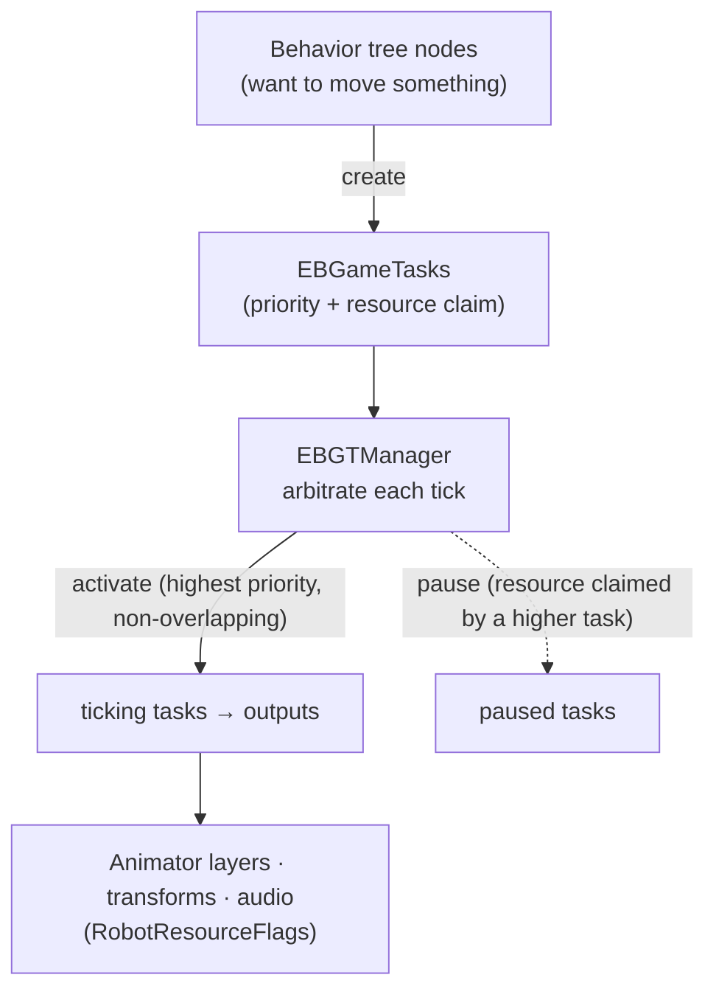

# ⚙️ The task scheduler — how concurrent behaviors share Moxie's outputs (`v3.6.4-Zephyr` / OTA `v24.10.803`)

The runtime glue between the [behavior tree](behavior-tree-engine.md) (decides) and the
[face/body engine](unity-face-animation.md) (executes), from the decompiled `Assembly-CSharp.dll`
(**v24.10.803**). Every output-driving action is an **`EBGameTask`** declaring a **priority**
(`RobotTaskPriority`) and the **resources** it needs (`RobotResourceFlags`, 44 outputs); the
**`EBGTManager`** activates tasks in priority order and pauses any whose resources overlap a
higher task's. That is how idle breathing, gaze, blink, lip-sync and a scripted wave all run at once.



## The task — `EBGameTask`

An `EBGameTask` (`IEBCouroutineScheduler`) is one output-driving action:

| Task | Drives |
|---|---|
| `EBGameTaskAnim` → `…AnimLayer` / `…AnimStateBase` / `…AnimTrigger` | an Animator layer / state / trigger |
| `EBGameTaskPlayCompositeAnim` | a one-shot clip via the [Playables compositor](unity-face-animation.md#3-the-runtime-players) |
| `EBGameTaskLookAt` | the IK look-at |
| `EBGameTaskPlayAudio` | an audio channel |
| `EBGameTaskTransform` | a direct bone/transform (head/torso/eye) |

Each carries a **`RobotTaskResources`** (a `RobotResourceFlags` bitmask claimed via `SetResourceFlags`)
and a **`RobotTaskPriority`**. Tasks are **pooled by type** (`TaskPool`, reused after a 2-frame delay) to
avoid per-action GC.

## The manager — `EBGTManager`

- **`TaskQueue`** (all live tasks) and **`TickingTasks`** (the active subset).
- **`PendingActions`** — add/remove are deferred (`EBGTAction_AddTask` / `…RemoveTask`) behind an
  `ActionLockCounter`, so tasks can create/kill tasks mid-iteration; mutations apply after the tick.
- **`CurrentClaimedResources`** — running union of resources held by tasks activated so far this tick
  (scratch sets tested with `IsOverlapping`).
- Lifecycle: **`Started → Activated → (Paused ↔ Resumed) → Ended`** (`bAborted` flag), exposed as
  `OnTaskStarted/Activated/Paused/Resumed/Ended`.

**Arbitration (`UpdateTaskActivations`)** — each tick, walk tasks highest priority first: if the task's
flags don't overlap `CurrentClaimedResources`, **activate** it and add its flags; otherwise **pause** it.
When the higher task ends or releases, the paused one **resumes** where it left off. Arbitration is
therefore priority-preemptive **per resource**.

Tie-breaks for same-priority / same-kind collisions:

- **`EBGameTaskPriorityOverlapPolicy`** — `InsertTaskInFront` (new preempts the existing equal) vs
  `InsertTaskAtEnd` (queues behind).
- **`EBGameTaskCreationPolicy`** — `ReplaceExisting` / `ReUseExisting` / `AddNew`.

## The outputs — `RobotResourceFlags`

A **`[Flags] ulong` of 44 outputs** — the definitive inventory of everything a behavior can drive:

| Group | Flags |
|---|---|
| **Base / performance** | `BaseAnimLayer`·`Triggers`·`State`, `PerformAnimLayer`·`Triggers`·`State`, `ScriptedLayer`, `CompositeAnim` |
| **Face — emotion & mouth** | `EmotionAnimLayer`·`State`, `EmotionFaceAnimLayer`·`State`, `VisemeAnimLayer`·`State`, `FaceAnimState` |
| **Face — eyes** | `EyesAnimLayer`, `PupilsAnimLayer`, `LidsAnimLayer`, `Blink182Layer`, `EyeLeftTransform`, `EyeRightTransform` |
| **Head** | `HeadAnimLayer`, `HeadTiltAnimLayer`, `HeadUpDownTransform`, `HeadGestures` |
| **Body / torso** | `BodyAnimLayer`, `BodyTiltAnimLayer`, `BodyUpDownAnimLayer`, `BodyTurnAnimLayer`, `BreatheAnimLayer`, `TorsoUpDownTransform`, `BodyTurnTransform`, `BodyGestures`, `TorsoGestures`, `TorsoHeadGestures` |
| **Arms** | `LeftAnimLayer`, `RightAnimLayer`, `ArmGestures`, `LeftArmGestures`, `RightArmGestures`, `FaceGestures` |
| **Gesture (composite)** | `GestureAnimLayer`·`Triggers`·`State` |
| **Gaze** | `GazeTarget`, `GazeFacing`, `FaceTrack` |
| **Audio** | `VoiceAudio`, `BkgAudio`, `SoundFXAudio`, `SoundFXAudio2`, `SoundStingerAudio`, `SoundVocalGesture` |

Eyes are split into `Pupils`/`Lids`/`Blink182` so a blink (`Blink182Layer`, a developer easter-egg name),
a gaze look-at (`GazeTarget`/`GazeFacing`) and an emotion (`EmotionAnimLayer`) hold non-overlapping claims
and run together. Layer names map onto the [face-animation Animator layers](unity-face-animation.md);
`*Transform` flags are direct bone control (bypassing the animator) onto the
[motors](../hardware/hardware-map.md).

## The priority ladder — `RobotTaskPriority`

Low → high (higher preempts lower):

```
RobotCloudConfigBehavior · Normal · GlobalBkgSound · AnimationAudioEvent
IdleState · IdleStateCompositAnim                 ← idle: preempted by almost everything
ChatBehavior · CoreMessengerBehavior
TouchBehavior · MpuBehavior                       ← reactions to being touched / picked up
EyeTrackBehavior · LookBehavior · GazeBehavior    ← autonomous attention
TurnTakingBehaviour · BlinkBehaviour
AnimationMonitorBehavior · MiniMapBehavior · FaceTrackerBehavior
BehaviorDefaultCompositeAnim · UIElement(+CompositeAnim)
MainRobotState · MainRobotStateCompositeAnim      ← scripted content performances
CompositeAnimPlayback · ChatAudioPlayBehavior
ReplayHeadTracking · HeadTrackDebug · TestBehavior
```

Idle sits near the bottom; touch/pickup reactions beat idle but yield to attention; autonomous gaze is
mid; scripted content (`MainRobotState`, `CompositeAnimPlayback`) sits near the top, while non-overlapping
layers (blink, lip-sync, emotion) keep running underneath. (This task ladder is distinct from the
action-level [score ladder](robot-actions.md#the-score-ladder-robotactionscores).)

**Example — scripted "hello" + wave:**

| Task | Priority | Claims | Outcome |
|---|---|---|---|
| Scripted wave + line | `MainRobotStateCompositeAnim` | `PerformAnimLayer`, `RightArmGestures`, `HeadGestures`, `VoiceAudio` | active |
| Lip-sync | (viseme) | `VisemeAnimLayer` | active |
| Blink | `BlinkBehaviour` | `Blink182Layer` | active |
| Autonomous gaze | `GazeBehavior` | `GazeTarget`, `GazeFacing` | active |
| Idle breathing | `IdleState` | `BreatheAnimLayer` | active |
| Idle fidget (right arm) | `IdleState` | `RightAnimLayer` (overlaps the wave) | **paused** → resumes when the wave ends |

## Implications

- **Custom brain:** not optional — reproduce priority + resource-set tasks, activate-by-priority /
  pause-on-overlap, and the `RobotResourceFlags` decomposition (it is also the output inventory a custom
  face/body must provide). `RobotTaskPriority` is the tuning that makes idle yield to reactions yield to
  scripted content.
- **Server revival:** on-device only; it explains why server-sent markup/mood/gaze
  ([the seam](../protocol/unity-mainapp-interface.md)) composes with autonomous behavior — it enters as
  tasks at defined priorities. Pre-801: no new lever.

---
📖 [Reverse-engineering index](../README.md) · [Behavior-tree engine](behavior-tree-engine.md) · [Robot actions](robot-actions.md) · [Face-animation engine](unity-face-animation.md) · [Gaze & attention](gaze-and-attention.md) · [Hardware map](../hardware/hardware-map.md)
