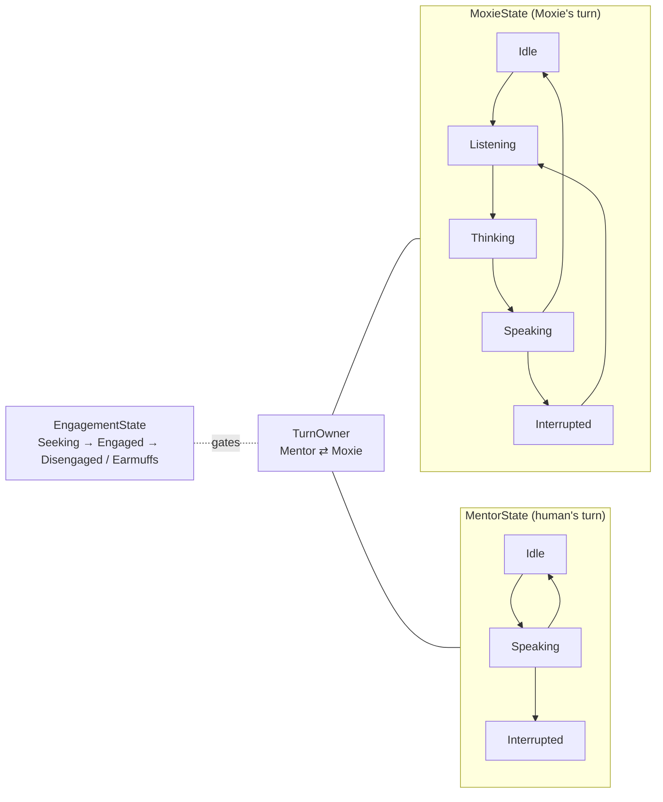

# 🗣️ Turn-taking & engagement — the conversation state machine (`v3.6.4-Zephyr` / OTA `v24.10.803`)

> Recovered from `Assembly-CSharp.dll` (the brain, `bo-android`) in the **v24.10.803** image. This is
> the backbone of a live conversation: *whose turn it is*, *what each party is doing*, *how engaged the
> interaction is*, and how **barge-in / interruption** works. It sits above the STT/TTS pipeline
> ([`perception-pipeline.md`](perception-pipeline.md)) and drives — and is queried by — the behavior
> tree ([`behavior-tree-engine.md`](behavior-tree-engine.md)). In Embodied's framing the human (the
> child) is the **"mentor"**; Moxie is the learner.

## The state model — `TurnTakingState`

`Embodied.Robot.Behavior.Input.Events.Brain.TurnTakingState` tracks a conversation as **five orthogonal
sub-states** (all enums start with `Unknown`):

| Sub-state | Values | Meaning |
|---|---|---|
| **`TurnOwner`** | `Mentor` · `Moxie` | whose turn it is to speak right now |
| **`MentorState`** | `Idle` · `Speaking` · `Interrupted` | what the **human** is doing |
| **`MoxieState`** | `Idle` · `Listening` · `Thinking` · `Speaking` · `Interrupted` | what **Moxie** is doing (the classic dialog states) |
| **`EngagementState`** | `Earmuffs` · `Engaged` · `Seeking` · `Disengaged` | how engaged the interaction is |
| **`AssistState`** | `None` · `Advanced` | assist/support level for the session |

- **`EngagementState`** is the attention lifecycle (ties to [`gaze-and-attention.md`](gaze-and-attention.md)):
  `Seeking` = looking for a person to talk to, `Engaged` = actively conversing, `Disengaged` = the
  person drifted off, **`Earmuffs`** = deliberately not listening (sensors muted — the on-device
  privacy/idle state).

### Derived predicates (from `TurnTakingBehavior` / `EventTurnOwner`)

```
IsMoxieTurn        = TurnOwner == Moxie
IsMentorTurn       = TurnOwner == Mentor
IsMentorSpeaking   = MentorState == Speaking
IsWaitingForResponse = IsMentorTurn && !IsMentorSpeaking     // Moxie asked; the human is silent
```

`IsWaitingForResponse` is the "awkward pause" after Moxie hands the turn over and the child hasn't
started talking yet — the trigger for a re-prompt or a nudge (see the timers below).



## Barge-in / interruption

Interruption is **event-driven**, not polled. `TurnTakingBehavior` subscribes to:

- **`ChatbotAllowCutoffEvent`** (`AllowCutoffHandler`) — the dialog engine declares when Moxie's current
  utterance *may* be cut off (some lines are interruptible, some aren't).
- **`AllowInterruption`** (`AllowInterruptionHandler`) — whether a barge-in is permitted right now.

When a barge-in is allowed and the mic/VAD detects the child talking over Moxie
(`interjectionDetected = e.Interrupted`), the relevant party's state flips to **`Interrupted`** —
`MoxieState.Interrupted` (child talked over Moxie → Moxie yields) or `MentorState.Interrupted`. This is
what lets a kid cut Moxie off mid-sentence and be heard, which is central to the toy feeling alive.

## Who is speaking — DOA person scoring

To decide *which* person owns the turn when several are present, the brain scores candidates by
mic-array **direction-of-arrival** fused with vision: `GetHighestScoredDOAPerson(cutOffTime)` and
`GetBestWorldDOATarget()` pick the active speaker (an `EBDOAPerson` / `EyeTargetDOAPerson`), which also
becomes the gaze target ([`gaze-and-attention.md`](gaze-and-attention.md)). So turn-taking, "who to look
at," and "whose speech to transcribe" share one source of truth.

## Response timing

`RobotState_TurnTaking_WaitingForResponseTime` (a Blackboard `float`, exposed as
`TurnTaking_WaitingForResponseTime()`) accumulates how long Moxie has been **waiting for the child to
respond** after handing over the turn, and resets to `0` when they speak or the turn changes. Behavior
trees read it (via `RobotBT_TurnTakingWaitingForResponseTime` / `RobotBT_TurnTakingIsResponseMissing`)
to re-prompt, offer a hint, or gracefully move on after a silence.

## Content / behavior-tree control

The state machine is fully queryable from content ([`behavior-tree-engine.md`](behavior-tree-engine.md)):
`RobotBT_TurnTakingInTurn`, `RobotBT_TurnTakingIn{Moxie,Engagement,Mentor,Assist}State`, the matching
`…TimeIn*` (dwell time in a state), `RobotBT_TurnTakingIsResponseMissing`, and
`RobotBT_TurnTakingWaitingForResponseTime`. Changes are published as **`TurnTakingEvent`** /
`EventTurnOwner` on the input bus ([`behavior-input-events.md`](behavior-input-events.md)), so any
manager (gaze, chat, idle) can react.

## What this means for the three goals

**① Custom firmware / custom brain.** This is the conversation-management contract a faithful brain must
implement: alternate `TurnOwner`, drive `MoxieState` (Idle→Listening→Thinking→Speaking), honor
`ChatbotAllowCutoffEvent`/`AllowInterruption` for barge-in, and track `WaitingForResponseTime` to handle
silences. The five-axis model is the blueprint.

**② Server revival.** A self-hosted server owns Moxie's **speaking** turn (it returns the chat text/TTS
over [`cloud-protocol.md`](../protocol/cloud-protocol.md)), but **listening, interruption, engagement and DOA are
on-device** — the server can't drive them directly; it reacts to STT results and emits markup. Knowing
this split tells a server author exactly where their responsibility ends.

**③ Pre-801 revival.** No new lever; brain-side, above the network boundary.

---
📖 [Reverse-engineering index](../README.md) · [Perception pipeline](perception-pipeline.md) · [Gaze & attention](gaze-and-attention.md) · [Behavior-tree engine](behavior-tree-engine.md) · [Content & conversation](content-and-conversation.md)
