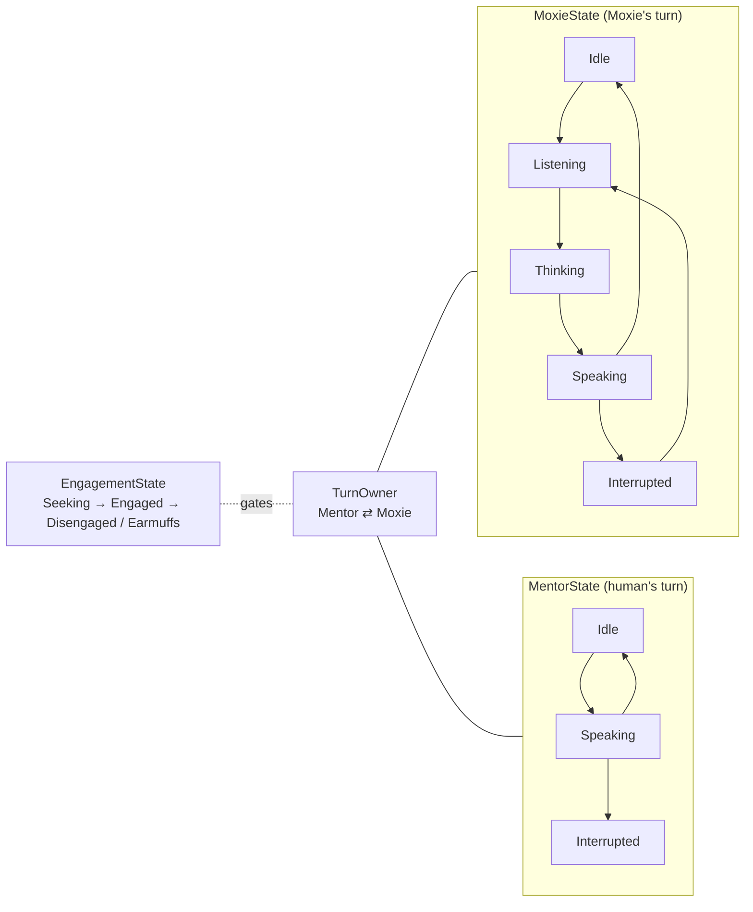

# 🗣️ Turn-taking & engagement — the conversation state machine (`v3.6.4-Zephyr` / OTA `v24.10.803`)

The backbone of a live conversation (decompiled `Assembly-CSharp.dll`, **v24.10.803**): whose turn it
is, what each party is doing, how engaged the interaction is, and how **barge-in** works. In Embodied's
framing the child is the **"mentor"** and Moxie the learner. It sits above STT/TTS
([perception-pipeline](perception-pipeline.md)) and is queried by the [behavior tree](behavior-tree-engine.md).
Listening, interruption, engagement and speaker selection are all on-device; a server owns only
Moxie's spoken turn.

## The state model — `TurnTakingState`

`Embodied.Robot.Behavior.Input.Events.Brain.TurnTakingState` — five orthogonal sub-states (every enum
also starts with `Unknown`):

| Sub-state | Values | Meaning |
|---|---|---|
| **`TurnOwner`** | `Mentor` · `Moxie` | whose turn it is to speak |
| **`MentorState`** | `Idle` · `Speaking` · `Interrupted` | what the **human** is doing |
| **`MoxieState`** | `Idle` · `Listening` · `Thinking` · `Speaking` · `Interrupted` | what **Moxie** is doing |
| **`EngagementState`** | `Earmuffs` · `Engaged` · `Seeking` · `Disengaged` | `Seeking` = looking for someone, `Engaged` = conversing, `Disengaged` = person drifted off, **`Earmuffs`** = deliberately not listening (sensors muted; privacy/idle) |
| **`AssistState`** | `None` · `Advanced` | assist/support level for the session |

Derived predicates (`TurnTakingBehavior` / `EventTurnOwner`):

```
IsMoxieTurn        = TurnOwner == Moxie
IsMentorTurn       = TurnOwner == Mentor
IsMentorSpeaking   = MentorState == Speaking
IsWaitingForResponse = IsMentorTurn && !IsMentorSpeaking     // Moxie asked; the human is silent
```


```mermaid
flowchart LR
  subgraph moxie["MoxieState (Moxie's turn)"]
    mi["Idle"] --> ml["Listening"] --> mt["Thinking"] --> ms["Speaking"] --> mi
    ms --> mint["Interrupted"] --> ml
  end
  subgraph mentor["MentorState (human's turn)"]
    hi["Idle"] --> hs["Speaking"] --> hi
    hs --> hint["Interrupted"]
  end
  own["TurnOwner<br/>Mentor ⇄ Moxie"] --- moxie
  own --- mentor
  eng["EngagementState<br/>Seeking → Engaged → Disengaged / Earmuffs"] -.gates.- own
```

## Barge-in / interruption

Event-driven. `TurnTakingBehavior` subscribes to:

- **`ChatbotAllowCutoffEvent`** (`AllowCutoffHandler`) — the dialog engine declares whether the current
  utterance *may* be cut off (some lines are interruptible, some aren't).
- **`AllowInterruption`** (`AllowInterruptionHandler`) — whether barge-in is permitted right now.

When allowed and the mic/VAD hears the child over Moxie (`interjectionDetected = e.Interrupted`), the
party's state flips to **`Interrupted`** (`MoxieState.Interrupted` → Moxie yields, or
`MentorState.Interrupted`). Audio-side signals (`CutoffDetected`, `AllowInterrupt`) are in
[perception-pipeline](perception-pipeline.md).

## Who is speaking — DOA person scoring

With several people present, candidates are scored by mic-array **direction-of-arrival** fused with vision:
`GetHighestScoredDOAPerson(cutOffTime)` and `GetBestWorldDOATarget()` pick the active speaker
(`EBDOAPerson` / `EyeTargetDOAPerson`), which also becomes the [gaze target](gaze-and-attention.md) — turn
ownership, "who to look at" and "whose speech to transcribe" share one source of truth.

## Response timing

`RobotState_TurnTaking_WaitingForResponseTime` (Blackboard `float`, exposed as
`TurnTaking_WaitingForResponseTime()`) accumulates while Moxie waits for the child after handing over the
turn (`IsWaitingForResponse`), resetting to `0` when they speak or the turn changes. Trees read it via
`RobotBT_TurnTakingWaitingForResponseTime` / `RobotBT_TurnTakingIsResponseMissing` to re-prompt, hint, or
move on.

## Control from content

All axes are queryable from trees — the 12 turn-taking condition nodes in the
[node catalog](behavior-tree-engine.md#the-node-catalog-the-65-robotbt_-nodes) — and mirrored onto the face
blackboard as `RobotState_TurnTaking_*` ([face engine §4](unity-face-animation.md#4-the-blackboard-bridge-statevariables)).
Changes publish as **`TurnTakingEvent`** / `EventTurnOwner` on the [input bus](behavior-input-events.md).
The cloud-side counterpart is PlaySpace `TurnState` ([content-and-conversation](content-and-conversation.md#embodiment-activity-runtime-playspace-turn-taking-orientation)).

## Implications

- **Custom brain:** alternate `TurnOwner`, drive `MoxieState` (Idle→Listening→Thinking→Speaking), honor
  `ChatbotAllowCutoffEvent`/`AllowInterruption`, and track `WaitingForResponseTime` for silences.
- **Server revival:** the server returns Moxie's speech ([cloud-protocol](../protocol/cloud-protocol.md));
  it reacts to STT results and emits markup but cannot drive listening/interruption/engagement/DOA.
  Pre-801: no new lever.

---
📖 [Reverse-engineering index](../README.md) · [Perception pipeline](perception-pipeline.md) · [Gaze & attention](gaze-and-attention.md) · [Behavior-tree engine](behavior-tree-engine.md) · [Content & conversation](content-and-conversation.md)
