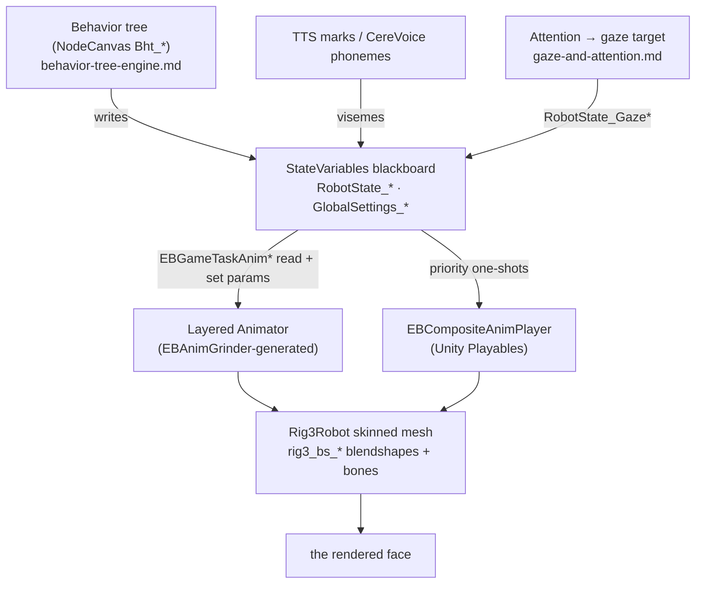

# 🎭 The face-animation engine — how Moxie's face actually renders (`v3.6.4-Zephyr` / OTA `v24.10.803`)

> From the decompiled `Assembly-CSharp.dll` (`bo-android`, **v24.10.803**) — the `EB*` animation classes,
> the `StateVariables` blackboard, and the `Eyeseme`/`Viseme`/`rig3` systems.
> [`unity-mainapp-interface.md`](../protocol/unity-mainapp-interface.md) is the *protocol seam*; **this is
> the machine behind it** — the code that turns a mood + gaze target + phoneme stream into the animated
> face. Every class/field/constant below is read from the binary.

## Architecture



The face is driven **entirely off a blackboard**: the behavior tree, perception, and TTS write
`RobotState_*` variables; animation tasks read them and set Animator parameters; the Animator (plus a
Playables compositor) blends blendshape/bone layers on the `rig3` mesh. A server never touches this — it
supplies mood + markup + TTS audio ([the seam](../protocol/unity-mainapp-interface.md)) and this engine renders it.

## The face itself — a customizable avatar (clean-room visual spec)

Everything below animates a **customizable character**, not a fixed picture — the design surface a
clean-room build reproduces *without* Moxie's art:

- **Render target:** a **640×480** image ([Unity → RenderTexture → the DLPC3430 projector](../firmware/unity-assets.md)),
  projected onto the fresnel faceplate. Design for that size/aspect.
- **Anatomy — 14 independent, swappable slots** (`MoxieCustomizationType`; the child styles the avatar):

| Slot(s) | Styles |
|---|---|
| `EyeColor` · `EyeDesign` · `EyeLid` | the **eyes** — color, iris/shape design, lid style (the expressive core) |
| `Brows` | eyebrows (expression amplifier) |
| `Mouth` · `Nose` · `Mustache` | lower-face features |
| `FaceColor` · `FaceDesign` | base head color + surface pattern |
| `Hair` · `Glasses` · `Stickers` · `Extras` · `Misc` | cosmetic add-on layers |

  So a faithful face is: a base head (color + design), two prominent eyes (the expressive core), brows, a
  mouth, and optional cosmetic layers — each an independent layer.
- **Expression repertoire:** **11 eye-moods** (Afraid · Angry · Concerned · Confused · Curious ·
  Embarrassed · Happy · Neutral · Sad · Shy · Surprised) cross-fading over ~2 s, each also reshaping the
  visemes; the mouth lip-syncs **41 ARPABET visemes** (§6).
- **Blink:** procedural and **per-eye**, a **4-phase profile** — close (`Start→Hold`), hold-shut
  (`Hold→Open`), reopen (`Open→End`) to a fully-closed blend of `100` — modulated by the current mood (a
  squint-happy blink ≠ a wide-surprised one) and re-timable via `TriggerProceduralBlink(profile, speed)`;
  independent L/R lids allow winks (§5).
- **Parametric vs. art:** timing, structure and repertoire are RE-derived — reproduce them. Geometry and
  palette live in Moxie's `rig3` mesh + `rig3animations` bundle, so a clean-room build supplies its **own**
  art driven by the same blendshape roles (this project's take: the [SIL face](../../architecture/sil-and-cicd.md)).

## 1. The face rig — `Rig3Robot`, blendshapes

**Rig 3** (`Rig3Robot` / `Rig3`): a Unity **`SkinnedMeshRenderer`** (`FaceMesh`) driven by blendshapes + a
skeleton (head/jaw bones). The mesh `rig3_faceMesh01` has **exactly 10 blendshapes** (UnityPy on
`sharedassets1`, `v24.10.803`), namespaced `karuBlendShapes.` (`bs` = blendshape, `L`/`R` = side):

```
rig3_bs_{L,R}_upperLid01   rig3_bs_{L,R}_lowerLid01   ← the 4 blink lids
rig3_bs_{L,R}_cheekAir01   ← cheek puff
rig3_bs_{L,R}_happyEyes01  rig3_bs_{L,R}_sadEyes01    ← eye-squash for happy / sad
```

Everything else — the 11 eyeseme moods, 41 visemes, gestures — is **bone/animation-clip-driven** (the
[`rig3animations` bundle](../firmware/unity-assets.md)), not morphs. The blink layer applies the four lid
shapes post-process each frame (C# param name `…_postp_blink`, §5).

## 2. The animation controller — the `EBAnimGrinder`

The Animator is **generated** at build time by the **`EBAnimGrinder`**, which "grinds" an **XML spec** +
the `rig3animations` bundle into a Unity `AnimationController` (+ `EBAnimGrinderGeneratedData`). It rebuilds
only when `sourceMD5 => GetDirectoryMD5Hash(…"rig3animations")` differs from `lastSuccessfulGrindSourceMD5`.
The XML model (`[XmlAttribute]`-serialized):

| Class | Role |
|---|---|
| `EBAnimGrinderLayer` | one Animator layer — `index`, `entry` state, `weight`, **`maskPath`** (avatar mask), bound to behavior code via `ParamsGameTaskType` / `AnimTriggerGameTaskType` / `AnimStateGameTaskType` |
| `EBAnimGrinderStateMachine` | the layer's states + transitions + clips |
| `EBAnimGrinderState` | a `clipName` (+ `animSpeed`) **or** a `blender` |
| `EBAnimGrinderBlender` / `…Control` | blend tree — animations blended by `values` over `bases` |
| `EBAnimGrinderTransition` | `origState → destState`, gated by `EBAnimGrinderParameter{name, threshold}` |

Each masked layer is **bound to a behavior-tree GameTask type** — the `*GameTaskType` binding is the wire
from NodeCanvas ([behavior-tree-engine](behavior-tree-engine.md)) into layer parameters, triggers and states.

## 3. The runtime players

- **Base Animator** (Mecanim) — the grinder-generated controller; parameters set by
  **`EBGameTaskAnimStateBase`** / `EBGameTaskAnimTrigger` / `EBGameTaskAnimLayer`, which
  `Animator.StringToHash(stateName)` a state onto an `EBAnimatorLayer` with `layerBlendInTime` /
  `layerBlendOutTime`.
- **`EBCompositeAnimPlayer`** — a **Unity Playables** compositor (`PlayableGraph`, `AnimationClipPlayable`,
  `AnimationPlayableUtilities.PlayClip`) playing **one-shot clips at a priority** (`outputTaskPriority`)
  over the base Animator, auto-pausing a non-looping clip at its end. Driven by
  **`EBGameTaskPlayCompositeAnim`** (gestures, reactions) — see the [task scheduler](task-scheduler.md).
- Blending: layer blenders `EBAnimLayerBlender`, `EBXFormLayerBlender` and an easing library —
  `EBBlendLinear`, `EBBlendCubic`, `EBBlendEase[In|Out|InOut]`, `EBBlendSpring`, `EBBlendTimed`,
  `EBBlendLinearVelocity`, `EBBlendCut`.

## 4. The blackboard bridge — `StateVariables`

**`StateVariables : EBSingletonBase<StateVariables>`** — a blackboard of `CreateVar(...)` entries the
behavior tree/perception write and animation tasks read. Face-relevant set (with defaults):

| Group | Variables |
|---|---|
| **Expression** | `RobotState_PlaybackMood` (`ePlaybackMood`, default Neutral), `RobotState_PlaybackIntensity` (int), `RobotState_IsPlayingMarkupGraph` |
| **Eyes / Eyeseme** | `RobotState_EyesemeState` (`ePlaybackMood`), `RobotState_EyesemeEnabled`, `…LayerBlendInTime`/`…OutTime` (3s), `…TransitionTime` (2s), `…BlinkLayerBlendInTime`/`…OutTime` (3s) |
| **Gaze target** | `RobotState_GazeControlEnabled`, `…HasTarget`/`…HasChatTarget`, `…GazeTargetPosition` (Vector3), `…Yaw`/`…RelativeYaw`/`…Height`/`…Distance2d`, `…Engaged`/`…Engagement` (0.5), `…Smiling`/`…Speaking`/`…Visible`, `RobotState_FaceLookAtTime` |
| **Turn-taking mirror** | `RobotState_TurnTaking_InTurn`/`_MoxieState`/`_MentorState`/`_EngagementState`/`_AssistState` (+ `…Time`) — copies of [`TurnTakingState`](turn-taking.md) |
| **Sensory / body** | `RobotState_SensoryMode` (`SensoryMode`), `RobotState_SensoryModeDuration`, `RobotState_Yaw`, `RobotState_SeenFaces`, `RobotState_TimeSinceFaceSeen` |
| **Global gates** | `GlobalSettings_LessMotion`, `…HideRobotVisualEffects`, `…HideRobotHUDAnimatorAttachments`, `…MuteRobotSoundEffects`, `…SlowSpeech` |

This is the contract a custom brain fills (or a custom renderer reads); the [BT nodes](behavior-tree-engine.md#the-node-catalog-the-65-robotbt_-nodes)
are its authoring API.

## 5. The eyes — Eyeseme + blink

`RobotState_EyesemeState` is an **`ePlaybackMood`** (values/order in [behavior-markup](behavior-markup.md)):

```
Neutral · Happy · Sad · Angry · Shy · Surprised · Afraid · Concerned · Confused · Curious · Embarrassed
```

The layer cross-fades between moods over `EyesemeTransitionTime` (2s) and fades in/out over
`EyesemeLayerBlendIn/OutTime` (3s). Each mood carries a **`VisemeIndices[mood]`**, so the same phoneme is
shaped differently by mood (a happy "aa" ≠ a sad "aa").

**Blink** is a separate post-process layer: `EyesemeBlinkParams{ EyesemeActivationPercentage,
EyelidUpperBlinkValue, EyelidLowerBlinkValue }` drives the four `rig3_bs_*_postp_blink` lid shapes,
modulated by the current eyeseme (`EyesemeActivationPercentage`). `BlinkControlMarkUpGenerator` exposes
blink as a `<mark>` command ([behavior-markup](behavior-markup.md)).

## 6. The mouth — visemes (lip-sync)

`Viseme : SpeechMarkupElement` defines **`VisemeType`** — **41 ARPABET phonemes** (`aa ae ah ao aw ax ay b
ch d dx dh eh er ey f g hh ih iy jh k l m n ng ow oy p r s sh t th uh uw v w y z zh`), each mapped by a
**`LayerLookupTable<VisemeType, string>`** to a mouth-shape layer. Two interchangeable sources:

- **Local CereVoice** — `VisemeConverter.LookupTable`: CereVoice phoneme strings (`CereVoicePhoneme`) → `VisemeType`.
- **Cloud TTS** — `CloudTTSVisemeUtils.VisemeLookupTable`: the `TTSMark`s in a
  [`CloudTTSResponse`](../protocol/unity-mainapp-interface.md#audio-out-tts-sfx-playback-control) → `VisemeType`
  ([perception-pipeline](perception-pipeline.md#output-side-tts-embodiedunity)).

A line is parsed into a **`SpeechMarkupElement` graph** (`Sentence` → `Word` → `Viseme`/`Marker`); while it
plays, `RobotState_IsPlayingMarkupGraph` is set and the mouth follows the timed visemes. Only the
phoneme→viseme table differs between sources.

## 7. Gaze / look-at

Aims head + eyes at `RobotState_GazeTargetPosition` (reading `…Yaw`/`…Height`/`…Engagement`/`…Smiling`/
`…Speaking`). The mover is **`EBAnimIKLookAtHandler : EBIKHandler`** — a `Stage` machine with a
`BlendParam{ fractionPosition, fractionRotation }` blending IK influence over the base animation. Where to
look (interest points, saccades, 10° hysteresis) is [gaze-and-attention](gaze-and-attention.md).

## 8. The sensory / idle layer — `SensoryMode`

The ambient layer when no scripted beat runs, selected by **`SensoryMode`** (8 states):

```
NoTarget · Disabled · Engaged · UnEngaged · Listening · Talking · Seeking · Earmuffs
```

`RobotState_SensoryMode` is set from perception + [turn-taking](turn-taking.md) (`Talking` while Moxie
speaks, `Listening` while the child does, `Seeking` when looking for a person, `Earmuffs` when disengaged)
and selects the idle-pose behavior (e.g. `Bht_Talking_Poses`). The SIL's ambient "imaginary life" is this
layer's analogue ([SIL](../../architecture/sil-and-cicd.md)).

## 9. Accessibility & global gates

Five **`GlobalSettings_*`** flags gate the engine — the render side of accessibility
([settings-schema](../firmware/settings-schema.md), [runtime-control](../protocol/runtime-control.md#accessibility-pacing-systemslowinputmodify)):

| Flag | Effect |
|---|---|
| `LessMotion` | reduce/limit animation amplitude |
| `HideRobotVisualEffects` | suppress particle/visual FX |
| `HideRobotHUDAnimatorAttachments` | hide on-face HUD attachments (Bangle etc.) |
| `MuteRobotSoundEffects` | silence SFX |
| `SlowSpeech` | slow speech/viseme pacing |

A faithful build must honor these — a child-accessibility contract, not cosmetic.

## 10. The per-frame picture

Each frame: **base Animator layers** (mood/body/idle, masked, blackboard-driven) **+ composite one-shots**
(Playables, at priority) **+ Eyeseme mood layer** **+ blink post-process** **+ viseme mouth layer** **+ IK
look-at**, summed into blendshape weights + bone poses on `rig3`, subject to the `GlobalSettings_*` gates.

## Implications

- **Custom face:** design the [avatar](#the-face-itself-a-customizable-avatar-clean-room-visual-spec)
  (640×480, the slots, own art), then reproduce the engine: small blendshape rig, layered/masked animator,
  `RobotState_*` blackboard, Eyeseme (11 moods) + post-process blink, viseme mouth via a phoneme table, IK
  look-at, `SensoryMode` idle selector — authored via the `EBAnimGrinder` pipeline. To keep the stock face,
  just write the blackboard.
- **Server revival:** stays on-device; the server supplies mood/markup ([behavior-markup](behavior-markup.md))
  and TTS audio + marks ([the seam](../protocol/unity-mainapp-interface.md#audio-out-tts-sfx-playback-control)).
  Pre-801: no new lever.

---
📖 [Reverse-engineering index](../README.md) · [MAINAPP interface](../protocol/unity-mainapp-interface.md) · [Unity assets](../firmware/unity-assets.md) · [Behavior-tree engine](behavior-tree-engine.md) · [Behavior markup](behavior-markup.md) · [Gaze & attention](gaze-and-attention.md) · [Perception pipeline](perception-pipeline.md)
