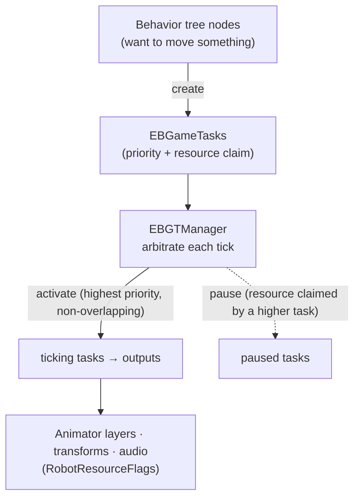

# ⚙️ The task scheduler — how concurrent behaviors share Moxie's outputs (`v3.6.4-Zephyr` / OTA `v24.10.803`)

> Reverse-engineered from the decompiled `Assembly-CSharp.dll` (`bo-android`) in the **v24.10.803** image —
> the `EBGameTask` / `EBGTManager` runtime, the `RobotResourceFlags` output model, and the
> `RobotTaskPriority` ladder. This is the **runtime glue** between the decision layer
> ([behavior-tree-engine](behavior-tree-engine.md), which *decides* what to do) and the render/motion
> layer ([unity-face-animation](unity-face-animation.md), which *executes* it). It answers the question
> those two docs leave open: **when a dozen behaviors run at once — idle breathing, autonomous gaze,
> blinking, lip-sync, a scripted wave, a flinch from being touched — how do they all drive Moxie's shared
> face/body/audio without fighting?** The answer is a priority + resource-arbitration scheduler.

## The problem

Moxie has one face, one head, two arms, and a few audio channels, but **many behaviors want them at
once**. The behavior tree ([NodeCanvas `Bht_*`](behavior-tree-engine.md)) is full of concurrent nodes;
each wants to move something. Without arbitration they'd stomp each other every frame. The `EBGameTask`
system is the solution: every output-driving action is a **task** that declares a **priority** and the
**resources** (output layers) it needs, and a manager runs only the non-conflicting winners.



## The task — `EBGameTask`

An **`EBGameTask`** (`IEBCouroutineScheduler`) is one output-driving action. Concrete kinds:

| Task | Drives |
|---|---|
| `EBGameTaskAnim` → `…AnimLayer` / `…AnimStateBase` / `…AnimTrigger` | an Animator layer / state / trigger |
| `EBGameTaskPlayCompositeAnim` | a one-shot clip via the [Playables compositor](unity-face-animation.md#3-the-runtime-players) |
| `EBGameTaskLookAt` | the IK look-at |
| `EBGameTaskPlayAudio` | an audio channel |
| `EBGameTaskTransform` | a direct bone/transform (head/torso/eye) |

Each task carries a **`RobotTaskResources`** (a `RobotResourceFlags` bitmask it claims via
`SetResourceFlags`) and a **`RobotTaskPriority`**. Tasks are **pooled by type** (`TaskPool`, reused with a
2-frame delay) to avoid per-action GC — Moxie spawns and retires these constantly.

## The manager — `EBGTManager`

The `EBGTManager` owns the tasks and arbitrates them each tick:

- **`TaskQueue`** (all live tasks) and **`TickingTasks`** (the currently-active subset).
- **`PendingActions`** — add/remove are **deferred** (`EBGTAction_AddTask` / `…RemoveTask`) behind an
  `ActionLockCounter`, so a task can safely create/kill tasks *while the manager is iterating* — the
  mutation is applied after the tick, not mid-loop.
- **`CurrentClaimedResources`** — the running union of resources held by the tasks activated so far this
  tick (scratch sets `IsOverlapping`-tested).
- Lifecycle events every task passes through: **`Started → Activated → (Paused ↔ Resumed) → Ended`**
  (`bAborted` flag) — exposed as `OnTaskStarted/Activated/Paused/Resumed/Ended`.

### The arbitration (`UpdateTaskActivations`)

Each tick the manager walks tasks **in priority order (highest first)** and, for each:

1. If the task's `RobotResourceFlags` **do not overlap** `CurrentClaimedResources` → **activate** it (it
   ticks and drives its output) and add its flags to the claimed set.
2. If they **do overlap** (a higher-priority task already holds one of those layers) → **pause** it.

When a higher task **ends or releases** its resources, the paused lower task is **resumed** where it left
off. So arbitration is **priority-preemptive per-resource**: a scripted animation can take the head and
torso while autonomous gaze keeps the eyes, and idle breathing keeps whatever's left — each behavior wins
exactly the outputs no higher-priority behavior wants.

Two tie-break policies handle same-priority / same-kind collisions:

- **`EBGameTaskPriorityOverlapPolicy`** — `InsertTaskInFront` (new task preempts the existing equal) vs
  `InsertTaskAtEnd` (queues behind it).
- **`EBGameTaskCreationPolicy`** — `ReplaceExisting` / `ReUseExisting` / `AddNew` (whether a new request
  supersedes, reuses, or stacks on an existing task of the same kind).

## The outputs — `RobotResourceFlags`

The resources tasks compete for is a **`[Flags] ulong` of 44 outputs** — the definitive inventory of
everything a behavior can drive, and the units of arbitration:

| Group | Flags |
|---|---|
| **Base / performance** | `BaseAnimLayer`·`Triggers`·`State`, `PerformAnimLayer`·`Triggers`·`State`, `ScriptedLayer`, `CompositeAnim` |
| **Face — emotion & mouth** | `EmotionAnimLayer`·`State`, `EmotionFaceAnimLayer`·`State`, `VisemeAnimLayer`·`State`, `FaceAnimState` |
| **Face — eyes** | `EyesAnimLayer`, `PupilsAnimLayer`, `LidsAnimLayer`, `Blink182Layer`, `EyeLeftTransform`, `EyeRightTransform` |
| **Head** | `HeadAnimLayer`, `HeadTiltAnimLayer`, `HeadUpDownTransform`, `HeadGestures` |
| **Body / torso** | `BodyAnimLayer`, `BodyTiltAnimLayer`, `BodyUpDownAnimLayer`, `BodyTurnAnimLayer`, `BreatheAnimLayer`, `TorsoUpDownTransform`, `BodyTurnTransform`, `BodyGestures`, `TorsoGestures`, `TorsoHeadGestures` |
| **Arms** | `LeftAnimLayer`, `RightAnimLayer`, `ArmGestures`, `LeftArmGestures`, `RightArmGestures`, `FaceGestures` |
| **Gesture (composite)** | `GestureAnimLayer`·`Triggers`·`State` |
| **Gaze** | `GazeTarget`, `GazeFacing`, `FaceTrack` |
| **Audio** | `VoiceAudio`, `BkgAudio`, `SoundFXAudio`, `SoundFXAudio2`, `SoundStingerAudio`, `SoundVocalGesture` |

Note the granularity: eyes are split into `Pupils`/`Lids`/`Blink182` so **blinking (a low-priority
`Blink182Layer` task) coexists with a gaze look-at (`GazeTarget`/`GazeFacing`) and an emotion
(`EmotionAnimLayer`)** — three tasks, three non-overlapping claims, all active at once. That's why Moxie
can blink while looking at you while smiling. (`Blink182Layer` — a developer easter-egg name for the blink
layer.) The layer names map straight onto the [face-animation Animator layers](unity-face-animation.md);
the `*Transform` flags are direct bone control (bypassing the animator) onto the
[hardware motors](hardware-map.md).

## The priority ladder — `RobotTaskPriority`

Which behavior wins a contested resource is decided by this enum (low → high; higher preempts lower):

```
RobotCloudConfigBehavior · Normal · GlobalBkgSound · AnimationAudioEvent
IdleState · IdleStateCompositAnim                 ← idle: preempted by almost everything
ChatBehavior · CoreMessengerBehavior
TouchBehavior · MpuBehavior                       ← reactions to being touched / picked up
EyeTrackBehavior · LookBehavior · GazeBehavior    ← autonomous attention
TurnTakingBehaviour · BlinkBehaviour
AnimationMonitorBehavior · MiniMapBehavior · FaceTrackerBehavior
BehaviorDefaultCompositeAnim · UIElement(+CompositeAnim)
MainRobotState · MainRobotStateCompositeAnim      ← scripted content performances
CompositeAnimPlayback · ChatAudioPlayBehavior
ReplayHeadTracking · HeadTrackDebug · TestBehavior
```

This ladder is the definitive "what overrides what": **idle** ambient motion sits near the bottom (any
real behavior preempts it); **touch/pickup reactions** override idle but yield to attention; **autonomous
gaze** is mid; and a **scripted content performance** (`MainRobotState`, `CompositeAnimPlayback`) sits near
the top so an activity's authored animation takes the outputs it needs over autonomous behavior — while
non-overlapping layers (blink, lip-sync, emotion) keep running underneath.

## Worked example — Moxie greets a child

While speaking a scripted "hello" and waving:

| Task | Priority | Claims | Outcome |
|---|---|---|---|
| Scripted wave + line (`MainRobotStateCompositeAnim`) | high | `PerformAnimLayer`, `RightArmGestures`, `HeadGestures`, `VoiceAudio` | **active** |
| Lip-sync | (viseme) | `VisemeAnimLayer` | **active** (no overlap) |
| Blink | `BlinkBehaviour` | `Blink182Layer` | **active** (no overlap) |
| Autonomous gaze | `GazeBehavior` | `GazeTarget`, `GazeFacing` | **active** (no overlap) |
| Idle breathing | `IdleState` | `BreatheAnimLayer` | **active** (no overlap) |
| Idle fidget wanting the right arm | `IdleState` | `RightAnimLayer` (overlaps the wave's arm) | **paused** → resumes when the wave ends |

Six concurrent tasks, one paused — exactly the layered, alive-looking result, with no output driven by two
tasks at once.

## What this means for the three goals

**① Custom firmware — the headline.** This scheduler is *not optional* — it's what keeps a behavior-rich
robot from tearing itself apart. A custom brain must reproduce: tasks that declare a **priority** +
**resource set**, a manager that activates by priority and pauses on resource overlap, and the
`RobotResourceFlags` decomposition (so blink/gaze/emotion/lip-sync coexist). The `RobotResourceFlags` enum
is also the **definitive output inventory** for a custom face/body — every layer and transform you must
provide. The `RobotTaskPriority` ladder is the tuning that makes idle yield to reactions yield to scripted
content.

**② Server revival.** On-device — a server never runs this. But it explains *why* the markup/mood/gaze a
server sends ([the seam](unity-mainapp-interface.md)) compose gracefully with autonomous behavior instead
of conflicting: they enter as tasks at defined priorities.

**③ Pre-801 revival.** No new lever; internal to the app.

---
📖 [Reverse-engineering index](README.md) · [Behavior-tree engine](behavior-tree-engine.md) · [Face-animation engine](unity-face-animation.md) · [Gaze & attention](gaze-and-attention.md) · [Hardware map](hardware-map.md) · [Behavior markup](behavior-markup.md)
