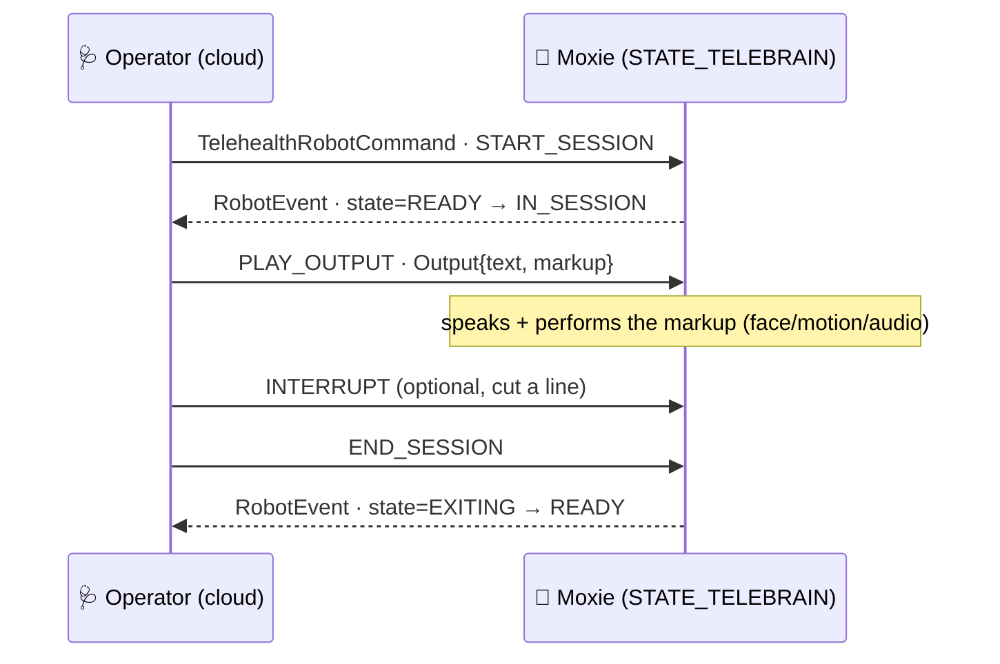

# 🩺 Telehealth / remote-puppet — the "TeleBrain" protocol (`v3.6.4-Zephyr` / OTA `v24.10.803`)

> The recovered `embodied.telehealth.TeleHealth.proto` + the `STATE_TELEBRAIN` launcher state, from the
> **v24.10.803** image. Telehealth is Moxie's **remote-puppet** mode: a remote human (a clinician /
> therapist) *replaces Moxie's on-device brain* and drives what it says and does in real time. It's a
> distinct operating mode with its own protocol, sitting on the MQTT transport
> ([`cloud-protocol.md`](cloud-protocol.md)) and emitting the same behavior markup
> ([`behavior-markup.md`](behavior-markup.md)) the local brain would.

## TL;DR

- **"TeleBrain" = tele-brain, a remote brain.** In `STATE_TELEBRAIN` the launcher runs **perception +
  MAINAPP but NOT the conversation BRAIN** ([`boot-and-launcher.md`](boot-and-launcher.md)) — so the
  camera/mic stay live (the clinician sees/hears the room) while a remote operator supplies every line.
- The operator sends **`Output { text, markup }`** and Moxie speaks + performs it; markup is the full
  behavior language, so the puppeteer controls face, motion, and audio, not just words.
- Transport is MQTT: `commands/telehealth` (cloud → robot) and the `telehealth` activity-log subtopic
  (robot → cloud). A session is `START_SESSION → PLAY_OUTPUT… → END_SESSION`.

## The launcher state

| State | Components up | Meaning |
|---|---|---|
| **`STATE_TELEBRAIN`** | perception + MAINAPP, **no BRAIN** | telehealth remote-brain session |

Entered from `STATE_RUNNING` when a telehealth session starts. Dropping the local ChatScript/LLM brain
is the whole point: the remote human *is* the brain, so there's no on-device dialog engine to conflict
with the operator's lines.

## The protocol — `embodied.telehealth.TeleHealth.proto`

```proto
package embodied.telehealth;

enum Action     { UNKNOWN_ACTION=0; START_SESSION=1; PLAY_OUTPUT=2; END_SESSION=3; UPDATE_STATE=4; INTERRUPT=5; }
enum RobotState { UNKNOWN_STATE=0;  READY=1; IN_SESSION=2; EXITING=3; }

message Output {                       // one thing for Moxie to say / perform
  optional string line_id      = 1;    // id of a pre-authored line (or ad-hoc)
  repeated string line_params  = 2;    // fill-ins for a templated line
  optional string text         = 3;    // spoken text
  optional string markup       = 4;    // behavior markup (behavior-markup.md) — face/motion/audio
}
message TelehealthStatus {
  optional uint64 timestamp = 1;  optional bool telehealth_active = 2;  optional bool session_active = 3;
  optional string software_version = 100;  optional string module_name = 101;
}
message TelehealthMessage {            // the core envelope
  optional uint64      timestamp   = 1;
  optional Action      action      = 2;   // what the operator wants
  optional Output      output      = 3;   // the line (for PLAY_OUTPUT)
  optional RobotState  state       = 4;   // robot-reported state
  optional string      session_id  = 5;
  optional string software_version = 100;  optional string module_name = 101;
}
message TelehealthRobotCommand { optional string command = 1; optional TelehealthMessage message = 2; }  // cloud → robot
message TelehealthRobotEvent   { optional string subtopic = 1; optional TelehealthMessage message = 2; } // robot → cloud
```

- **`Action`** is the operator's control verb: `START_SESSION` / `END_SESSION` bracket the session;
  **`PLAY_OUTPUT`** makes Moxie deliver an `Output`; **`INTERRUPT`** cuts Moxie off mid-line (barge-in
  from the operator side — cf. [`turn-taking.md`](turn-taking.md)); `UPDATE_STATE` syncs status.
- **`RobotState`** is what the robot reports back: `READY` (idle, telehealth armed), `IN_SESSION`
  (actively puppeted), `EXITING` (tearing down).

## Session flow



## Transport (MQTT)

Per [`cloud-protocol.md`](cloud-protocol.md):

- **Cloud → robot:** `/devices/{device_id}/commands/telehealth` carries the `TelehealthRobotCommand`
  (alongside the other JSON commands like `remote_chat`, `query_result`).
- **Robot → cloud:** the `client-service-activity-log` event with a **`telehealth`** subtopic carries the
  `TelehealthRobotEvent` (status/state, session lifecycle).

So a telehealth backend is a peer of the normal chat backend — same device topics, a different command
verb — and `Output.markup` reuses the exact markup grammar the conversation path emits.

## What this means for the three goals

**① Custom firmware.** A distinct, brain-off operating mode. A custom build can keep or re-implement it;
the launcher gate (`STATE_TELEBRAIN`, no local brain) is the pattern for "let something external drive
Moxie."

**② Server revival.** This is a **ready-made remote-control API** — a self-hosted server can implement
telehealth to let a remote parent/therapist puppet Moxie live: send `START_SESSION`, then `PLAY_OUTPUT`
with `text` + `markup`, and Moxie speaks and moves. Because the local brain is off in this mode, the
server has full authority over every line without fighting an on-device dialog engine. A genuinely
useful revival feature beyond autonomous chat.

**③ Pre-801 revival.** No new lever; it rides the same MQTT/endpoint path as normal chat
([`network-trust.md`](network-trust.md)).

---
📖 [Reverse-engineering index](README.md) · [Cloud protocol](cloud-protocol.md) · [Boot & launcher](boot-and-launcher.md) · [Behavior markup](behavior-markup.md) · [Turn-taking](turn-taking.md)
