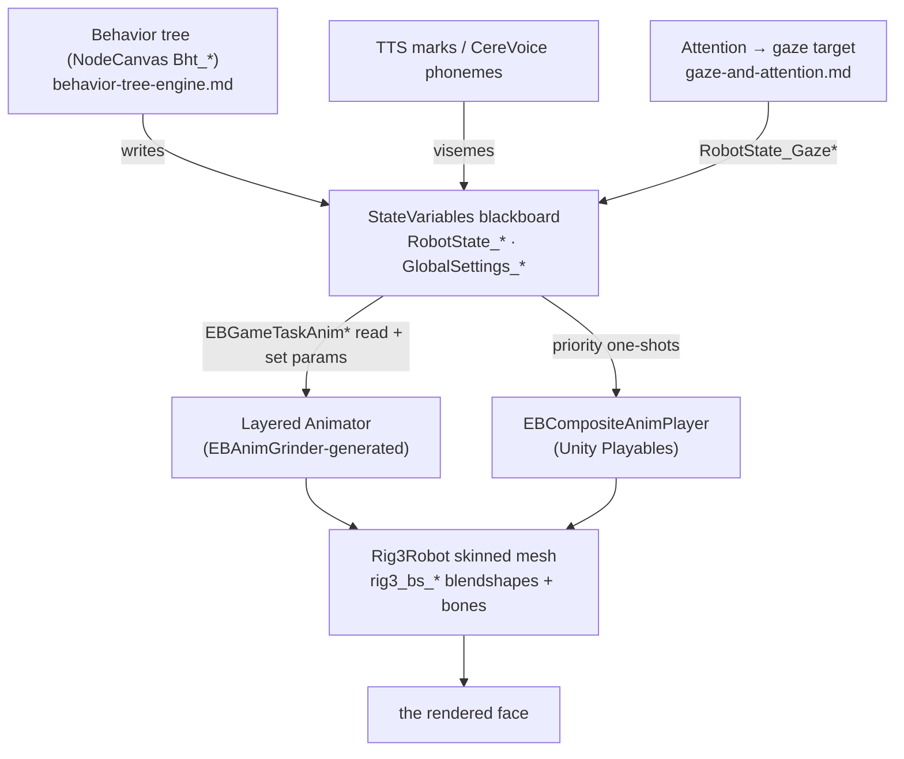

# 🎭 The face-animation engine — how Moxie's face actually renders (`v3.6.4-Zephyr` / OTA `v24.10.803`)

> Reverse-engineered from the decompiled `Assembly-CSharp.dll` (the Unity MAINAPP, `bo-android`) in the
> **v24.10.803** image — the `EB*` (Embodied) animation classes, the `StateVariables` blackboard, the
> `Eyeseme`/`Viseme` systems, and the `rig3` face rig. Where [`unity-mainapp-interface.md`](unity-mainapp-interface.md)
> is the *protocol seam* between the brain logic and the Unity app, **this is the machine on the other
> side of that seam**: the actual code that turns a mood, a gaze target, and a stream of phonemes into the
> animated face. Every class, field, and constant below is read from the binary.

## Architecture



The face is driven **entirely off a blackboard**: the behavior tree, perception, and TTS write
`RobotState_*` variables; animation tasks read them and set Animator parameters; the Animator (plus a
Playables compositor) blends blendshape/bone layers on the `rig3` mesh. A server never touches this — it
supplies mood + markup + TTS audio ([the seam](unity-mainapp-interface.md)) and this engine renders it.

## 1. The face rig — `Rig3Robot`, blendshapes

Moxie's face is **rig 3** (`Rig3Robot` / `Rig3`): a Unity **`SkinnedMeshRenderer`** (`FaceMesh`) driven by
**blendshapes** + a skeleton (head/jaw bones). Blendshapes follow a strict naming convention —
`rig3_bs_<side>_<feature><nn>[…]` — e.g. the blink shapes:

```
rig3_bs_L_upperLid01_postp_blink   rig3_bs_R_upperLid01_postp_blink
rig3_bs_L_lowerLid01_postp_blink   rig3_bs_R_lowerLid01_postp_blink
```

`bs` = blendshape, `L`/`R` = side, and the **`_postp_blink`** suffix marks a **post-process** shape —
applied *after* the base animation each frame (the blink layer overlays the expression, below). Expressions
and visemes are just weighted sets of these blendshapes; the animation system's whole job is to compute
their weights every frame.

## 2. The animation controller — the `EBAnimGrinder`

The Animator isn't hand-built in the Unity editor; it's **generated** by the **`EBAnimGrinder`**, a
build-time tool that "grinds" an **XML spec** + the **`rig3animations`** asset bundle into a Unity
`AnimationController` (+ an `EBAnimGrinderGeneratedData` companion). It only rebuilds when the source
changes — `sourceMD5 => GetDirectoryMD5Hash(…"rig3animations")` vs `lastSuccessfulGrindSourceMD5`.

The XML model (all `[XmlAttribute]`-serialized) is a full state machine:

| Class | Role |
|---|---|
| `EBAnimGrinderLayer` | one Animator layer — `index`, `entry` state, `weight`, **`maskPath`** (avatar mask), and a binding to behavior code via `ParamsGameTaskType` / `AnimTriggerGameTaskType` / `AnimStateGameTaskType` |
| `EBAnimGrinderStateMachine` | the layer's states + transitions + its animation clips |
| `EBAnimGrinderState` | one state — a `clipName` (+ `animSpeed`) **or** a `blender` |
| `EBAnimGrinderBlender` / `…Control` | blend several animations by `values` (a blend tree) over `bases` |
| `EBAnimGrinderTransition` | `origState → destState`, gated by `EBAnimGrinderParameter{name, threshold}` |

So the face is a **multi-layer, masked Animator** where each layer is **bound to a behavior-tree GameTask
type** — that binding (`*GameTaskType`) is the wire from NodeCanvas
([behavior-tree-engine](behavior-tree-engine.md)) into the layer's parameters, triggers, and state
selection.

## 3. The runtime players

Two systems drive the rig each frame:

- **The base Animator** (Mecanim) — the grinder-generated controller, layered and masked, its parameters
  set by **`EBGameTaskAnimStateBase`** / `EBGameTaskAnimTrigger` / `EBGameTaskAnimLayer` (behavior tasks
  that `Animator.StringToHash(stateName)` a state onto an `EBAnimatorLayer` with `layerBlendInTime` /
  `layerBlendOutTime`).
- **`EBCompositeAnimPlayer`** — a **Unity Playables** compositor (`PlayableGraph`,
  `AnimationClipPlayable`, `AnimationPlayableUtilities.PlayClip`) that plays **one-shot clips at a
  priority** (`outputTaskPriority`) *on top of* the base Animator, auto-pausing a non-looping clip at its
  end. It's driven by **`EBGameTaskPlayCompositeAnim`** — the task a behavior/markup node fires to play a
  specific animation (a gesture, a reaction) over whatever the base layers are doing.

Blending between all of this uses the **`EB*` layer blenders** (`EBAnimLayerBlender`, `EBXFormLayerBlender`)
and a small **easing library** — `EBBlendLinear`, `EBBlendCubic`, `EBBlendEase[In|Out|InOut]`,
`EBBlendSpring`, `EBBlendTimed`, `EBBlendLinearVelocity`, `EBBlendCut` — so a layer can fade in with a
spring, an ease, or a hard cut.

## 4. The blackboard bridge — `StateVariables`

The single source of truth the whole engine reads is **`StateVariables : EBSingletonBase<StateVariables>`**
— a blackboard of `CreateVar(...)` entries the behavior tree/perception write and the animation tasks
consume. The face-relevant set (with defaults):

| Group | Variables |
|---|---|
| **Expression** | `RobotState_PlaybackMood` (`ePlaybackMood`, default Neutral), `RobotState_PlaybackIntensity` (int), `RobotState_IsPlayingMarkupGraph` |
| **Eyes / Eyeseme** | `RobotState_EyesemeState` (`ePlaybackMood`), `RobotState_EyesemeEnabled`, `…LayerBlendInTime`/`…OutTime` (3s), `…TransitionTime` (2s), `…BlinkLayerBlendInTime`/`…OutTime` (3s) |
| **Gaze target** | `RobotState_GazeControlEnabled`, `…HasTarget`/`…HasChatTarget`, `…GazeTargetPosition` (Vector3), `…Yaw`/`…RelativeYaw`/`…Height`/`…Distance2d`, `…Engaged`/`…Engagement` (0.5), `…Smiling`/`…Speaking`/`…Visible`, `RobotState_FaceLookAtTime` |
| **Turn-taking mirror** | `RobotState_TurnTaking_InTurn`/`_MoxieState`/`_MentorState`/`_EngagementState`/`_AssistState` (+ `…Time`) — copies of [`TurnTakingState`](turn-taking.md) so the face reacts to the conversation |
| **Sensory / body** | `RobotState_SensoryMode` (`SensoryMode`), `RobotState_SensoryModeDuration`, `RobotState_Yaw`, `RobotState_SeenFaces`, `RobotState_TimeSinceFaceSeen` |
| **Global gates** | `GlobalSettings_LessMotion`, `…HideRobotVisualEffects`, `…HideRobotHUDAnimatorAttachments`, `…MuteRobotSoundEffects`, `…SlowSpeech` |

This is the exact contract a custom brain must fill (or a custom renderer must read) to animate the face —
it's the in-memory counterpart of the behavior/markup layer.

## 5. The eyes — Eyeseme + blink

**Eyeseme** is the eye-expression layer. `RobotState_EyesemeState` is an **`ePlaybackMood`** — 11 moods:

```
Neutral · Happy · Sad · Angry · Shy · Surprised · Afraid · Concerned · Confused · Curious · Embarrassed
```

The layer cross-fades between moods over `EyesemeTransitionTime` (2s) and fades the whole layer in/out over
`EyesemeLayerBlendIn/OutTime` (3s). Each mood also carries a **`VisemeIndices[mood]`** — so the *same*
spoken phoneme is shaped differently by mood (a happy "aa" ≠ a sad "aa").

**Blink** is a **separate post-process layer** on top: `EyesemeBlinkParams{ EyesemeActivationPercentage,
EyelidUpperBlinkValue, EyelidLowerBlinkValue }` drives the four `rig3_bs_*_postp_blink` eyelid blendshapes,
and — crucially — the blink is **modulated by the current eyeseme** (`EyesemeActivationPercentage`), so a
squinting-happy blink differs from a wide-surprised one. `BlinkControlMarkUpGenerator` exposes blink as a
`<mark>` command ([behavior-markup](behavior-markup.md)).

## 6. The mouth — visemes (lip-sync)

Speech drives the mouth through a **viseme** pipeline. `Viseme : SpeechMarkupElement` defines a
**`VisemeType`** of **41 ARPABET phonemes** (`aa ae ah ao aw ax ay b ch d dx dh eh er ey f g hh ih iy jh k
l m n ng ow oy p r s sh t th uh uw v w y z zh`), each mapped by a **`LayerLookupTable<VisemeType, string>`**
to a mouth-shape (blendshape) layer. The stream of visemes comes from **two interchangeable sources**:

- **Local CereVoice** — `VisemeConverter.LookupTable` maps CereVoice phoneme strings → `VisemeType`
  (`CereVoicePhoneme`, [perception-pipeline](perception-pipeline.md)).
- **Cloud TTS** — `CloudTTSVisemeUtils.VisemeLookupTable` maps the `TTSMark`s in a
  [`CloudTTSResponse`](unity-mainapp-interface.md#audio-out-tts-sfx-playback-control) → `VisemeType`.

A spoken line is parsed into a **`SpeechMarkupElement` graph** — `Sentence` → `Word` → `Viseme`/`Marker`
— and while it plays, `RobotState_IsPlayingMarkupGraph` is set and the mouth layer follows the timed
visemes. This is why the same server-supplied `text + markup + audio` lip-syncs identically whether the
audio came from CereVoice or a cloud engine — only the phoneme→viseme table differs.

## 7. Gaze / look-at

The gaze layer aims the head + eyes at `RobotState_GazeTargetPosition` (and reads `…Yaw`/`…Height`/
`…Engagement`/`…Smiling`/`…Speaking`). The mover is **`EBAnimIKLookAtHandler : EBIKHandler`** — an IK
handler with a `Stage` machine and a `BlendParam{ fractionPosition, fractionRotation }` that blends the
IK influence in/out so the look-at layers over the base animation smoothly. The *decision* of where to
look (interest points, saccade timing, the 10° hysteresis) is the attention system in
[`gaze-and-attention.md`](gaze-and-attention.md); this section is the **motor** that executes it on the
rig.

## 8. The sensory / idle layer — `SensoryMode`

When Moxie isn't executing a scripted beat, an ambient layer keeps it alive, selected by **`SensoryMode`**
(8 states):

```
NoTarget · Disabled · Engaged · UnEngaged · Listening · Talking · Seeking · Earmuffs
```

`RobotState_SensoryMode` is set from perception + [turn-taking](turn-taking.md) (e.g. `Talking` while
Moxie speaks, `Listening` while the child does, `Seeking` when looking for a person, `Earmuffs` when
disengaged), and it selects the idle-pose behavior (e.g. the `Bht_Talking_Poses` tree). This is the layer
behind the [SIL's "imaginary life" ambient motion](../architecture/sil-and-cicd.md).

## 9. Accessibility & global gates

Five **`GlobalSettings_*`** blackboard flags gate the whole engine — the render-side of the accessibility
surface ([settings-schema](settings-schema.md), [runtime-control](runtime-control.md#accessibility-pacing-systemslowinputmodify)):

| Flag | Effect |
|---|---|
| `LessMotion` | reduce/limit animation amplitude (motion-sensitivity) |
| `HideRobotVisualEffects` | suppress particle/visual FX |
| `HideRobotHUDAnimatorAttachments` | hide on-face HUD attachments (Bangle etc.) |
| `MuteRobotSoundEffects` | silence SFX |
| `SlowSpeech` | slow the speech/viseme pacing |

A faithful custom build must honor these — they're a child-accessibility contract, not cosmetic.

## 10. The per-frame picture

Putting it together, each frame the face is: **base Animator layers** (mood/body/idle, grinder-generated,
masked, parameters set from the blackboard) **+ composite one-shots** (gestures/reactions via Playables at
priority) **+ the Eyeseme mood layer** (cross-faded) **+ the blink post-process** **+ the viseme mouth
layer** (timed to phonemes) **+ the IK look-at** — all summed into blendshape weights + bone poses on the
`rig3` mesh, subject to the `GlobalSettings_*` gates.

## What this means for the three goals

**① Custom firmware — the headline.** This is the complete face-animation architecture. To **build a
custom face**, reproduce: a blendshape rig, a layered/masked animator, a blackboard of the `RobotState_*`
variables above, an Eyeseme mood layer (11 moods) + a post-process blink, a viseme mouth layer fed by a
phoneme→viseme table, an IK look-at, and the `SensoryMode` idle selector. The `EBAnimGrinder` (XML +
`rig3animations` → controller) is the **authoring pipeline** to recreate. To keep the stock face, you just
write the blackboard.

**② Server revival.** The server never runs this — it stays on-device. The server's job is upstream:
supply the **mood/markup** ([behavior-markup](behavior-markup.md)) and the **TTS audio + marks**
([the seam](unity-mainapp-interface.md#audio-out-tts-sfx-playback-control)) that set
`RobotState_PlaybackMood` and feed the viseme layer. Get those right and the stock engine renders a
fully-expressive, lip-synced face.

**③ Pre-801 revival.** No new lever; the face engine is internal to the app, above the network boundary.

---
📖 [Reverse-engineering index](README.md) · [MAINAPP interface](unity-mainapp-interface.md) · [Unity assets](unity-assets.md) · [Behavior-tree engine](behavior-tree-engine.md) · [Behavior markup](behavior-markup.md) · [Gaze & attention](gaze-and-attention.md) · [Perception pipeline](perception-pipeline.md)
