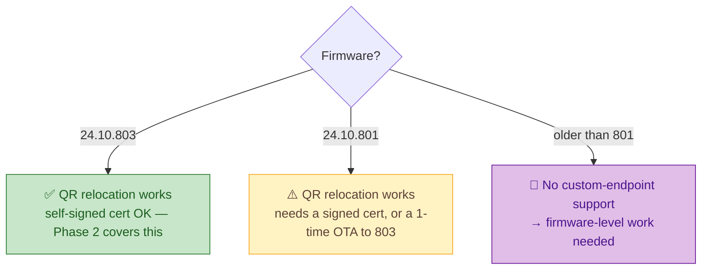

# 🔧 Firmware & older robots (research track)

Reviving *every* Moxie is the mission — including units too old for the camera-QR relocation path.
This is an honest research track, not a solved problem.

## The three tiers of robot (by firmware)

## Why older robots are hard (the lockdown)
Moxie's OS was hardened by Lantronix: **Secure Boot + Android Verified Boot (AVB) + SELinux**, signed
system images, and locked external interfaces. As of today:
- **No public root** for Moxie exists.
- **ADB** access is unconfirmed / disabled on retail units.
- A custom system image or sideloaded APK is blocked by verified boot + image signing.
- The pre-801 firmware has **no custom-endpoint support at all**, so the QR relocation used for
  803/801 simply isn't there.

So an older robot can't be redirected in software the way a 803 robot can — it needs either an
official signed OTA to a newer build (only the original author currently has the 803 image) or
genuine firmware-level work.

## In-scope research directions (future)
Documented as goals, with clear-eyed difficulty. Nothing here is claimed to work yet.
- **Obtain / relay the signed 803 OTA** for 801 units (community path exists via the OpenMoxie author).
- **Firmware acquisition & analysis** — dump and study a system image (e.g. via a robot we own) to
  understand the boot chain and endpoint pinning.
- **Bootloader / AVB** — investigate whether any unlock, downgrade, or signed-update path exists.
- **Hardware-assisted** (last resort, invasive) — serial/UART, eMMC, or CSI-tap approaches for
  research units only. We prefer non-invasive methods and treat teardown as a last resort.

## Principles for this track
- **Safety first** — a child's robot is not a test bench; irreversible steps get loud warnings and are
  opt-in for spare/research units.
- **Non-invasive by default** — camera-QR and network methods before anything physical.
- **Document everything** — even dead ends, so nobody repeats them.

See also: the on-device lockdown notes in [`README.md`](README.md) and the camera/vision constraints
in [`../docs/architecture/vision.md`](../docs/architecture/vision.md).

---
📖 [Back to hardware](README.md) · [Back to top](../README.md)
