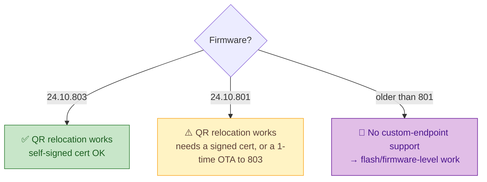

# 🔧 Firmware & older robots (research track)

Reviving *every* Moxie is the mission — including units too old for the camera-QR relocation path.

> ⚠️ **Reconciled with the reverse-engineering.** This page is the *owner-facing* summary; the
> authoritative, version-stamped detail is in [`../docs/reverse-engineering/`](../docs/reverse-engineering/)
> (firmware **v3.6.4-Zephyr / OTA v24.10.803**, which this project **has and has fully analyzed**).
> Earlier revisions of this file predated that analysis and understated what's known — corrected below.

## The three tiers of robot (by firmware)

## Why older robots are hard (the lockdown) — and the actual paths
Moxie's OS was hardened (Lantronix: **Secure Boot + AVB + SELiniux**, signed A/B images). The current,
RE-backed picture:
- **No *public* root exists** — but the boot chain has a concrete bypass: on AVB failure U-Boot drops
  to **`rockusb`/`fastboot`**, and **maskrom/`rkdeveloptool`** can flash a `--disable-verification`
  `vbmeta` and then any `system`/`vendor`. See [`hardware-access.md`](../docs/reverse-engineering/hardware/hardware-access.md)
  and [`flashing-runbook.md`](../docs/reverse-engineering/firmware/flashing-runbook.md).
- **ADB** on retail units is locked (`ro.adb.secure=1`, `ro.debuggable=0`); **recovery-mode sideload
  and maskrom/rockusb bypass it** — see [`hardware-access.md`](../docs/reverse-engineering/hardware/hardware-access.md).
- Custom code needs system-image write (AVB), **but no Embodied signing key** — a debug-signed app in
  `/system/priv-app` inherits full privileges once you can write the image
  ([`firmware-image.md`](../docs/reverse-engineering/firmware/firmware-image.md)).
- **Pre-801 firmware has no custom-endpoint support** (endpoint pinned to `mqtt.googleapis.com`, CA-
  validated — [`network-trust.md`](../docs/reverse-engineering/protocol/network-trust.md)), so software re-home
  isn't available; those units need the **flash path** (Tier 2/3), ideally without teardown if the
  Macro-button→rockusb + a reachable USB port pan out (open bench item, [`COVERAGE.md`](../docs/reverse-engineering/COVERAGE.md)).

## In-scope research directions
- **Macro-button → bootrom-download** mapping + USB-port reachability — the potential **no-teardown**
  revival for pre-801 (unsigned rockusb flash). Bench experiment.
- **A genuine signed 803 `update.zip`** — would unlock recovery-sideload / network-OTA revival of 801.
- **Teardown artifacts** — UART pad map, maskrom test-point, per-partition read-back vs
  [hashes](../docs/reverse-engineering/firmware/firmware-803-reference.md). External teardown footage + FCC
  internal photos are mapped in [`external-sources.md`](../docs/reverse-engineering/external-sources.md).

## Principles for this track
- **Safety first** — a child's robot is not a test bench; irreversible steps get loud warnings and are
  opt-in for spare/research units.
- **Cheapest-for-the-owner first** — camera-QR and network methods before anything physical, but
  **teardown/flashing are in scope**, not off-limits.
- **Document everything** — even dead ends, so nobody repeats them.

---
📖 [Back to hardware](README.md) · [Field guide](../docs/reverse-engineering/FIELD-GUIDE.md) · [Hardware access](../docs/reverse-engineering/hardware/hardware-access.md)
