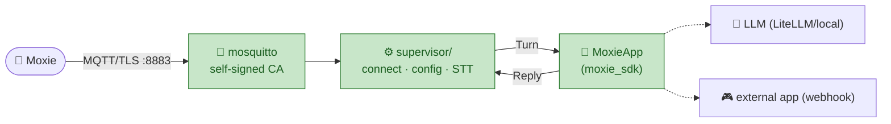

# 📡 `mqtt/` — the robot cloud + Moxie SDK

The **robot-facing half of the server app** (③ in [`../STRUCTURE.md`](../STRUCTURE.md); the parent-app-facing half is [`../server/`](../server/)). The half the **robot** connects to: an MQTT broker, a supervisor that speaks Moxie's
protocol, and the **Moxie SDK** — the clean interface any AI uses to drive Moxie as an avatar.

See the vision: [`../docs/architecture/moxie-as-a-platform.md`](../docs/architecture/moxie-as-a-platform.md) ·
protocol detail: [`../docs/architecture/mqtt-and-conversation.md`](../docs/architecture/mqtt-and-conversation.md).
The implementation contracts this half fills: the [AI seam](../docs/architecture/ai-seam.md) (LLM/STT/TTS)
and the [config & telemetry contract](../docs/architecture/config-and-telemetry-contract.md) (`/config` + `/state`).



## Layout
| Path | What |
|------|------|
| `moxie_sdk/` | the SDK: `MoxieApp`, `Turn`/`Reply`/`Action`, and built-in apps (`LLMApp`, `WebhookApp`, `EchoApp`) |
| `supervisor/moxie_runtime.py` | MQTT runtime — connect detection, config push, conversation routing |
| `broker/` | mosquitto config + `gen-certs.sh` (self-signed CA per appliance; keys are gitignored) |
| `config.py` / `run.py` | configuration (env-overridable) + entrypoint |
| `docker-compose.yml` / `Dockerfile` | run broker + supervisor together (the whole stack incl. the console: [`../docker-compose.yml`](../docker-compose.yml)) |
| `docker-entrypoint.sh` / `status_proxy.py` | container entrypoint + an opt-in forwarder so the console (another container) can reach the runtime's loopback-only `/status` |

## Run it

**1. Generate broker certs** (once, for your broker's LAN IP):
```bash
./broker/gen-certs.sh 192.168.1.9
```

**2. Start the broker + supervisor:**
```bash
cp .env.example .env      # set MOXIE_LLM_BASE_URL / _API_KEY / _MODEL and MOXIE_BROKER_HOST
docker compose up -d
```
> Want the parent console too, and one `.env` for everything? Run the repo-root stack
> instead: `docker compose up` — [`docs/guides/one-command-stack.md`](../docs/guides/one-command-stack.md).
Or run them directly:
```bash
docker run -d --name moxie-mqtt --network host \
  -v $PWD/broker/mosquitto.conf:/mosquitto/config/mosquitto.conf:ro \
  -v $PWD/broker/keys:/mosquitto/config/keys:ro eclipse-mosquitto:2
pip install -r requirements.txt
python run.py
```

**3. Point Moxie at it** — show the robot the **endpoint QR** (the parent-app web UI's *Server
Pairing* tab, or `tools/pairing/moxie_endpoint_qr.py <broker-ip>`). Moxie relocates to your broker,
gets its config, and is ready.

## Pick the brain (`MOXIE_APP`)
- `llm` (default) — a companion powered by any OpenAI-compatible endpoint. Local-first.
- `webhook` — hand each turn to an **external** game/service (set `MOXIE_WEBHOOK_ENDPOINT`). This is
  how another app *becomes* Moxie without any code here.
- `echo` — echoes speech, for testing.

## Status
✅ Broker, supervisor, config push, and LLM conversation (with history) are working and were verified
with a simulated robot. 🔨 Next: wire **faster-whisper STT** (`supervisor/moxie_runtime.py:handle_zmq`)
so real voice turns work, and drop in OpenMoxie's `automarkup` for expressive delivery. See
[`../ROADMAP.md`](../ROADMAP.md).

---
📖 [Back to top](../README.md) · [Moxie as a platform →](../docs/architecture/moxie-as-a-platform.md)
