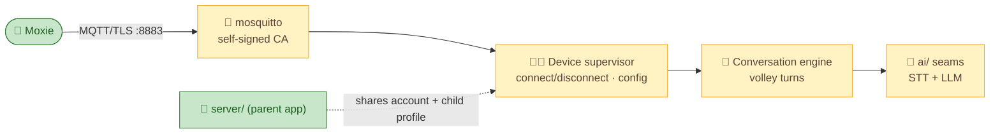

# 📡 `mqtt/` — the robot cloud (Phase 2–3)

The second half of the revival: the service the **robot** connects to, replacing Embodied's MQTT/IoT
cloud. Not built yet — this directory holds the plan; the full spec is
[`../docs/architecture/mqtt-and-conversation.md`](../docs/architecture/mqtt-and-conversation.md).

## What goes here
- **Endpoint-config QR generator** — the "second QR" a firmware-801/803 Moxie waits for after Wi-Fi:
  `{"debug":{"command":"om","param":"<ServiceConfiguration2>"}}`, pointing the robot at this box.
- **MQTT broker** — mosquitto, TLS on :8883 with a self-signed CA (works on firmware 24.10.803),
  `allow_anonymous`, `$SYS` log-topic trick for connect/disconnect detection.
- **Device supervisor** — push initial config (`pairing_status`, schedule, settings), mark paired.
- **Conversation engine** — RemoteChatRequest/Response turns; the audio→STT→LLM→markup→speak loop.

## Topics (robot ⇄ cloud)
- `devices/{id}/events/{name}` — remote-chat, activity-log, zmq (STT audio), device-logs, http-token
- `devices/{id}/state` — robot presence/state
- `devices/{id}/commands/{name}` — config, query_result, remote_chat, http_token, telehealth

## How it relates to `server/`
`server/` issues the **Wi-Fi QR** and owns account/child/robot identity. `mqtt/` issues the **endpoint
QR** and runs the live conversation. Same machine, same account DB.
See [`../docs/architecture/overview.md`](../docs/architecture/overview.md).

## Status
🔨 Specced; build order in [`../ROADMAP.md`](../ROADMAP.md): broker → supervisor + QR#2 → config →
local LLM → local STT → content modules → glue to `server/`.

---
📖 [Back to top](../README.md) · [Full spec →](../docs/architecture/mqtt-and-conversation.md)
