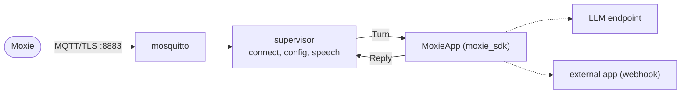

# mqtt — the robot cloud and the Moxie SDK

The half of the backend the **robot** connects to: an MQTT broker, a supervisor that speaks
Moxie's protocol, and the Moxie SDK, the interface any AI uses to drive Moxie. The half the
**phone** talks to is [`../server/`](../server/README.md).

Contracts this folder implements: [MQTT and conversation](../docs/architecture/mqtt-and-conversation.md),
the [AI seam](../docs/architecture/ai-seam.md) (LLM, speech-to-text, text-to-speech) and
[config and telemetry](../docs/architecture/config-and-telemetry-contract.md). The bigger picture:
[Moxie as a platform](../docs/architecture/moxie-as-a-platform.md).


```mermaid
flowchart LR
    moxie(["Moxie"]) -->|"MQTT/TLS :8883"| broker["mosquitto"]
    broker --> rt["supervisor<br/>connect, config, speech"]
    rt -->|"Turn"| app["MoxieApp (moxie_sdk)"]
    app -->|"Reply"| rt
    app -.-> llm["LLM endpoint"]
    app -.-> ext["external app (webhook)"]
```

## Layout

| Path | What |
|---|---|
| [`moxie_sdk/`](moxie_sdk/README.md) | The SDK: `MoxieApp`, `Turn`/`Reply`/`Action`, the built-in brains, speech (`stt.py`, `tts.py`), markup, safety, memory, schedules, content packs, telemetry, the store. |
| [`supervisor/`](supervisor/README.md) | The MQTT runtime: connect detection, config push, conversation routing, the device permit list, and a loopback status HTTP API on `:8930`. |
| [`broker/`](broker/README.md) | Mosquitto config, ACLs, and `gen-certs.sh` (a self-signed CA per appliance; keys are git-ignored). |
| [`content_modules/`](content_modules/README.md) | Shipped content modules (JSON). |
| [`data/`](data/README.md) | Where per-robot state is written at runtime. |
| `config.py`, `run.py` | Settings (all from environment; see `.env.example`) and the entry point. |
| `docker-compose.yml`, `Dockerfile`, `docker-entrypoint.sh`, `status_proxy.py` | Broker plus supervisor in containers. `status_proxy.py` lets the console container reach the status API. |

## Run it

The easiest route is the repo-root stack, which adds the parent console and uses one `.env`:
`docker compose up` ([guide](../docs/guides/one-command-stack.md)). To run just this half:

```bash
./broker/gen-certs.sh 192.168.1.9    # once: certs for the broker's LAN address
cp .env.example .env                 # set MOXIE_LLM_BASE_URL / _API_KEY / _MODEL and MOXIE_BROKER_HOST
docker compose up -d
```

Or without Docker, with a broker already running: `pip install -r requirements.txt && python run.py`.

Then show the robot the **endpoint QR** (the parent web app's *Server Pairing* tab, or
`tools/pairing/moxie_endpoint_qr.py <broker-ip>`). A robot on firmware 24.10.801/803 moves to
your broker and receives its config. Robots are refused until permitted
([permitting a robot](../docs/guides/permitting-a-robot.md)).

## Pick the brain (`MOXIE_APP`)
- `llm` (default) — a companion powered by any OpenAI-compatible endpoint. Local-first.
- `content` — the data-driven activity engine (`MOXIE_CONTENT_MODULE`), answered through the same
  model seam.
- `webhook` — hand each turn to an **external** game/service (set `MOXIE_WEBHOOK_ENDPOINT`). This is
  how another app *becomes* Moxie without any code here.
- `echo` — echoes speech, for testing. Needs no brain endpoint at all.
- `any` — *decide per child.* See below.

These names are a **closed list** ([`moxie_sdk/brains.py`](moxie_sdk/brains.py)); anything
else exits at startup naming them, rather than quietly starting the `llm` app.

### One appliance, a different brain per child

`MOXIE_APP` is only the **default layer**. Which brain answers a given robot is
`defaults ⊕ fleet ⊕ per-robot` — the same layering as every other parent-set value — so:

```bash
curl -s localhost:8930/brain                                   # what this box can run, and who is on what
curl -s -XPOST localhost:8930/brain?scope=fleet  -d '{"brain":"content"}'   # the house rule
curl -s -XPOST 'localhost:8930/brain?device_id=d_…' -d '{"brain":"webhook"}' # this child only
```

The change lands on that child's **next turn** — no restart, and a turn already in flight finishes
with the brain that heard the question. An explicit `MOXIE_APP` **pins** the appliance's brain and a
per-child pick cannot overrule it; set `MOXIE_APP=any` to hand the choice to the console. Design and
gaps: [`brain-picker.md`](../docs/architecture/backlog/brain-picker.md).

## Status

Broker, supervisor, config push, LLM and content conversations with memory, voice, ears,
markup, safety, telemetry, schedules and content packs all run end to end against the simulated
robot (`../sim/run_smoke.sh`, `../sim/run_scenarios.sh`) and in CI. No physical robot has
connected yet. See the [roadmap](../ROADMAP.md).
